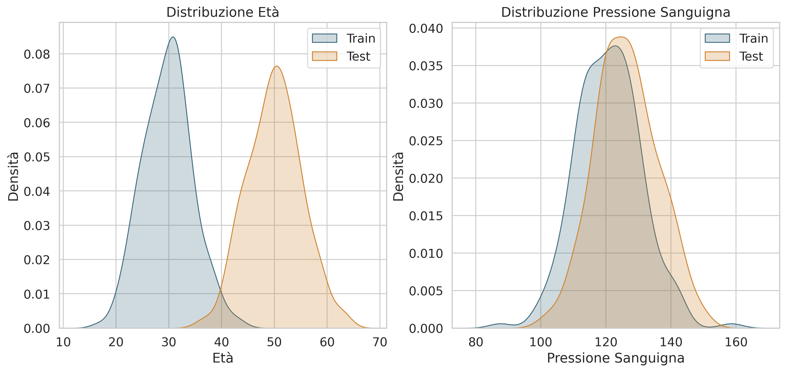

# Batch Normalization

## Introduzione

La **Batch Normalization** è una tecnica di normalizzazione introdotta da Sergey Ioffe e Christian Szegedy nel 2015 che ha rivoluzionato l'addestramento delle reti neurali profonde. Questa tecnica affronta il problema del **Internal Covariate Shift**, stabilizzando la distribuzione degli input ad ogni layer durante l'addestramento e permettendo l'uso di learning rate più elevati, una convergenza più rapida e una maggiore robustezza nell'inizializzazione dei pesi.

## Il Problema del Covariate Shift

### Definizione Formale del Covariate Shift

Il **Covariate Shift** si verifica quando la distribuzione degli input cambia tra il training e il test set. Qui, ogni singolo input è rappresentato come un **vettore di feature** 

$$
X =
\begin{bmatrix}
x_1 \\
x_2 \\
\vdots \\
x_d
\end{bmatrix}
\in \mathbb{R}^d
$$

dove $d$ è il numero di feature per ciascun campione. Allo stesso modo, la variabile target associata a quell'input può essere rappresentata come **vettore colonna**:

$$
Y =
\begin{bmatrix}
y_1 \\
y_2 \\
\vdots \\
y_c
\end{bmatrix}
\in \mathbb{R}^c
$$

dove $c$ rappresenta il numero di componenti del target (ad esempio il numero di classi in una codifica one-hot).

Formalmente, si parla di covariate shift quando la **distribuzione marginale dei vettori di input** differisce tra training e test set:

$$
P_{train}(X) \neq P_{test}(X)
$$

Questo significa che i singoli vettori di input osservati durante l'addestramento provengono da una distribuzione diversa rispetto a quelli osservati in fase di test. Non stiamo confrontando matrici di dataset interi, ma la distribuzione dei **singoli vettori di input**.

Nonostante ciò, la relazione condizionale tra input e output rimane invariata:

$$
P_{train}(Y|X) = P_{test}(Y|X)
$$

In altre parole, il modo in cui i vettori target $Y$ dipendono dai vettori di input $X$ non cambia tra training e test. Questo implica che la “regola” che il modello deve apprendere resta valida, ma il modello potrebbe comunque avere difficoltà a generalizzare se i vettori di input osservati durante il test sono distribuiti in maniera diversa rispetto a quelli visti in addestramento.

**Esempio concreto:**

Immaginiamo di classificare il rischio di malattia in base a due variabili: età e pressione sanguigna.

- Nel **training set**, molte persone hanno età tra 20 e 40 anni.  
- Nel **test set**, molte persone hanno età tra 40 e 60 anni.  

```python
import numpy as np
import pandas as pd
import matplotlib.pyplot as plt
import seaborn as sns

sns.set(style="whitegrid", font_scale=1.2)
np.random.seed(42)

palette = {
    "blue": "#406c80",
    "orange": "#cf8532",
}

# Dati train
train_age = np.random.normal(30, 5, 200)
train_bp = np.random.normal(120, 10, 200)
train_risk = (train_age + train_bp/2 + np.random.normal(0,5,200)) > 100

# Dati test
test_age = np.random.normal(50, 5, 200)
test_bp = np.random.normal(125, 10, 200)
test_risk = (test_age + test_bp/2 + np.random.normal(0,5,200)) > 100

df_train = pd.DataFrame({'Age': train_age, 'BP': train_bp, 'Risk': train_risk, 'Set':'Train'})
df_test = pd.DataFrame({'Age': test_age, 'BP': test_bp, 'Risk': test_risk, 'Set':'Test'})
df = pd.concat([df_train, df_test])

plt.figure(figsize=(14,6))

plt.subplot(1,2,1)
sns.kdeplot(df_train['Age'], label='Train', fill=True, color=palette["blue"])
sns.kdeplot(df_test['Age'], label='Test', fill=True, color=palette["orange"])
plt.title("Distribuzione Età")
plt.xlabel("Età")
plt.ylabel("Densità")
plt.legend()

plt.subplot(1,2,2)
sns.kdeplot(df_train['BP'], label='Train', fill=True, color=palette["blue"])
sns.kdeplot(df_test['BP'], label='Test', fill=True, color=palette["orange"])
plt.title("Distribuzione Pressione Sanguigna")
plt.xlabel("Pressione Sanguigna")
plt.ylabel("Densità")
plt.legend()

# Salvo il grafico su file
plt.savefig("covariate_shift_distributions.png", dpi=300, bbox_inches='tight')

# Mostro il grafico
plt.show()
```



<br>

In questo caso:

$$
P_{train}(X) \neq P_{test}(X)
$$

Tuttavia, se la probabilità di avere la malattia dato età e pressione è la stessa nei due set, cioè:

$$
P(Y = \text{malattia} \mid X = (\text{età, pressione})) \text{ è identica in train e test,}
$$

allora:

$$
P_{train}(Y|X) = P_{test}(Y|X)
$$

Il modello ha imparato la “regola” corretta, anche se i dati osservati nel test set sono distribuiti in modo diverso rispetto a quelli del training set.

### Internal Covariate Shift

L'**Internal Covariate Shift** è un fenomeno analogo che si verifica all'interno della rete neurale. Durante l'addestramento, i parametri di ogni layer cambiano, causando una variazione continua nella distribuzione degli input ai layer successivi.

Consideriamo un layer $l$ con input $x^{(l)}$ e parametri $\theta^{(l)}$. L'output del layer è:

$$z^{(l)} = f^{(l)}(x^{(l)}; \theta^{(l)})$$

Durante l'addestramento, quando i parametri $\theta^{(l-1)}$ del layer precedente vengono aggiornati, la distribuzione di $x^{(l)}$ cambia, anche se i parametri $\theta^{(l)}$ rimangono fissi temporaneamente.

#### Conseguenze

Questo fenomeno causa diversi problemi:

1. **Vanishing/Exploding Gradients**: Se gli input ad un layer hanno varianza molto piccola o molto grande, i gradienti possono diventare troppo piccoli o troppo grandi.


    Consideriamo un singolo layer feedforward lineare con input $x \in \mathbb{R}^d$, pesi $W \in \mathbb{R}^{d \times n}$, bias $b \in \mathbb{R}^n$ e output:

    $$
    z = W^\top x + b
    $$

    Supponiamo di applicare una funzione di perdita $\mathcal{L}(z)$. Il gradiente rispetto ai pesi è:

    $$
    \frac{\partial \mathcal{L}}{\partial W} = x \cdot \left(\frac{\partial \mathcal{L}}{\partial z}\right)^\top
    $$

    Quello che ci interessa è la norma attesa del gradiente. Se assumiamo che $x$ e $\frac{\partial \mathcal{L}}{\partial z}$ siano **indipendenti** e con **media zero**, allora:

    $$
    \mathbb{E}\Big[\frac{\partial \mathcal{L}}{\partial W}\Big] = \mathbb{E}[x] \cdot \mathbb{E}\Big[\frac{\partial \mathcal{L}}{\partial z}\Big]^\top = 0
    $$

    La media dice solo dove "centra" i gradienti, ma non quanto fluttuano da campione a campione. In media, quindi, il gradiente non ha bias. Ciò che conta per la stabilità è invece la **varianza**, che dice quanto fluttuano i gradienti da campione a campione.

    La varianza del gradiente di ciascun peso è:

    $$
    \mathrm{Var}\Big[\frac{\partial \mathcal{L}}{\partial W}\Big] = \mathbb{E}\Big[\Big(\frac{\partial \mathcal{L}}{\partial W}\Big)^2\Big] - \Big(\mathbb{E}\Big[\frac{\partial \mathcal{L}}{\partial W}\Big]\Big)^2
    $$

    Poiché l’aspettativa $\mathbb{E}\Big[\frac{\partial \mathcal{L}}{\partial W}\Big]$ è zero:

    $$
    \mathrm{Var}\Big[\frac{\partial \mathcal{L}}{\partial W}\Big] = \mathbb{E}[x^2] \cdot \mathbb{E}\Big[\Big(\frac{\partial \mathcal{L}}{\partial z}\Big)^2\Big] = \mathrm{Var}[x] \cdot \mathrm{Var}\Big[\frac{\partial \mathcal{L}}{\partial z}\Big]
    $$

    Quindi

    - Se $\mathrm{Var}[x] \gg 1$, alcuni gradienti $g$ diventano molto grandi.  
      - Con gradient descent: $W \gets W - \eta g$  
      - Piccoli $\eta$ possono mitigare, ma gradienti troppo grandi causano **exploding gradients** (i pesi saltano troppo in un solo passo). 
  
    - Se $\mathrm{Var}[x] \ll 1$, i gradienti diventano molto piccoli → **vanishing gradients**, aggiornamenti dei pesi quasi nulli.

    La stabilità dei gradienti quindi dipende direttamente dalla varianza degli input. Controllare o normalizzare la varianza degli input è essenziale per evitare gradienti esplosivi o nulli.  

2. **Saturazione delle funzioni di attivazione**: Funzioni come la sigmoide o la tanh possono saturare se gli input sono troppo grandi in valore assoluto.

    Consideriamo una funzione di attivazione sigmoide:

    $$
    \sigma(z) = \frac{1}{1 + e^{-z}}, \quad \sigma'(z) = \sigma(z)(1-\sigma(z))
    $$

    Se l’input $z$ ha distribuzione con media $\mu_z$ e varianza $\sigma_z^2$ molto grande:

    - Per $|z| \gg 1$, $\sigma(z) \approx 0$ o $1$  
    - Quindi:  
    $$
    \sigma'(z) = \sigma(z)(1-\sigma(z)) \approx 0
    $$

    $$
    \lim_{|z| \to \infty} \sigma'(z) = 0
    $$

    La derivata della sigmoide tende a zero quando la varianza degli input è troppo grande, causando saturazione e vanishing gradient.

3. **Instabilità nell'addestramento**: La continua variazione delle distribuzioni rende difficile l'ottimizzazione.

    Sia un layer $l$ con output:

    $$
    z^{(l)} = f^{(l)}(x^{(l)}; \theta^{(l)})
    $$

    e un layer successivo $l+1$ con input:

    $$
    x^{(l+1)} = z^{(l)}
    $$

    Supponiamo che la distribuzione di $x^{(l+1)}$ abbia media $\mu^{(l+1)}$ e varianza $\sigma^{2(l+1)}$. Durante l’addestramento, quando aggiorniamo $\theta^{(l)}$:

    $$
    x_{\text{new}}^{(l+1)} = f^{(l)}(x^{(l)}; \theta_{\text{new}}^{(l)})
    $$

    La media e la varianza cambiano continuamente:

    $$
    \mu_{\text{new}}^{(l+1)} \neq \mu^{(l+1)}, \quad
    \sigma_{\text{new}}^{2(l+1)} \neq \sigma^{2(l+1)}
    $$

    Di conseguenza, il layer $l+1$ deve adattarsi a input distribuiti in modo diverso ad ogni passo.

    Formalmente, il gradiente rispetto a $\theta^{(l+1)}$ dipende da $x^{(l+1)}$:

    $$
    \frac{\partial \mathcal{L}}{\partial \theta^{(l+1)}} = 
    \frac{\partial \mathcal{L}}{\partial z^{(l+1)}} 
    \frac{\partial z^{(l+1)}}{\partial \theta^{(l+1)}}
    $$

    Se la distribuzione di $x^{(l+1)}$ cambia ad ogni passo, la distribuzione del gradiente cambia anch’essa, rendendo l’ottimizzazione instabile.

    L’aspettativa e la varianza del gradiente dipendono dalla distribuzione degli input del layer successivo. Una distribuzione instabile causa gradienti instabili, quindi l’addestramento è meno stabile.

## Formulazione Matematica della Batch Normalization

### Algoritmo Base

Sia $B = \{x_1, x_2, \ldots, x_m\}$ un mini-batch di $m$ esempi. Per ogni feature $i$, la batch normalization esegue i seguenti passi:

#### 1. Calcolo della Media del Batch

$$\mu_B^{(i)} = \frac{1}{m} \sum_{j=1}^{m} x_j^{(i)}$$

dove $x_j^{(i)}$ è l'$i$-esima feature del $j$-esimo esempio nel batch.

#### 2. Calcolo della Varianza del Batch

$$\sigma_B^{2(i)} = \frac{1}{m} \sum_{j=1}^{m} (x_j^{(i)} - \mu_B^{(i)})^2$$

#### 3. Normalizzazione

$$\hat{x}_j^{(i)} = \frac{x_j^{(i)} - \mu_B^{(i)}}{\sqrt{\sigma_B^{2(i)} + \epsilon}}$$

dove $\epsilon$ è una piccola costante (tipicamente $10^{-8}$) aggiunta per stabilità numerica per evitare divisioni per zero.

#### 4. Scaling e Shifting

$$y_j^{(i)} = \gamma^{(i)} \hat{x}_j^{(i)} + \beta^{(i)}$$

dove $\gamma^{(i)}$ e $\beta^{(i)}$ sono parametri appresi durante l'addestramento.

### Notazione Vettoriale e Matriciale

Per un batch di input 

$$
X = 
\begin{bmatrix}
\mathbf{x}_1^\top \\
\mathbf{x}_2^\top \\
\vdots \\
\mathbf{x}_m^\top
\end{bmatrix} 
\in \mathbb{R}^{m \times d},
$$

dove $m$ è la dimensione del batch e $d$ il numero di feature, la **Batch Normalization** normalizza ciascuna feature separatamente.

1. **Media del batch per ogni feature**:

$$
\boldsymbol{\mu}_B = \frac{1}{m} \sum_{i=1}^{m} \mathbf{x}_i \in \mathbb{R}^d
$$
che in notazione matriciale diventa:
$$
\boldsymbol{\mu}_B = \frac{1}{m} \mathbf{1}_m^\top X \in \mathbb{R}^{1 \times d},
$$

2. **Varianza del batch per ogni feature**:

$$
\boldsymbol{\sigma}_B^2 = \frac{1}{m} \sum_{i=1}^{m} (\mathbf{x}_i - \boldsymbol{\mu}_B) \odot (\mathbf{x}_i - \boldsymbol{\mu}_B) \in \mathbb{R}^d
$$
che in notazione matriciale diventa:
$$
\boldsymbol{\sigma}_B^2 = \frac{1}{m} \sum_{i=1}^{m} (\mathbf{x}_i - \boldsymbol{\mu}_B) \odot (\mathbf{x}_i - \boldsymbol{\mu}_B) \in \mathbb{R}^{1 \times d}
$$

3. **Normalizzazione batch (per feature)**:

$$
\hat{\mathbf{x}}_i = \frac{\mathbf{x}_i - \boldsymbol{\mu}_B}{\sqrt{\boldsymbol{\sigma}_B^2 + \epsilon}} \in \mathbb{R}^d
$$
che in notazione matriciale diventa:
$$
\hat{X} = (X - \mathbf{1}_m \boldsymbol{\mu}_B) \underbrace{\oslash}_\text{Divisione element-wise} \sqrt{\mathbf{1}_m \boldsymbol{\sigma}_B^2 + \epsilon} \in \mathbb{R}^{m \times d}
$$

4. **Scaling e shifting con parametri apprendibili**:

$$
\mathbf{y}_i = \boldsymbol{\gamma} \odot \hat{\mathbf{x}}_i + \boldsymbol{\beta} \in \mathbb{R}^d
$$


$$
Y = \hat{X} \odot \boldsymbol{\gamma} + \boldsymbol{\beta} \in \mathbb{R}^{m \times d}
$$

dove $\odot$ indica il prodotto elemento per elemento, e $\boldsymbol{\gamma}$ e $\boldsymbol{\beta}$ sono vettori di dimensione $d$ che consentono al modello di riadattare scala e media di ogni feature.

## Rete Neurale Semplice: Con e Senza Batch Normalization

Sia un input $\mathbf{x} \in \mathbb{R}^d$ e un hidden layer con $h$ unità, funzione di attivazione $\phi(\cdot)$ e output finale $\hat{\mathbf{y}} \in \mathbb{R}^c$.

### 1. Senza Batch Normalization

$$
\begin{aligned}
\mathbf{z}^{(1)} &= W^{(1)\top} \mathbf{x} + \mathbf{b}^{(1)} \in \mathbb{R}^h \\
\mathbf{a}^{(1)} &= \phi\big(\mathbf{z}^{(1)}\big) \in \mathbb{R}^h \\
\mathbf{z}^{(2)} &= W^{(2)\top} \mathbf{a}^{(1)} + \mathbf{b}^{(2)} \in \mathbb{R}^c \\
\hat{\mathbf{y}} &= \psi(\mathbf{z}^{(2)}) \in \mathbb{R}^c
\end{aligned}
$$

- $W^{(1)} \in \mathbb{R}^{d \times h}, W^{(2)} \in \mathbb{R}^{h \times c}$  
- $\phi$ = funzione di attivazione (ReLU, sigmoide, ecc.)  
- $\psi$ = funzione di output (softmax, identità, ecc.)

### 2. Con Batch Normalization

Aggiungiamo BN **prima dell’attivazione** nel hidden layer:

$$
\begin{aligned}
\mathbf{z}^{(1)} &= W^{(1)\top} \mathbf{x} + \mathbf{b}^{(1)} \in \mathbb{R}^h \\
\hat{\mathbf{z}}^{(1)} &= \frac{\mathbf{z}^{(1)} - \boldsymbol{\mu}_B}{\sqrt{\boldsymbol{\sigma}_B^2 + \epsilon}} \\
\mathbf{y}^{(1)} &= \boldsymbol{\gamma} \odot \hat{\mathbf{z}}^{(1)} + \boldsymbol{\beta} \\
\mathbf{a}^{(1)} &= \phi\big(\mathbf{y}^{(1)}\big) \in \mathbb{R}^h \\
\mathbf{z}^{(2)} &= W^{(2)\top} \mathbf{a}^{(1)} + \mathbf{b}^{(2)} \in \mathbb{R}^c \\
\hat{\mathbf{y}} &= \psi(\mathbf{z}^{(2)}) \in \mathbb{R}^c
\end{aligned}
$$

```tikz
\usepackage{tikz}
\usetikzlibrary{positioning, arrows.meta, shapes.geometric, shadows, decorations.pathmorphing}
\usepackage{amsmath, amssymb}

\begin{document}
\begin{tikzpicture}[
    node distance=2.8cm,
    scale=1.1,
    % Stili per i nodi
    input/.style={
        circle, 
        draw=blue!70, 
        fill=blue!10, 
        minimum size=1.5cm,
        font=\Large\bfseries,
        drop shadow
    },
    linear/.style={
        rectangle, 
        rounded corners=8pt, 
        draw=gray!70, 
        fill=gray!10,
        minimum width=3.2cm,
        minimum height=1.8cm,
        align=center,
        font=\small,
        drop shadow
    },
    batchnorm/.style={
        rectangle, 
        rounded corners=12pt, 
        draw=orange!70, 
        fill=orange!15,
        minimum width=4.5cm,
        minimum height=2.2cm,
        align=center,
        font=\small,
        drop shadow={shadow xshift=2pt, shadow yshift=-2pt, fill=orange!30}
    },
    activation/.style={
        ellipse, 
        draw=green!70, 
        fill=green!15,
        minimum width=2.8cm,
        minimum height=1.5cm,
        align=center,
        font=\small,
        drop shadow={shadow xshift=2pt, shadow yshift=-2pt, fill=green!30}
    },
    output/.style={
        diamond, 
        draw=purple!70, 
        fill=purple!10,
        minimum width=2.5cm,
        minimum height=2.5cm,
        align=center,
        font=\Large\bfseries,
        drop shadow
    },
    % Stile per le frecce
    arrow/.style={
        ->, 
        >=Stealth, 
        thick, 
        draw=black!70,
        shorten >=2pt,
        shorten <=2pt
    },
    % Stile per le etichette
    label/.style={
        font=\tiny,
        above,
        text=black!80
    }
]

% Layer di input
\node[input] (input) {$\mathbf{x}$};

% Primo layer lineare
\node[linear, right=of input] (z1) {
    \textbf{Linear 1}\\[2pt]
    $\mathbf{z}^{(1)} = W^{(1)\top}\mathbf{x} + \mathbf{b}^{(1)}$
};

% Batch Normalization (nodo principale)
\node[batchnorm, right=of z1] (bn) {
    \textbf{Batch Normalization}\\[4pt]
    $\hat{\mathbf{z}}^{(1)} = \frac{\mathbf{z}^{(1)}-\mu_B}{\sqrt{\sigma_B^2+\epsilon}}$\\[2pt]
    $\mathbf{y}^{(1)} = \gamma \odot \hat{\mathbf{z}}^{(1)} + \boldsymbol{\beta}$
};

% Activation function
\node[activation, right=of bn] (act) {
    \textbf{Activation}\\[2pt]
    $\mathbf{a}^{(1)} = \phi(\mathbf{y}^{(1)})$
};

% Secondo layer lineare
\node[linear, right=of act] (z2) {
    \textbf{Linear 2}\\[2pt]
    $\mathbf{z}^{(2)} = W^{(2)\top}\mathbf{a}^{(1)} + \mathbf{b}^{(2)}$
};

% Output
\node[output, right=of z2] (output) {$\hat{\mathbf{y}}$};

% Connessioni con etichette
\draw[arrow] (input) -- (z1) node[label, midway] {input};
\draw[arrow] (z1) -- (bn) node[label, midway] {pre-activation};
\draw[arrow] (bn) -- (act) node[label, midway] {normalized};
\draw[arrow] (act) -- (z2) node[label, midway] {activated};
\draw[arrow] (z2) -- (output) node[label, midway] {prediction};

% Annotazioni per la Batch Normalization
\node[above=0.5cm of bn, font=\scriptsize, text=orange!80] {
    \textbf{Normalizza e scala}
};

% Legenda in basso
\node[below=1.5cm of act, font=\footnotesize, align=left] {
    \textcolor{blue!70}{$\bullet$} Input layer \quad
    \textcolor{gray!70}{$\bullet$} Linear layers \quad
    \textcolor{orange!70}{$\bullet$} Batch Normalization \quad
    \textcolor{green!70}{$\bullet$} Activation \quad
    \textcolor{purple!70}{$\bullet$} Output
};

\end{tikzpicture}
\end{document}
```

- $\boldsymbol{\mu}_B, \boldsymbol{\sigma}_B^2 \in \mathbb{R}^h$ = media e varianza sul batch  
- $\boldsymbol{\gamma}, \boldsymbol{\beta} \in \mathbb{R}^h$ = parametri apprendibili di scaling e shifting  
- La BN stabilizza la distribuzione dei valori prima dell’attivazione, riducendo **Internal Covariate Shift**

### Differenze chiave

| Versione       | Note |
|----------------|------|
| Senza BN       | $\mathbf{a}^{(1)} = \phi(W^\top \mathbf{x} + b)$ → distribuzione dei valori cambia ad ogni aggiornamento dei pesi |
| Con BN         | $\mathbf{a}^{(1)} = \phi(\boldsymbol{\gamma} \odot \hat{\mathbf{z}} + \boldsymbol{\beta})$ → distribuzione più stabile, gradienti più controllati |

## Proprietà Teoriche

### Invarianza per Trasformazioni Affini

La batch normalization è invariante rispetto a trasformazioni affini scalari, nel senso che:
$\text{BN}(ax + b) = \pm \text{BN}(x)$

dove il segno dipende dal segno di $a$.

**Interpretazione:** L'output normalizzato è lo stesso (a meno del segno) indipendentemente da come gli input vengono scalati o traslati.

#### Dimostrazione dell'Invarianza

Consideriamo un batch $\{x_1, x_2, \ldots, x_m\}$ e la sua trasformazione affine:
$$x'_i = ax_i + b \quad \forall i = 1, \ldots, m$$

**Passo 1: Calcolo della media trasformata**
$$\mu' = \frac{1}{m}\sum_{i=1}^{m} x'_i = \frac{1}{m}\sum_{i=1}^{m} (ax_i + b) = a\frac{1}{m}\sum_{i=1}^{m} x_i + b = a\mu + b$$

**Passo 2: Calcolo della varianza trasformata**
$$\sigma'^2 = \frac{1}{m}\sum_{i=1}^{m} (x'_i - \mu')^2$$

Sostituendo:
$$\sigma'^2 = \frac{1}{m}\sum_{i=1}^{m} (ax_i + b - a\mu - b)^2 = \frac{1}{m}\sum_{i=1}^{m} a^2(x_i - \mu)^2 = a^2\sigma^2$$

**Passo 3: Normalizzazione dei dati trasformati**
$$\hat{x}'_i = \frac{x'_i - \mu'}{\sqrt{\sigma'^2 + \epsilon}}$$

Sostituendo le espressioni trovate:
$$\hat{x}'_i = \frac{ax_i + b - (a\mu + b)}{\sqrt{a^2\sigma^2 + \epsilon}} = \frac{a(x_i - \mu)}{\sqrt{a^2\sigma^2 + \epsilon}}$$

**Caso $a > 0$:**
$$\hat{x}'_i = \frac{a(x_i - \mu)}{|a|\sqrt{\sigma^2 + \epsilon/a^2}} = \frac{x_i - \mu}{\sqrt{\sigma^2 + \epsilon/a^2}}$$

**Caso limite:** Quando $|a| \gg \sqrt{\epsilon}$, allora $\epsilon/a^2 \to 0$:
$$\hat{x}'_i \to \frac{x_i - \mu}{\sqrt{\sigma^2}} = \hat{x}_i$$

**Caso $a < 0$:**
$$\hat{x}'_i = \frac{a(x_i - \mu)}{|a|\sqrt{\sigma^2 + \epsilon/a^2}} = -\frac{x_i - \mu}{\sqrt{\sigma^2 + \epsilon/a^2}} = -\hat{x}_i$$

#### Conseguenze Pratiche

1. **Robustezza rispetto al preprocessing:** La rete è insensibile a normalizzazioni diverse dei dati
2. **Invarianza rispetto ai pesi:** Scaling dei pesi di un layer non influenza l'output normalizzato
3. **Accelerazione del training:** Riduce la dipendenza dall'inizializzazione dei parametri

---

#### Caso vettoriale

##### Setup e Notazione
Batch: $\{\mathbf{x}_1, \ldots, \mathbf{x}_m\}$ con $\mathbf{x}_i \in \mathbb{R}^d$, trasformazione $\mathbf{x}'_i = \mathbf{A}\mathbf{x}_i + \mathbf{b}$, $\mathbf{A} = \text{diag}(a_1, \ldots, a_d)$

$$\boldsymbol{\mu} = \frac{1}{m}\sum_{i=1}^{m} \mathbf{x}_i, \quad \boldsymbol{\sigma}^2 = \frac{1}{m}\sum_{i=1}^{m} (\mathbf{x}_i - \boldsymbol{\mu}) \odot (\mathbf{x}_i - \boldsymbol{\mu}), \quad \hat{\mathbf{x}}_i = \frac{\mathbf{x}_i - \boldsymbol{\mu}}{\sqrt{\boldsymbol{\sigma}^2 + \epsilon \mathbf{1}}}$$

##### Trasformazione

**Media trasformata:**
$$\boldsymbol{\mu}' = \frac{1}{m}\sum_{i=1}^{m} (\mathbf{A}\mathbf{x}_i + \mathbf{b}) = \mathbf{A}\boldsymbol{\mu} + \mathbf{b}$$

**Varianza trasformata:**
$$\boldsymbol{\sigma}'^2 = \frac{1}{m}\sum_{i=1}^{m} (\mathbf{A}\mathbf{x}_i + \mathbf{b} - \mathbf{A}\boldsymbol{\mu} - \mathbf{b}) \odot (\mathbf{A}\mathbf{x}_i + \mathbf{b} - \mathbf{A}\boldsymbol{\mu} - \mathbf{b})$$
$$= \frac{1}{m}\sum_{i=1}^{m} (\mathbf{A}(\mathbf{x}_i - \boldsymbol{\mu})) \odot (\mathbf{A}(\mathbf{x}_i - \boldsymbol{\mu})) = (\mathbf{A} \odot \mathbf{A}) \odot \boldsymbol{\sigma}^2 = \mathbf{A}^2 \boldsymbol{\sigma}^2$$

**Normalizzazione trasformata:**
$$\hat{\mathbf{x}}'_i = \frac{\mathbf{A}\mathbf{x}_i + \mathbf{b} - \mathbf{A}\boldsymbol{\mu} - \mathbf{b}}{\sqrt{\mathbf{A}^2 \boldsymbol{\sigma}^2 + \epsilon \mathbf{1}}} = \frac{\mathbf{A}(\mathbf{x}_i - \boldsymbol{\mu})}{\sqrt{\mathbf{A}^2 \boldsymbol{\sigma}^2 + \epsilon \mathbf{1}}}$$

$$= \frac{\mathbf{A}(\mathbf{x}_i - \boldsymbol{\mu})}{\sqrt{\mathbf{A}^2(\boldsymbol{\sigma}^2 + \epsilon \mathbf{A}^{-2})}} = \frac{\mathbf{A}(\mathbf{x}_i - \boldsymbol{\mu})}{|\mathbf{A}|\sqrt{\boldsymbol{\sigma}^2 + \epsilon \mathbf{A}^{-2}}}$$

$$= \text{sign}(\mathbf{A}) \odot \frac{\mathbf{x}_i - \boldsymbol{\mu}}{\sqrt{\boldsymbol{\sigma}^2 + \epsilon \mathbf{A}^{-2}}}$$

#### Risultato
Per $|\mathbf{A}| \gg \sqrt{\epsilon} \mathbf{1}$: $\epsilon \mathbf{A}^{-2} \to \mathbf{0}$

$$\boxed{\text{BN}(\mathbf{A}\mathbf{x} + \mathbf{b}) = \text{sign}(\mathbf{A}) \odot \text{BN}(\mathbf{x})}$$

dove $\text{sign}(\mathbf{A}) = \text{diag}(\text{sign}(a_1), \ldots, \text{sign}(a_d))$

### BatchNorm come Trasformazione Affine Condizionata

Come per la Layer Normalization, la Batch Normalization applica centering, scaling e shifting, ma la normalizzazione avviene **lungo la dimensione del batch** per ogni feature. Per un batch di dimensione $m$ e una feature $x$:

$$
\mu_B = \frac{1}{m} \sum_{i=1}^{m} x_i, \quad
\sigma_B^2 = \frac{1}{m} \sum_{i=1}^{m} (x_i - \mu_B)^2
$$

$$
\hat{x}_i = \frac{x_i - \mu_B}{\sqrt{\sigma_B^2 + \epsilon}}, \quad
y_i = \gamma \hat{x}_i + \beta
$$

In forma matriciale, per un batch di vettori $\mathbf{X} \in \mathbb{R}^{m \times H}$:

$$
\mathbf{Y} = \text{diag}(\gamma) \frac{(\mathbf{I} - \frac{1}{m} \mathbf{1}\mathbf{1}^\top)\mathbf{X}}{\sigma_B} + \beta
$$

- L’operatore $\frac{(\mathbf{I} - \frac{1}{m} \mathbf{1}\mathbf{1}^\top)}{\sigma_B}$ dipende dai valori del batch corrente, quindi la trasformazione è **affine condizionata sui dati del batch**.  
- L’applicazione dei parametri $\gamma$ e $\beta$ permette al layer di apprendere uno **scaling e shift ottimale**, rendendo l’operazione equivalente a una **trasformazione affine trainabile**.

Possiamo quindi riscrivere la Batch Normalization come:

$$
\mathbf{Y} = A(\mathbf{X}) \mathbf{X} + \mathbf{B}, \quad
A(\mathbf{X}) = \frac{\text{diag}(\gamma) \, (\mathbf{I} - \frac{1}{m} \mathbf{1}\mathbf{1}^\top)}{\sigma_B}, \quad
\mathbf{B} = \beta
$$

dove:

- $\mathbf{X} \in \mathbb{R}^{m \times H}$ è il batch di input,
- $\sigma_B$ è la deviazione standard calcolata lungo il batch per ogni feature,
- $\mathbf{1}\mathbf{1}^\top / m$ rappresenta il centering sul batch,
- $\gamma$ e $\beta$ sono i parametri di scaling e shift trainabili.  

**Differenze chiave rispetto a LayerNorm**:

1. LN normalizza le feature di ogni singolo esempio, BN normalizza lungo il batch per ogni feature.
2. In fase di inference, BN utilizza le statistiche di training ($\mu_{running}, \sigma_{running}$), rendendo la trasformazione affine “fissa”, mentre LN rimane affine condizionata sull’input.
3. BN introduce dipendenza tra gli esempi del batch, LN no.

In sintesi, anche BatchNorm può essere vista come una trasformazione affine condizionata, con comportamenti diversi a seconda che si consideri la fase di training o inference.

---

### Effetto sulla Distribuzione dei Gradienti

La **Batch Normalization (BN)** non agisce solo sulla distribuzione degli attivazioni forward, ma ha anche un impatto fondamentale sulla **propagazione dei gradienti** durante il backpropagation. Analizziamo nel dettaglio.

#### 1. Derivata rispetto all’input normalizzato

Dato un input $x_i$ che viene normalizzato in:

$$
\hat{x}_i = \frac{x_i - \mu}{\sqrt{\sigma^2 + \epsilon}}
$$

e successivamente scalato e traslato tramite i parametri appresi $\gamma, \beta$:

$$
y_i = \gamma \hat{x}_i + \beta
$$

la derivata della loss $L$ rispetto all’input normalizzato $\hat{x}_i$ è:

$$
\frac{\partial L}{\partial \hat{x}_i} = \frac{\partial L}{\partial y_i} \cdot \frac{\partial y_i}{\partial \hat{x}_i} = \frac{\partial L}{\partial y_i} \cdot \gamma
$$

👉 Questo significa che il gradiente verso $\hat{x}_i$ viene semplicemente **scalato da $\gamma$**, mantenendo un controllo esplicito sulla sua ampiezza.

#### 2. Derivata rispetto all’input originale

Il passo cruciale è calcolare la derivata rispetto all’input non normalizzato $x_i$. La formula completa è:

Partiamo da
$$
\hat{x}_j=\frac{x_j-\mu}{\sqrt{\sigma^2+\epsilon}},\qquad 
\mu=\frac{1}{m}\sum_{k=1}^m x_k,\qquad
\sigma^2=\frac{1}{m}\sum_{k=1}^m (x_k-\mu)^2.
$$

Vogliamo calcolare
$$
\frac{\partial L}{\partial x_i}=\sum_{j=1}^m\frac{\partial L}{\partial \hat{x}_j}\frac{\partial \hat{x}_j}{\partial x_i}.
$$

Calcoliamo $\dfrac{\partial \hat{x}_j}{\partial x_i}$. Definiamo $s=\sqrt{\sigma^2+\epsilon}$. Allora
$$
\hat{x}_j=(x_j-\mu)s^{-1}.
$$
Per la regola della catena:
$$
\frac{\partial \hat{x}_j}{\partial x_i}
= s^{-1}\frac{\partial (x_j-\mu)}{\partial x_i} + (x_j-\mu)\frac{\partial (s^{-1})}{\partial \sigma^2}\frac{\partial \sigma^2}{\partial x_i}.
$$

Calcoliamo i termini necessari.

1. $\displaystyle\frac{\partial (x_j-\mu)}{\partial x_i}=\delta_{ij}-\frac{\partial\mu}{\partial x_i}=\delta_{ij}-\frac{1}{m}.$

2. $\displaystyle\frac{\partial (s^{-1})}{\partial \sigma^2} = \frac{d}{d\sigma^2}(\sigma^2+\epsilon)^{-1/2} = -\tfrac{1}{2}(\sigma^2+\epsilon)^{-3/2} = -\tfrac{1}{2}s^{-3}.$

3. Usando $\sigma^2=\tfrac{1}{m}\sum_k x_k^2-\mu^2$ (o derivando direttamente), si ottiene
$$
\frac{\partial \sigma^2}{\partial x_i}=\frac{2}{m}(x_i-\mu).
$$

Inserendo (2) e (3):
$$
\frac{\partial (s^{-1})}{\partial \sigma^2}\frac{\partial \sigma^2}{\partial x_i}
= -\tfrac{1}{2}s^{-3}\cdot \frac{2}{m}(x_i-\mu) = -\frac{1}{m}s^{-3}(x_i-\mu).
$$

Quindi
$$
\frac{\partial \hat{x}_j}{\partial x_i}
= s^{-1}\!\left(\delta_{ij}-\frac{1}{m}\right) + (x_j-\mu)\left(-\frac{1}{m}s^{-3}(x_i-\mu)\right).
$$

Raccogliendo $s^{-1}$:
$$
\frac{\partial \hat{x}_j}{\partial x_i}
= \frac{1}{s}\left(\delta_{ij}-\frac{1}{m}\right) - \frac{1}{m}\frac{(x_j-\mu)(x_i-\mu)}{s^{3}}
= \frac{1}{s}\left(\delta_{ij}-\frac{1}{m} - \frac{(x_j-\mu)(x_i-\mu)}{m(\sigma^2+\epsilon)}\right).
$$

Usando $\hat{x}_k=\dfrac{x_k-\mu}{s}$ si riscrive l'ultimo termine:
$$
\frac{(x_j-\mu)(x_i-\mu)}{s^{2}}=\hat{x}_j\hat{x}_i
$$
quindi
$$
\frac{\partial \hat{x}_j}{\partial x_i}
= \frac{1}{s}\left(\delta_{ij}-\frac{1}{m} - \frac{\hat{x}_j\hat{x}_i}{m}\right).
$$

Ora calcoliamo $\dfrac{\partial L}{\partial x_i}$:
$$
\frac{\partial L}{\partial x_i}
= \sum_{j=1}^m \frac{\partial L}{\partial \hat{x}_j}\frac{\partial \hat{x}_j}{\partial x_i}
= \sum_{j=1}^m \frac{\partial L}{\partial \hat{x}_j}\cdot \frac{1}{s}\left(\delta_{ij}-\frac{1}{m} - \frac{\hat{x}_j\hat{x}_i}{m}\right).
$$

Svolgendo la somma:
$$
\frac{\partial L}{\partial x_i}
= \frac{1}{s}\left(\frac{\partial L}{\partial \hat{x}_i} - \frac{1}{m}\sum_{j=1}^m\frac{\partial L}{\partial \hat{x}_j} - \frac{\hat{x}_i}{m}\sum_{j=1}^m\frac{\partial L}{\partial \hat{x}_j}\hat{x}_j\right).
$$

Sostituendo $s=\sqrt{\sigma^2+\epsilon}$ otteniamo la formula finale:
$$
\boxed{\displaystyle
\frac{\partial L}{\partial x_i} = 
\frac{1}{\sqrt{\sigma^2 + \epsilon}}
\left[ 
\frac{\partial L}{\partial \hat{x}_i} 
- \frac{1}{m}\sum_{j=1}^{m}\frac{\partial L}{\partial \hat{x}_j} 
- \frac{\hat{x}_i}{m}\sum_{j=1}^{m}\frac{\partial L}{\partial \hat{x}_j}\hat{x}_j 
\right].}
$$

dove $m$ è la dimensione del batch.

Analizziamone i termini:

1. **Termine diretto**:  
   $$
   \frac{\partial L}{\partial \hat{x}_i}
   $$
   contribuisce con il gradiente locale di ogni esempio.

2. **Termine di ricentraggio**:  
   $$
   - \frac{1}{m}\sum_{j=1}^{m}\frac{\partial L}{\partial \hat{x}_j}
   $$
   questo assicura che la somma dei gradienti sul batch sia **zero**, mantenendo i gradienti ricentrati come lo erano gli input.

3. **Termine di decorrelazione**:  
   $$
   - \frac{\hat{x}_i}{m}\sum_{j=1}^{m}\frac{\partial L}{\partial \hat{x}_j}\hat{x}_j
   $$
   qui il gradiente viene corretto in base alla correlazione con l’input normalizzato $\hat{x}_j$.  
   👉 Questo riduce la **correlazione tra gradienti diversi nel batch**, migliorando la stabilità dell’ottimizzazione.

Infine, il tutto è riscalato dal fattore:

$$
\frac{1}{\sqrt{\sigma^2 + \epsilon}}
$$

che garantisce che i gradienti abbiano **varianza controllata**, impedendo esplosioni o scomparse del gradiente.

#### 3. Interpretazione complessiva

- La BN **ricentra i gradienti** → niente drift verso direzioni comuni del batch.  
- La BN **riscalda i gradienti** → controlla la scala, riducendo vanishing/exploding gradients.  
- La BN **riduce la correlazione** → ogni esempio nel batch contribuisce in maniera più indipendente.  

👉 In sintesi, la Batch Normalization agisce come una **regolarizzazione implicita** anche nel backward pass, rendendo la superficie di ottimizzazione più liscia e favorendo una convergenza più stabile e veloce.

## Backpropagation attraverso la Batch Normalization

### Derivate Parziali

Per implementare correttamente la batch normalization, è necessario calcolare le derivate parziali per tutti i parametri coinvolti.

#### Derivata rispetto a $\gamma$ e $\beta$

$$\frac{\partial L}{\partial \gamma} = \sum_{i=1}^{m} \frac{\partial L}{\partial y_i} \hat{x}_i$$

$$\frac{\partial L}{\partial \beta} = \sum_{i=1}^{m} \frac{\partial L}{\partial y_i}$$

#### Derivata rispetto all'input normalizzato

$$\frac{\partial L}{\partial \hat{x}_i} = \frac{\partial L}{\partial y_i} \gamma$$

#### Derivata rispetto alla varianza

$$
\begin{align*}
\frac{\partial L}{\partial \sigma_B^2} 
&= \sum_{i=1}^m \frac{\partial L}{\partial \hat{x}_i}\cdot \frac{\partial \hat{x}_i}{\partial \sigma_B^2} \\[0.75em]
&= \sum_{i=1}^m \frac{\partial L}{\partial \hat{x}_i} (x_i - \mu_B)\cdot \frac{\partial}{\partial \sigma_B^2}(\sigma_B^2 + \epsilon)^{-1/2} \\[0.75em]
&= \sum_{i=1}^m \frac{\partial L}{\partial \hat{x}_i} (x_i - \mu_B)\left(-\tfrac{1}{2}\right)(\sigma_B^2 + \epsilon)^{-3/2} \\[0.75em]
&= \sum_{i=1}^m \frac{\partial L}{\partial \hat{x}_i} (x_i - \mu_B)\,\frac{-1}{2}(\sigma_B^2 + \epsilon)^{-3/2}
\end{align*}
$$

#### Derivata rispetto alla media

$$
\begin{align*}
\frac{\partial L}{\partial \mu_B} 
&= \sum_{i=1}^{m} \frac{\partial L}{\partial \hat{x}_i} \cdot \frac{\partial \hat{x}_i}{\partial \mu_B} 
    + \frac{\partial L}{\partial \sigma_B^2} \cdot \frac{\partial \sigma_B^2}{\partial \mu_B} \\[0.75em]
&= \sum_{i=1}^{m} \frac{\partial L}{\partial \hat{x}_i} \cdot \left(-\frac{1}{\sqrt{\sigma_B^2 + \epsilon}}\right) 
    + \frac{\partial L}{\partial \sigma_B^2} \cdot \left(\frac{-2}{m}\sum_{i=1}^m (x_i - \mu_B)\right) \\[0.75em]
&= \sum_{i=1}^{m} \frac{\partial L}{\partial \hat{x}_i}\,\frac{-1}{\sqrt{\sigma_B^2 + \epsilon}} 
    + \frac{\partial L}{\partial \sigma_B^2}\,\frac{-2}{m}\sum_{i=1}^m (x_i - \mu_B)
\end{align*}
$$

#### Derivata rispetto all'input originale

$$
\begin{align*}
\frac{\partial L}{\partial x_i} 
&= \frac{1}{\sqrt{\sigma_B^2 + \epsilon}}
\left[
    \frac{\partial L}{\partial \hat{x}_i} 
    - \frac{1}{m}\sum_{j=1}^{m}\frac{\partial L}{\partial \hat{x}_j} 
    - \frac{\hat{x}_i}{m}\sum_{j=1}^{m}\frac{\partial L}{\partial \hat{x}_j}\hat{x}_j
\right] \\[0.75em]
&= \frac{1}{\sqrt{\sigma_B^2 + \epsilon}} \frac{\partial L}{\partial \hat{x}_i} 
   - \frac{1}{m\sqrt{\sigma_B^2 + \epsilon}} \sum_{j=1}^{m}\frac{\partial L}{\partial \hat{x}_j} 
   - \frac{\hat{x}_i}{m\sqrt{\sigma_B^2 + \epsilon}} \sum_{j=1}^{m}\frac{\partial L}{\partial \hat{x}_j}\hat{x}_j \\[0.75em]
&= \frac{1}{\sqrt{\sigma_B^2 + \epsilon}} \frac{\partial L}{\partial \hat{x}_i} 
   + \left(-\frac{1}{\sqrt{\sigma_B^2 + \epsilon}}\right)\frac{1}{m}\sum_{j=1}^{m}\frac{\partial L}{\partial \hat{x}_j} 
   + \left(-\tfrac{1}{2}(\sigma_B^2 + \epsilon)^{-\tfrac{3}{2}}\right)\frac{2\hat{x}_i}{m}\sum_{j=1}^{m}\frac{\partial L}{\partial \hat{x}_j}\hat{x}_j \\[0.75em]
&= \frac{1}{\sqrt{\sigma_B^2 + \epsilon}} \frac{\partial L}{\partial \hat{x}_i} 
   + \frac{1}{m}\frac{\partial L}{\partial \mu_B} 
   + \frac{2(x_i - \mu_B)}{m}\frac{\partial L}{\partial \sigma_B^2}.
\end{align*}
$$

## Batch Normalization durante l'Inferenza

Durante la fase di test o inferenza, non abbiamo accesso a un batch di esempi, quindi non possiamo calcolare statistiche del batch. Invece, utilizziamo le **statistiche della popolazione** stimate durante l'addestramento.

### Calcolo delle Statistiche di Popolazione

Durante l'addestramento, manteniamo una media mobile delle statistiche del batch:

$$\mu_{pop} = \alpha \mu_{pop} + (1-\alpha) \mu_B$$

$$\sigma_{pop}^2 = \alpha \sigma_{pop}^2 + (1-\alpha) \sigma_B^2$$

dove $\alpha$ è tipicamente 0.9 o 0.99.

### Normalizzazione durante l'Inferenza

$$\hat{x} = \frac{x - \mu_{pop}}{\sqrt{\sigma_{pop}^2 + \epsilon}}$$

$$y = \gamma \hat{x} + \beta$$

### Perché è importante

Usare le statistiche di popolazione durante l'inferenza è cruciale perché:
- **Stabilizza le attivazioni**: evita che la normalizzazione dipenda da un batch di test troppo piccolo o non rappresentativo.  
- **Garantisce coerenza**: i dati vengono trasformati nello stesso modo indipendentemente dalla dimensione del batch o dal singolo esempio.  
- **Preserva le prestazioni**: senza questo accorgimento, la rete si troverebbe a elaborare input con distribuzioni diverse rispetto a quelle viste in addestramento, causando un forte degrado della qualità delle predizioni.  

## Effetti della Batch Normalization

### Stabilizzazione del Training

La batch normalization riduce la sensibilità all'inizializzazione dei pesi. Matematicamente, questo può essere compreso osservando che la normalizzazione limita la magnitudine degli input a ogni layer, indipendentemente dall'inizializzazione precedente.

### Regolarizzazione Implicita

La batch normalization ha un effetto regolarizzante implicito. Questo avviene perché:

1. **Rumore del Batch**: Le statistiche calcolate su mini-batch introducono rumore stocastico che agisce come regolarizzazione.

2. **Normalizzazione**: La normalizzazione riduce l'overfitting forzando la rete a essere meno dipendente da valori specifici degli input.

### Learning Rates più Elevati

La batch normalization permette l'uso di learning rate più elevati attraverso un meccanismo molto efficace: il **ricentramento automatico dei gradienti**.

#### Ricentramento Automatico dei Gradienti

Dalla formula del gradiente della batch normalization:

$$\frac{\partial L}{\partial x_i} = \frac{1}{\sqrt{\sigma^2 + \epsilon}}\left[\frac{\partial L}{\partial \hat{x}_i} - \frac{1}{m}\sum_{j=1}^{m}\frac{\partial L}{\partial \hat{x}_j} - \frac{\hat{x}_i}{m}\sum_{j=1}^{m}\frac{\partial L}{\partial \hat{x}_j}\hat{x}_j\right]$$

**Teorema (Ricentramento)**: La somma dei gradienti su un batch è sempre zero:

$$\boxed{\sum_{i=1}^m \frac{\partial L}{\partial x_i} = 0}$$

**Dimostrazione**: 
$$\begin{align*}
\sum_{i=1}^m \frac{\partial L}{\partial x_i} &= \frac{1}{\sqrt{\sigma^2 + \epsilon}} \sum_{i=1}^m \left[\frac{\partial L}{\partial \hat{x}_i} - \frac{1}{m}\sum_{j=1}^{m}\frac{\partial L}{\partial \hat{x}_j} - \frac{\hat{x}_i}{m}\sum_{j=1}^{m}\frac{\partial L}{\partial \hat{x}_j}\hat{x}_j\right]\\
&= \frac{1}{\sqrt{\sigma^2 + \epsilon}} \left[\sum_{i=1}^m\frac{\partial L}{\partial \hat{x}_i} - \sum_{j=1}^{m}\frac{\partial L}{\partial \hat{x}_j} - \frac{1}{m}\sum_{j=1}^{m}\frac{\partial L}{\partial \hat{x}_j}\hat{x}_j \sum_{i=1}^m\hat{x}_i\right]
\end{align*}$$

Poiché per costruzione della batch normalization: $\frac{1}{m}\sum_{i=1}^m\hat{x}_i = 0 \implies \sum_{i=1}^m\hat{x}_i = 0$, otteniamo:

$$\sum_{i=1}^m \frac{\partial L}{\partial x_i} = \frac{1}{\sqrt{\sigma^2 + \epsilon}} \left[\sum_{i=1}^m\frac{\partial L}{\partial \hat{x}_i} - \sum_{j=1}^{m}\frac{\partial L}{\partial \hat{x}_j}\right] = 0$$

#### Proprietà di Stabilità

**Teorema (Decorrelazione)**: Il termine correttivo $-\frac{\hat{x}_i}{m}\sum_{j=1}^{m}\frac{\partial L}{\partial \hat{x}_j}\hat{x}_j$ rimuove automaticamente la componente del gradiente correlata con l'input normalizzato.

**Conseguenza per l'Ottimizzazione**: Questo ricentramento garantisce che i gradienti non abbiano un bias sistematico in una direzione specifica, riducendo le oscillazioni durante l'ottimizzazione e permettendo l'uso di learning rate più elevati senza instabilità.

#### Implicazioni Pratiche

Il ricentramento automatico fornisce una garanzia algebrica che:

1. **Elimina bias direzionali**: $\sum_{i=1}^m \frac{\partial L}{\partial x_i} = 0$ sempre
2. **Riduce correlazioni**: I gradienti sono decorrelati rispetto agli input normalizzati
3. **Stabilizza l'aggiornamento**: Le oscillazioni sono naturalmente attenuate

Questa proprietà matematica rigorosa è l'unico meccanismo con dimostrazione completa che spiega perché la batch normalization permette learning rate più elevati in modo affidabile e prevedibile.

## Varianti della Batch Normalization

### [[Layer Normalization]]

Invece di normalizzare across il batch, la layer normalization normalizza across le features:

$$\mu_i = \frac{1}{H} \sum_{j=1}^{H} x_{i,j}$$

$$\sigma_i^2 = \frac{1}{H} \sum_{j=1}^{H} (x_{i,j} - \mu_i)^2$$

dove $H$ è il numero di features per ogni esempio.

### [[Instance Normalization]]

Normalizza ogni feature map indipendentemente:

$$\mu_{i,j} = \frac{1}{HW} \sum_{h=1}^{H} \sum_{w=1}^{W} x_{i,j,h,w}$$

### [[Group Normalization]]

Divide le features in gruppi e normalizza all'interno di ogni gruppo:

$$\mu_{i,g} = \frac{1}{C_g HW} \sum_{c \in \mathcal{G}_g} \sum_{h=1}^{H} \sum_{w=1}^{W} x_{i,c,h,w}$$

dove $\mathcal{G}_g$ è il set di canali nel gruppo $g$.

## Analisi della Complessità Computazionale

### Complessità Temporale

Per un layer con $d$ features e batch size $m$:

- **Forward pass**: $O(md)$ per calcolare media, varianza, e normalizzazione
- **Backward pass**: $O(md)$ per calcolare tutti i gradienti

### Complessità Spaziale

- **Memoria aggiuntiva**: $O(d)$ per memorizzare $\gamma$, $\beta$, statistiche di popolazione
- **Memoria temporanea**: $O(md)$ per memorizzare input normalizzati durante il forward pass

## Limitazioni Teoriche

### Dipendenza dalla Dimensione del Batch

La batch normalization è sensibile alla dimensione del batch. Per batch molto piccoli, le statistiche del batch diventano rumorose e possono degradare le performance. Questo è particolarmente problematico quando:

$$\text{Var}[\mu_B] = \frac{\sigma^2}{m}$$

dove la varianza della media del batch è inversamente proporzionale alla dimensione del batch.

### Discrepanza Train-Test

Esiste una discrepanza fondamentale tra il comportamento durante training (usando statistiche del batch) e test (usando statistiche di popolazione). Questa discrepanza può causare:

1. **Shift di distribuzione** tra training e test
2. **Performance degradation** se le statistiche di popolazione non sono ben stimate

## Connessioni con Teoria dell'Ottimizzazione

### Landscape dell'Ottimizzazione

La batch normalization modifica il landscape di ottimizzazione rendendo la loss function più smooth. Questo può essere compreso attraverso l'analisi delle derivate seconde (matrice Hessiana).

Per una loss function $L(W)$, la batch normalization tende a ridurre il condition number della Hessiana:

$$\kappa(H) = \frac{\lambda_{\max}(H)}{\lambda_{\min}(H)}$$

dove $\lambda_{\max}$ e $\lambda_{\min}$ sono il massimo e minimo autovalore della Hessiana.

### Invarianza dei Gradienti

Una proprietà importante è che la batch normalization introduce un tipo di invarianza dei gradienti. Se riscaliamo i pesi di un layer per una costante $\alpha$:

$$W' = \alpha W$$

l'output dopo batch normalization rimane invariato (up to the learned parameters $\gamma$ and $\beta$), rendendo l'ottimizzazione più stabile.

## Applicazioni Pratiche e Considerazioni

### Placement nella Rete

La posizione della batch normalization è critica:

1. **Prima dell'attivazione**: $BN(Wx + b) \rightarrow \text{activation}$
2. **Dopo l'attivazione**: $BN(\text{activation}(Wx + b))$

La scelta influenza le proprietà della normalizzazione e le performance del modello.

### Interazione con Dropout

La batch normalization e il dropout possono interagire in modi complessi. È generalmente raccomandato applicare dropout dopo la batch normalization per evitare conflitti nella normalizzazione delle statistiche.

## Conclusioni

La batch normalization rappresenta un breakthrough teorico e pratico nel deep learning. La sua efficacia deriva da una combinazione di:

1. **Stabilizzazione delle distribuzioni interne**
2. **Effetto regolarizzante implicito**  
3. **Miglioramento del conditioning del problema di ottimizzazione**
4. **Robustezza nell'inizializzazione**

Dal punto di vista matematico, la batch normalization trasforma il problema di ottimizzazione in uno più trattabile, permettendo l'addestramento efficiente di reti molto profonde. La sua formulazione elegante e le proprietà teoriche ben definite la rendono uno strumento fondamentale nell'arsenale del deep learning moderno.

La comprensione profonda della matematica sottostante è essenziale per utilizzare efficacemente questa tecnica e per sviluppare ulteriori miglioramenti nelle architetture neurali future.