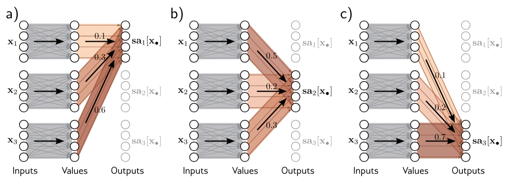

# Il Meccanismo di Attention: Una Guida Completa

## Introduzione e Intuizione

Il meccanismo di **attention** rappresenta una delle innovazioni più rivoluzionarie nel deep learning moderno. Per comprenderne l'importanza, partiamo da un'osservazione semplice ma profonda: quando leggiamo una frase complessa, non prestiamo la stessa attenzione a tutte le parole. Alcune sono cruciali per il significato, altre sono accessorie. Il nostro cervello è straordinariamente bravo a identificare dinamicamente dove focalizzare l'attenzione.

Consideriamo questa frase: *"Il gatto nero del vicino ha mangiato il pesce rosso che nuotava nella boccia."* Quando cerchiamo di capire "chi ha mangiato cosa", la nostra attenzione si focalizza principalmente su "gatto", "ha mangiato" e "pesce", mentre parole come "del" o "che" ricevono meno attenzione diretta, pur contribuendo alla comprensione strutturale.

Questa capacità di **attenzione selettiva** è esattamente quello che l'attention mechanism cerca di replicare artificialmente. L'idea è permettere a ogni elemento (una parola/un token) di una sequenza di "guardare" tutti gli altri elementi, decidendo dinamicamente a quali prestare maggiore attenzione per costruire la propria rappresentazione.

## I Problemi delle Architetture Precedenti

Per apprezzare pienamente l'innovazione dell'attention, dobbiamo comprendere le limitazioni che affliggevano i modelli precedenti, in particolare le Reti Neurali Ricorrenti (RNN) e le loro varianti come LSTM e GRU.
### Il Bottleneck Sequenziale

Le RNN processano le sequenze in modo strettamente sequenziale: per comprendere la parola in posizione $t$, il modello deve aver elaborato tutte le parole dalle posizioni $1$ a $t-1$. Questo approccio, seppur intuitivo, presenta problemi fondamentali.

Immaginiamo di dover tradurre una frase lunga dal tedesco all'inglese. In tedesco, il verbo principale spesso appare alla fine della frase. Una RNN deve "ricordare" tutte le informazioni accumulate dall'inizio della frase fino al verbo finale, mantenendo questa informazione in un singolo vettore di stato nascosto. È come cercare di ricordare una lista della spesa sempre più lunga senza poterla scrivere: prima o poi alcune informazioni si perdono.

Matematicamente, questo si manifesta nel problema del **vanishing gradient**: l'informazione delle parole iniziali deve "viaggiare" attraverso molti passaggi computazionali per raggiungere le posizioni finali, e durante questo viaggio si degrada progressivamente. Se abbiamo una sequenza di lunghezza $T$, il gradiente che deve propagare dalla fine all'inizio viene moltiplicato $T$ volte per i pesi della rete. Se questi pesi hanno norma minore di 1, il gradiente si riduce esponenzialmente.

### L'Impossibilità di Parallelizzazione

Un secondo problema cruciale è l'impossibilità di parallelizzare il calcolo. Per calcolare l'output in posizione $t$, dobbiamo necessariamente aver calcolato gli output in tutte le posizioni precedenti. Questo rende l'addestramento estremamente lento, specialmente su sequenze lunghe e con l'hardware moderno che è ottimizzato per calcoli paralleli.

### I Pesi Fissi

In una **rete neurale standard**, diversi input influenzano l'output in misura diversa secondo i valori dei pesi che moltiplicano quegli input. Questo meccanismo è il cuore dell'apprendimento nelle reti neurali: durante la fase di training, la rete regola questi pesi per minimizzare l'errore sui dati di addestramento.

Tuttavia, una volta che la rete è stata addestrata, **quei pesi, e i loro input associati, sono fissi**. Questo significa che la "importanza" relativa di ogni caratteristica di input è determinata una volta per tutte durante l'addestramento e rimane costante per tutti gli input futuri.

## L'Intuizione dell'Attention: Una Media Pesata Intelligente

L'attention risolve questi problemi attraverso un cambio di paradigma radicale. Invece di processare sequenzialmente, permette a ogni elemento di "guardare" direttamente tutti gli altri elementi della sequenza. Inoltre, la rete con attention cambia i pesi dinamicamente in base all'input. 

### Un Esempio Concreto

Consideriamo la frase: *"La chiave è sul tavolo nella cucina."* Supponiamo di voler determinare la rappresentazione della parola "chiave". Un meccanismo di attention permetterebbe a "chiave" di guardare direttamente tutte le altre parole e decidere quanto ciascuna sia rilevante:

- "La": bassa rilevanza (articolo generico)
- "è": media rilevanza (connette il soggetto al resto)
- "sul": alta rilevanza (preposizione che indica posizione)
- "tavolo": altissima rilevanza (oggetto su cui si trova la chiave)
- "nella": media rilevanza (ulteriore specificazione di posizione)
- "cucina": alta rilevanza (luogo specifico)

La rappresentazione finale di "chiave" sarebbe una combinazione pesata di tutte queste informazioni, con pesi proporzionali alla rilevanza.

### Codifica delle Parole: da One-Hot a Embedding

Per poter applicare meccanismi di attention sui testi, dobbiamo prima rappresentare le parole in forma numerica. Due approcci principali sono il **one-hot encoding** e gli **embedding**.

#### One-Hot Encoding

- Supponiamo di avere un vocabolario con $V$ parole distinte.  
- Ogni parola $w_i$ viene rappresentata come un vettore sparso $\mathbf{e}_i \in \mathbb{R}^V$, con un unico elemento pari a 1 nella posizione corrispondente all'indice della parola nel vocabolario:

$$
\mathbf{e}_i = [0, 0, \dots, 1, \dots, 0]
$$

- Questo metodo è semplice e diretto, ma presenta alcuni svantaggi:

  1. La dimensione dei vettori cresce rapidamente con il vocabolario.  
  2. Non cattura la **similarità semantica**: parole come "cane" e "gatto" risultano ortogonali, anche se semanticamente vicine, e parole come "divano" e "topo" risultano ortogonali anche se semanticamente distanti.  
  3. Non permette generalizzazione: ogni parola è completamente indipendente dalle altre.  

#### Embedding

Per superare questi limiti, si utilizzano i **Dense Word Embeddings**:

- Ogni parola $w_m$ viene rappresentata da un vettore **denso** $\mathbf{x}_m \in \mathbb{R}^d$, con $d \ll V$.  
- Gli embedding vengono **appresi** dal modello durante il training, in modo che parole semanticamente simili abbiano rappresentazioni vicine nello spazio degli embeddings:

$$
\mathbf{x}_1, \mathbf{x}_2, \dots, \mathbf{x}_N \in \mathbb{R}^d
$$

- Questi vettori densi sono la rappresentazione numerica di partenza per il **meccanismo di attention**: a differenza dei one-hot, gli embedding permettono di catturare relazioni semantiche e di ridurre drasticamente la dimensionalità.

Un Transformer rappresenta un'evoluzione degli embedding tradizionali: invece di assegnare a ogni vettore una rappresentazione fissa, lo colloca in uno spazio che tiene conto del contesto fornito da tutti gli altri vettori della sequenza.

### Formulazione Matematica

Consideriamo $N$ token in input, ognuno rappresentato da un embedding $\mathbf{x}_m \in \mathbb{R}^d$.

L'idea alla base della self-attention è quella di calcolare, per ciascun token (embedding), una **combinazione pesata** di tutti i token della sequenza.  
In altre parole, ogni output è una media pesata adattiva dei vettori di input.

#### Definizione dei Value

Per ciascun embedding $\mathbf{x}_m \in \mathbb{R}^d$, costruiamo un **value vector** $\mathbf{v}_m \in \mathbb{R}^{d_v}$ tramite una trasformazione lineare:

$$
\mathbf{v}_m = \mathbf{W}_v \mathbf{x}_m + \mathbf{b}_v
\quad\text{con}\quad 
\mathbf{W}_v \in \mathbb{R}^{d_v \times d}, \; \mathbf{b}_v \in \mathbb{R}^{d_v}
$$

dove $\mathbf{W}_v$ e $\mathbf{b}_v$ sono parametri appresi durante il training e $d_v$ indica la dimensione dei value vectors.

Tipicamente $d_v = d$ per permettere le residual connections, ma non è sempre necessariamente così.

#### Self-Attention come combinazione pesata

Il vettore di output corrispondente alla posizione $n$ è una combinazione lineare di tutti i value $\mathbf{v}_1, \dots, \mathbf{v}_N$, pesata dai coefficienti di attenzione $a_{nm}$:

$$
\mathbf{sa}_n[\mathbf{x}_1, \dots, \mathbf{x}_N] = \mathbf{y}_n = \sum_{m=1}^N a_{nm} \,\mathbf{v}_m
$$

dove $a_{nm}$ indica **quanto l'output in posizione $n$ presta attenzione all'input in posizione $m$**.

#### Vincoli sui pesi di attenzione

I pesi $a_{nm}$ hanno due proprietà fondamentali:

- **Non negatività:**  
  $a_{nm} \geq 0 \quad \forall n,m$
- **Normalizzazione:**  
  $\sum_{m=1}^N a_{nm} = 1 \quad \forall n$

Queste condizioni garantiscono che $\mathbf{y}_n$ sia una **combinazione convessa** dei value $\mathbf{v}_m$, rendendo il modello stabile e interpretabile.



<br>

**Figura 1 – La self-attention come instradamento (routing).**  
Il meccanismo di self-attention prende in input $N$ vettori $\mathbf{x}_1, \ldots, \mathbf{x}_N \in \mathbb{R}^d$  
(qui $N = 3$ e $d = 4$) e li processa separatamente per calcolare $N$ vettori *value*.  

L'output $n$-esimo $\mathbf{sa}_n[\mathbf{x}_1, \ldots, \mathbf{x}_N]$ (scritto in breve come $\mathbf{sa}_n[\mathbf{x}_\bullet]$)  
viene quindi calcolato come una **somma pesata** dei $N$ vettori *value*, dove i pesi sono positivi e sommano a uno.  

- **(a)** L'output $\mathbf{sa}_1[\mathbf{x}_\bullet]$ è calcolato come  
  $a_{11} = 0.1$ volte il primo vettore *value* $\mathbf{v}_1$,  
  $a_{12} = 0.3$ volte il secondo vettore *value* $\mathbf{v}_2$,  
  e $a_{13} = 0.6$ volte il terzo vettore *value* $\mathbf{v}_3$.  

- **(b)** L'output $\mathbf{sa}_2[\mathbf{x}_\bullet]$ è calcolato nello stesso modo,  
  ma con pesi $a_{21} = 0.5$, $a_{22} = 0.2$ e $a_{23} = 0.3$.  

- **(c)** Il calcolo dell'output $\mathbf{sa}_3[\mathbf{x}_\bullet]$ utilizza ancora pesi diversi:  
  $a_{31}$, $a_{32}$, $a_{33}$ con valori specifici per questa posizione.  

In sintesi, ciascun output può essere visto come un **instradamento differente dei $N$ vettori value**.

#### Interpretazione

La self-attention può quindi essere vista come un **meccanismo di instradamento (routing)**:  
ogni output $\mathbf{y}_n$ è costruito mescolando i value $\mathbf{v}_m$ in proporzioni determinate dai pesi $a_{nm}$.  

Nelle sezioni successive vedremo come vengono calcolati in pratica questi pesi $a_{nm}$ utilizzando le **query** e le **key**, e come questo porti alla definizione della **dot-product self-attention**.

La vera innovazione sta nel modo in cui vengono calcolati i pesi $a_{nm}$. Non sono fissi o predeterminati, ma vengono calcolati **dinamicamente** in base al contenuto effettivo della sequenza.

### Il Concetto di Query
La **query** $\mathbf{q}_n \in \mathbb{R}^{d_k}$ rappresenta "cosa sta cercando" l'elemento in posizione $n$. È una domanda posta in forma vettoriale. Quando calcoliamo la rappresentazione di "chiave" nel nostro esempio precedente, la query potrebbe essere interpretata come "Sto cercando informazioni che mi aiutino a capire dove mi trovo e cosa mi circonda".

Matematicamente, la query viene ottenuta attraverso una trasformazione lineare dell'input originale:
$$\mathbf{q}_n = \mathbf{W}_q \mathbf{x}_n + \mathbf{b}_q$$
dove $\mathbf{W}_q \in \mathbb{R}^{d_k \times d}$ è una matrice di pesi apprendibili e $\mathbf{b}_q \in \mathbb{R}^{d_k}$ è un vettore di bias. La dimensione $d_k$ (dimensione delle query e key) può essere diversa da $d$ (dimensione dell'input).

L'effetto della dimensione $d_k$ sull'apprendimento è legato alla **granularità delle relazioni** che il modello riesce a cogliere:
- **$d_k$ piccolo** → il modello riesce a rappresentare solo poche caratteristiche.  
  Questo porta a un'attenzione più semplice e focalizzata, ma con rischio di perdere dettagli.
- **$d_k$ grande** → il modello ha accesso a molte più informazioni.  
  Questo aumenta la capacità rappresentativa, ma può introdurre ridondanza e maggior costo computazionale.

Quindi $d_k$ non è scelto a caso, ma rappresenta un compromesso tra **espressività**, **stabilità numerica** e **efficienza**.

Per questo nei transformer standard si utilizza la regola:
$$
d_k = \frac{d}{h}
$$
dove:
- $d$ = dimensione dell'embedding di input
- $h$ = numero di teste di attenzione.

### Il Concetto di Key
La **key** $\mathbf{k}_m$ rappresenta "cosa può offrire" l'elemento in posizione $m$. È una sorta di "biglietto da visita" che descrive il tipo di informazione disponibile in quella posizione. Tornando al nostro esempio, la key di "tavola" potrebbe essere interpretata come "Sono un oggetto fisico, posso fornire informazioni su posizione e supporto di altri oggetti".

$$\mathbf{k}_m = \mathbf{W}_k \mathbf{x}_m + \mathbf{b}_k$$
dove $\mathbf{W}_k \in \mathbb{R}^{d_k \times d}$ e $\mathbf{b}_k \in \mathbb{R}^{d_k}$ sono i parametri per la trasformazione delle key.

### Il Concetto di Value
Il **value** $\mathbf{v}_m$ rappresenta "il contenuto informativo effettivo" dell'elemento in posizione $m$. Una volta che abbiamo deciso di prestare attenzione a un elemento (attraverso la compatibilità query-key), il value è ciò che effettivamente "prendiamo" da quell'elemento.

$$\mathbf{v}_m = \mathbf{W}_v \mathbf{x}_m + \mathbf{b}_v$$
dove $\mathbf{W}_v \in \mathbb{R}^{d_v \times d}$ e $\mathbf{b}_v \in \mathbb{R}^{d_v}$ sono i parametri per la trasformazione dei value. Notate che $d_v$ (dimensione dei value) può essere diversa sia da $d$ che da $d_k$.

### Perché Tre Trasformazioni Separate?
La separazione in query, key e value non è arbitraria ma serve scopi precisi e ha profonde implicazioni teoriche:

**Decoupling semantico**: La compatibilità (determinata da query e key) è separata dal contenuto (determinato dai value). Questo permette al modello di dire "So che devo prestare attenzione a questa posizione" (alta compatibilità query-key) indipendentemente da "Cosa prendo effettivamente da questa posizione" (value).

**Flessibilità rappresentazionale**: Ogni trasformazione può specializzarsi nel catturare aspetti diversi dell'informazione. Le query possono imparare a rappresentare "bisogni informativi", le key possono rappresentare "capacità informative", e i value possono rappresentare "contenuti informativi".

**Controllo dimensionale**: Permettere dimensioni diverse ottimizza l'efficienza computazionale. Tipicamente $d_k$ è più piccolo di $d$ per rendere più efficiente il calcolo delle similarità.

## Dot-Product Attention: Il Cuore del Meccanismo

### Calcolo della Compatibilità

Il cuore dell'**attention mechanism** è il calcolo della compatibilità tra key e query attraverso il **prodotto scalare**:

$$\text{score}(\mathbf{k}_m, \mathbf{q}_n) = \mathbf{k}_m^T \mathbf{q}_n = \sum_{\ell=1}^{d_k} k_{m,\ell} \cdot q_{n,\ell}$$

dove $m$ indica la posizione della key (input) e $n$ indica la posizione della query (output).

Questa scelta del prodotto scalare non è casuale ma ha solide motivazioni matematiche e computazionali. Il prodotto scalare misura la proiezione di un vettore sull'altro, catturando così quanto due vettori "puntino nella stessa direzione" nello spazio delle caratteristiche.

Se consideriamo vettori normalizzati, il prodotto scalare diventa il **coseno dell'angolo** tra i vettori, fornendo una misura di similarità geometrica intuitiva. Vettori paralleli (stessa direzione) hanno prodotto scalare massimo, vettori ortogonali hanno prodotto scalare zero, vettori opposti hanno prodotto scalare minimo.

### Il Problema dello Scaling e la Sua Soluzione

Quando le dimensioni dei vettori key e query diventano grandi, i prodotti scalari possono assumere valori molto grandi in magnitudine. Questo crea problemi significativi per la funzione softmax che viene applicata successivamente.

Per comprendere il problema, consideriamo la funzione softmax applicata ai punteggi per la query in posizione $n$:

$$\text{softmax}(\mathbf{s}_n)_m = \frac{e^{s_{mn}}}{\sum_{k=1}^{N} e^{s_{kn}}}$$

dove $\mathbf{s}_n = [s_{1n}, s_{2n}, \ldots, s_{Nn}]^T$ è il vettore dei punteggi per la query $n$.

Se gli elementi di $\mathbf{s}_n$ sono molto grandi, la funzione esponenziale li amplifica enormemente, causando due problemi:

1. **Saturazione**: La softmax si concentra quasi tutto il peso su un singolo elemento, perdendo la capacità di distribuire l'attenzione
2. **Instabilità numerica**: Valori molto grandi possono causare overflow nell'esponenziale

### Analisi Teorica dello Scaling Factor

Per risolvere questo problema, introduciamo un fattore di scala $\sqrt{d_k}$:

$$\text{score}(\mathbf{k}_m, \mathbf{q}_n) = \frac{\mathbf{k}_m^T \mathbf{q}_n}{\sqrt{d_k}}$$

La giustificazione teorica è elegante. Assumiamo che le componenti delle key e query siano variabili aleatorie indipendenti con media zero e varianza unitaria. Per una generica coppia key-query, il prodotto scalare è:

$$\mathbf{k}^T \mathbf{q} = \sum_{\ell=1}^{d_k} k_\ell q_\ell$$

La varianza di questa somma è:

$$\text{Var}(\mathbf{k}^T \mathbf{q}) = \text{Var}\left(\sum_{\ell=1}^{d_k} k_\ell q_\ell\right) = \sum_{\ell=1}^{d_k} \text{Var}(k_\ell q_\ell)$$

Poiché $k_\ell$ e $q_\ell$ sono indipendenti con media zero e varianza unitaria:

$$\text{Var}(k_\ell q_\ell) = \mathbb{E}[(k_\ell q_\ell)^2] - (\mathbb{E}[k_\ell q_\ell])^2 = \mathbb{E}[k_\ell^2]\mathbb{E}[q_\ell^2] - 0 = 1 \cdot 1 = 1$$

Quindi:

$$\text{Var}(\mathbf{k}^T \mathbf{q}) = d_k$$

Dividendo per $\sqrt{d_k}$, otteniamo:

$$\text{Var}\left(\frac{\mathbf{k}^T \mathbf{q}}{\sqrt{d_k}}\right) = \frac{\text{Var}(\mathbf{k}^T \mathbf{q})}{d_k} = \frac{d_k}{d_k} = 1$$

Questo mantiene la varianza dei punteggi costante, indipendentemente dalla dimensionalità, stabilizzando il comportamento della softmax.

### La Softmax: Competizione e Normalizzazione

I punteggi scalati vengono trasformati in pesi probabilistici attraverso la softmax. Per la query in posizione $n$:

$$a_{mn} = \frac{\exp\left(\frac{\mathbf{k}_m^T \mathbf{q}_n}{\sqrt{d_k}}\right)}{\sum_{\ell=1}^{N} \exp\left(\frac{\mathbf{k}_\ell^T \mathbf{q}_n}{\sqrt{d_k}}\right)}$$

La softmax ha proprietà cruciali per l'attention:

**Competizione**: I pesi "competono" tra loro. Se un punteggio aumenta, gli altri diminuiscono automaticamente per mantenere la somma pari a 1. Questo crea un meccanismo di **competizione soft** dove l'attenzione si concentra sui punteggi più alti.

**Differenziabilità**: È completamente differenziabile, permettendo l'addestramento end-to-end tramite backpropagation.

**Interpretabilità**: I pesi risultanti possono essere interpretati come probabilità, fornendo insight su dove il modello sta "guardando".

## Formulazione Matriciale e Implementazione

### Efficienza Computazionale

Per implementare efficientemente l'attention, utilizziamo operazioni matriciali che sfruttano l'hardware moderno ottimizzato per il calcolo parallelo.

Organizziamo tutti gli input in una matrice $\mathbf{X} \in \mathbb{R}^{d \times N}$ dove ogni colonna $n$ contiene l'embedding $\mathbf{x}_n$. Le matrici di query, key e value diventano:

$$\mathbf{Q} = \mathbf{W}_q \mathbf{X} + \mathbf{b}_q \mathbf{1}^T \in \mathbb{R}^{d_k \times N}$$
$$\mathbf{K} = \mathbf{W}_k \mathbf{X} + \mathbf{b}_k \mathbf{1}^T \in \mathbb{R}^{d_k \times N}$$
$$\mathbf{V} = \mathbf{W}_v \mathbf{X} + \mathbf{b}_v \mathbf{1}^T \in \mathbb{R}^{d_v \times N}$$

dove $\mathbf{1} \in \mathbb{R}^{1 \times N}$ è un vettore riga di tutti 1.

In questa formulazione:
- La colonna $n$ di $\mathbf{Q}$ contiene $\mathbf{q}_n$
- La colonna $m$ di $\mathbf{K}$ contiene $\mathbf{k}_m$
- La colonna $m$ di $\mathbf{V}$ contiene $\mathbf{v}_m$

### La Formula Completa

L'intero meccanismo di attention si riduce a una singola operazione matriciale:

$$\text{Attention}(\mathbf{Q}, \mathbf{K}, \mathbf{V}) = \mathbf{V} \cdot \text{softmax}\left(\frac{\mathbf{K}^T\mathbf{Q}}{\sqrt{d_k}}\right)$$

Analizziamo i passaggi:

1. **$\mathbf{K}^T\mathbf{Q} \in \mathbb{R}^{N \times N}$**: Calcola tutti i prodotti scalari key-query simultaneamente, dove l'elemento $(m,n)$ è $\mathbf{k}_m^T \mathbf{q}_n$

2. **Divisione per $\sqrt{d_k}$**: Applica lo scaling factor elemento per elemento

3. **Softmax**: Normalizza ogni colonna della matrice (ogni colonna $n$ corrisponde ai pesi di attenzione $a_{mn}$ per $m = 1, \ldots, N$)

4. **Moltiplicazione per $\mathbf{V}$**: Calcola la combinazione pesata dei value. Il risultato è una matrice $\mathbb{R}^{d_v \times N}$ dove la colonna $n$ contiene $\mathbf{y}_n = \sum_{m=1}^N a_{mn} \mathbf{v}_m$

## Self-Attention: Il Dialogo Interno della Sequenza

### Definizione e Significato

Nel **self-attention**, tutte le query, key e value provengono dalla stessa sequenza di input. Questo significa che ogni elemento della sequenza può prestare attenzione a tutti gli altri elementi, incluso se stesso.

Matematicamente, tutti derivano dalla stessa matrice $\mathbf{X}$:
$$\mathbf{Q} = \mathbf{W}_q \mathbf{X} + \mathbf{b}_q \mathbf{1}^T$$
$$\mathbf{K} = \mathbf{W}_k \mathbf{X} + \mathbf{b}_k \mathbf{1}^T$$  
$$\mathbf{V} = \mathbf{W}_v \mathbf{X} + \mathbf{b}_v \mathbf{1}^T$$

### Un Esempio Dettagliato

Consideriamo la frase: *"Il gatto caccia il topo."* Nel self-attention, ogni parola può prestare attenzione a tutte le altre:

- **"gatto"** (posizione 2) potrebbe avere $a_{32}$ alto per "caccia" (relazione soggetto-verbo) e $a_{52}$ significativo per "topo" (relazione semantica predatore-preda)
- **"caccia"** (posizione 3) potrebbe avere $a_{23}$ alto per "gatto" (chi fa l'azione) e $a_{53}$ alto per "topo" (oggetto dell'azione)
- **"topo"** (posizione 5) potrebbe prestare attenzione a "caccia" e "gatto" per comprendere il suo ruolo nella situazione

Questo crea rappresentazioni **contestuali**: la rappresentazione di ogni parola $\mathbf{y}_n$ incorpora informazioni da tutte le altre parole nella frase attraverso i coefficienti $a_{mn}$.

### Vantaggi del Self-Attention

**Cattura di dipendenze a lungo raggio**: Due parole distanti nella sequenza (posizioni $n$ e $m$ con $|n-m|$ grande) possono interagire direttamente senza passaggi intermedi.

**Parallelizzazione completa**: Tutti i calcoli possono essere eseguiti simultaneamente, non c'è dipendenza sequenziale.

**Flessibilità**: Il modello impara automaticamente quali relazioni $a_{mn}$ sono importanti, senza assumzioni a priori sulla struttura linguistica.

## Implementazione in Python

Vediamo ora un'implementazione pratica del meccanismo di self-attention:

```python
import torch
from torch import nn
import torch.nn.functional as F
import math

class BasicSelfAttention(nn.Module):
    """
    Implementazione di Self-Attention che segue esattamente il formalismo matematico:
    
    Formalismo:
    - X ∈ R^(d × N): matrice input con features sulle righe, sequenze sulle colonne
    - Q = W_q @ X + b_q @ 1^T ∈ R^(d_k × N)
    - K = W_k @ X + b_k @ 1^T ∈ R^(d_k × N)  
    - V = W_v @ X + b_v @ 1^T ∈ R^(d_v × N)
    - Scores = K^T @ Q / √d_k ∈ R^(N × N), dove scores[m,n] = k_m^T @ q_n
    - Attention = V @ softmax_col(Scores) ∈ R^(d_v × N)
    """
    
    def __init__(self, d_model, d_k=None, d_v=None):
        super().__init__()
        
        # Dimensioni di default
        if d_k is None:
            d_k = d_model
        if d_v is None:
            d_v = d_model
            
        self.d_model = d_model
        self.d_k = d_k
        self.d_v = d_v
        
        # Matrici di trasformazione come definite nel formalismo
        # W_q ∈ R^(d_k × d_model)
        self.W_q = nn.Parameter(torch.randn(d_k, d_model) / math.sqrt(d_model))
        # W_k ∈ R^(d_k × d_model)  
        self.W_k = nn.Parameter(torch.randn(d_k, d_model) / math.sqrt(d_model))
        # W_v ∈ R^(d_v × d_model)
        self.W_v = nn.Parameter(torch.randn(d_v, d_model) / math.sqrt(d_model))
        
        # Vettori di bias
        # b_q ∈ R^(d_k × 1)
        self.b_q = nn.Parameter(torch.zeros(d_k, 1))
        # b_k ∈ R^(d_k × 1)
        self.b_k = nn.Parameter(torch.zeros(d_k, 1))  
        # b_v ∈ R^(d_v × 1)
        self.b_v = nn.Parameter(torch.zeros(d_v, 1))
        
    def forward(self, x, return_attention=True):
        """
        Forward pass seguendo il formalismo matematico.
        
        Args:
            x: Input tensor di shape (batch_size, seq_len, d_model)
            return_attention: Se ritornare i pesi di attention
            
        Returns:
            output: Tensor di shape (batch_size, seq_len, d_v)
            attention_weights: Tensor di shape (batch_size, seq_len, seq_len) se return_attention=True
        """
        batch_size, seq_len, d_model = x.size()
        
        # PASSO 1: Riorganizza input secondo il formalismo
        # x: (batch_size, seq_len, d_model) → X: (batch_size, d_model, seq_len)
        X = x.transpose(-2, -1)  
        
        # PASSO 2: Calcola Q, K, V seguendo esattamente il formalismo
        # Q = W_q @ X + b_q @ 1^T
        ones = torch.ones(1, seq_len, device=x.device, dtype=x.dtype)  # 1^T ∈ R^(1 × N)
        
        Q = torch.matmul(self.W_q.unsqueeze(0), X) + torch.matmul(self.b_q.unsqueeze(0), ones.unsqueeze(0))
        K = torch.matmul(self.W_k.unsqueeze(0), X) + torch.matmul(self.b_k.unsqueeze(0), ones.unsqueeze(0))
        V = torch.matmul(self.W_v.unsqueeze(0), X) + torch.matmul(self.b_v.unsqueeze(0), ones.unsqueeze(0))
        
        # PASSO 3: Calcola scores = K^T @ Q / √d_k
        # K^T: (batch_size, seq_len, d_k)
        # Q: (batch_size, d_k, seq_len)
        # Risultato: (batch_size, seq_len, seq_len) dove [m,n] = k_m^T @ q_n
        scores = torch.matmul(K.transpose(-2, -1), Q) / math.sqrt(self.d_k)
        
        # PASSO 4: Applica softmax per colonne
        # softmax_col normalizza lungo la dimensione delle key (dim=-2)
        # Così ∑_m a_{mn} = 1 per ogni query n
        attention_weights = F.softmax(scores, dim=-2)
        
        # PASSO 5: Calcola output = V @ attention_weights
        # V: (batch_size, d_v, seq_len)
        # attention_weights: (batch_size, seq_len, seq_len)
        # Risultato: (batch_size, d_v, seq_len)
        output = torch.matmul(V, attention_weights)
        
        # PASSO 6: Riporta alla convenzione standard PyTorch
        # (batch_size, d_v, seq_len) → (batch_size, seq_len, d_v)
        output = output.transpose(-2, -1)
        
        if return_attention:
            return output, attention_weights
        else:
            return output
```

## Complessità Computazionale e Considerazioni Pratiche

### Analisi della Complessità

La complessità computazionale del self-attention è dominata da due operazioni principali:

**Calcolo di $\mathbf{Q}\mathbf{K}^T$**: Richiede $O(N^2 d_k)$ operazioni, dove $N$ è la lunghezza della sequenza.

**Calcolo dell'output**: La moltiplicazione dei pesi per i value richiede $O(N^2 d_v)$ operazioni.

La **complessità totale** è quindi $O(N^2 d)$ dove $d = \max(d_k, d_v)$.

### Confronto con le RNN

Le RNN hanno complessità $O(N d^2)$ per layer, che sembra migliore per $N < d$. Tuttavia, il vantaggio cruciale dell'attention è la **parallelizzazione**: mentre le RNN richiedono $O(N)$ operazioni sequenziali, l'attention richiede solo $O(1)$.

### Limitazioni Pratiche

**Consumo di memoria**: La matrice di attention $N \times N$ può diventare proibitivamente grande per sequenze lunghe. Per $N = 10000$, abbiamo 100 milioni di elementi.

**Scaling quadratico**: Il tempo di calcolo cresce quadraticamente con la lunghezza della sequenza, limitando l'applicabilità a documenti molto lunghi.

## Proprietà Matematiche e Interpretazione

### Interpretazione Geometrica

L'attention può essere vista come un meccanismo che "mescola" i vettori di input in modo intelligente. Ogni output è un punto nel convex hull dei vettori di input, con la posizione determinata dai pesi di attention.

Geometricamente, se i value sono punti nello spazio, l'attention calcola un "centro di massa" pesato di questi punti per ogni query.

### Connessioni con la Teoria dell'Informazione

I pesi di attention possono essere interpretati come una distribuzione di probabilità condizionale:

$$P(\text{prestare attenzione alla posizione } j | \text{query in posizione } i) = a_{ij}$$

L'output è quindi il valore atteso dei value sotto questa distribuzione. Questo collega l'attention alla teoria dell'informazione e ai modelli probabilistici.

### Invarianze e Simmetrie

Il meccanismo di attention ha alcune proprietà di invarianza interessanti:

**Permutation equivariance**: Se permuti gli input, gli output vengono permutati allo stesso modo (senza positional encoding).

**Scale invariance**: Moltiplicare tutti gli input per una costante non cambia i pesi di attention (grazie alla normalizzazione softmax).

## Conclusioni

Il meccanismo di attention ha rivoluzionato il deep learning fornendo un modo elegante e efficace per catturare relazioni complesse in sequenze di dati. La sua capacità di permettere interazioni dirette tra elementi distanti, mantenendo al contempo la parallelizzazione completa, lo ha reso la base per i Transformer e, di conseguenza, per i modelli linguistici moderni.

L'intuizione fondamentale - permettere a ogni elemento di "prestare attenzione" a tutti gli altri elementi - è semplice ma potente. La sua implementazione attraverso query, key e value fornisce la flessibilità necessaria per apprendere relazioni complesse, mentre la formulazione matriciale garantisce l'efficienza computazionale.

Sebbene presenti limitazioni in termini di complessità quadratica, l'attention rimane uno strumento fondamentale nell'arsenale del deep learning moderno, e continua a ispirare nuove architetture e applicazioni in numerosi domini oltre al natural language processing.