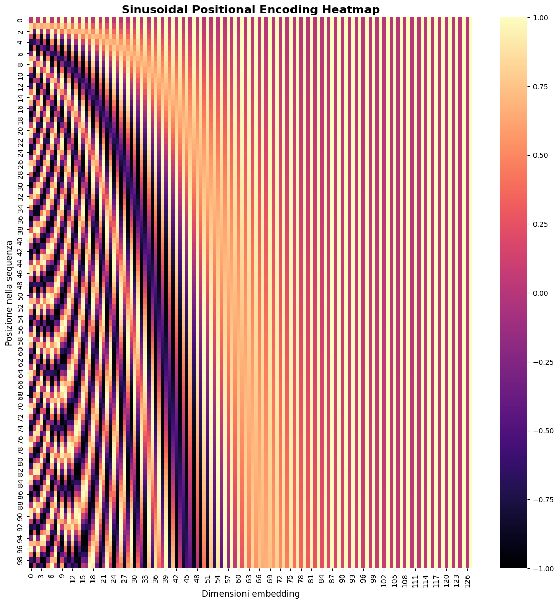
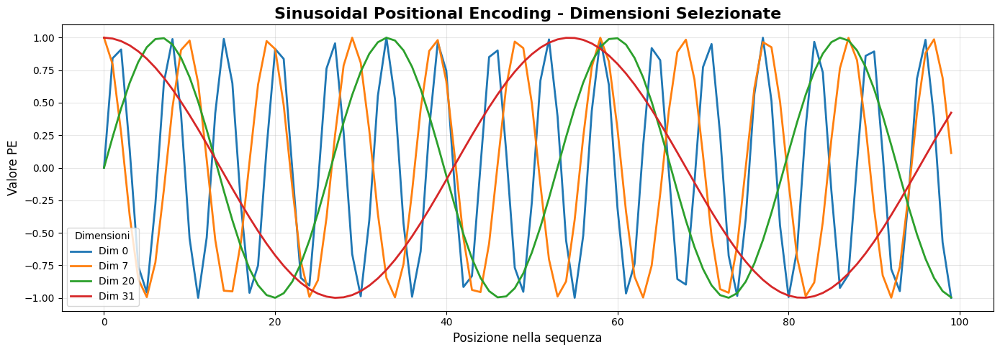

# Il Positional Encoding: Una Guida Completa

## Introduzione e Motivazione

Il meccanismo di **self-attention** tradizionale presenta una proprietà fondamentale che, a prima vista, potrebbe sembrare un vantaggio ma che in realtà costituisce una limitazione critica: è **permutation invariant**.

Consideriamo due frasi apparentemente simili:
- *"Il gatto caccia il topo"*
- *"Il topo caccia il gatto"*

Per un essere umano, queste frasi hanno significati completamente diversi. Il primo descrive un predatore che insegue la sua preda, il secondo una situazione decisamente più insolita. La differenza semantica è interamente dovuta all'**ordine** delle parole.

Tuttavia, se applichiamo il meccanismo di self-attention puro a queste due frasi, otterremmo risultati identici. Questo perché l'attention calcola una matrice di similarità dove ogni elemento dipende solo dal contenuto dei vettori, non dalla loro posizione nella sequenza.

### Il Problema della Permutation Invariance

Matematicamente, se $\pi$ è una permutazione degli indici $\{1, 2, \ldots, N\}$, e definiamo:
$$\mathbf{X}' = \begin{bmatrix} \mathbf{x}_{\pi(1)} & \mathbf{x}_{\pi(2)} & \cdots & \mathbf{x}_{\pi(N)} \end{bmatrix}$$

allora:
$$\text{Attention}(\mathbf{X}') = \text{Permute}(\text{Attention}(\mathbf{X}), \pi)$$

In altre parole, l'output dell'attention su una sequenza permutata è semplicemente la permutazione dell'output originale. Questo significa che il modello non può distinguere tra "gatto caccia topo" e "topo caccia gatto" basandosi solo sul contenuto semantico delle parole.

### L'Importanza dell'Ordine nel Linguaggio

L'ordine è cruciale in molti aspetti del linguaggio naturale:

**Struttura sintattica**: In "La casa rossa è bella", l'aggettivo "rossa" modifica "casa", non "bella". La posizione determina le relazioni sintattiche.

**Relazioni causali**: In "Prima piove, poi esce il sole", l'ordine temporale è semanticamente rilevante.

**Ambiguità di scope**: In "Il professore ha visto lo studente con il telescopio", l'interpretazione cambia se riordiniamo gli elementi.

## La Soluzione: Positional Encoding

Il **positional encoding** risolve questo problema iniettando informazione posizionale direttamente negli embedding di input, prima che vengano processati dal meccanismo di attention.

L'idea fondamentale è semplice: invece di utilizzare direttamente gli embedding delle parole $\mathbf{x}_n$, utilizziamo una versione "arricchita":

$$\mathbf{x}'_n = \mathbf{x}_n + \mathbf{p}_n$$

dove $\mathbf{p}_n \in \mathbb{R}^d$ è il **positional encoding** per la posizione $n$.

Successivamente, applichiamo le trasformazioni lineari per ottenere query, key e value:

- **Query**: $\mathbf{q}_n = \mathbf{W}_q \mathbf{x}'_n + \mathbf{b}_q = \mathbf{W}_q (\mathbf{x}_n + \mathbf{p}_n) + \mathbf{b}_q$
- **Key**: $\mathbf{k}_m = \mathbf{W}_k \mathbf{x}'_m + \mathbf{b}_k = \mathbf{W}_k (\mathbf{x}_m + \mathbf{p}_m) + \mathbf{b}_k$
- **Value**: $\mathbf{v}_m = \mathbf{W}_v \mathbf{x}'_m + \mathbf{b}_v = \mathbf{W}_v (\mathbf{x}_m + \mathbf{p}_m) + \mathbf{b}_v$

### Requisiti per un Positional Encoding Efficace

Un buon positional encoding deve soddisfare diversi requisiti:

1. **Unicità**: Posizioni diverse devono avere encoding diversi: $\mathbf{p}_i \neq \mathbf{p}_j$ per $i \neq j$
2. **Determinismo**: La stessa posizione deve sempre avere lo stesso encoding
3. **Bounded**: I valori devono rimanere in un range limitato per non dominare l'informazione semantica
4. **Relazione di distanza**: Posizioni vicine dovrebbero avere encoding "simili" in qualche senso
5. **Estendibilità**: Deve funzionare per sequenze di lunghezza arbitraria, anche superiore a quelle viste durante il training

### Effetto sui Punteggi di Attention

I punteggi di attention diventano:
$$s_{mn} = \frac{1}{\sqrt{d_k}} \mathbf{k}_m^T \mathbf{q}_n = \frac{1}{\sqrt{d_k}} (\mathbf{W}_k (\mathbf{x}_m + \mathbf{p}_m) + \mathbf{b}_k)^T (\mathbf{W}_q (\mathbf{x}_n + \mathbf{p}_n) + \mathbf{b}_q)$$

Espandendo e trascurando i termini di bias per semplicità:
$$s_{mn} = \frac{1}{\sqrt{d_k}} \left[ (\mathbf{W}_k \mathbf{x}_m)^T (\mathbf{W}_q \mathbf{x}_n) + (\mathbf{W}_k \mathbf{x}_m)^T (\mathbf{W}_q \mathbf{p}_n) + (\mathbf{W}_k \mathbf{p}_m)^T (\mathbf{W}_q \mathbf{x}_n) + (\mathbf{W}_k \mathbf{p}_m)^T (\mathbf{W}_q \mathbf{p}_n) \right]$$

### Interpretazione dei Quattro Termini

1. **Contenuto–Contenuto**  
   $$(W_k \mathbf{x}_m)^T (W_q \mathbf{x}_n)$$  
   È il termine originale: confronta il contenuto dei token (embedding) nelle posizioni $m$ e $n$.  
   → Senza positional encoding rimarrebbe solo questo.

2. **Contenuto–Posizione**  
   $$(W_k \mathbf{x}_m)^T (W_q \mathbf{p}_n)$$  
   Il contenuto in posizione $m$ viene confrontato con *la posizione* $n$.  
   → Permette di modellare il fatto che un token (embedding) possa “guardare” preferenzialmente a certe posizioni della sequenza, indipendentemente dal contenuto.

3. **Posizione–Contenuto**  
   $$(W_k \mathbf{p}_m)^T (W_q \mathbf{x}_n)$$  
   La posizione $m$ influenza come valutare il contenuto in $n$.  
   → Esempio: il modello può imparare che i token (embedding) iniziali hanno un ruolo speciale rispetto agli altri.

4. **Posizione–Posizione**  
   $$(W_k \mathbf{p}_m)^T (W_q \mathbf{p}_n)$$  
   Confronto puramente posizionale tra $m$ e $n$.  
   → Con encoding sinusoidali, diventa una funzione della **distanza relativa** tra le due posizioni.

### Sintesi

Questa espansione mostra che il positional encoding non si limita ad arricchire gli embedding, ma **entra direttamente nei calcoli di attenzione** in quattro modi distinti:

- **Contenuto–Contenuto**: relazione semantica fra token (il termine "classico").  
- **Key–Posizione** e **Posizione–Query**: interazioni miste che legano contenuto e posizione.  
- **Posizione–Posizione**: relazioni strutturali fra posizioni, indipendenti dal contenuto.

👉 In pratica, il modello non solo sa *cosa* c’è nella sequenza, ma anche *dove* e *in relazione a chi*.  

## Sinusoidal Positional Encoding: La Soluzione Elegante

Il **sinusoidal positional encoding**, introdotto nel paper "Attention Is All You Need", soddisfa tutti questi requisiti attraverso una formulazione matematicamente molto elegante.

### Definizione Matematica

Per una posizione $n$ e una dimensione $i$ (dove $i = 0, 1, 2, \ldots, d-1$) dove $d$ rappresenta la dimensione dell'embedding, il positional encoding è definito come:

$$
\text{PE}(n, i) = \begin{cases}
\sin\left(\frac{n}{10000^{i/d}}\right) & \text{se } i \text{ è pari} \\[0.3em]
\cos\left(\frac{n}{10000^{(i-1)/d}}\right) & \text{se } i \text{ è dispari}
\end{cases}
$$

Equivalentemente, possiamo scrivere:
$$
\text{PE}(n, 2j) = \sin\left(\frac{n}{10000^{2j/d}}\right)
$$
$$
\text{PE}(n, 2j+1) = \cos\left(\frac{n}{10000^{2j/d}}\right)
$$

dove $j = 0, 1, 2, \ldots, \lfloor d/2 \rfloor - 1$.

### Interpretazione delle Frequenze

Ogni coppia di dimensioni $(2j, 2j+1)$ corrisponde a una **frequenza** specifica:
$$\omega_j = \frac{1}{10000^{2j/d}}$$

Le dimensioni con indice basso hanno frequenze alte (oscillazioni rapide), mentre le dimensioni con indice alto hanno frequenze basse (oscillazioni lente).

Questa struttura crea una sorta di "orologio multidimensionale" dove:
- Le dimensioni a **frequenza alta** distinguono posizioni vicine
- Le dimensioni a **frequenza bassa** catturano pattern a lungo raggio

### Esempio Numerico

In questo esempio, calcoliamo e visualizziamo il **positional encoding sinusoidale** introdotto nel paper *"Attention Is All You Need"*.

#### 1. Funzione di Calcolo

Definiamo una funzione per calcolare la matrice di positional encoding, che prende in input il numero massimo di posizioni della sequenza e la dimensione dell'embedding.

```python
import numpy as np
import matplotlib.pyplot as plt
import seaborn as sns

# ----------------------------
# Funzione Positional Encoding
# ----------------------------
def sinusoidal_positional_encoding(max_position, d_model):
    # Genera un array di posizioni da 0 a max_position-1
    position = np.arange(max_position)[:, np.newaxis]  
    
    # Calcola il termine di divisione per le frequenze esponenziali
    # Usando exp e log per stabilità numerica invece di 10000^(2i/d)
    div_term = np.exp(np.arange(0, d_model, 2) * -(np.log(10000.0) / d_model))
    
    # Inizializza la matrice dei positional encoding a zero
    pe = np.zeros((max_position, d_model))  
    
    # Dimensioni pari: sinus
    pe[:, 0::2] = np.sin(position * div_term)  
    # Dimensioni dispari: coseno
    pe[:, 1::2] = np.cos(position * div_term)  
    
    # Ritorna la matrice PE (posizioni x dimensioni embedding)
    return pe

```

#### Motivazione dell'Uso di log ed exp

Vediamo perché riscriviamo la formula in forma esponenziale:

$$
10000^{2i/d} = \exp\left(\frac{2i}{d} \log 10000\right)
$$

Quindi la divisione originale:

$$
\frac{n}{10000^{2i/d}} = n \cdot \exp\left(- \frac{2i}{d} \log 10000\right)
$$

##### Motivo della log:

Usando `log` ed `exp` evitiamo di calcolare potenze molto grandi o molto piccole direttamente.  
Questo migliora la **stabilità numerica** e previene **overflow** o **underflow**.

##### Equivalenza:

Matematicamente, `position * div_term` nel codice equivale a `n / 10000^(2i/d)` della formula originale.


#### 2. Parametri di Esempio
Per visualizzare i pattern tipici:
- Numero di posizioni: `max_position = 100`  
- Dimensione dell'embedding: `d_model = 128`  

```python
# Parametri
max_position = 100   # Numero di posizioni da visualizzare
d_model = 128        # Dimensione embedding

# Calcolo PE
pe = sinusoidal_positional_encoding(max_position, d_model)
```

### 3. Heatmap della Matrice PE
Visualizziamo l'intera matrice PE con una **heatmap**:

- Asse verticale → posizioni nella sequenza  
- Asse orizzontale → dimensioni dell'embedding  
- Palette colori accattivante per evidenziare le oscillazioni sinusoidali  

```python
# Heatmap con palette
plt.figure(figsize=(14, 14))
sns.heatmap(pe, cmap='magma', cbar=True, vmin=-1, vmax=1)  # Cambiato cmap
plt.title('Sinusoidal Positional Encoding Heatmap', fontsize=16, fontweight='bold')
plt.xlabel('Dimensioni embedding', fontsize=12)
plt.ylabel('Posizione nella sequenza', fontsize=12)
plt.show()
```


### 4. Andamento di Dimensioni Selezionate
Per osservare come cambiano alcune dimensioni chiave attraverso la sequenza:

- Selezioniamo dimensioni rappresentative (es. 0, 3, 7, 15, 31)  
- Plottiamo il loro andamento lungo le posizioni  

```python
# Visualizzazione Dimensioni Selezionate
plt.figure(figsize=(14, 5))
dims_to_plot = [0, 7, 20, 31]  # Dimensioni chiave
colors = sns.color_palette("tab10", len(dims_to_plot))

for i, d in enumerate(dims_to_plot):
    plt.plot(pe[:, d], label=f'Dim {d}', color=colors[i], linewidth=2)

plt.title('Sinusoidal Positional Encoding - Dimensioni Selezionate', fontsize=16, fontweight='bold')
plt.xlabel('Posizione nella sequenza', fontsize=12)
plt.ylabel('Valore PE', fontsize=12)
plt.grid(alpha=0.3)
plt.legend(title='Dimensioni')
plt.tight_layout()
plt.show()
```



### 5. Esempio Concreto
Per avere un’idea numerica dei valori:

- Consideriamo le prime 5 posizioni con dimensione embedding ridotta (es. 6)  
- Stampiamo i vettori di positional encoding corrispondenti  

```python
# Esempio concreto delle prime posizioni
print("Prime 5 posizioni (dimensioni 6):")
pe_small = sinusoidal_positional_encoding(5, 6)
for i, p in enumerate(pe_small):
    print(f"Posizione {i}: {np.round(p, 3)}")

[OUTPUT:]
Prime 5 posizioni (dimensioni 6):
Posizione 0: [0. 1. 0. 1. 0. 1.]
Posizione 1: [0.841 0.54  0.046 0.999 0.002 1.   ]
Posizione 2: [ 0.909 -0.416  0.093  0.996  0.004  1.   ]
Posizione 3: [ 0.141 -0.99   0.139  0.99   0.006  1.   ]
Posizione 4: [-0.757 -0.654  0.185  0.983  0.009  1.   ]
```

### Visualizzazione dei Pattern

Osservando questi vettori, notiamo pattern interessanti:

**Frequenze diverse**: Le prime due dimensioni (frequenza alta) cambiano rapidamente tra posizioni consecutive, mentre le ultime due (frequenza bassa) cambiano più gradualmente.

**Unicità**: Ogni posizione ha un "fingerprint" unico dato dalla combinazione delle diverse frequenze.

**Continuità**: Posizioni adiacenti hanno encoding simili ma distinguibili.

## Proprietà Matematiche del Sinusoidal Encoding

### 1. Proprietà di Linearità

Una delle proprietà più eleganti del sinusoidal encoding è che permette di calcolare l'encoding di una posizione $n + k$ a partire da quello della posizione $n$ attraverso una **trasformazione lineare**.

Per una singola frequenza $\omega_j$, abbiamo:
$$
\begin{bmatrix}
\sin(\omega_j(n + k)) \\
\cos(\omega_j(n + k))
\end{bmatrix}
=
\begin{bmatrix}
\cos(\omega_j k) & \sin(\omega_j k) \\
-\sin(\omega_j k) & \cos(\omega_j k)
\end{bmatrix}
\begin{bmatrix}
\sin(\omega_j n) \\
\cos(\omega_j n)
\end{bmatrix}
$$

Questa è una **matrice di rotazione** di angolo $\omega_j k$.

### 2. Prodotto Scalare e Distanza

Il prodotto scalare tra gli encoding di due posizioni ha una forma analitica precisa:
$$
\begin{aligned}
\mathbf{p}_i^T \mathbf{p}_j 
&= \sum_{m=0}^{d-1} (\mathbf{p}_i)_m \cdot (\mathbf{p}_j)_m \\[2mm]
&= \sum_{k=0}^{d/2-1} \Big[ (\mathbf{p}_i)_{2k} (\mathbf{p}_j)_{2k} + (\mathbf{p}_i)_{2k+1} (\mathbf{p}_j)_{2k+1} \Big] \\[1mm]
&= \sum_{k=0}^{d/2-1} \Big[ \sin(\omega_k i) \sin(\omega_k j) + \cos(\omega_k i) \cos(\omega_k j) \Big] \\[1mm]
&= \sum_{k=0}^{d/2-1} \cos(\omega_k (i-j)) \quad \text{(per l'identità trigonometrica } \cos(a-b) = \cos a \cos b + \sin a \sin b \text{)}
\end{aligned}
$$

Questo significa che la "similarità" tra due posizioni dipende solo dalla loro **distanza relativa** $|i-j|$, non dalle posizioni assolute.

### 3. Bounded Values

Tutti i valori del positional encoding sono compresi tra $-1$ e $1$:
$$-1 \leq \text{PE}(n, i) \leq 1 \quad \forall n, i$$

Questo assicura che il positional encoding non domini l'informazione semantica degli embedding.

### 4. Estendibilità

Il sinusoidal encoding può essere calcolato per posizioni arbitrariamente grandi senza bisogno di riaddestramento, poiché le funzioni trigonometriche sono definite per tutti i numeri reali.

## Esempio Concreto: Analisi di una Frase

Consideriamo la frase: *"Il gatto dorme"* e vediamo come il positional encoding influenzi l'attention.

### Senza Positional Encoding

Gli embedding semantici potrebbero essere (semplificando a $\mathbb{R}^3$):
- $\mathbf{x}_1 = [0.2, 0.8, 0.1]^T$ (Il)
- $\mathbf{x}_2 = [0.9, 0.3, 0.7]^T$ (gatto)  
- $\mathbf{x}_3 = [0.1, 0.5, 0.9]^T$ (dorme)

I punteggi di attention (semplificati, assumendo $\mathbf{W}_q = \mathbf{W}_k = \mathbf{I}$ e ignorando il fattore di scala) sarebbero:
- $s_{11} = \mathbf{x}_1^T \mathbf{x}_1 = 0.69$
- $s_{12} = \mathbf{x}_1^T \mathbf{x}_2 = 0.41$
- $s_{13} = \mathbf{x}_1^T \mathbf{x}_3 = 0.56$

### Con Positional Encoding

Dopo aver aggiunto il positional encoding:
- $\mathbf{x}'_1 = \mathbf{x}_1 + \mathbf{p}_1$
- $\mathbf{x}'_2 = \mathbf{x}_2 + \mathbf{p}_2$
- $\mathbf{x}'_3 = \mathbf{x}_3 + \mathbf{p}_3$

I nuovi punteggi di attention incorporeranno informazione posizionale:
$$s_{12} = (\mathbf{x}_1 + \mathbf{p}_1)^T(\mathbf{x}_2 + \mathbf{p}_2) = \mathbf{x}_1^T\mathbf{x}_2 + \mathbf{x}_1^T\mathbf{p}_2 + \mathbf{p}_1^T\mathbf{x}_2 + \mathbf{p}_1^T\mathbf{p}_2$$

Il termine $\mathbf{p}_1^T\mathbf{p}_2$ aggiunge un bias basato sulla distanza posizionale, mentre i termini crociati $\mathbf{x}_1^T\mathbf{p}_2$ e $\mathbf{p}_1^T\mathbf{x}_2$ creano interazioni complesse tra semantica e posizione.

## Integrazione con l'Attention Mechanism

### Formulazione Matriciale Completa

Nel meccanismo di attention con positional encoding, partiamo dagli embedding arricchiti:
$$\mathbf{X}' = \mathbf{X} + \mathbf{P} \in \mathbb{R}^{d \times N}$$

dove:
- $\mathbf{X} = [\mathbf{x}_1, \mathbf{x}_2, \ldots, \mathbf{x}_N] \in \mathbb{R}^{d \times N}$ contiene gli embedding di contenuto
- $\mathbf{P} = [\mathbf{p}_1, \mathbf{p}_2, \ldots, \mathbf{p}_N] \in \mathbb{R}^{d \times N}$ contiene i positional encoding

Le matrici di query, key e value diventano:
$$
\begin{align}
\mathbf{Q} &= \mathbf{W}_q \mathbf{X}' + \mathbf{b}_q \mathbf{1}^T = \mathbf{W}_q (\mathbf{X} + \mathbf{P}) + \mathbf{b}_q \mathbf{1}^T \in \mathbb{R}^{d_k \times N} \\
\mathbf{K} &= \mathbf{W}_k \mathbf{X}' + \mathbf{b}_k \mathbf{1}^T = \mathbf{W}_k (\mathbf{X} + \mathbf{P}) + \mathbf{b}_k \mathbf{1}^T \in \mathbb{R}^{d_k \times N} \\
\mathbf{V} &= \mathbf{W}_v \mathbf{X}' + \mathbf{b}_v \mathbf{1}^T = \mathbf{W}_v (\mathbf{X} + \mathbf{P}) + \mathbf{b}_v \mathbf{1}^T \in \mathbb{R}^{d_v \times N}
\end{align}
$$

dove $\mathbf{1} \in \mathbb{R}^N$ è un vettore di uni per il broadcasting dei bias.

### Calcolo degli Score di Attention

La matrice degli score (prima dell'applicazione della softmax) è:
$$\mathbf{S} = \frac{1}{\sqrt{d_k}} \mathbf{K}^T \mathbf{Q} \in \mathbb{R}^{N \times N}$$

dove l'elemento $(m,n)$ rappresenta lo score tra la key della posizione $m$ e la query della posizione $n$:
$$s_{mn} = \frac{1}{\sqrt{d_k}} \mathbf{k}_m^T \mathbf{q}_n$$

### Applicazione della Softmax

I pesi di attention sono ottenuti applicando la softmax per righe:
$$a_{mn} = \frac{\exp(s_{mn})}{\sum_{j=1}^N \exp(s_{jn})}$$

assicurando che $\sum_{m=1}^N a_{mn} = 1$ per ogni $n$.

### Output Finale

L'output dell'attention mechanism è:
$$\mathbf{Y} = \mathbf{V} \mathbf{A} \in \mathbb{R}^{d_v \times N}$$

dove ogni colonna $\mathbf{y}_n$ è una combinazione pesata dei value:
$$\mathbf{y}_n = \sum_{m=1}^N a_{mn} \mathbf{v}_m$$

## Varianti del Positional Encoding

### Learned Positional Encoding

Invece di utilizzare funzioni sinusoidali fisse, alcuni modelli apprendono gli encoding come parametri:

$$\mathbf{P} = [\mathbf{p}_1, \mathbf{p}_2, \ldots, \mathbf{p}_{N_{\max}}] \in \mathbb{R}^{d \times N_{\max}}$$

dove ogni $\mathbf{p}_n$ è un parametro appreso durante il training.

**Vantaggi:**
- Maggiore flessibilità adattiva
- Possibile ottimizzazione per compiti specifici

**Svantaggi:**
- Limitati alla lunghezza massima vista in training
- Maggior numero di parametri
- Possibile overfitting

### Relative Positional Encoding

Alcuni modelli utilizzano encoding relativi che dipendono dalla distanza tra posizioni piuttosto che dalle posizioni assolute:

$$\text{PE}_{\text{rel}}(i, j) = f(i - j)$$

Questo approccio è particolarmente utile per modelli che devono generalizzare a sequenze molto lunghe.

### Rotary Position Embedding (RoPE)

RoPE integra l'informazione posizionale direttamente nel prodotto scalare attention attraverso rotazioni nello spazio complesso:

$$(\mathbf{q}_m^{\text{RoPE}})^T \mathbf{k}_n^{\text{RoPE}} = \mathbf{q}_m^T \mathbf{R}_m^T \mathbf{R}_n \mathbf{k}_n$$

dove $\mathbf{R}_i$ è una matrice di rotazione dipendente dalla posizione.

## Considerazioni Avanzate

### Scaling del Positional Encoding

In alcuni modelli, il positional encoding viene scalato per controllare la sua influenza relativa rispetto al contenuto semantico:

$$\mathbf{x}'_n = \mathbf{x}_n + \alpha \cdot \mathbf{p}_n$$

dove $\alpha$ è un iperparametro che determina l'importanza relativa dell'informazione posizionale.

### Interazione con Dropout

Il positional encoding viene tipicamente applicato prima del dropout layer:

$$\mathbf{x}''_n = \text{Dropout}(\mathbf{x}_n + \mathbf{p}_n)$$

Questo permette al modello di apprendere robustezza rispetto a piccole perturbazioni nell'informazione posizionale.

### Limitazioni del Sinusoidal Encoding

**Ambiguità per sequenze molto lunghe**: Per sequenze estremamente lunghe, le funzioni sinusoidali possono iniziare a "ripetersi", creando ambiguità posizionali.

**Linearità delle relazioni**: Il modello assume che le relazioni posizionali siano catturabili attraverso combinazioni lineari di funzioni trigonometriche.

**Mancanza di adattabilità**: A differenza dei learned embeddings, i pattern sinusoidali sono fissi e non possono adattarsi a pattern posizionali specifici del task.

## Effetti sui Transformer

### Architettura Completa

Nel Transformer completo, il positional encoding viene aggiunto all'inizio:

```
Input Embeddings → + Positional Encoding → Multi-Head Attention → ...
```

Questo significa che **tutta l'architettura** downstream beneficia dell'informazione posizionale.

### Multi-Head Attention

Nel multi-head attention, il positional encoding influenza **tutte le teste** simultaneamente:

$$\text{Head}_h = \text{Attention}(\mathbf{Q}_h, \mathbf{K}_h, \mathbf{V}_h)$$

dove:
$$\mathbf{Q}_h = \mathbf{W}_q^{(h)} (\mathbf{X} + \mathbf{P})$$

Ogni testa può quindi specializzarsi nel catturare diversi tipi di relazioni posizionali.

### Layer Profondi

Un aspetto interessante è che il positional encoding viene aggiunto solo all'input del primo layer. I layer successivi ricevono informazione posizionale attraverso le rappresentazioni elaborate dai layer precedenti.

Questo crea una **gerarchia di informazione posizionale**:
- **Layer bassi**: Relazioni posizionali esplicite e dirette
- **Layer alti**: Relazioni posizionali integrate con informazione semantica complessa

## Validazione Empirica e Risultati

### Ablation Studies

Studi di ablazione hanno dimostrato l'importanza critica del positional encoding:

**Senza positional encoding**: I modelli Transformer perdono drasticamente performance su task che richiedono comprensione dell'ordine sequenziale.

**Con positional encoding**: Miglioramenti significativi in traduzione automatica, language modeling e task di comprensione del linguaggio.

### Analisi dei Pattern Appresi

Visualizzazioni delle matrici di attention nei Transformer addestrati mostrano che il positional encoding permette l'emergere di pattern linguistici complessi:

**Local attention**: Parole adiacenti spesso si prestano attenzione reciproca
**Syntactic attention**: Relazioni sintattiche (soggetto-verbo, sostantivo-aggettivo) vengono catturate
**Long-range dependencies**: Dipendenze a lungo raggio diventano più facilmente learnable

## Considerazioni Implementation

### Efficienza Computazionale

Il positional encoding ha un costo computazionale trascurabile:
- **Sinusoidal**: $O(Nd)$ per il calcolo, $O(d)$ per la memorizzazione (pattern ripetibile)
- **Learned**: $O(1)$ per l'accesso, $O(N_{\max}d)$ per la memorizzazione

### Stabilità Numerica

L'uso di funzioni trigonometriche garantisce valori bounded, ma richiede attenzione nella scelta della base (10000 nel caso standard) per evitare frequenze troppo alte o troppo basse.

### Compatibilità Cross-Architecture

Il sinusoidal encoding è diventato uno standard de facto, garantendo compatibilità tra diversi modelli e implementazioni.

## Direzioni Future

### Encoding Adattivo

Ricerche recenti esplorano encoding che si adattano dinamicamente alla lunghezza della sequenza o al contenuto:

$$\mathbf{p}_n = f(n, \mathbf{x}_1, \ldots, \mathbf{x}_N, \theta)$$

### Encoding Multidimensionale

Per task che coinvolgono strutture 2D o 3D (immagini, grafi), si sviluppano encoding posizionali multidimensionali:

$$\text{PE}(x, y, i) = \sin\left(\frac{x \cdot y}{10000^{i/d}}\right)$$

### Encoding Gerarchico

Per catturare strutture gerarchiche (paragrafi, sezioni, documenti), si utilizzano encoding a più livelli:

$$\mathbf{p}_n = \mathbf{p}_n^{\text{word}} + \mathbf{p}_n^{\text{sentence}} + \mathbf{p}_n^{\text{paragraph}}$$

## Conclusioni

Il positional encoding rappresenta una soluzione elegante e matematicamente fondata al problema della permutation invariance nell'attention mechanism. Attraverso l'iniezione di informazione posizionale negli embedding di input, permette ai Transformer di catturare sia relazioni semantiche che strutturali.

La scelta del sinusoidal encoding come standard si basa su una combinazione di:
- **Eleganza matematica**: Proprietà di linearità e periodicità ben definite
- **Efficienza computazionale**: Calcolo deterministico senza parametri aggiuntivi
- **Estendibilità**: Funziona per sequenze di lunghezza arbitraria
- **Interpretabilità**: Pattern di frequenza comprensibili

Il positional encoding non è semplicemente un "trucco tecnico", ma rappresenta un ponte fondamentale tra la potenza computazionale dell'attention mechanism e i requisiti strutturali del linguaggio naturale. La sua introduzione ha reso possibile l'emergere dei Transformer come architettura dominante nel deep learning moderno.

Comprendere il positional encoding è quindi essenziale per chiunque voglia padroneggiare i moderni modelli di linguaggio e contribuire al loro sviluppo futuro.