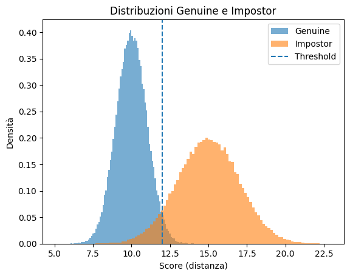

# Metriche Biometriche per Classificazione in Machine Learning

## Indice

1. [Introduzione e Fondamenti](#1-introduzione-e-fondamenti)
2. [Verifica Biometrica](#2-verifica-biometrica)
3. [Identificazione Open-Set](#3-identificazione-open-set)
4. [Identificazione Closed-Set](#4-identificazione-closed-set)
5. [Metodologie di Valutazione Offline](#5-metodologie-di-valutazione-offline)
6. [Confronto: Metriche Biometriche vs Machine Learning](#6-confronto-metriche-biometriche-vs-machine-learning)
7. [Affidabilità e Qualità](#7-affidabilità-e-qualità)

## 1. Introduzione e Fondamenti

### 1.1 Contesto dei Sistemi Biometrici

I sistemi biometrici operano in condizioni di **incertezza intrinseca**, una caratteristica che li distingue profondamente dai sistemi di autenticazione tradizionali basati su password o token. Mentre una password è sempre identica e il suo confronto è deterministico (corretta o errata), un campione biometrico dello stesso individuo non è mai esattamente uguale al precedente. Questa è la sfida fondamentale della biometria: nessun sistema è perfetto perché la flessibilità necessaria per riconoscere lo stesso individuo in condizioni diverse introduce inevitabilmente errori.

#### Requisiti di una caratteristica biometrica

Affinché una caratteristica possa essere utilizzata efficacemente come **tratto biometrico**, deve soddisfare una serie di requisiti fondamentali. Questi criteri permettono di valutare l’affidabilità, la robustezza e l’accettabilità di un sistema biometrico nel mondo reale.

- **Universalità**
Il tratto biometrico dovrebbe essere posseduto da ogni individuo. In altre parole, quasi tutte le persone devono poter essere identificate tramite quella caratteristica, fatta eccezione per rari casi particolari (ad esempio disabilità o condizioni mediche specifiche).

- **Unicità**
Il tratto biometrico deve essere sufficientemente diverso da persona a persona. Idealmente, ogni individuo dovrebbe poter essere distinto da qualsiasi altro sulla base di quella caratteristica, riducendo al minimo il rischio di ambiguità o collisioni.

   *Nota: una assunzione base dei sistemi biometrici è che ogni persona è unica.*

- **Permanenza**
Una buona caratteristica biometrica non dovrebbe variare significativamente nel tempo. Anche se piccoli cambiamenti sono inevitabili, il tratto deve rimanere stabile abbastanza a lungo da garantire un’identificazione affidabile nel corso degli anni.

- **Collezionabilità (Collectability)**
Il tratto biometrico deve poter essere misurato o acquisito tramite sensori appropriati (ad esempio fotocamere, scanner o microfoni). Inoltre, la misurazione dovrebbe essere sufficientemente accurata e ripetibile.

- **Accettabilità**
Le persone coinvolte non dovrebbero avere obiezioni rilevanti alla raccolta del tratto biometrico. Questo aspetto è strettamente legato a considerazioni etiche, culturali e di privacy, ed è cruciale per l’adozione su larga scala dei sistemi biometrici.

#### Fonti di Incertezza

1. **Variazioni intra-classe**: Lo stesso individuo produce campioni mai identici

   Immaginiamo di acquisire il volto della stessa persona in momenti diversi. Le variazioni possono essere numerose: la persona potrebbe sorridere in una foto ed essere seria nell'altra, indossare occhiali o averli rimossi, trovarsi sotto luce naturale o artificiale. Anche fattori sottili come la stanchezza, il trucco, o semplicemente l'angolazione della testa possono alterare significativamente l'aspetto del campione acquisito. Queste **variazioni intra-classe** (cioè variazioni all'interno della stessa classe/identità) rappresentano una sfida perché il sistema deve essere abbastanza "tollerante" da riconoscere che si tratta della stessa persona nonostante le differenze.
   
   - Posa, espressione, illuminazione variabili
   - Qualità di acquisizione diversa (sensore sporco, bassa risoluzione)
   - Cambiamenti temporali (invecchiamento, barba, accessori, chirurgia, etc.)

2. **Similarità inter-classe**: Individui diversi possono apparire simili

   D'altra parte, esistono persone che naturalmente si assomigliano. I gemelli omozigoti sono l'esempio estremo, ma anche fratelli, genitori e figli, o semplicemente persone con caratteristiche facciali comuni possono generare campioni biometrici molto simili. Queste **similarità inter-classe** (cioè somiglianze tra classi/identità diverse) sono problematiche perché il sistema deve essere abbastanza "selettivo" da distinguere persone diverse nonostante le somiglianze.
   
   - Somiglianze familiari (gemelli, fratelli)
   - Caratteristiche comuni nella popolazione
   - Condizioni di acquisizione che "uniformano" i soggetti

3. **Non-universalità**: Non tutti gli individui possono essere riconosciuti

   Un'assunzione fondamentale dei sistemi biometrici è che ogni persona possieda la caratteristica biometrica da rilevare. Tuttavia, questo non è sempre vero: alcune persone hanno impronte digitali usurate o danneggiate da lavori manuali, altre hanno difficoltà con il riconoscimento dell'iride a causa di particolari condizioni oculari. Questa **non-universalità** significa che una percentuale della popolazione potrebbe non essere riconoscibile dal sistema, indipendentemente dalla qualità dell'algoritmo.
   
   - Impronte digitali usurate o danneggiate
   - Caratteristiche biometriche ambigue o assenti
   - Impossibilità fisica di acquisire il tratto (es. persone senza mani per fingerprint)

### 1.2 Architettura di Sistema

Un sistema biometrico è composto da diversi moduli che lavorano in sequenza per trasformare un tratto fisico o comportamentale in una decisione di autenticazione. Comprendere questa architettura è fondamentale per identificare i punti critici dove possono verificarsi errori o attacchi.

```{visible}
Acquisizione → Estrazione Feature → Matching → Decisione
     ↓              ↓                  ↓           ↓
  Sensore      Template DB         Matcher    Threshold
```

Il processo inizia con l'**acquisizione** tramite un sensore specifico (telecamera per il volto, scanner per impronte, microfono per la voce). Questo passaggio è critico: un'acquisizione di bassa qualità compromette irrimediabilmente le fasi successive. Successivamente, il modulo di **estrazione feature** analizza il campione grezzo e ne estrae le caratteristiche distintive, memorizzate come template biometrico. Il **matcher** confronta poi il template del probe (campione da verificare) con i template memorizzati nel database, producendo uno score di similarità o distanza. Infine, la **decisione** viene presa confrontando questo score con una soglia predefinita.

*Nota: Il **sample** è il dato grezzo acquisito dal sensore. Le **features** sono le caratteristiche estratte dai dati grezzi. Il **template** è l'insieme delle features estratte dai dati grezzi.*

#### Tipologie di Utenti

Il comportamento dell’utente influenza in modo significativo il funzionamento e la sicurezza del sistema biometrico. È possibile distinguere diverse categorie:

- **Utenti cooperativi**: l’utente è interessato a essere riconosciuto correttamente (es. autenticazione volontaria). Un impostore in questo caso tenta di farsi riconoscere come un utente legittimo.
- **Utenti non cooperativi**: l’utente è indifferente o ostile al riconoscimento (es. sorveglianza). Un impostore può tentare di evitare deliberatamente il riconoscimento.
- **Utenti pubblici / privati**:
  - *Pubblici*: clienti o utenti esterni (es. controllo accessi in aeroporti).
  - *Privati*: dipendenti o membri interni di un’organizzazione.
- **Utenti frequenti / occasionali**:
  - *Used*: utilizzano il sistema frequentemente, con template aggiornati e stabili.
  - *Non-used*: interagiscono raramente con il sistema, aumentando la probabilità di mismatch.
- **Utenti consapevoli / inconsapevoli**:
  - *Aware*: sanno di essere sottoposti a riconoscimento biometrico.
  - *Not aware*: il riconoscimento avviene in modo trasparente o passivo.

Queste differenze influenzano la qualità dell’acquisizione, la variabilità intra-classe e la robustezza richiesta al sistema.

#### Tipologie di Setting di Acquisizione

Le condizioni operative del sistema hanno un impatto diretto sulle prestazioni biometriche:

- **Setting controllati**:
  - condizioni ambientali controllate (illuminazione, posa, distanza)
  - distorsioni ridotte
  - possibilità di scartare template difettosi
  - acquisizione ripetibile
- **Setting non controllati o sotto-controllati**:
  - condizioni ambientali variabili
  - presenza di rumore, occlusioni, blur
  - template con diversi livelli di distorsione
  - possibilità di scartare template difettosi, ma **senza possibilità di ripetere la cattura**

I sistemi operanti in setting non controllati devono essere più robusti e tolleranti alla variabilità.

**Vulnerabilità agli attacchi (spoofing)**:

I sistemi biometrici possono essere attaccati a diversi livelli:

- **Livello sensore**: Presentazione di tratti falsi (impronte artificiali in gelatina, maschere 3D, foto stampate). Questo è l'attacco più comune e intuitivo, dove un malintenzionato cerca di "ingannare" il sensore presentando una replica del tratto biometrico legittimo.

- **Canale di comunicazione**: Intercettazione e replay di campioni. Se il sensore è separato dall'unità di elaborazione, un attaccante potrebbe intercettare i dati trasmessi e riprodurli successivamente per accedere al sistema senza presentarsi fisicamente.

- **Matcher**: Manipolazione degli score di similarità. Un attaccante con accesso al software potrebbe modificare il modulo di matching per forzare uno score alto anche quando la somiglianza è bassa.

- **Database template**: Modifica o iniezione di template. Compromettere il database consente di sostituire template legittimi o inserirne di fraudolenti, ottenendo così accesso permanente al sistema.

#### Enrollment

Acquisizione ed elaborazione dei dati biometrici dell'utente per l'utilizzo da parte del sistema nelle successive operazioni di autenticazione (gallery).

#### Recognition

Acquisizione ed elaborazione dei dati biometrici dell'utente al fine di fornire una decisione di autenticazione basata sul risultato di un processo di abbinamento tra il modello memorizzato e quello corrente. (verifica 1:1, identificazione 1:N)

#### Modalità Tradizionali di Riconoscimento e Autenticazione

Attualmente, il riconoscimento (spesso finalizzato all’autenticazione) viene effettuato secondo due principali modalità:

- **Qualcosa che si possiede**: una carta, un badge o un documento.  
  Tuttavia, questi oggetti possono essere **persi, rubati o copiati**. In realtà, il sistema non autentica la persona, ma **l’oggetto** in suo possesso.

- **Qualcosa che si conosce**: una password personale o condivisa.  
  Anche in questo caso esistono diverse criticità: la password può essere **indovinata, carpita o dimenticata**. Inoltre, una password facile da ricordare è spesso anche **facile da indovinare**.

- **Basato su ciò che si è**: caratteristiche **biometriche** dell’individuo, come tratti fisici (impronte digitali, volto, iride) o comportamentali (voce, dinamica di digitazione, andatura).  
  In questo caso, l’autenticazione è legata direttamente all’identità della persona, riducendo la dipendenza da oggetti o informazioni memorizzate.

### 1.3 Modalità Operative

I sistemi biometrici operano principalmente in tre modalità, ciascuna con caratteristiche e metriche di valutazione specifiche:

**Verifica (1:1)**:
- L'utente dichiara un'identità $i$ (claim)
- Sistema confronta: probe vs template dell'identità dichiarata
- Decisione binaria: accetta/rifiuta
- Esempio pratico: Sblocco smartphone con Face ID - l'utente dichiara implicitamente di essere il proprietario del dispositivo

**Identificazione Open-Set (1:N con reject option)**:
- Nessuna identità dichiarata
- Sistema confronta: probe vs tutti i template in galleria
- Decisioni: (1) il soggetto è/non è in galleria, (2) se sì, quale identità
- Esempio pratico: Sorveglianza in aeroporto - il sistema cerca di identificare se una persona è presente in una watchlist

**Watch list**:
  - Il sistema possiede una lista di soggetti di interesse
  - Verifica se il *probe* appartiene alla lista

  Tipologie di watch list:
  - **White list**: i soggetti presenti nella lista sono **autorizzati** e l’accesso viene consentito
  - **Black list**: i soggetti presenti nella lista sono **non autorizzati**; il riconoscimento può generare un **allarme**


**Identificazione Closed-Set (1:N forzata)**:
- Assunzione: il probe appartiene sicuramente alla galleria
- Sistema restituisce sempre un'identità
- Errore solo se l'identità corretta non è al primo posto
- Esempio pratico: Gara sportiva dove tutti i partecipanti sono pre-registrati

La distinzione tra queste modalità è cruciale perché determina quali errori sono possibili e come vengono misurate le performance del sistema.

### 1.4 Tipologie di Caratteristiche Biometriche

I sistemi biometrici si basano sull’analisi di **caratteristiche distintive** degli individui, che possono essere classificate ad **alto livello** in base alla loro natura e stabilità nel tempo. In generale, le caratteristiche biometriche si suddividono in **fisiologiche**, **comportamentali** e **miste**, a cui si affiancano le **tracce biologiche**.

#### Caratteristiche Fisiologiche (Physiological Features)

Sono legate alla struttura fisica dell’individuo e tendono a essere **stabili nel tempo**.

- **Biometria delle impronte digitali** (*Fingerprints biometrics*): riconoscimento basato sui pattern delle creste papillari.
- **Biometria oculare** (*Eye biometrics*):
  - riconoscimento dell’**iride**
  - riconoscimento della **retina**
- **Biometria facciale** (*Face biometrics*): riconoscimento del volto tramite immagini nel visibile o all’infrarosso.
- **Biometria dell’orecchio** (*Ear biometrics*): riconoscimento basato sulla forma e struttura dell’orecchio.
- **Biometria della mano** (*Hand biometrics*): riconoscimento tramite la geometria delle dita e della mano.

#### Caratteristiche Comportamentali (Behavioural Features)

Descrivono il **comportamento** dell’individuo piuttosto che la sua struttura fisica e sono generalmente più **variabili**.

- **Biometria della firma** (*Signature biometrics*):  
  - firma statica  
  - firma dinamica (velocità, pressione, traiettoria)
- **Dinamica di digitazione** (*Keystroke dynamics*): pattern di pressione e temporizzazione durante la digitazione.
- **Biometria vocale** (*Voice biometrics*): riconoscimento basato sulle caratteristiche della voce.
- **Riconoscimento dell’andatura** (*Gait recognition*): analisi del modo di camminare.

#### Caratteristiche Miste (Mixed Features)

Combinano aspetti fisiologici e comportamentali.

- **Volto**: struttura facciale (fisiologica) + espressioni e movimenti (comportamentali).
- **Voce**: caratteristiche dell’apparato vocale (fisiologiche) + modalità di emissione (comportamentali).

#### Tracce Biologiche (Biological Traces Biometrics)

- **DNA**: caratteristica biometrica estremamente discriminante, utilizzata principalmente in ambito forense e non in sistemi di autenticazione in tempo reale.

#### Strong Biometric Traits

Sono tratti biometrici caratterizzati da **elevata unicità e persistenza nel tempo**, quindi particolarmente affidabili per il riconoscimento:

- **Impronte digitali**
- **Volto**
- **Iride**

#### Soft Biometric Traits

Sono tratti biometrici con **bassa unicità** o **scarsa persistenza**, ma possono essere utili per **ridurre lo spazio di ricerca** o supportare altre biometrie:

- Colore dei capelli
- Forma del volto
- Andatura
- Altre caratteristiche fisiche generali

Questi tratti possono variare nel tempo a causa di fattori come **umore, stato di salute, età o condizioni ambientali**, ma risultano utili come informazioni complementari nei sistemi biometrici complessi (ad esempio per limitare il numero di candidati in fase di identificazione).

### 1.5 Notazione e Terminologia

**Insiemi fondamentali**:
- $\mathcal{G}$ = Gallery (insieme di template enrollati)
- $\mathcal{P}$ = Probe set (insieme di campioni da riconoscere)
- $\mathcal{P}_G \subset \mathcal{P}$ = Probe di soggetti in galleria (enrolled)
- $\mathcal{P}_N \subset \mathcal{P}$ = Probe di soggetti NON in galleria (non-enrolled)
- $N$ = Numero di identità in galleria
- $|\mathcal{G}|$ = Numero totale di template in galleria

**Funzioni di ground truth** (disponibili solo in fase di testing):
- $\text{id}(t)$: restituisce l'identità vera associata al template $t$
- $\text{topMatch}(p, i)$: restituisce il miglior match tra probe $p$ e template dell'identità $i$

**Funzioni di matching**:
- $s(t_1, t_2) \in \mathbb{R}$: similarità tra template (maggiore = più simili)
- $d(t_1, t_2) \in \mathbb{R}^+$: distanza tra template (minore = più simili)

**Convenzione**: Useremo principalmente **distanze** (valori più bassi indicano maggiore somiglianza).

### 1.5 Distribuzioni di Score

Le distribuzioni di score sono il concetto fondamentale per comprendere il comportamento dei sistemi biometrici. Ogni confronto tra template produce uno score (distanza o similarità), e questi score seguono distribuzioni statistiche diverse a seconda che i template appartengano alla stessa persona o a persone diverse.

**Definizione formale delle distribuzioni**:

Sia $X$ un campione biometrico casuale e sia $s$ uno score (distanza o similarità).

**Distribuzione Impostor** (o Non-Match):
$$p(s|H_0) = p(s|\text{id}(t_1) \neq \text{id}(t_2))$$

Score ottenuti confrontando template di **identità diverse**. Questa distribuzione rappresenta quanto sono dissimili persone diverse secondo il sistema biometrico. In un sistema ideale, tutti gli score impostor dovrebbero essere alti (se usiamo distanze) o bassi (se usiamo similarità).

**Distribuzione Genuine** (o Match):
$$p(s|H_1) = p(s|\text{id}(t_1) = \text{id}(t_2))$$

Score ottenuti confrontando template della **stessa identità**. Questa distribuzione rappresenta quanto sono simili campioni diversi della stessa persona. In un sistema ideale, tutti gli score genuine dovrebbero essere bassi (per distanze) o alti (per similarità).

**Proprietà teorica**:
In un sistema ideale: $supp(p(s|H_0)) \cap supp(p(s|H_1)) = \emptyset$, dove 

$$supp(p) = \{x \in \mathbb{R} : p(x) > 0\}.$$

In pratica, le distribuzioni si **sovrappongono**, rendendo impossibile una separazione perfetta. Questa sovrapposizione è la causa fondamentale di tutti gli errori nei sistemi biometrici.

**Caratteristiche tipiche** (usando distanze):
- Impostor distribution: score alti (alta distanza), $\sigma_I$ moderata
- Genuine distribution: score bassi (bassa distanza), $\sigma_G$ variabile
- Overlap region: $p(s|H_0) > 0 \land p(s|H_1) > 0$

La **qualità del sistema** è inversamente proporzionale all'area di sovrapposizione. Un sistema migliore ha distribuzioni più separate, con meno sovrapposizione.

**Interpretazione grafica**:

```python
import numpy as np
import matplotlib.pyplot as plt

# Numero di confronti
n_genuine  = 100_000
n_impostor = 100_000

# Distribuzione Genuine (distanze basse)
genuine_scores = np.random.normal(
    loc=10.0,      # media (bassa)
    scale=1.0,    # deviazione standard
    size=n_genuine
)

# Distribuzione Impostor (distanze alte)
impostor_scores = np.random.normal(
    loc=15.0,      # media (alta)
    scale=2.0,    # deviazione standard
    size=n_impostor
)

plt.figure()

plt.hist(
    genuine_scores,
    bins=100,
    density=True,
    alpha=0.6,
    label="Genuine"
)

plt.hist(
    impostor_scores,
    bins=100,
    density=True,
    alpha=0.6,
    label="Impostor"
)

threshold = 12.0
plt.axvline(threshold, linestyle="--", label="Threshold")

plt.xlabel("Score (distanza)")
plt.ylabel("Densità")
plt.title("Distribuzioni Genuine e Impostor")
plt.legend()

plt.show()
```


Nella regione di overlap, è impossibile distinguere con certezza se uno score proviene da un confronto genuine o impostor. La scelta della soglia determina quanti errori di ciascun tipo commetteremo.

## 1.6 Come Confrontiamo due Template?

Una volta estratti i template biometrici, il passo successivo consiste nel **confrontarli** per ottenere uno **score** di similarità o distanza.  
La scelta della metrica di confronto dipende dalla **natura del template** (vettore, istogramma, serie temporale, insieme di punti, ecc.).

### 🔹 Template come vettori

In molti sistemi biometrici, i template sono rappresentati come **vettori numerici** in uno spazio multidimensionale.  
In questo caso, è possibile utilizzare metriche standard:

- **Distanza Euclidea**  
  Misura la distanza geometrica tra due vettori nello spazio.
  👉 Vedi: [[Distanza Euclidea]]

- **Similarità Coseno**  
  Misura l’angolo tra due vettori, indipendentemente dalla loro norma.
  👉 Vedi: [[Similarità Coseno]]

Queste metriche possono essere interpretate rispettivamente come:
- **distanza** (più piccola = più simili)
- **similarità** (più grande = più simili)

### 🔹 Correlazione

Per template rappresentati come **istogrammi** o **insiemi di punti**, è possibile usare una misura di similarità basata sulla correlazione:

- **Correlazione di Pearson**  
  Valuta il grado di relazione lineare tra due rappresentazioni.
  👉 Vedi: [[Correlazione di Pearson]]

### 🔹 Confronto tra istogrammi

Quando i template sono **istogrammi** (ad esempio distribuzioni di orientamenti o frequenze), esistono metriche dedicate:

- **Distanza di Bhattacharyya**  
  Misura la sovrapposizione tra due distribuzioni di probabilità.
  👉 Vedi: [[Distanza di Bhattacharyya]]

### 🔹 Serie temporali

Per template che rappresentano **segnali nel tempo** (ad esempio andature, gesti, segnali biometrici dinamici):

- **Dynamic Time Warping (DTW)**  
  Allinea due serie temporali che possono avere velocità diverse ma forma simile.
  👉 Vedi: [[Dynamic Time Warping]]

Un esempio tipico è il confronto di due sequenze di camminata:  
anche se la velocità di esecuzione varia, la traiettoria spaziale degli arti rimane simile.

### 🔹 Template da modelli Deep Learning

Nel caso di sistemi basati su **Deep Learning**, il confronto avviene tipicamente sulle **embedding**:

- Si rimuove l’ultimo strato di classificazione (di solito un **softmax**)
- L’output intermedio della rete viene usato come **vettore di feature**
- Le embedding vengono confrontate usando metriche standard (es. distanza euclidea o similarità coseno)

👉 Vedi: [[Embedding in Deep Learning]]

### 🔹 Template strutturati complessi

Alcuni template richiedono strategie di confronto più sofisticate.  
Ad esempio, nel riconoscimento delle impronte digitali:

- I template sono insiemi di **minuzie**
- È necessario trovare il **miglior accoppiamento** tra punti prima di calcolare uno score

👉 Vedi: [[Matching di Minuzie]]

### Dopo il Confronto

Una volta calcolato uno score di **similarità** o **distanza**, questo viene confrontato con una **soglia di accettazione**:

- **Verifica** o **identificazione open-set**
- Score ≥ soglia → accettazione (similarità)
- Score ≤ soglia → accettazione (distanza)

L’analisi delle prestazioni studia il comportamento del sistema al variare della soglia, mettendo in evidenza:
- errori del sistema
- compromesso tra falsi accettati e falsi rifiutati

### In Sintesi

- Selezionare ed estrarre **feature sufficientemente discriminative**
- Definire una **strategia di matching appropriata**
- Analizzare il comportamento del sistema al variare della soglia:
  - similarità ≥ soglia
  - distanza ≤ soglia


## 2. Verifica Biometrica

### 2.1 Definizione Formale del Task

La verifica è la modalità operativa più comune nei sistemi biometrici consumer (smartphone, laptop, accesso fisico). Il compito è relativamente semplice da definire ma complesso da realizzare con alta accuratezza.

**Task di Verifica**: Data una coppia $(p, i)$ dove:
- $p$ = probe (campione biometrico acquisito)
- $i$ = identità dichiarata (claim esplicito o implicito)

Decidere se $\text{id}(p) = i$.

**Decision rule parametrizzata da soglia** $\tau$:

Per **distanze**:
$$\delta_\tau(p, i) = \begin{cases}
\text{Accept} & \text{se } d(p, \text{topMatch}(p,i)) \leq \tau \\
\text{Reject} & \text{altrimenti}
\end{cases}$$

Per **similarità**:
$$\delta_\tau(p, i) = \begin{cases}
\text{Accept} & \text{se } s(p, \text{topMatch}(p,i)) \geq \tau \\
\text{Reject} & \text{altrimenti}
\end{cases}$$

La soglia $\tau$ è il parametro più critico del sistema: determina il trade-off tra sicurezza e usabilità. Una soglia troppo restrittiva blocca utenti legittimi, una troppo permissiva lascia entrare impostori.

### 2.2 Tassonomia degli Outcome

**Definizione rigorosa degli outcome**:

Siano:
- $H_1$: ipotesi che $\text{id}(p) = i$ (claim genuino)
- $H_0$: ipotesi che $\text{id}(p) \neq i$ (claim impostor)
- $D_1$: decisione di accettare
- $D_0$: decisione di rifiutare

| **Ipotesi Vera** | **Decisione** | **Outcome** | **Nome** | **Tipo** |
|------------------|---------------|-------------|----------|----------|
| $H_1$ | $D_1$ | $\text{id}(p) = i \land \text{Accept}$ | Genuine Acceptance (GA) | ✓ Corretto |
| $H_1$ | $D_0$ | $\text{id}(p) = i \land \text{Reject}$ | False Rejection (FR) | ✗ Errore Tipo I |
| $H_0$ | $D_0$ | $\text{id}(p) \neq i \land \text{Reject}$ | Genuine Rejection (GR) | ✓ Corretto |
| $H_0$ | $D_1$ | $\text{id}(p) \neq i \land \text{Accept}$ | False Acceptance (FA) | ✗ Errore Tipo II |

**Interpretazione e impatto**:
- **GA (Genuine Acceptance)**: Utente legittimo correttamente riconosciuto - esperienza utente positiva
- **GR (Genuine Rejection)**: Impostore correttamente respinto - sistema funziona come previsto
- **FR (False Rejection)**: Utente legittimo erroneamente respinto - **impatto: usabilità, frustrazione utente**
- **FA (False Acceptance)**: Impostore erroneamente accettato - **impatto: SICUREZZA, accesso non autorizzato**

**Esempio concreto**:
Consideriamo uno smartphone con riconoscimento facciale usato da 100 persone diverse in un giorno:
- 10 utilizzi sono dal proprietario (genuine attempts)
- 90 tentativi sono da altre persone che trovano il telefono (impostor attempts)

Se il sistema ha FAR = 0.01 e FRR = 0.05:
- Il proprietario verrà bloccato circa 0.5 volte (5% di 10 tentativi)
- Circa 0.9 impostori entreranno nel telefono (1% di 90 tentativi)

### 2.3 Metriche Fondamentali

#### 2.3.1 False Acceptance Rate (FAR)

Il FAR misura quanto spesso il sistema lascia entrare persone non autorizzate. È la metrica più critica per la sicurezza del sistema.

**Definizione**:
$$\text{FAR}(\tau) = \frac{\text{\# False Acceptances}}{\text{\# Impostor Attempts}} = \frac{|\{(p,i) : \text{id}(p) \neq i \land d(p,i) \leq \tau\}|}{|\{(p,i) : \text{id}(p) \neq i\}|}$$

**Interpretazione probabilistica**:
$$\text{FAR}(\tau) = P(D_1 | H_0) = P(\text{Accept} | \text{impostor})$$

Probabilità che un impostore venga erroneamente accettato.

**Esempio pratico**: FAR = 0.001 (0.1%) significa che in media 1 impostore su 1000 viene accettato. In un sistema con milioni di accessi giornalieri, anche un FAR apparentemente basso può tradursi in migliaia di accessi non autorizzati.

**Relazione con la distribuzione**:
$$\text{FAR}(\tau) = \int_{-\infty}^{\tau} p(d|H_0) \, dd = P(d \leq \tau | H_0)$$

Il FAR è quindi l'area sotto la curva della distribuzione impostor a sinistra della soglia $\tau$.

**Considerazioni operative**:
- In applicazioni di alta sicurezza (banche, accesso a dati sensibili): FAR target < 0.0001 (0.01%)
- In applicazioni consumer (smartphone): FAR tipico ≈ 0.001-0.01 (0.1%-1%)
- Il FAR aumenta con attacchi mirati (presentation attacks, deepfakes)

#### 2.3.2 False Rejection Rate (FRR)

Il FRR misura quanto spesso il sistema blocca utenti legittimi. È la metrica più critica per l'usabilità del sistema.

**Definizione**:
$$\text{FRR}(\tau) = \frac{\text{\# False Rejections}}{\text{\# Genuine Attempts}} = \frac{|\{(p,i) : \text{id}(p) = i \land d(p,i) > \tau\}|}{|\{(p,i) : \text{id}(p) = i\}|}$$

**Interpretazione probabilistica**:
$$\text{FRR}(\tau) = P(D_0 | H_1) = P(\text{Reject} | \text{genuine})$$

Probabilità che un utente genuino venga erroneamente rifiutato.

**Esempio pratico**: FRR = 0.05 (5%) significa che in media 1 utente legittimo su 20 viene respinto. Se un utente tenta l'accesso 10 volte al giorno, verrà bloccato circa una volta ogni due giorni, causando frustrazione.

**Relazione con la distribuzione**:
$$\text{FRR}(\tau) = \int_{\tau}^{\infty} p(d|H_1) \, dd = P(d > \tau | H_1)$$

Il FRR è l'area sotto la curva della distribuzione genuine a destra della soglia $\tau$.

**Considerazioni operative**:
- In applicazioni consumer: FRR target < 0.01-0.05 (1%-5%)
- FRR troppo alto causa abbandono del sistema biometrico (gli utenti preferiscono password)
- FRR aumenta con variazioni ambientali (illuminazione, angolazione, invecchiamento)

#### 2.3.3 Genuine Acceptance Rate (GAR)

Il GAR è la metrica complementare al FRR e misura il successo del sistema nel riconoscere utenti legittimi.

**Definizione**:
$$\text{GAR}(\tau) = 1 - \text{FRR}(\tau) = P(D_1 | H_1)$$

**Relazione complementare**:
$$\text{GAR}(\tau) + \text{FRR}(\tau) = 1$$

Entrambe misurate rispetto ai **genuine attempts**.

Il GAR è spesso preferito nelle presentazioni perché è una metrica "positiva" (più alto è meglio), mentre il FRR è una metrica "negativa" (più basso è meglio). Tuttavia, contengono la stessa informazione.

**Esempio**: Un sistema con GAR = 0.98 (98%) ha FRR = 0.02 (2%). Questo significa che 98 utenti legittimi su 100 vengono correttamente riconosciuti.

#### 2.3.4 Genuine Rejection Rate (GRR)

Il GRR misura quanto efficacemente il sistema respinge impostori.

**Definizione**:
$$\text{GRR}(\tau) = 1 - \text{FAR}(\tau) = P(D_0 | H_0)$$

**Relazione complementare**:
$$\text{GRR}(\tau) + \text{FAR}(\tau) = 1$$

Entrambe misurate rispetto agli **impostor attempts**.

Il GRR è meno comunemente riportato rispetto al FAR, ma può essere utile per enfatizzare l'aspetto positivo della sicurezza del sistema.

### 2.4 Conteggi vs Rate

È fondamentale distinguere tra conteggi assoluti e rate normalizzate, poiché questa distinzione è fonte di errori comuni nella valutazione di sistemi biometrici.

**Distinzione critica**:

**Conteggi assoluti** (matcher-level):
- FM (False Match): Numero di match errati prodotti dal matcher
- FNM (False Non-Match): Numero di non-match errati
- Dipendono dalla dimensione del dataset di test
- Non confrontabili tra diversi esperimenti

**Rate normalizzate** (system-level):
- FAR, FRR: Normalizzate rispetto alle popolazioni rilevanti
- Possono includere failure sistemici (FTE, FTA)
- Confrontabili tra diversi esperimenti
- Indipendenti dalla dimensione assoluta del dataset

**Failure to Enroll (FTE)**:
$$\text{FTE} = \frac{\text{\# soggetti che non possono essere enrollati}}{N_{\text{popolazione}}}$$

Il FTE misura la percentuale di persone che non riescono a registrarsi nel sistema. Cause comuni:
- Qualità biometrica insufficiente (impronte danneggiate)
- Caratteristiche biometriche atipiche
- Problemi tecnici del sensore

**Failure to Acquire (FTA)**:
$$\text{FTA} = \frac{\text{\# acquisizioni fallite}}{\text{\# tentativi di acquisizione}}$$

Il FTA misura la percentuale di tentativi di acquisizione che falliscono. Diverso dal FTE perché:
- FTE: problema persistente con un individuo specifico
- FTA: problema temporaneo che può risolversi al tentativo successivo

**Esempio pratico**:
Un sistema di impronte digitali in un'azienda:
- 1000 dipendenti tentano l'enrollment
- 5 hanno impronte troppo usurate (FTE = 0.5%)
- Durante l'enrollment, 50 acquisizioni falliscono per dita sporche/umide (FTA ≈ 5%)
- In operazione: 10000 accessi giornalieri, 20 FA, 100 FR
  - FAR = 20 / (numero impostori) - serve conoscere la composizione
  - FRR = 100 / (numero genuine) - serve conoscere la composizione

### 2.5 Trade-off FAR-FRR

Il trade-off tra FAR e FRR è la caratteristica fondamentale dei sistemi biometrici threshold-based. Comprendere questo trade-off è essenziale per configurare correttamente un sistema.

**Teorema 2.1** (Monotonicità):
*Per un sistema di verifica basato su soglia:*

1. $\text{FAR}(\tau)$ è monotona **decrescente** in $\tau$
2. $\text{FRR}(\tau)$ è monotona **crescente** in $\tau$

**Dimostrazione**:

(1) Aumentando $\tau$, rendiamo più restrittiva l'accettazione (richiediamo distanza più bassa):
$$\tau_1 < \tau_2 \Rightarrow P(d \leq \tau_1 | H_0) \geq P(d \leq \tau_2 | H_0)$$
$$\Rightarrow \text{FAR}(\tau_1) \geq \text{FAR}(\tau_2)$$

(2) Simmetricamente per FRR:
$$\tau_1 < \tau_2 \Rightarrow P(d > \tau_1 | H_1) \leq P(d > \tau_2 | H_1)$$

$$
\Rightarrow \text{FRR}(\tau_1) \leq \text{FRR}(\tau_2)
$$ 

$\square$

**Implicazione pratica**: Non è possibile minimizzare simultaneamente FAR e FRR modificando solo la soglia. Ogni miglioramento in sicurezza (FAR più basso) costa in usabilità (FRR più alto) e viceversa.

**Casi estremi**:

$$
\lim_{\tau \to 0} \begin{cases}
\text{FAR}(\tau) \to 1 \\
\text{FRR}(\tau) \to 0
\end{cases} \quad \text{(accetta tutti - sistema inutile per sicurezza)}
$$

$$
\lim_{\tau \to \infty} 
\begin{cases}
\text{FAR}(\tau) \to 0 \\
\text{FRR}(\tau) \to 1
\end{cases} \quad \text{(rifiuta tutti - sistema inutile per accesso)}
$$

**Visualizzazione del trade-off**:

```
Rate
 1.0 |     FRR
     |       /
     |      /
     |     /
     |    /
     |   /  
     |  / X (EER)
     | /   \
     |/     \
     |\      \
     | \      \_____ FAR
 0.0 |__\___________\________> Threshold
     0              τ*       ∞
```

Il punto X rappresenta l'Equal Error Rate (EER), dove FAR = FRR. Questo è spesso usato come punto di riferimento, ma non necessariamente il punto operativo ottimale.

### 2.6 Equal Error Rate (EER)

L'EER è la metrica scalare più comunemente usata per riassumere la performance di un sistema biometrico in un singolo numero.

**Definizione**:
$$\text{EER} = \text{FAR}(\tau^*) = \text{FRR}(\tau^*)$$

dove $\tau^*$ è la soglia per cui FAR e FRR si uguagliano.

**Calcolo**:
$$\tau^* = \arg\min_\tau |\text{FAR}(\tau) - \text{FRR}(\tau)|$$

**Proprietà**:
- Metrica **scalare** che riassume la performance complessiva
- EER basso indica sistema migliore (tipicamente 0.1%-5% per sistemi moderni)
- Punto di **bilanciamento naturale** tra i due errori
- Utile quando non si hanno informazioni sui costi relativi di FA e FR
- Indipendente dalla scelta arbitraria di una soglia operativa

**Limitazione critica**: L'EER potrebbe non essere il punto operativo ottimale se FA e FR hanno costi asimmetrici. Ad esempio:
- In un sistema bancario: costo(FA) >> costo(FR) → opereremo a FAR molto più basso dell'EER
- In un sistema di accesso rapido: costo(FR) >> costo(FA) → opereremo a FRR molto più basso dell'EER

**Esempio di calcolo**:

| Threshold | FAR | FRR |
|-----------|-----|-----|
| 0.1 | 0.250 | 0.001 |
| 0.2 | 0.100 | 0.005 |
| 0.3 | 0.050 | 0.015 |
| 0.4 | 0.020 | 0.035 |
| 0.5 | 0.010 | 0.070 |
| 0.6 | 0.005 | 0.150 |

EER ≈ 0.027 alla soglia ≈ 0.42 (interpolando tra 0.4 e 0.5)

**Confronto tra sistemi**:
- Sistema A: EER = 1% - Eccellente
- Sistema B: EER = 5% - Buono
- Sistema C: EER = 10% - Accettabile per applicazioni non critiche
- Sistema D: EER = 20% - Scadente, non utilizzabile

### 2.7 Punti Operativi Speciali

Oltre all'EER, esistono altri punti operativi di interesse che corrispondono a requisiti applicativi specifici.

#### Zero FAR (ZeroFMR)

**Definizione**:
$$\text{ZeroFAR} = \text{FRR}(\tau_{\text{max}})$$

dove $\tau_{\text{max}}$ è la soglia più restrittiva che garantisce FAR = 0.

Per distanze: $\tau_{\text{max}} = \min\{d(p,g) : \text{id}(p) \neq \text{id}(g)\}$

FRR ottenuto quando la soglia è impostata per garantire FAR = 0.

**Uso**: Applicazioni di **massima sicurezza** (accesso a sistemi critici, vault bancari, laboratori militari).

**Esempio**: Sistema di accesso a un data center con dati sensibili:
- Impostato a ZeroFAR
- FAR = 0% (nessun impostore può entrare)
- FRR potrebbe essere 30-40% (alto, ma accettabile dato il contesto)
- Gli utenti legittimi hanno metodi di backup (PIN, badge)

#### Zero FRR (ZeroFNMR)

**Definizione**:
$\text{ZeroFRR} = \text{FAR}(\tau_{\text{min}})$

dove $\tau_{\text{min}}$ è la soglia più permissiva che garantisce FRR = 0.

Per distanze: $\tau_{\text{min}} = \max\{d(p,g) : \text{id}(p) = \text{id}(g)\}$

FAR ottenuto quando la soglia è impostata per garantire FRR = 0.

**Uso**: Applicazioni di **massima usabilità** (accesso prioritario, sistemi di emergenza).

**Esempio**: Sistema di accesso per personale medico in pronto soccorso:
- Impostato a ZeroFRR
- FRR = 0% (nessun medico viene bloccato in emergenza)
- FAR potrebbe essere 5-10% (relativamente alto, ma compensato da altri controlli)

**Nota pratica**: A causa della sovrapposizione delle distribuzioni, ottenere esattamente FAR = 0 o FRR = 0 è generalmente impossibile nella pratica. Questi sono punti **concettuali** o **asintotici** che rappresentano i limiti teorici del sistema.

### 2.8 Receiver Operating Characteristic (ROC)

La curva ROC è lo strumento più potente per visualizzare e confrontare le performance di sistemi biometrici. Fornisce una visione completa del comportamento del sistema a tutte le possibili soglie.

**Definizione formale**:

La curva ROC è la funzione parametrica:
$\text{ROC}(\tau) = (\text{FAR}(\tau), \text{GAR}(\tau)) = (\text{FAR}(\tau), 1 - \text{FRR}(\tau))$

al variare di $\tau \in [0, \infty)$.

**Coordinate**:
- **Asse X**: FAR (False Accept Rate) - l'errore di sicurezza
- **Asse Y**: GAR (Genuine Accept Rate) = 1 - FRR - il successo nell'accettare legittimi

**Punti notevoli**:

- $(0, 0)$: $\tau = \infty$ → rifiuta tutto (inutilmente restrittivo)
- $(1, 1)$: $\tau = 0$ → accetta tutto (inutilmente permissivo)
- $(0, 1)$: Sistema perfetto (separazione completa delle distribuzioni - irraggiungibile)
- Diagonale $y = x$: Classificatore casuale (equivalente a lanciare una moneta)

**Interpretazione geometrica**:
- Curva più vicina all'angolo $(0,1)$ → sistema migliore
- Curva sopra la diagonale → potere discriminante positivo
- Curva sulla diagonale → nessun potere discriminante
- Curva sotto la diagonale → sistema "invertito" (peggio del caso, probabilmente bug nel codice)

**Area Under the Curve (AUC-ROC)**:
$\text{AUC} = \int_0^1 \text{GAR}(t) \, d(\text{FAR}(t))$

**Range**: $[0, 1]$ dove:
- AUC = 1: Perfetto (le distribuzioni non si sovrappongono)
- AUC = 0.5: Casuale (nessuna capacità discriminante)
- AUC > 0.5: Potere discriminante positivo
- AUC tipico per sistemi moderni: 0.95-0.999

**Interpretazione probabilistica dell'AUC**:
L'AUC rappresenta la probabilità che uno score genuine casuale sia migliore (più basso per distanze) di uno score impostor casuale. Formalmente:

$\text{AUC} = P(d_{\text{genuine}} < d_{\text{impostor}})$

**Confronto tra sistemi usando ROC**:

```
GAR
 1.0|    Sistema A (migliore)
    |      _.-'''
    |    _/
    |   /      Sistema B
    | _/     _/
    |/    _/
    |  _/  Diagonale (casuale)
    |_/
 0.0|__________________ FAR
   0.0               1.0
```

Sistema A domina Sistema B: per ogni valore di FAR, Sistema A ha GAR più alto.

**Esempio pratico**:
Confronto di tre algoritmi di face recognition:

| Sistema | AUC | EER | Interpretazione |
|---------|-----|-----|-----------------|
| Deep CNN | 0.998 | 0.5% | Stato dell'arte |
| Traditional Features | 0.950 | 3% | Buono, ma superato |
| Baseline | 0.850 | 8% | Accettabile per applicazioni non critiche |

### 2.9 Detection Error Tradeoff (DET)

La curva DET è un'alternativa alla ROC, particolarmente utile per analizzare sistemi ad alta accuratezza dove gli errori sono molto bassi.

**Definizione**:
$\text{DET}(\tau) = (\text{FAR}(\tau), \text{FRR}(\tau))$

**Differenze chiave con ROC**:
- Confronto **diretto** tra i due errori (non usa GAR)
- Scala **logaritmica** su entrambi gli assi
- Curva più **bassa e a sinistra** è migliore (opposto di ROC)
- Visualizza direttamente il trade-off FAR-FRR

**Vantaggi**:
- Evidenzia meglio differenze a bassi error rate (0.1%, 0.01%, 0.001%)
- Più intuitivo per applicazioni di sicurezza
- Simmetrico rispetto ai due tipi di errore
- Permette di vedere chiaramente i punti operativi a FAR molto basso

**Scala logaritmica**:
$\log_{10}(\text{FAR}(\tau)) \text{ vs } \log_{10}(\text{FRR}(\tau))$

Assi tipici: da 0.01% (10⁻⁴) a 50% (10⁻⁰·³)

Permette di distinguere $10^{-3}$ da $10^{-4}$ (cruciale in sicurezza), cosa difficile con scala lineare.

**Interpretazione DET**:

```
FRR (log)
 10%|
    |  \
    |   \  Sistema B (peggiore)
    |    \
 1% |     \
    |   \  \ Sistema A (migliore)
    |    \  \
0.1%|     \  \
    |      \  \
0.01|_______\__\_______ FAR (log)
    0.01  0.1  1%  10%
```

Sistema A ha errori più bassi per tutte le soglie operative.

**Esempio**: Sistema di riconoscimento iris:
- Su scala lineare: differenza tra FAR=0.0001 e FAR=0.00001 invisibile
- Su scala log DET: differenza chiaramente visibile (ordine di grandezza)
- Critico per applicazioni ad alta sicurezza dove questi numeri contano

### 2.10 Scelta della Soglia Ottimale

La scelta della soglia ottimale dipende dal contesto applicativo, dai costi degli errori e dai prior sulle popolazioni. Non esiste una soglia universalmente ottimale.

#### Approccio Bayesiano con Costi

Il framework Bayesiano formalizza la scelta della soglia in termini di minimizzazione del rischio atteso.

**Rischio atteso**:
$R(\tau) = C_{FA} \cdot \text{FAR}(\tau) \cdot \pi_I + C_{FR} \cdot \text{FRR}(\tau) \cdot \pi_G$

dove:
- $C_{FA}$ = costo di una False Acceptance (es. perdita finanziaria, compromissione sicurezza)
- $C_{FR}$ = costo di una False Rejection (es. frustrazione utente, perdita di tempo)
- $\pi_I$ = prior probability di impostor (proporzione di tentativi di accesso da impostori)
- $\pi_G$ = prior probability di genuine (proporzione di tentativi da utenti legittimi)

**Soglia ottimale**:
$\tau^* = \arg\min_\tau R(\tau)$

**Teorema 2.2** (Soglia di Neyman-Pearson):
*Data la loss matrix asimmetrica, la soglia ottimale soddisfa:*

$\frac{p(d|\text{genuine})}{p(d|\text{impostor})} = \frac{C_{FA} \cdot \pi_I}{C_{FR} \cdot \pi_G}$

valutata in $d = \tau^*$.

Questa è la **likelihood ratio** al punto di soglia ottimale.

**Casi speciali**:

1. **Costi uguali** ($C_{FA} = C_{FR}$) e **prior uniforme** ($\pi_I = \pi_G = 0.5$):
   $\tau^* = \text{valore per cui } p(d|H_1) = p(d|H_0)$
   Corrisponde approssimativamente all'EER (punto di intersezione delle distribuzioni).

2. **Sicurezza critica** ($C_{FA} \gg C_{FR}$):
   $\frac{C_{FA}}{C_{FR}} \text{ grande} \Rightarrow \tau^* \to 0 \quad \text{(soglia molto restrittiva)}$
   Esempio: $C_{FA} = €1.000.000$ (furto di dati), $C_{FR} = €1$ (utente riprova)
   → Opereremo a FAR ≈ 0.0001% anche se FRR ≈ 20%

3. **Usabilità critica** ($C_{FR} \gg C_{FA}$):
   $\frac{C_{FR}}{C_{FA}} \text{ grande} \Rightarrow \tau^* \to \infty \quad \text{(soglia molto permissiva)}$
   Esempio: Sistema di screening rapido dove i falsi positivi vengono catturati da controlli successivi

4. **Prior sbilanciati**:
   Se $\pi_I \gg \pi_G$ (molti più tentativi impostor): soglia più restrittiva
   Se $\pi_G \gg \pi_I$ (quasi tutti tentativi genuine): soglia più permissiva

**Esempio pratico completo**:

Scenario: Sistema di accesso a un edificio aziendale
- 1000 dipendenti (genuine users)
- 10 tentativi di accesso giornalieri per dipendente = 10.000 genuine attempts/giorno
- 100 tentativi da non-dipendenti (impostor) = 100 impostor attempts/giorno
- $\pi_G = 10000/10100 \approx 0.99$, $\pi_I = 100/10100 \approx 0.01$

Costi:
- $C_{FA}$ = €500 (costo medio per gestire intrusion, investigate, ecc.)
- $C_{FR}$ = €2 (tempo perso dipendente + frustrazione)

Rischio atteso per diversi punti operativi:

| Punto | FAR | FRR | R(τ) |
|-------|-----|-----|------|
| EER | 2% | 2% | 500×0.02×0.01 + 2×0.02×0.99 = €0.14 |
| Low FAR | 0.1% | 10% | 500×0.001×0.01 + 2×0.1×0.99 = €0.203 |
| Low FRR | 5% | 0.5% | 500×0.05×0.01 + 2×0.005×0.99 = €0.26 |

→ In questo caso, EER è vicino all'ottimo perché $C_{FA}/C_{FR} \approx 250$ ma $\pi_G/\pi_I \approx 100$ compensano.

**Considerazioni aggiuntive**:
- I costi possono non essere solo monetari (reputazione, rischio legale, privacy)
- I prior possono cambiare nel tempo (attacchi mirati aumentano $\pi_I$)
- La soglia può essere adattata dinamicamente in base a risk analysis real-time

## 3. Identificazione Open-Set

### 3.1 Definizione del Task

L'identificazione open-set è la modalità operativa più complessa e realistica, tipica di applicazioni di sorveglianza, watchlist e controllo accessi dove non tutti i soggetti sono pre-registrati.

**Task di Identificazione Open-Set**: Dato un probe $p$:

1. **Determinare** se $\text{id}(p) \in \mathcal{G}$ (detection/presence)
2. **Se sì**, identificare quale identità: $\arg\min_{g \in \mathcal{G}} d(p, g)$ (identification)

**Differenze chiave con verifica**:
- Nessuna identità dichiarata (no claim) → sistema deve fare tutto autonomamente
- Confronto **1-to-N**: probe vs tutta la galleria → computazionalmente intensivo
- Decisione binaria **+ identificazione** → due possibili tipi di errore
- Più errori possibili → metriche più complesse

**Terminologia**:
- **Enrolled**: $\text{id}(p) \in \mathcal{G}$ - il soggetto è nel database
- **Non-enrolled**: $\text{id}(p) \notin \mathcal{G}$ - il soggetto non è nel database
- Non usiamo "impostor" (termine riservato alla verifica con claim esplicito)

**Applicazioni pratiche**:
- **Watchlist**: aeroporti, stazioni, eventi pubblici - cercare soggetti di interesse
- **Controllo accessi**: edifici aziendali dove visitatori esterni devono essere gestiti
- **Investigazioni**: identificare persone in video/foto confrontando con database criminali
- **Sorveglianza**: monitoraggio continuo per rilevare presenza di persone note

### 3.2 Procedura Operativa

**Algoritmo dettagliato**:

```
Input: 
  - probe p (campione biometrico da identificare)
  - gallery G = {g₁, g₂, ..., g|G|} (database template)
  - threshold τ (soglia di decisione)

Output: 
  - identity or "not in gallery"

1. Compute all distances:
   D = {d(p, g₁), d(p, g₂), ..., d(p, g|G|)}

2. Sort D in ascending order:
   d₁ ≤ d₂ ≤ ... ≤ d|G|
   
   Otteniamo ranked list: [(g₁, d₁), (g₂, d₂), ..., (g|G|, d|G|)]
   dove g₁ è il template più simile a p

3. Decision logic:
   If d₁ > τ:
     Return "not in gallery" (no detection)
     // Nemmeno il match migliore supera la soglia
   Else:
     // Detection positivo, ora verifichiamo l'identità
     Return id(g₁)  // Identità del template con distanza minima
```

**Ruolo critico della soglia**:
- Funge da **presence detector** - decide se il probe appartiene a qualcuno in galleria
- NON verifica un'identità dichiarata (differenza con verifica)
- Controlla se **qualcuno** in galleria è sufficientemente simile
- Troppo permissiva → molti falsi allarmi (persone non in galleria rilevate erroneamente)
- Troppo restrittiva → molte persone in galleria non vengono rilevate

**Complessità computazionale**:
- O(|G|) confronti per ogni probe
- Per gallerie grandi (milioni di template): necessari algoritmi di indicizzazione/hashing
- Trade-off accuracy vs speed: approssimazioni (LSH, quantization) riducono accuracy ma aumentano velocità

### 3.3 Tassonomia degli Outcome

A differenza della verifica (4 outcome), l'identificazione open-set ha outcome più complessi perché combina detection e identification.

**Caso 1: Probe enrolled** ($p \in \mathcal{P}_G$) - Il soggetto È nel database

| **Condizione** | **Outcome** | **Nome** | **Interpretazione** |
|----------------|-------------|----------|---------------------|
| $d_1 \leq \tau \land \text{id}(g_1) = \text{id}(p)$ | Detection ✓, ID ✓ | **Correct Detection & Identification** | Successo completo |
| $d_1 \leq \tau \land \text{id}(g_1) \neq \text{id}(p)$ | Detection ✓, ID ✗ | **False Rejection** (misidentification) | Rilevato ma ID sbagliata |
| $d_1 > \tau$ | Detection ✗ | **False Rejection** (missed detection) | Non rilevato affatto |

**Caso 2: Probe non-enrolled** ($p \in \mathcal{P}_N$) - Il soggetto NON è nel database

| **Condizione** | **Outcome** | **Nome** | **Interpretazione** |
|----------------|-------------|----------|---------------------|
| $d_1 > \tau$ | Nessun detection | **Genuine Rejection** | Corretto - nessun allarme |
| $d_1 \leq \tau$ | Detection errato | **False Acceptance** (false alarm) | Falso allarme |

**Importante**: In open-set, FR può avvenire in **due modi**:
1. Soggetto enrolled non rilevato affatto ($d_1 > \tau$)
2. Soggetto enrolled rilevato ma con identità sbagliata al primo posto ($d_1 \leq \tau$ ma $\text{id}(g_1) \neq \text{id}(p)$)

**Esempio pratico - Watchlist aeroportuale**:

Galleria: 1000 soggetti pericolosi
Probe stream: 10000 passeggeri/giorno, di cui 2 sono in watchlist

Scenario A - Soglia troppo permissiva (τ = alto):
- I 2 soggetti pericolosi vengono rilevati (✓)
- Ma anche 500 passeggeri innocenti attivano falsi allarmi (✗)
- FAR = 500/9998 ≈ 5% (inaccettabile - troppe false investigazioni)

Scenario B - Soglia troppo restrittiva (τ = basso):
- Solo 50 falsi allarmi (✓)
- Ma 1 dei 2 soggetti pericolosi non viene rilevato (✗)
- FRR = 1/2 = 50% (inaccettabile - obiettivo principale fallito)

Scenario C - Soglia bilanciata:
- I 2 soggetti pericolosi rilevati correttamente
- 100 falsi allarmi (gestibili con verifica secondaria)
- FAR = 100/9998 ≈ 1%, FRR = 0/2 = 0%

### 3.4 Metriche con Ranking

In open-set, la posizione nella ranked list è fondamentale perché il sistema può restituire una short-list di candidati, non solo il top-1.

#### 3.4.1 Detection and Identification Rate (DIR)

**Definizione generale**:

$\text{DIR}(\tau, k) = \frac{|\{p \in \mathcal{P}_G : d_1 \leq \tau \land \text{rank}(\text{id}(p)) \leq k\}|}{|\mathcal{P}_G|}$

dove $\text{rank}(\text{id}(p))$ è la posizione della prima occorrenza dell'identità corretta nella lista ordinata.

**Interpretazione**: Probabilità che un probe enrolled sia:
1. Rilevato (detection): almeno un template sotto soglia
2. Correttamente identificato entro rank k

**Caso speciale - DIR a rank 1**:
$\text{DIR}(\tau, 1) = \frac{|\{p \in \mathcal{P}_G : d_1 \leq \tau \land \text{id}(g_1) = \text{id}(p)\}|}{|\mathcal{P}_G|}$

Questo è il caso più importante: identità corretta al primo posto.

**Interpretazione**: Probabilità che un probe enrolled sia correttamente identificato al primo posto **e** che la distanza superi la soglia.

**Proprietà di monotonicità**:
$\text{DIR}(\tau, k_1) \leq \text{DIR}(\tau, k_2) \quad \forall k_1 < k_2$

All'aumentare di $k$, DIR può solo aumentare o restare costante (più posizioni = più opportunità di trovare l'identità corretta).

**Esempio pratico**:

Watchlist con 100 soggetti, 200 probe enrolled:
- DIR(τ, 1) = 0.85 → 170 probe identificati correttamente al rank 1
- DIR(τ, 5) = 0.92 → 184 probe hanno identità corretta entro top-5
- DIR(τ, 10) = 0.95 → 190 probe hanno identità corretta entro top-10

Interpretazione: Per 30 probe (15%), l'identità corretta non è al primo posto ma appare entro i primi 10 candidati. In applicazioni dove un operatore umano verifica la short-list, DIR(τ, 10) è più rilevante di DIR(τ, 1).

#### 3.4.2 False Rejection Rate

**Definizione**:
$\text{FRR}(\tau) = 1 - \text{DIR}(\tau, 1)$

**Interpretazione**: Probabilità che un soggetto enrolled non sia correttamente identificato al primo posto.

**Decomposizione**:
$\text{FRR}(\tau) = P(\text{no detection}|p \in \mathcal{P}_G) + P(\text{misidentification}|p \in \mathcal{P}_G)$

$= \frac{|\{p \in \mathcal{P}_G : d_1 > \tau\}|}{|\mathcal{P}_G|} + \frac{|\{p \in \mathcal{P}_G : d_1 \leq \tau \land \text{id}(g_1) \neq \text{id}(p)\}|}{|\mathcal{P}_G|}$

Questa decomposizione è utile per diagnosticare problemi:
- Se termine 1 domina: problema di detection (soglia troppo restrittiva)
- Se termine 2 domina: problema di identification (matcher non discriminativo)

**Esempio diagnostico**:

Sistema A: FRR = 10% (5% no detection + 5% misidentification)
→ Problema bilanciato: migliorare sia soglia che matcher

Sistema B: FRR = 10% (9% no detection + 1% misidentification)
→ Problema di detection: aumentare soglia (accettare più FAR per ridurre FRR)

Sistema C: FRR = 10% (1% no detection + 9% misidentification)
→ Problema di identification: migliorare matcher (feature extraction più discriminativa)

#### 3.4.3 False Acceptance Rate (False Alarm Rate)

**Definizione**:
$\text{FAR}(\tau) = \text{FPIR}(\tau) = \frac{|\{p \in \mathcal{P}_N : d_1 \leq \tau\}|}{|\mathcal{P}_N|}$

FPIR = False Positive Identification Rate (terminologia alternativa, comune in letteratura)

**Interpretazione**: Probabilità che un soggetto non-enrolled produca una distanza sotto soglia (false alarm).

**Nota importante**: In open-set, la posizione nella ranked list è **irrilevante** per FA. Conta solo se $d_1 \leq \tau$. Questo perché:
- Per probe non-enrolled, non esiste identità corretta in galleria
- Qualsiasi detection è un errore, indipendentemente da quale identità viene restituita
- L'identità restituita è casuale/arbitraria (dipende da chi somiglia di più al probe)

**Differenza con verifica**:
- Verifica: FAR richiede claim specifico
- Open-set: FAR è detection errato di qualsiasi tipo

**Impatto operativo del FAR**:

In applicazioni watchlist reali, FAR alto ha conseguenze pratiche:

Esempio aeroporto con 10000 passeggeri/giorno, 100 in watchlist:
- FAR = 1%: 99 falsi allarmi/giorno
- Ogni falso allarme richiede:
  - Investigazione di sicurezza (15 min)
  - Potenziale interrogatorio
  - Stress per passeggero innocente
  - Costo operativo (personale)

Con 99 falsi allarmi: 24.75 ore operative/giorno solo per gestire falsi positivi!

→ Necessario FAR < 0.1% (< 10 falsi allarmi/giorno) per essere operativamente sostenibile.

### 3.5 Open-Set ROC (Watchlist ROC)

La curva ROC per identificazione open-set ha interpretazione simile alla ROC di verifica, ma con metriche diverse sugli assi.

**Definizione**:
$\text{ROC}_{\text{open}}(\tau) = (\text{FAR}(\tau), \text{DIR}(\tau, 1))$

**Differenza con ROC di verifica**:
- Asse Y: **DIR** invece di GAR
- DIR è più restrittiva: richiede detection **E** identification corretti
- GAR richiede solo acceptance di genuine (decision threshold)
- Curve open-set tendenzialmente più basse della ROC verification

**Interpretazione geometrica**:

```
DIR
 1.0|      Perfetto (0,1)
    |       *
    |      /
    |     /  Open-set ROC
    |    /   (più bassa)
    |   /
    |  /
    | /    Verification ROC
    |/     (più alta)
    /
   /  EER
  /
 /_____________________ FAR
0                      1.0
```

**Perché DIR < GAR (a parità di FAR)?**

1. **GAR** (verifica): Accetta genuine che dichiarano identità corretta
   - Confronto 1:1 con template della identità dichiarata
   - Solo test: "score abbastanza basso?"

2. **DIR** (open-set): Identifica correttamente enrolled al rank 1
   - Confronto 1:N con tutta la galleria
   - Test: "score abbastanza basso?" + "è il più basso?"
   - Più restrittivo: altri template in galleria possono "competere"

**Esempio numerico**:

Sistema con soglia τ = 0.3:
- Probe genuine p con id(p) = A
  - Verifica: d(p, template_A) = 0.25 < 0.3 → Accept (GA contribuisce a GAR) ✓
  - Open-set: 
    - d(p, template_A) = 0.25 < 0.3 → Detection ✓
    - Ma d(p, template_B) = 0.22 < d(p, template_A) → ID = B (wrong!) ✗
    - Risultato: Non contribuisce a DIR, è un FR

→ Stesso probe, stessa soglia: successo in verifica, fallimento in open-set

**AUC-DIR** (Area Under DIR curve):
$\text{AUC}_{\text{DIR}} = \int_0^1 \text{DIR}(t, 1) \, d(\text{FAR}(t))$

Tipicamente: AUC_DIR < AUC_GAR per stesso algoritmo, perché identificazione è più difficile.

**Utilizzo pratico**:
- Confronto algoritmi per applicazioni watchlist
- Selezione soglia operativa per specifiche FAR/DIR requirements
- Analisi robustezza al crescere della galleria (DIR degrada più rapidamente di GAR)

### 3.6 Equal Error Rate in Open-Set

**Definizione**:
$\text{EER}_{\text{open}} = \text{FAR}(\tau^*) = \text{FRR}(\tau^*)$

dove:
$\tau^* = \arg\min_\tau |\text{FAR}(\tau) - \text{FRR}(\tau)|$

**Relazione con DIR**:
$\text{FRR}(\tau) = 1 - \text{DIR}(\tau, 1)$

quindi:
$\text{EER}_{\text{open}} = \text{FAR}(\tau^*) = 1 - \text{DIR}(\tau^*, 1)$

Al punto EER: $\text{FAR} = 1 - \text{DIR}$, ovvero $\text{DIR} = 1 - \text{FAR}$

**Interpretazione**:
- Open-set EER tipicamente più alto di verification EER (task più difficile)
- Sistema eccellente: EER < 2%
- Sistema buono: EER 2-5%
- Sistema accettabile: EER 5-10%
- Sistema scadente: EER > 10%

**Esempio comparative**:

| Sistema | Verification EER | Open-Set EER | Degradazione |
|---------|-----------------|--------------|--------------|
| Face Recognition (Deep) | 0.5% | 1.5% | 3× |
| Fingerprint | 1% | 2.5% | 2.5× |
| Iris | 0.1% | 0.3% | 3× |

La degradazione (rapporto EER_open/EER_verif) è tipicamente 2-4×, dipende dalla discriminatività del matcher e dalla dimensione della galleria.

### 3.7 Regioni Operative

In applicazioni watchlist, si identificano 5 regioni operative tipiche, ciascuna adatta a contesti specifici.

**1. Extremely Low False Alarm** ($\tau \to 0$, molto restrittivo):

**Caratteristiche**:
- FAR ≈ 0 (quasi nessun falso allarme)
- DIR basso (molti enrolled non vengono rilevati)
- Ogni allarme richiede azione immediata

**Applicazioni**:
- Sorveglianza discreta in eventi pubblici
- Monitoraggio diplomatico (non si vuole allertare i soggetti)
- Sistemi dove investigating ogni allarme è costoso

**Esempio**: Sorveglianza durante visita diplomatica
- Watchlist: 50 potenziali minacce
- 100.000 persone monitorate
- FAR target: 0.001% → ~1 falso allarme
- DIR tollerato: 60% → 30/50 soggetti rilevati
- Obiettivo: minimizzare distur bo operativo, investigare solo alert reali

**2. Extremely High Detection** ($\tau \to \infty$, molto permissivo):

**Caratteristiche**:
- DIR ≈ 1 (quasi tutti enrolled vengono rilevati)
- FAR alto (molti falsi allarmi)
- Priorità: non perdere nessun soggetto in watchlist

**Applicazioni**:
- Border control (terrorismo)
- Ricerca latitanti
- Situazioni dove missing un soggetto ha conseguenze gravi

**Esempio**: Controllo frontiera alta sicurezza
- Watchlist: 1000 terroristi noti
- 50.000 attraversamenti/giorno
- DIR target: 99.9% → massimo 1 miss su 1000
- FAR tollerato: 2% → 1000 falsi allarmi/giorno
- Obiettivo: catturare tutti, costo operativo secondario

**3. Low False Alarm + Moderate Detection** (bilanciato conservativo):

**Caratteristiche**:
- FAR basso ma non zero
- DIR accettabile (70-85%)
- Bilanciamento verso sicurezza operativa

**Applicazioni**:
- Investigazioni ordinarie
- Sorveglianza eventi medi
- Risk management standard

**Esempio**: Sorveglianza stazione ferroviaria
- Watchlist: 200 soggetti ricercati
- 200.000 passeggeri/giorno
- FAR target: 0.01% → 20 falsi allarmi/giorno
- DIR target: 80% → 160/200 rilevati se passano
- Obiettivo: gestibile da team di 3-4 operatori

**4. High Detection + Moderate False Alarm** (bilanciato aggressivo):

**Caratteristiche**:
- DIR alto (90-95%)
- FAR tollerabile (0.1-0.5%)
- Bilanciamento verso efficacia detection

**Applicazioni**:
- Security screening aeroportuale
- Accessi ad aree critiche
- Situazioni con verifica secondaria disponibile

**Esempio**: Pre-screening aeroportuale
- Watchlist: 5000 persone sospette
- 100.000 passeggeri/giorno
- FAR tollerato: 0.2% → 200 falsi allarmi
- DIR target: 95% → massimo 250 miss su 5000
- Verifica secondaria: controllo documenti per tutti gli alert
- Obiettivo: alta detection, false alarm gestiti da controlli successivi

**5. No Threshold** (tutto logged):

**Caratteristiche**:
- Nessuna soglia operativa
- Sistema restituisce tutto con confidence scores
- Post-processing umano/automatico

**Applicazioni**:
- Investigazioni forensi
- Analisi retrospettiva
- Ricerca intelligence

**Esempio**: Analisi post-evento criminalità
- Video sorveglianza di 72 ore
- Watchlist: 10000 persone di interesse
- Sistema: estrae tutti i volti, computa similarità con watchlist
- Output: ranked list con confidence per ogni detection
- Investigatori: filtrano manualmente basandosi su confidence + context
- Obiettivo: non perdere nessuna possibile corrispondenza

**Selezione della regione operativa**:

La scelta dipende da:
1. **Costi operativi**: Quanto costa investigare un false alarm?
2. **Conseguenze miss**: Quanto è grave non rilevare un soggetto?
3. **Prevalenza**: Quanti enrolled vs non-enrolled?
4. **Verifica secondaria**: Esistono controlli successivi?
5. **Constraints legali**: Privacy, proporzionalità misure

**Trade-off analysis**:

| Regione | FAR | DIR | Costo FA/giorno | Miss/anno | Preferita quando |
|---------|-----|-----|-----------------|-----------|------------------|
| 1 | 0.001% | 60% | Basso | Alto | Costo FA >> Costo miss |
| 2 | 2% | 99% | Molto alto | Bassissimo | Costo miss >> Costo FA |
| 3 | 0.01% | 80% | Moderato | Moderato | Bilanciato, risorse limitate |
| 4 | 0.2% | 95% | Moderato-alto | Basso | Verifica secondaria disponibile |
| 5 | N/A | 100% (teorico) | Altissimo | Zero | Solo post-processing |

## 4. Identificazione Closed-Set

### 4.1 Definizione del Task

L'identificazione closed-set è una modalità operativa semplificata, irrealistica per applicazioni reali ma molto utile per valutazione di algoritmi di matching.

**Task di Identificazione Closed-Set**: Dato un probe $p$:

**Assunzione forte**: $\text{id}(p) \in \mathcal{G}$ (sempre, per definizione del task)

**Output**: L'identità $\hat{i} = \arg\min_{g \in \mathcal{G}} d(p, g)$

**Caratteristiche distintive**:
- **Nessuna soglia** di accettazione/rigetto
- Sistema **deve sempre** restituire un'identità dalla galleria
- Unico errore possibile: identità sbagliata al primo posto
- **Non realistico** per applicazioni reali (assunzione di probe sempre enrolled irrealistica)

**Perché è usato?**:
1. **Valutazione pura del matcher**: Isola la capacità discriminativa dell'algoritmo di matching dalla scelta della soglia
2. **Semplicità**: Metriche più semplici da calcolare e interpretare
3. **Benchmark standard**: Molti dataset pubblici usano protocollo closed-set per confronti
4. **Upper bound**: Fornisce performance massima teorica (best case) del sistema

**Uso principale**: Ricerca accademica per confrontare algoritmi di feature extraction e matching. NON per deployment operativo.

**Limitazioni critiche**:
- Ignora il problema della detection (soggetti non in galleria)
- Non modella false acceptances
- Performance closed-set > open-set sempre (task più facile)
- Risultati closed-set NON trasferibili direttamente a scenari operativi

### 4.2 Ranked List e Cumulative Match Score

In closed-set, il concetto fondamentale è la **ranked list**: lista ordinata di tutte le identità in galleria per similarità al probe.

**Procedura**:
1. Calcola distanze: $\{d(p, g_i)\}_{i=1}^{|\mathcal{G}|}$
2. Ordina in ordine crescente (per distanze): $d_1 \leq d_2 \leq ... \leq d_{|\mathcal{G}|}$
3. Identifica rank della risposta corretta

**Definizione di Rank**:
$\text{rank}(p) = \min\{k : \text{id}(g_k) = \text{id}(p)\}$

Posizione della **prima occorrenza** dell'identità corretta nella lista ordinata.

**Esempio**:

Probe p con id(p) = Alice
Galleria: {Alice, Bob, Charlie, David, Eve}

Ranked list dopo matching:
1. Bob (d = 0.15)
2. Alice (d = 0.18) ← identità corretta
3. Charlie (d = 0.23)
4. David (d = 0.29)
5. Eve (d = 0.35)

→ rank(p) = 2 (Alice è al secondo posto)

**Cumulative Match Score (CMS)**:
$\text{CMS}(k) = \frac{|\{p \in \mathcal{P} : \text{rank}(p) \leq k\}|}{|\mathcal{P}|}$

**Interpretazione**: Probabilità che l'identità corretta appaia entro le prime $k$ posizioni.

Equivalentemente: percentuale di probe per cui l'identità corretta è al rank ≤ k.

**Casi speciali**:

**CMS(1)** = **Recognition Rate (RR)** = **Rank-1 Accuracy**:
$\text{RR} = \text{CMS}(1) = \frac{|\{p \in \mathcal{P} : \text{rank}(p) = 1\}|}{|\mathcal{P}|}$

Metrica più importante in closed-set. Sistema con RR < 90% considerato scadente.

**CMS(5)**, **CMS(10)**: Spesso riportate per analisi completa
- Sistema con CMS(1)=85%, CMS(5)=95%, CMS(10)=98%
  → Interpretazione: per 10% probe, identità corretta non è top-1 ma appare entro top-5
  → Utile per sistemi con human-in-the-loop (operatore verifica top-5)

**CMS($|\mathcal{G}|$) = 1**: Sempre, per definizione di closed-set
  → L'identità corretta è sempre da qualche parte nella lista

**Proprietà di monotonicità**:
$\text{CMS}(k_1) \leq \text{CMS}(k_2) \quad \forall k_1 < k_2$

La funzione è monotona non-decrescente (logico: più posizioni consideriamo, più probe hanno identità corretta inclusa).

**Esempio pratico completo**:

Dataset: 100 probe, galleria di 50 identità

| Rank k | # probe con rank≤k | CMS(k) |
|--------|-------------------|--------|
| 1 | 82 | 0.82 |
| 2 | 90 | 0.90 |
| 3 | 93 | 0.93 |
| 5 | 96 | 0.96 |
| 10 | 98 | 0.98 |
| 20 | 99 | 0.99 |
| 50 | 100 | 1.00 |

Interpretazione:
- 82% identificazioni corrette immediate (rank-1)
- 8% probe hanno identità corretta al rank 2
- 3% probe richiedono vedere top-3
- 2% probe richiedono top-5 o più

Sistema valutazione:
- RR = 82%: buono ma non eccellente
- CMS(5) = 96%: se operatore può verificare top-5, molto utile
- 2% probe hanno identità corretta oltre rank-5: casi difficili

### 4.3 Cumulative Match Characteristic (CMC)

La curva CMC è la visualizzazione grafica della funzione CMS, strumento standard per presentare risultati closed-set.

**Definizione**:

La curva CMC è la funzione:
$\text{CMC}(k) = \text{CMS}(k), \quad k = 1, 2, \ldots, |\mathcal{G}|$

**Coordinate**:
- **Asse X**: Rank $k$ (scala lineare, tipicamente 1-20 o log-scale per gallerie grandi)
- **Asse Y**: CMS($k$) = frazione probe con identità corretta entro rank k

**Proprietà grafiche**:
- Curva sempre **crescente** (o costante a tratti)
- Parte da CMS(1) = RR (punto più importante)
- Arriva sempre a CMS($|\mathcal{G}|$) = 1 (estremo destro)
- Sistema migliore: curva che cresce più velocemente (raggiunge valori alti con k piccolo)
- Curva ideale: verticale in k=1 (salto da 0 a 1 immediatamente)

**Visualizzazione tipica**:

```
CMS(k)
 1.0|                    Sistema A (migliore)
    |     _______________
    |    /               Sistema B
    |   /     ___
    |  /     /           Sistema C (peggiore)
    | /     /
    |/     /
    |     /
    |    /
 0.5|   /
    |  /
    |_/
    |/_________________
 0.0|__________________ Rank k
    1   5   10      50
```

Sistema A: RR=95%, sale rapidamente → eccellente
Sistema B: RR=85%, sale moderatamente → buono
Sistema C: RR=70%, sale lentamente → scadente

**Area Under CMC (AUC-CMC)**:
$\text{AUC}_{\text{CMC}} = \sum_{k=1}^{|\mathcal{G}|} \text{CMS}(k)$

**Range**: $[0, |\mathcal{G}|]$

**Interpretazione**: Somma di tutti i CMS. Sistema perfetto avrebbe AUC = |G| (CMS=1 per tutti i rank).

**Versione normalizzata**:
$\text{nAUC}_{\text{CMC}} = \frac{\text{AUC}_{\text{CMC}}}{|\mathcal{G}|} \in [0, 1]$

Normalizza per dimensione galleria, permette confronto tra dataset con |G| diverse.

**Interpretazione alternativa di nAUC**: Mean rank atteso normalizzato (inversamente).
- nAUC vicino a 1: rank medi bassi (buono)
- nAUC vicino a 0.5: rank medi alti (scadente)

**Esempio calcolo**:

Galleria: 10 identità
CMS values: [0.6, 0.7, 0.8, 0.85, 0.9, 0.93, 0.95, 0.97, 0.98, 1.0]

AUC = 0.6 + 0.7 + 0.8 + 0.85 + 0.9 + 0.93 + 0.95 + 0.97 + 0.98 + 1.0 = 8.68
nAUC = 8.68 / 10 = 0.868

**Confronto multi-sistema**:

| Sistema | RR (rank-1) | CMS(5) | CMS(10) | nAUC |
|---------|-------------|--------|---------|------|
| DeepFace | 97.4% | 99.2% | 99.8% | 0.985 |
| FaceNet | 95.1% | 98.7% | 99.5% | 0.972 |
| Traditional | 78.3% | 88.9% | 94.2% | 0.891 |

Tutti i numeri concordano: DeepFace > FaceNet > Traditional

**Utilizzo pratico della CMC**:

1. **Rank-1 (RR)**: Metrica principale per sistemi fully automatic
2. **Rank-5 o Rank-10**: Per sistemi semi-automatic con human verification
3. **Forma della curva**: Diagnostica robustezza
   - Curva molto ripida dopo rank-1: pochi casi ambigui
   - Curva graduale: molti probe hanno multiple identità simili
4. **nAUC**: Metrica scalare per confronto rapido, meno influenzata da outlier di RR

**Attenzione**: CMC non fornisce informazioni su:
- Performance con probe non in galleria (by definition, tutti sono in galleria)
- Trade-off FAR vs FRR (nessuna soglia)
- Robustezza a impostori (nessun impostor scenario)

### 4.4 Confronto tra Modalità

Riassunto comparativo delle tre modalità operative principali.

| **Aspetto** | **Verifica** | **Open-Set** | **Closed-Set** |
|-------------|--------------|--------------|----------------|
| **Claim** | Sì (esplicito o implicito) | No | No |
| **Confronti** | 1:1 (probe vs claimed ID) | 1:N (probe vs galleria) | 1:N (probe vs galleria) |
| **Soglia** | Sì (critica) | Sì (critica) | No |
| **Possibili FA** | Sì (impostor accepted) | Sì (false alarm) | No (by definition) |
| **Possibili FR** | Sì (genuine rejected) | Sì (missed + misID) | Solo misID (ranked) |
| **Metrica primaria** | FAR, FRR, EER | DIR, FAR, EER | CMS(k), RR |
| **Curva principale** | ROC (GAR vs FAR) | Open-Set ROC (DIR vs FAR) | CMC (CMS vs rank) |
| **Realismo applicativo** | Alto | Alto | Basso |
| **Complessità computazionale** | Bassa O(1) | Alta O(N) | Alta O(N) |
| **Uso principale** | Accesso personale | Watchlist, sorveglianza | Ricerca, benchmark |

**Relazioni di difficoltà**:

Per stesso matcher e dataset:
$\text{Accuracy}_{\text{closed-set}} \geq \text{Accuracy}_{\text{open-set}} \geq \text{Accuracy}_{\text{verification}}$

(in termini di successo relativo)

Perché:
- Closed-set: nessuna detection, identità sempre presente
- Open-set: detection richiesta, ma 1:N confronto
- Verification: deve anche gestire claim checking, ma 1:1 facilita

**In termini di EER** (quando comparabile):
$\text{EER}_{\text{closed-set}} \leq \text{EER}_{\text{open-set}}$

**Esempio numerico**:

Sistema face recognition su stesso dataset:

| Modalità | Metrica | Valore | Interpretazione |
|----------|---------|--------|-----------------|
| Verification | EER | 2% | Baseline |
| Verification | FAR @ FRR=1% | 0.1% | Security setting |
| Open-Set | EER | 5% | Più difficile (detection+ID) |
| Open-Set | DIR @ FAR=0.1% | 88% | Watchlist setting |
| Closed-Set | RR (rank-1) | 94% | Best case (no detection) |
| Closed-Set | CMS(5) | 98% | Top-5 accuracy |

**Quando usare quale modalità?**:

**Verifica**:
- Smartphone unlock
- Laptop login
- Physical access control (badge + biometric)
- ATM authentication

**Open-Set**:
- Airport watchlist
- Casino excluded persons
- Retail loss prevention
- Missing person search

**Closed-Set**:
- Research paper benchmarks
- Algorithm development
- Competition leaderboards
- Academic datasets (LFW, IJB-C, etc.)

**NON usare closed-set per**:
- System procurement decisions (irrealisticamente ottimistico)
- Real-world deployments (manca detection component)
- Security analysis (ignora false acceptances)

## 5. Metodologie di Valutazione Offline

### 5.1 Principi Generali

La valutazione offline è il processo di testing di un sistema biometrico usando dataset statici con ground truth noto, prima del deployment operativo.

**Valutazione offline**: Testing su dataset statici con **ground truth** noto per ogni campione.

**Requisiti fondamentali**:
- Ogni campione ha label corretta nota (identità vera)
- Nessun vincolo temporale (possiamo ripetere esperimenti)
- Permette analisi sistematica e riproducibile
- Consente confronto equo tra algoritmi diversi

**Importanza critica**: In operazione reale, l'identità del probe potrebbe essere sconosciuta (questo è il punto!). La valutazione offline stima l'affidabilità del sistema **prima** del deployment, evitando di scoprire problemi in produzione.

**Differenza online vs offline**:

**Online (produzione)**:
- Ground truth sconosciuto (eccetto per audit/logging)
- Decisioni immediate richieste
- Costi di errore reali (sicurezza, usabilità)
- Impossibile ripetere condizioni esatte
- Difficile debugging

**Offline (valutazione)**:
- Ground truth disponibile
- Tempo illimitato per analisi
- Simulazione di costi di errore
- Ripetibilità completa
- Facile debugging e ottimizzazione

**Obiettivi valutazione offline**:
1. **Stimare performance** aspettata in operazione
2. **Confrontare algoritmi** in condizioni controllate
3. **Ottimizzare parametri** (soglie, feature extraction, ecc.)
4. **Identificare failure modes** (quali probe causano errori)
5. **Certificare compliance** con standard (ISO/IEC 19795, NIST, etc.)

### 5.2 Partizionamento dei Dati

Il partizionamento corretto dei dati è fondamentale per ottenere stime affidabili di performance. Partizionamenti errati portano a sovrastima dell'accuratezza (overfitting).

#### Training vs Testing (TR/TS)

**Regola fondamentale**: 
$\text{TR} \cap \text{TS} = \emptyset$

Nessun campione può apparire sia in training che in testing.

**Partizionamento basato su soggetti** (preferito e più rigoroso):
- Alcuni soggetti **solo in training**: usati per apprendere modello
- Altri soggetti **solo in testing**: mai visti dal modello
- Valuta **generalizzazione** a nuovi individui (obiettivo reale del sistema)
- Più realistico: in deployment, sistema vedrà persone nuove

Esempio:
- Dataset 1000 persone, 10 immagini/persona
- Training: 700 persone (7000 immagini)
- Testing: 300 persone (3000 immagini)
- Zero overlap tra identità

**Partizionamento basato su campioni** (meno rigoroso):
- Stesso soggetto può apparire in entrambi i set
- Campioni diversi dello stesso soggetto per TR e TS
- Meno robusto: rischio di overfitting all'identità
- Utilizzabile quando soggetti scarsi ma campioni abbondanti

Esempio:
- Dataset 100 persone, 100 immagini/persona
- Training: 70 immagini/persona (7000 tot)
- Testing: 30 immagini/persona (3000 tot)
- Stesse identità, immagini diverse

**Training set composition**: Deve avere:

1. **Alta variabilità** (esposizione a diverse condizioni):
   - Pose: frontal, profile, ±45°
   - Illuminazione: indoor, outdoor, artificial, natural
   - Espressioni: neutral, smile, surprise
   - Accessori: glasses, hats, scarves
   - Qualità: sharp, blurred, low-resolution

2. **Campioni di qualità diversa**:
   - Non solo immagini perfette
   - Include degradazioni realistiche
   - Simula condizioni operative

3. **Rappresentatività della popolazione target**:
   - Distribuzione età, gender, etnia simile al deployment
   - Evita bias: training solo su giovani caucasici, testing su anziani asiatici
   - Balanced representation

**Esempio fallimento**:
- Training: Solo immagini indoor, frontal, alta risoluzione
- Testing: Immagini outdoor, profile, bassa risoluzione
- Risultato: Performance crolla (train/test mismatch)

**Rule of thumb**:
- Training: 60-80% dei soggetti (o campioni se subject-based impossibile)
- Testing: 20-40% dei soggetti
- MAI testare su training data (overfitting)

#### Gallery vs Probe (G/P)

Partizionamento interno al test set, specifico per modalità operative biometriche.

**Regola**: 
$\mathcal{G} \cap \mathcal{P} = \emptyset \quad \text{(per i template, non per le identità)}$

Stesso soggetto può avere template in galleria E probe nel probe set, ma **template diversi**.

**Composizione della Gallery**:

**Strategia 1 - High-quality enrollment** (più realistica):
- Template acquisiti in condizioni controllate
- Simula enrollment reale in sistema operativo
- Esempio: foto ID card, acquisizione in ufficio
- Pro: realismo alto
- Contro: probe low-quality vs gallery high-quality (scenario difficile ma reale)

**Strategia 2 - Multiple conditions**:
- Template con diverse condizioni per ciascuna identità
- Aumenta robustezza del matcher
- Esempio: frontal + profile, indoor + outdoor per ogni ID
- Pro: performance migliori
- Contro: può sovrastimare performance operative (enrollment reale è mono-condition)