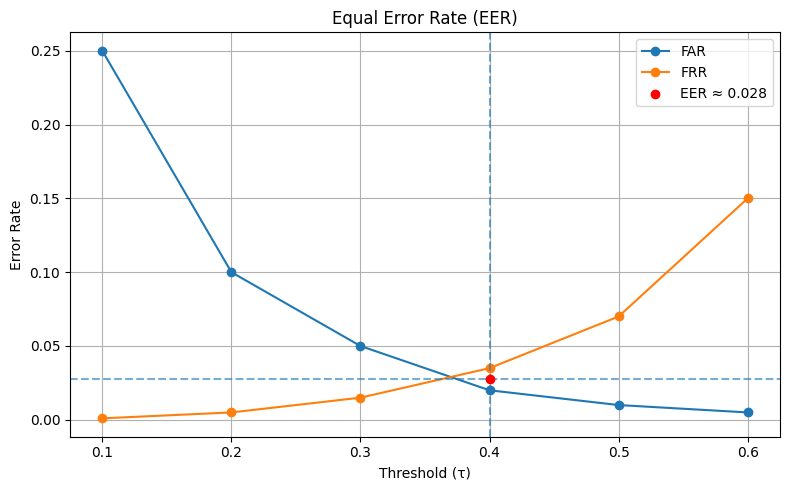
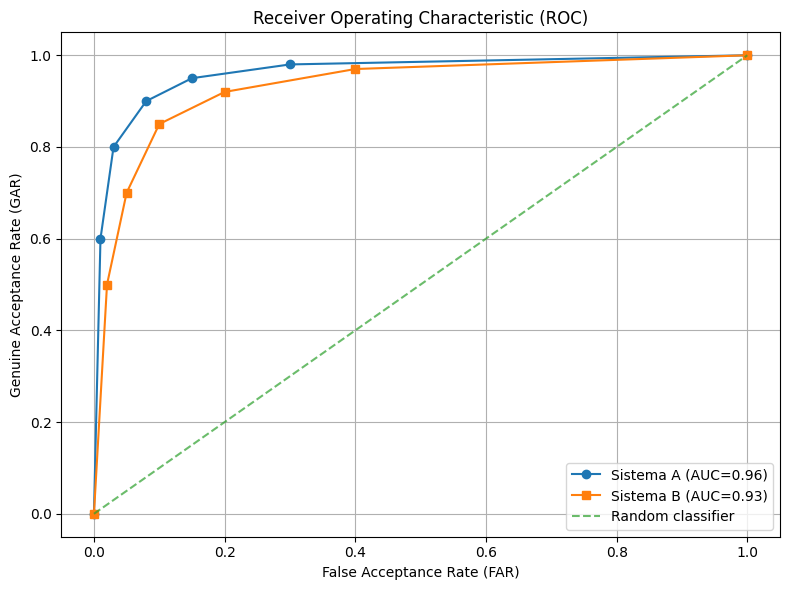
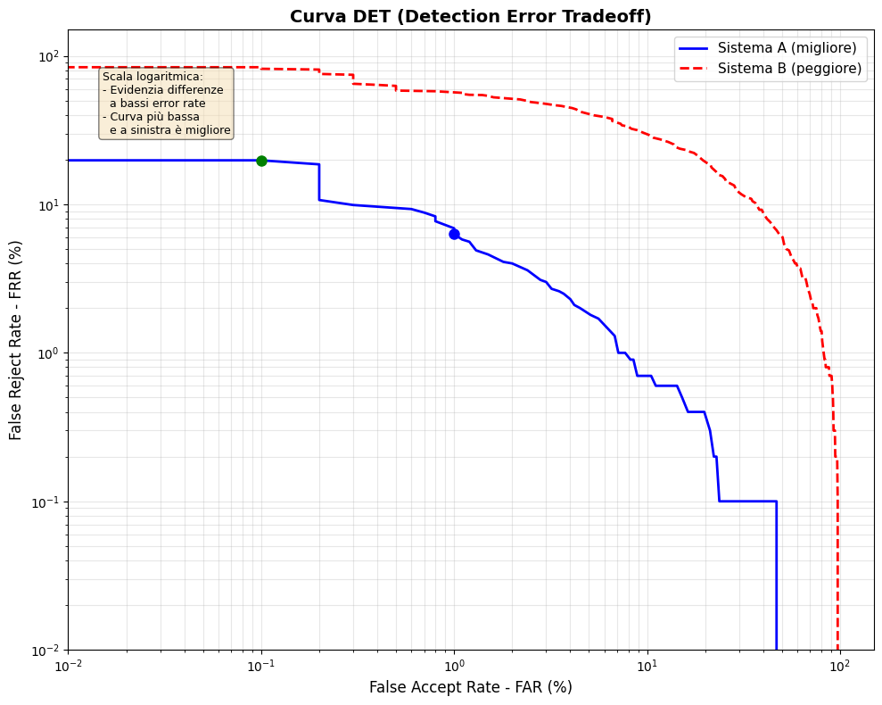
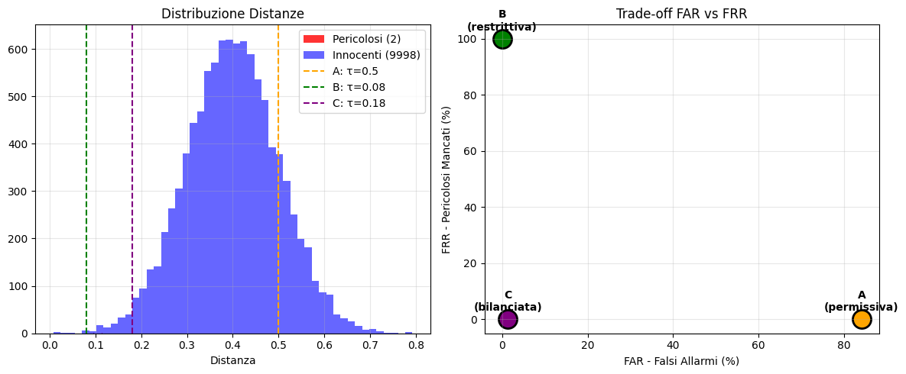
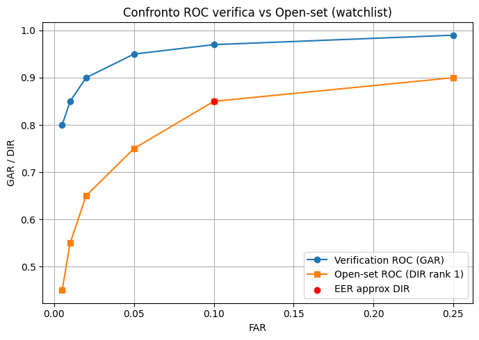

# Metriche Biometriche per Classificazione in Machine Learning

## Indice

1. [Introduzione e Fondamenti](#1-introduzione-e-fondamenti)
2. [Verifica Biometrica](#2-verifica-biometrica)
3. [Identificazione Open-Set](#3-identificazione-open-set)
4. [Identificazione Closed-Set](#4-identificazione-closed-set)
5. [Metodologie di Valutazione Offline](#5-metodologie-di-valutazione-offline)
6. [Affidabilità e Qualità](#6-affidabilità-e-qualità)

## 1. Introduzione e Fondamenti

### 1.1 Contesto dei Sistemi Biometrici

I sistemi biometrici operano in condizioni di **incertezza intrinseca**, una caratteristica che li distingue profondamente dai sistemi di autenticazione tradizionali basati su password o token. Mentre una password è sempre identica e il suo confronto è deterministico (corretta o errata), un campione biometrico dello stesso individuo non è mai esattamente uguale al precedente. Questa è la sfida fondamentale della biometria: nessun sistema è perfetto perché la flessibilità necessaria per riconoscere lo stesso individuo in condizioni diverse introduce inevitabilmente errori.

#### Requisiti di una caratteristica biometrica

Affinché una caratteristica possa essere utilizzata efficacemente come **tratto biometrico**, deve soddisfare una serie di requisiti fondamentali. Questi criteri permettono di valutare l’affidabilità, la robustezza e l’accettabilità di un sistema biometrico nel mondo reale.

- **Universalità**
Il tratto biometrico dovrebbe essere posseduto da ogni individuo. In altre parole, quasi tutte le persone devono poter essere identificate tramite quella caratteristica, fatta eccezione per rari casi particolari (ad esempio disabilità o condizioni mediche specifiche).

- **Unicità**
Il tratto biometrico deve essere sufficientemente diverso da persona a persona. Idealmente, ogni individuo dovrebbe poter essere distinto da qualsiasi altro sulla base di quella caratteristica, riducendo al minimo il rischio di ambiguità o collisioni.

   *Nota: una assunzione base dei sistemi biometrici è che ogni persona è unica.*

- **Permanenza**
Una buona caratteristica biometrica non dovrebbe variare significativamente nel tempo. Anche se piccoli cambiamenti sono inevitabili, il tratto deve rimanere stabile abbastanza a lungo da garantire un’identificazione affidabile nel corso degli anni.

- **Collezionabilità (Collectability)**
Il tratto biometrico deve poter essere misurato o acquisito tramite sensori appropriati (ad esempio fotocamere, scanner o microfoni). Inoltre, la misurazione dovrebbe essere sufficientemente accurata e ripetibile.

- **Accettabilità**
Le persone coinvolte non dovrebbero avere obiezioni rilevanti alla raccolta del tratto biometrico. Questo aspetto è strettamente legato a considerazioni etiche, culturali e di privacy, ed è cruciale per l’adozione su larga scala dei sistemi biometrici.

#### Fonti di Incertezza

1. **Variazioni intra-classe**: Lo stesso individuo produce campioni mai identici

   Immaginiamo di acquisire il volto della stessa persona in momenti diversi. Le variazioni possono essere numerose: la persona potrebbe sorridere in una foto ed essere seria nell'altra, indossare occhiali o averli rimossi, trovarsi sotto luce naturale o artificiale. Anche fattori sottili come la stanchezza, il trucco, o semplicemente l'angolazione della testa possono alterare significativamente l'aspetto del campione acquisito. Queste **variazioni intra-classe** (cioè variazioni all'interno della stessa classe/identità) rappresentano una sfida perché il sistema deve essere abbastanza "tollerante" da riconoscere che si tratta della stessa persona nonostante le differenze.
   
   - Posa, espressione, illuminazione variabili
   - Qualità di acquisizione diversa (sensore sporco, bassa risoluzione)
   - Cambiamenti temporali (invecchiamento, barba, accessori, chirurgia, etc.)

2. **Similarità inter-classe**: Individui diversi possono apparire simili

   D'altra parte, esistono persone che naturalmente si assomigliano. I gemelli omozigoti sono l'esempio estremo, ma anche fratelli, genitori e figli, o semplicemente persone con caratteristiche facciali comuni possono generare campioni biometrici molto simili. Queste **similarità inter-classe** (cioè somiglianze tra classi/identità diverse) sono problematiche perché il sistema deve essere abbastanza "selettivo" da distinguere persone diverse nonostante le somiglianze.
   
   - Somiglianze familiari (gemelli, fratelli)
   - Caratteristiche comuni nella popolazione
   - Condizioni di acquisizione che "uniformano" i soggetti

3. **Non-universalità**: Non tutti gli individui possono essere riconosciuti

   Un'assunzione fondamentale dei sistemi biometrici è che ogni persona possieda la caratteristica biometrica da rilevare. Tuttavia, questo non è sempre vero: alcune persone hanno impronte digitali usurate o danneggiate da lavori manuali, altre hanno difficoltà con il riconoscimento dell'iride a causa di particolari condizioni oculari. Questa **non-universalità** significa che una percentuale della popolazione potrebbe non essere riconoscibile dal sistema, indipendentemente dalla qualità dell'algoritmo.
   
   - Impronte digitali usurate o danneggiate
   - Caratteristiche biometriche ambigue o assenti
   - Impossibilità fisica di acquisire il tratto (es. persone senza mani per fingerprint)

### 1.2 Architettura di Sistema

Un sistema biometrico è composto da diversi moduli che lavorano in sequenza per trasformare un tratto fisico o comportamentale in una decisione di autenticazione. Comprendere questa architettura è fondamentale per identificare i punti critici dove possono verificarsi errori o attacchi.

```{visible}
Acquisizione → Estrazione Feature → Matching → Decisione
     ↓              ↓                  ↓           ↓
  Sensore      Template DB         Matcher    Threshold
```

Il processo inizia con l'**acquisizione** tramite un sensore specifico (telecamera per il volto, scanner per impronte, microfono per la voce). Questo passaggio è critico: un'acquisizione di bassa qualità compromette irrimediabilmente le fasi successive. Successivamente, il modulo di **estrazione feature** analizza il campione grezzo e ne estrae le caratteristiche distintive, memorizzate come template biometrico. Il **matcher** confronta poi il template del probe (campione da verificare) con i template memorizzati nel database, producendo uno score di similarità o distanza. Infine, la **decisione** viene presa confrontando questo score con una soglia predefinita.

*Nota: Il **sample** è il dato grezzo acquisito dal sensore. Le **features** sono le caratteristiche estratte dai dati grezzi. Il **template** è l'insieme delle features estratte dai dati grezzi.*

#### Tipologie di Utenti

Il comportamento dell’utente influenza in modo significativo il funzionamento e la sicurezza del sistema biometrico. È possibile distinguere diverse categorie:

- **Utenti cooperativi**: l’utente è interessato a essere riconosciuto correttamente (es. autenticazione volontaria). Un impostore in questo caso tenta di farsi riconoscere come un utente legittimo.
- **Utenti non cooperativi**: l’utente è indifferente o ostile al riconoscimento (es. sorveglianza). Un impostore può tentare di evitare deliberatamente il riconoscimento.
- **Utenti pubblici / privati**:
  - *Pubblici*: clienti o utenti esterni (es. controllo accessi in aeroporti).
  - *Privati*: dipendenti o membri interni di un’organizzazione.
- **Utenti frequenti / occasionali**:
  - *Used*: utilizzano il sistema frequentemente, con template aggiornati e stabili.
  - *Non-used*: interagiscono raramente con il sistema, aumentando la probabilità di mismatch.
- **Utenti consapevoli / inconsapevoli**:
  - *Aware*: sanno di essere sottoposti a riconoscimento biometrico.
  - *Not aware*: il riconoscimento avviene in modo trasparente o passivo.

Queste differenze influenzano la qualità dell’acquisizione, la variabilità intra-classe e la robustezza richiesta al sistema.

#### Tipologie di Setting di Acquisizione

Le condizioni operative del sistema hanno un impatto diretto sulle prestazioni biometriche:

- **Setting controllati**:
  - condizioni ambientali controllate (illuminazione, posa, distanza)
  - distorsioni ridotte
  - possibilità di scartare template difettosi
  - acquisizione ripetibile
- **Setting non controllati o sotto-controllati**:
  - condizioni ambientali variabili
  - presenza di rumore, occlusioni, blur
  - template con diversi livelli di distorsione
  - possibilità di scartare template difettosi, ma **senza possibilità di ripetere la cattura**

I sistemi operanti in setting non controllati devono essere più robusti e tolleranti alla variabilità.

**Vulnerabilità agli attacchi (spoofing)**:

I sistemi biometrici possono essere attaccati a diversi livelli:

- **Livello sensore**: Presentazione di tratti falsi (impronte artificiali in gelatina, maschere 3D, foto stampate). Questo è l'attacco più comune e intuitivo, dove un malintenzionato cerca di "ingannare" il sensore presentando una replica del tratto biometrico legittimo.

- **Canale di comunicazione**: Intercettazione e replay di campioni. Se il sensore è separato dall'unità di elaborazione, un attaccante potrebbe intercettare i dati trasmessi e riprodurli successivamente per accedere al sistema senza presentarsi fisicamente.

- **Matcher**: Manipolazione degli score di similarità. Un attaccante con accesso al software potrebbe modificare il modulo di matching per forzare uno score alto anche quando la somiglianza è bassa.

- **Database template**: Modifica o iniezione di template. Compromettere il database consente di sostituire template legittimi o inserirne di fraudolenti, ottenendo così accesso permanente al sistema.

#### Enrollment

Acquisizione ed elaborazione dei dati biometrici dell'utente per l'utilizzo da parte del sistema nelle successive operazioni di autenticazione (gallery).

#### Recognition

Acquisizione ed elaborazione dei dati biometrici dell'utente al fine di fornire una decisione di autenticazione basata sul risultato di un processo di abbinamento tra il modello memorizzato e quello corrente. (verifica 1:1, identificazione 1:N)

#### Modalità Tradizionali di Riconoscimento e Autenticazione

Attualmente, il riconoscimento (spesso finalizzato all’autenticazione) viene effettuato secondo due principali modalità:

- **Qualcosa che si possiede**: una carta, un badge o un documento.  
  Tuttavia, questi oggetti possono essere **persi, rubati o copiati**. In realtà, il sistema non autentica la persona, ma **l’oggetto** in suo possesso.

- **Qualcosa che si conosce**: una password personale o condivisa.  
  Anche in questo caso esistono diverse criticità: la password può essere **indovinata, carpita o dimenticata**. Inoltre, una password facile da ricordare è spesso anche **facile da indovinare**.

- **Basato su ciò che si è**: caratteristiche **biometriche** dell’individuo, come tratti fisici (impronte digitali, volto, iride) o comportamentali (voce, dinamica di digitazione, andatura).  
  In questo caso, l’autenticazione è legata direttamente all’identità della persona, riducendo la dipendenza da oggetti o informazioni memorizzate.

### 1.3 Modalità Operative

I sistemi biometrici operano principalmente in tre modalità, ciascuna con caratteristiche e metriche di valutazione specifiche:

**Verifica (1:1)**:
- L'utente dichiara un'identità $i$ (claim)
- Sistema confronta: probe vs template dell'identità dichiarata
- Decisione binaria: accetta/rifiuta
- Esempio pratico: Sblocco smartphone con Face ID - l'utente dichiara implicitamente di essere il proprietario del dispositivo

**Identificazione Open-Set (1:N con reject option)**:
- Nessuna identità dichiarata
- Sistema confronta: probe vs tutti i template in galleria
- Decisioni: (1) il soggetto è/non è in galleria, (2) se sì, quale identità
- Esempio pratico: Sorveglianza in aeroporto - il sistema cerca di identificare se una persona è presente in una watchlist

  **Watch list**:
    - Il sistema possiede una lista di soggetti di interesse
    - Verifica se il *probe* appartiene alla lista

    Tipologie di watch list:
    - **White list**: i soggetti presenti nella lista sono **autorizzati** e l’accesso viene consentito
    - **Black list**: i soggetti presenti nella lista sono **non autorizzati**; il riconoscimento può generare un **allarme**


**Identificazione Closed-Set (1:N forzata)**:
- Assunzione: il probe appartiene sicuramente alla galleria
- Sistema restituisce sempre un'identità
- Errore solo se l'identità corretta non è al primo posto
- Esempio pratico: Gara sportiva dove tutti i partecipanti sono pre-registrati

La distinzione tra queste modalità è cruciale perché determina quali errori sono possibili e come vengono misurate le performance del sistema.

### 1.4 Tipologie di Caratteristiche Biometriche

I sistemi biometrici si basano sull’analisi di **caratteristiche distintive** degli individui, che possono essere classificate ad **alto livello** in base alla loro natura e stabilità nel tempo. In generale, le caratteristiche biometriche si suddividono in **fisiologiche**, **comportamentali** e **miste**, a cui si affiancano le **tracce biologiche**.

#### Caratteristiche Fisiologiche (Physiological Features)

Sono legate alla struttura fisica dell’individuo e tendono a essere **stabili nel tempo**.

- **Biometria delle impronte digitali** (*Fingerprints biometrics*): riconoscimento basato sui pattern delle creste papillari.
- **Biometria oculare** (*Eye biometrics*):
  - riconoscimento dell’**iride**
  - riconoscimento della **retina**
- **Biometria facciale** (*Face biometrics*): riconoscimento del volto tramite immagini nel visibile o all’infrarosso.
- **Biometria dell’orecchio** (*Ear biometrics*): riconoscimento basato sulla forma e struttura dell’orecchio.
- **Biometria della mano** (*Hand biometrics*): riconoscimento tramite la geometria delle dita e della mano.

#### Caratteristiche Comportamentali (Behavioural Features)

Descrivono il **comportamento** dell’individuo piuttosto che la sua struttura fisica e sono generalmente più **variabili**.

- **Biometria della firma** (*Signature biometrics*):  
  - firma statica  
  - firma dinamica (velocità, pressione, traiettoria)
- **Dinamica di digitazione** (*Keystroke dynamics*): pattern di pressione e temporizzazione durante la digitazione.
- **Biometria vocale** (*Voice biometrics*): riconoscimento basato sulle caratteristiche della voce.
- **Riconoscimento dell’andatura** (*Gait recognition*): analisi del modo di camminare.

#### Caratteristiche Miste (Mixed Features)

Combinano aspetti fisiologici e comportamentali.

- **Volto**: struttura facciale (fisiologica) + espressioni e movimenti (comportamentali).
- **Voce**: caratteristiche dell’apparato vocale (fisiologiche) + modalità di emissione (comportamentali).

#### Tracce Biologiche (Biological Traces Biometrics)

- **DNA**: caratteristica biometrica estremamente discriminante, utilizzata principalmente in ambito forense e non in sistemi di autenticazione in tempo reale.

#### Strong Biometric Traits

Sono tratti biometrici caratterizzati da **elevata unicità e persistenza nel tempo**, quindi particolarmente affidabili per il riconoscimento:

- **Impronte digitali**
- **Volto**
- **Iride**

#### Soft Biometric Traits

Sono tratti biometrici con **bassa unicità** o **scarsa persistenza**, ma possono essere utili per **ridurre lo spazio di ricerca** o supportare altre biometrie:

- Colore dei capelli
- Forma del volto
- Andatura
- Altre caratteristiche fisiche generali

Questi tratti possono variare nel tempo a causa di fattori come **umore, stato di salute, età o condizioni ambientali**, ma risultano utili come informazioni complementari nei sistemi biometrici complessi (ad esempio per limitare il numero di candidati in fase di identificazione).

### 1.5 Notazione e Terminologia

**Insiemi fondamentali**:
- $\mathcal{G}$ = Gallery (insieme di template enrollati)
- $\mathcal{P}$ = Probe set (insieme di campioni da riconoscere)
- $\mathcal{P}_G \subset \mathcal{P}$ = Probe di soggetti in galleria (enrolled)
- $\mathcal{P}_N \subset \mathcal{P}$ = Probe di soggetti NON in galleria (non-enrolled)
- $N$ = Numero di identità in galleria
- $|\mathcal{G}|$ = Numero totale di template in galleria

**Funzioni di ground truth** (disponibili solo in fase di testing):
- $\text{id}(t)$: restituisce l'identità vera associata al template $t$
- $\text{topMatch}(p, i)$: restituisce il miglior match tra probe $p$ e template dell'identità $i$

**Funzioni di matching**:
- $s(t_1, t_2) \in \mathbb{R}$: similarità tra template (maggiore = più simili)
- $d(t_1, t_2) \in \mathbb{R}^+$: distanza tra template (minore = più simili)

**Convenzione**: Useremo principalmente **distanze** (valori più bassi indicano maggiore somiglianza).

### 1.5 Distribuzioni di Score

Le distribuzioni di score sono il concetto fondamentale per comprendere il comportamento dei sistemi biometrici. Ogni confronto tra template produce uno score (distanza o similarità), e questi score seguono distribuzioni statistiche diverse a seconda che i template appartengano alla stessa persona o a persone diverse.

**Definizione formale delle distribuzioni**:

Sia $X$ un campione biometrico casuale e sia $s$ uno score (distanza o similarità).

**Distribuzione Impostor** (o Non-Match):
$$p(s|H_0) = p(s|\text{id}(t_1) \neq \text{id}(t_2))$$

Score ottenuti confrontando template di **identità diverse**. Questa distribuzione rappresenta quanto sono dissimili persone diverse secondo il sistema biometrico. In un sistema ideale, tutti gli score impostor dovrebbero essere alti (se usiamo distanze) o bassi (se usiamo similarità).

**Distribuzione Genuine** (o Match):
$$p(s|H_1) = p(s|\text{id}(t_1) = \text{id}(t_2))$$

Score ottenuti confrontando template della **stessa identità**. Questa distribuzione rappresenta quanto sono simili campioni diversi della stessa persona. In un sistema ideale, tutti gli score genuine dovrebbero essere bassi (per distanze) o alti (per similarità).

**Proprietà teorica**:
In un sistema ideale: $supp(p(s|H_0)) \cap supp(p(s|H_1)) = \emptyset$, dove 

$$supp(p) = \{x \in \mathbb{R} : p(x) > 0\}.$$

In pratica, le distribuzioni si **sovrappongono**, rendendo impossibile una separazione perfetta. Questa sovrapposizione è la causa fondamentale di tutti gli errori nei sistemi biometrici.

**Caratteristiche tipiche** (usando distanze):
- Impostor distribution: score alti (alta distanza), $\sigma_I$ moderata
- Genuine distribution: score bassi (bassa distanza), $\sigma_G$ variabile
- Overlap region: $p(s|H_0) > 0 \land p(s|H_1) > 0$

La **qualità del sistema** è inversamente proporzionale all'area di sovrapposizione. Un sistema migliore ha distribuzioni più separate, con meno sovrapposizione.

**Interpretazione grafica**:

```python
import numpy as np
import matplotlib.pyplot as plt

# Numero di confronti
n_genuine  = 100_000
n_impostor = 100_000

# Distribuzione Genuine (distanze basse)
genuine_scores = np.random.normal(
    loc=10.0,      # media (bassa)
    scale=1.0,    # deviazione standard
    size=n_genuine
)

# Distribuzione Impostor (distanze alte)
impostor_scores = np.random.normal(
    loc=15.0,      # media (alta)
    scale=2.0,    # deviazione standard
    size=n_impostor
)

plt.figure()

plt.hist(
    genuine_scores,
    bins=100,
    density=True,
    alpha=0.6,
    label="Genuine"
)

plt.hist(
    impostor_scores,
    bins=100,
    density=True,
    alpha=0.6,
    label="Impostor"
)

threshold = 12.0
plt.axvline(threshold, linestyle="--", label="Threshold")

plt.xlabel("Score (distanza)")
plt.ylabel("Densità")
plt.title("Distribuzioni Genuine e Impostor")
plt.legend()

plt.show()
```


Nella regione di overlap, è impossibile distinguere con certezza se uno score proviene da un confronto genuine o impostor. La scelta della soglia determina quanti errori di ciascun tipo commetteremo.

## 1.6 Come Confrontiamo due Template?

Una volta estratti i template biometrici, il passo successivo consiste nel **confrontarli** per ottenere uno **score** di similarità o distanza.  
La scelta della metrica di confronto dipende dalla **natura del template** (vettore, istogramma, serie temporale, insieme di punti, ecc.).

### 🔹 Template come vettori

In molti sistemi biometrici, i template sono rappresentati come **vettori numerici** in uno spazio multidimensionale.  
In questo caso, è possibile utilizzare metriche standard:

- **Distanza Euclidea**  
  Misura la distanza geometrica tra due vettori nello spazio.
  👉 Vedi: [[Distanza Euclidea]]

- **Similarità Coseno**  
  Misura l’angolo tra due vettori, indipendentemente dalla loro norma.
  👉 Vedi: [[Similarità Coseno]]

Queste metriche possono essere interpretate rispettivamente come:
- **distanza** (più piccola = più simili)
- **similarità** (più grande = più simili)

### 🔹 Correlazione

Per template rappresentati come **istogrammi** o **insiemi di punti**, è possibile usare una misura di similarità basata sulla correlazione:

- **Correlazione di Pearson**  
  Valuta il grado di relazione lineare tra due rappresentazioni.
  👉 Vedi: [[Correlazione di Pearson]]

### 🔹 Confronto tra istogrammi

Quando i template sono **istogrammi** (ad esempio distribuzioni di orientamenti o frequenze), esistono metriche dedicate:

- **Distanza di Bhattacharyya**  
  Misura la sovrapposizione tra due distribuzioni di probabilità.
  👉 Vedi: [[Distanza di Bhattacharyya]]

### 🔹 Serie temporali

Per template che rappresentano **segnali nel tempo** (ad esempio andature, gesti, segnali biometrici dinamici):

- **Dynamic Time Warping (DTW)**  
  Allinea due serie temporali che possono avere velocità diverse ma forma simile.
  👉 Vedi: [[Dynamic Time Warping]]

Un esempio tipico è il confronto di due sequenze di camminata:  
anche se la velocità di esecuzione varia, la traiettoria spaziale degli arti rimane simile.

### 🔹 Template da modelli Deep Learning

Nel caso di sistemi basati su **Deep Learning**, il confronto avviene tipicamente sulle **embedding**:

- Si rimuove l’ultimo strato di classificazione (di solito un **softmax**)
- L’output intermedio della rete viene usato come **vettore di feature**
- Le embedding vengono confrontate usando metriche standard (es. distanza euclidea o similarità coseno)

👉 Vedi: [[Embedding in Deep Learning]]

### 🔹 Template strutturati complessi

Alcuni template richiedono strategie di confronto più sofisticate.  
Ad esempio, nel riconoscimento delle impronte digitali:

- I template sono insiemi di **minuzie**
- È necessario trovare il **miglior accoppiamento** tra punti prima di calcolare uno score

👉 Vedi: [[Matching di Minuzie]]

### Dopo il Confronto

Una volta calcolato uno score di **similarità** o **distanza**, questo viene confrontato con una **soglia di accettazione**:

- **Verifica** o **identificazione open-set**
- Score ≥ soglia → accettazione (similarità)
- Score ≤ soglia → accettazione (distanza)

L’analisi delle prestazioni studia il comportamento del sistema al variare della soglia, mettendo in evidenza:
- errori del sistema
- compromesso tra falsi accettati e falsi rifiutati

### In Sintesi

- Selezionare ed estrarre **feature sufficientemente discriminative**
- Definire una **strategia di matching appropriata**
- Analizzare il comportamento del sistema al variare della soglia:
  - similarità ≥ soglia
  - distanza ≤ soglia


## 2. Verifica Biometrica

### 2.1 Definizione Formale del Task

La verifica è la modalità operativa più comune nei sistemi biometrici consumer (smartphone, laptop, accesso fisico). Il compito è relativamente semplice da definire ma complesso da realizzare con alta accuratezza.

**Task di Verifica**: Data una coppia $(p, i)$ dove:
- $p$ = probe (campione biometrico acquisito)
- $i$ = identità dichiarata (claim esplicito o implicito)

Decidere se $\text{id}(p) = i$.

**Decision rule parametrizzata da soglia** $\tau$:

Per **distanze**:
$$\delta_\tau(p, i) = \begin{cases}
\text{Accept} & \text{se } d(p, \text{topMatch}(p,i)) \leq \tau \\
\text{Reject} & \text{altrimenti}
\end{cases}$$

Per **similarità**:
$$\delta_\tau(p, i) = \begin{cases}
\text{Accept} & \text{se } s(p, \text{topMatch}(p,i)) \geq \tau \\
\text{Reject} & \text{altrimenti}
\end{cases}$$

La soglia $\tau$ è il parametro più critico del sistema: determina il trade-off tra sicurezza e usabilità. Una soglia troppo restrittiva blocca utenti legittimi, una troppo permissiva lascia entrare impostori.

### 2.2 Tassonomia degli Outcome

**Definizione rigorosa degli outcome**:

Siano:
- $H_1$: ipotesi che $\text{id}(p) = i$ (claim genuino)
- $H_0$: ipotesi che $\text{id}(p) \neq i$ (claim impostor)
- $D_1$: decisione di accettare
- $D_0$: decisione di rifiutare

| **Ipotesi Vera** | **Decisione** | **Outcome** | **Nome** | **Tipo** |
|------------------|---------------|-------------|----------|----------|
| $H_1$ | $D_1$ | $\text{id}(p) = i \land \text{Accept}$ | Genuine Acceptance (GA) | ✓ Corretto |
| $H_1$ | $D_0$ | $\text{id}(p) = i \land \text{Reject}$ | False Rejection (FR) | ✗ Errore Tipo I |
| $H_0$ | $D_0$ | $\text{id}(p) \neq i \land \text{Reject}$ | Genuine Rejection (GR) | ✓ Corretto |
| $H_0$ | $D_1$ | $\text{id}(p) \neq i \land \text{Accept}$ | False Acceptance (FA) | ✗ Errore Tipo II |

**Interpretazione e impatto**:
- **GA (Genuine Acceptance)**: Utente legittimo correttamente riconosciuto - esperienza utente positiva
- **GR (Genuine Rejection)**: Impostore correttamente respinto - sistema funziona come previsto
- **FR (False Rejection)**: Utente legittimo erroneamente respinto - **impatto: usabilità, frustrazione utente**
- **FA (False Acceptance)**: Impostore erroneamente accettato - **impatto: SICUREZZA, accesso non autorizzato**

### 2.3 Metriche Fondamentali

#### 2.3.1 False Acceptance Rate (FAR)

Il FAR misura quanto spesso il sistema lascia entrare persone non autorizzate. È la metrica più critica per la sicurezza del sistema.

**Definizione**:
$$\text{FAR}(\tau) = \frac{\text{\# False Acceptances}}{\text{\# Impostor Attempts}} = \frac{|\{(p,i) : \text{id}(p) \neq i \land d(p,i) \leq \tau\}|}{|\{(p,i) : \text{id}(p) \neq i\}|}$$

**Interpretazione probabilistica**:
$$\text{FAR}(\tau) = P(D_1 | H_0) = P(\text{Accept} | \text{impostor})$$

Probabilità che un impostore venga erroneamente accettato.

**Esempio pratico**: FAR = 0.001 (0.1%) significa che in media 1 impostore su 1000 viene accettato. In un sistema con milioni di accessi giornalieri, anche un FAR apparentemente basso può tradursi in migliaia di accessi non autorizzati.

**Relazione con la distribuzione**:
$$\text{FAR}(\tau) = \int_{-\infty}^{\tau} p(d|H_0) \, dd = P(d \leq \tau | H_0)$$

Il FAR è quindi l'area sotto la curva della distribuzione impostor a sinistra della soglia $\tau$.

**Considerazioni operative**:
- In applicazioni di alta sicurezza (banche, accesso a dati sensibili): FAR target < 0.0001 (0.01%)
- In applicazioni consumer (smartphone): FAR tipico ≈ 0.001-0.01 (0.1%-1%)
- Il FAR aumenta con attacchi mirati (presentation attacks, deepfakes)

#### 2.3.2 False Rejection Rate (FRR)

Il FRR misura quanto spesso il sistema blocca utenti legittimi. È la metrica più critica per l'usabilità del sistema.

**Definizione**:
$$\text{FRR}(\tau) = \frac{\text{\# False Rejections}}{\text{\# Genuine Attempts}} = \frac{|\{(p,i) : \text{id}(p) = i \land d(p,i) > \tau\}|}{|\{(p,i) : \text{id}(p) = i\}|}$$

**Interpretazione probabilistica**:
$$\text{FRR}(\tau) = P(D_0 | H_1) = P(\text{Reject} | \text{genuine})$$

Probabilità che un utente genuino venga erroneamente rifiutato.

**Quindi**: FRR = 0.05 (5%) significa che in media 1 utente legittimo su 20 viene respinto. Se un utente tenta l'accesso 10 volte al giorno, verrà bloccato circa una volta ogni due giorni, causando frustrazione.

**Esempio concreto**:
Consideriamo uno smartphone con riconoscimento facciale usato da 100 persone diverse in un giorno:
- 10 utilizzi sono dal proprietario (genuine attempts)
- 90 tentativi sono da altre persone che trovano il telefono (impostor attempts)

Se il sistema ha FAR = 0.01 e FRR = 0.05:
- Il proprietario verrà bloccato circa 0.5 volte (5% di 10 tentativi)
- Circa 0.9 impostori entreranno nel telefono (1% di 90 tentativi)

**Relazione con la distribuzione**:
$$\text{FRR}(\tau) = \int_{\tau}^{\infty} p(d|H_1) \, dd = P(d > \tau | H_1)$$

Il FRR è l'area sotto la curva della distribuzione genuine a destra della soglia $\tau$.

**Considerazioni operative**:
- In applicazioni consumer: FRR target < 0.01-0.05 (1%-5%)
- FRR troppo alto causa abbandono del sistema biometrico (gli utenti preferiscono password)
- FRR aumenta con variazioni ambientali (illuminazione, angolazione, invecchiamento)

#### 2.3.3 Genuine Acceptance Rate (GAR)

Il GAR è la metrica complementare al FRR e misura il successo del sistema nel riconoscere utenti legittimi.

**Definizione**:
$$\text{GAR}(\tau) = \frac{\text{\# Genuine Accepts}}{\text{\# Genuine Attempts}} = \frac{|\{(p,i) : \text{id}(p) = i \land d(p,i) \leq \tau\}|}{|\{(p,i) : \text{id}(p) = i\}|}= 1 - \text{FRR}(\tau) = P(D_1 | H_1)$$

**Relazione complementare**:
$$\text{GAR}(\tau) + \text{FRR}(\tau) = 1$$

Entrambe misurate rispetto ai **genuine attempts**.

Il GAR è spesso preferito nelle presentazioni perché è una metrica "positiva" (più alto è meglio), mentre il FRR è una metrica "negativa" (più basso è meglio). Tuttavia, contengono la stessa informazione.

**Esempio**: Un sistema con GAR = 0.98 (98%) ha FRR = 0.02 (2%). Questo significa che 98 utenti legittimi su 100 vengono correttamente riconosciuti.

#### 2.3.4 Genuine Rejection Rate (GRR)

Il GRR misura quanto efficacemente il sistema respinge impostori.

**Definizione**:
$$\text{GRR}(\tau) = \frac{\text{\# Genuine Rejections}}{\text{\# Impostors Attempts}} = \frac{|\{(p,i) : \text{id}(p) \neq i \land d(p,i) > \tau\}|}{|\{(p,i) : \text{id}(p) \neq i\}|}= 1 - \text{FAR}(\tau) = P(D_0 | H_0)$$

**Relazione complementare**:
$$\text{GRR}(\tau) + \text{FAR}(\tau) = 1$$

Entrambe misurate rispetto agli **impostor attempts**.

Il GRR è meno comunemente riportato rispetto al FAR, ma può essere utile per enfatizzare l'aspetto positivo della sicurezza del sistema.

### 2.4 Conteggi vs Rate

È fondamentale distinguere tra conteggi assoluti e rate normalizzate, poiché questa distinzione è fonte di errori comuni nella valutazione di sistemi biometrici.

**Distinzione critica**:

**Conteggi assoluti** (matcher-level):
- FM (False Match): Numero di match errati prodotti dal matcher
- FNM (False Non-Match): Numero di non-match errati
- Dipendono dalla dimensione del dataset di test
- Non confrontabili tra diversi esperimenti

**Rate normalizzate** (system-level):
- FAR, FRR: Normalizzate rispetto alle popolazioni rilevanti
- Possono includere failure sistemici (FTE, FTA)
- Confrontabili tra diversi esperimenti
- Indipendenti dalla dimensione assoluta del dataset

**Failure to Enroll (FTE)**:
$$\text{FTE} = \frac{\text{\# soggetti che non possono essere enrollati}}{N_{\text{popolazione}}}$$

Il FTE misura la percentuale di persone che non riescono a registrarsi nel sistema. Cause comuni:
- Qualità biometrica insufficiente (impronte danneggiate)
- Caratteristiche biometriche atipiche
- Problemi tecnici del sensore

**Failure to Acquire (FTA)**:
$$\text{FTA} = \frac{\text{\# acquisizioni fallite}}{\text{\# tentativi di acquisizione}}$$

Il FTA misura la percentuale di tentativi di acquisizione che falliscono. Diverso dal FTE perché:
- FTE: problema persistente con un individuo specifico
- FTA: problema temporaneo che può risolversi al tentativo successivo

**Esempio pratico**:
Un sistema di impronte digitali in un'azienda:
- 1000 dipendenti tentano l'enrollment
- 5 hanno impronte troppo usurate (FTE = 0.5%)
- Durante l'enrollment, 50 acquisizioni falliscono per dita sporche/umide (FTA ≈ 5%)
- In operazione: 10000 accessi giornalieri, 20 FA, 100 FR
  - FAR = 20 / (numero impostori) - serve conoscere la composizione
  - FRR = 100 / (numero genuine) - serve conoscere la composizione

### 2.5 Trade-off FAR-FRR

Il trade-off tra FAR e FRR è la caratteristica fondamentale dei sistemi biometrici threshold-based. Comprendere questo trade-off è essenziale per configurare correttamente un sistema.

**Teorema 2.1** (Monotonicità):
*Per un sistema di verifica basato su soglia:*

1. $\text{FAR}(\tau)$ è monotona **decrescente** in $\tau$
2. $\text{FRR}(\tau)$ è monotona **crescente** in $\tau$

**Dimostrazione**:

(1) Aumentando $\tau$, rendiamo più restrittiva l'accettazione (richiediamo distanza più bassa):
$$\tau_1 < \tau_2 \Rightarrow P(d \leq \tau_1 | H_0) \geq P(d \leq \tau_2 | H_0)$$
$$\Rightarrow \text{FAR}(\tau_1) \geq \text{FAR}(\tau_2)$$

(2) Simmetricamente per FRR:
$$\tau_1 < \tau_2 \Rightarrow P(d > \tau_1 | H_1) \leq P(d > \tau_2 | H_1)$$

$$
\Rightarrow \text{FRR}(\tau_1) \leq \text{FRR}(\tau_2)
$$ 

$\square$

**Implicazione pratica**: Non è possibile minimizzare simultaneamente FAR e FRR modificando solo la soglia. Ogni miglioramento in sicurezza (FAR più basso) costa in usabilità (FRR più alto) e viceversa.

**Casi estremi**:

$$
\lim_{\tau \to 0} \begin{cases}
\text{FAR}(\tau) \to 1 \\
\text{FRR}(\tau) \to 0
\end{cases} \quad \text{(accetta tutti - sistema inutile per sicurezza)}
$$

$$
\lim_{\tau \to \infty} 
\begin{cases}
\text{FAR}(\tau) \to 0 \\
\text{FRR}(\tau) \to 1
\end{cases} \quad \text{(rifiuta tutti - sistema inutile per accesso)}
$$

### 2.6 Equal Error Rate (EER)

L'EER è la metrica scalare più comunemente usata per riassumere la performance di un sistema biometrico in un singolo numero.

**Definizione**:
$$\text{EER} = \text{FAR}(\tau^*) = \text{FRR}(\tau^*)$$

dove $\tau^*$ è la soglia per cui FAR e FRR si uguagliano.

**Calcolo**:
$$\tau^* = \arg\min_\tau |\text{FAR}(\tau) - \text{FRR}(\tau)|$$

**Proprietà**:
- Metrica **scalare** che riassume la performance complessiva
- EER basso indica sistema migliore (tipicamente 0.1%-5% per sistemi moderni)
- Punto di **bilanciamento naturale** tra i due errori
- Utile quando non si hanno informazioni sui costi relativi di FA e FR
- Indipendente dalla scelta arbitraria di una soglia operativa

**Limitazione critica**: L'EER potrebbe non essere il punto operativo ottimale se FA e FR hanno costi asimmetrici. Ad esempio:
- In un sistema bancario: costo(FA) >> costo(FR) → opereremo a FAR molto più basso dell'EER
- In un sistema di accesso rapido: costo(FR) >> costo(FA) → opereremo a FRR molto più basso dell'EER

**Esempio di calcolo**:

| Threshold | FAR | FRR |
|-----------|-----|-----|
| 0.1 | 0.250 | 0.001 |
| 0.2 | 0.100 | 0.005 |
| 0.3 | 0.050 | 0.015 |
| 0.4 | 0.020 | 0.035 |
| 0.5 | 0.010 | 0.070 |
| 0.6 | 0.005 | 0.150 |

EER ≈ 0.027 alla soglia ≈ 0.42 (interpolando tra 0.4 e 0.5)

**Confronto tra sistemi**:
- Sistema A: EER = 1% - Eccellente
- Sistema B: EER = 5% - Buono
- Sistema C: EER = 10% - Accettabile per applicazioni non critiche
- Sistema D: EER = 20% - Scadente, non utilizzabile

**Esempio**: Il seguente codice mostra un semplice esempio di calcolo e visualizzazione dell’**Equal Error Rate (EER)** a partire da valori discreti di FAR e FRR misurati a diverse soglie operative.  
L’EER viene stimato come il punto in cui la differenza tra FAR e FRR è minima e viene rappresentato graficamente come il punto di equilibrio tra le due curve di errore.

```python
import numpy as np
import matplotlib.pyplot as plt

# Soglie operative
thresholds = np.array([
    0.1, 0.2, 0.3, 0.4, 0.5, 0.6
])

# False Acceptance Rate (FAR)
far = np.array([
    0.250, 0.100, 0.050, 0.020, 0.010, 0.005
])

# False Rejection Rate (FRR)
frr = np.array([
    0.001, 0.005, 0.015, 0.035, 0.070, 0.150
])

# Differenza assoluta tra FAR e FRR
difference = np.abs(far - frr)

# Indice della soglia ottimale
eer_index = np.argmin(difference)  # es: np.argmin(difference)

# Soglia di EER
eer_threshold = thresholds[eer_index]  # thresholds[eer_index]

# Valore di EER
eer = (far[eer_index] + frr[eer_index]) / 2

plt.figure(figsize=(8, 5))

plt.plot(thresholds, far, marker='o', label='FAR')
plt.plot(thresholds, frr, marker='o', label='FRR')

# Punto EER
plt.scatter(
    eer_threshold,
    eer,
    color='red',
    zorder=5,
    label=f'EER ≈ {eer:.3f}'
)

# Linee guida
plt.axvline(eer_threshold, linestyle='--', alpha=0.6)
plt.axhline(eer, linestyle='--', alpha=0.6)

plt.xlabel('Threshold (τ)')
plt.ylabel('Error Rate')
plt.title('Equal Error Rate (EER)')
plt.legend()
plt.grid(True)

plt.tight_layout()
plt.show()
```



### 2.7 Punti Operativi Speciali

Oltre all'EER, esistono altri punti operativi di interesse che corrispondono a requisiti applicativi specifici.

#### Zero FAR (ZeroFMR)

**Definizione**:
$$\text{ZeroFAR} = \text{FRR}(\tau_{\text{max}})$$

dove $\tau_{\text{max}}$ è la soglia più restrittiva che garantisce FAR = 0.

Per distanze: $\tau_{\text{max}} = \min\{d(p,g) : \text{id}(p) \neq \text{id}(g)\}$

FRR ottenuto quando la soglia è impostata per garantire FAR = 0.

**Uso**: Applicazioni di **massima sicurezza** (accesso a sistemi critici, vault bancari, laboratori militari).

**Esempio**: Sistema di accesso a un data center con dati sensibili:
- Impostato a ZeroFAR
- FAR = 0% (nessun impostore può entrare)
- FRR potrebbe essere 30-40% (alto, ma accettabile dato il contesto)
- Gli utenti legittimi hanno metodi di backup (PIN, badge)

#### Zero FRR (ZeroFNMR)

**Definizione**:
$\text{ZeroFRR} = \text{FAR}(\tau_{\text{min}})$

dove $\tau_{\text{min}}$ è la soglia più permissiva che garantisce FRR = 0.

Per distanze: $\tau_{\text{min}} = \max\{d(p,g) : \text{id}(p) = \text{id}(g)\}$

FAR ottenuto quando la soglia è impostata per garantire FRR = 0.

**Uso**: Applicazioni di **massima usabilità** (accesso prioritario, sistemi di emergenza).

**Esempio**: Sistema di accesso per personale medico in pronto soccorso:
- Impostato a ZeroFRR
- FRR = 0% (nessun medico viene bloccato in emergenza)
- FAR potrebbe essere 5-10% (relativamente alto, ma compensato da altri controlli)

**Nota pratica**: A causa della sovrapposizione delle distribuzioni, ottenere esattamente FAR = 0 o FRR = 0 è generalmente impossibile nella pratica. Questi sono punti **concettuali** o **asintotici** che rappresentano i limiti teorici del sistema.

### 2.8 Receiver Operating Characteristic (ROC)

La curva ROC è lo strumento più potente per visualizzare e confrontare le performance di sistemi biometrici. Fornisce una visione completa del comportamento del sistema a tutte le possibili soglie.

**Definizione formale**:

La curva ROC è la funzione parametrica:
$\text{ROC}(\tau) = (\text{FAR}(\tau), \text{GAR}(\tau)) = (\text{FAR}(\tau), 1 - \text{FRR}(\tau))$

al variare di $\tau \in [0, \infty)$.

**Coordinate**:
- **Asse X**: FAR (False Accept Rate) - l'errore di sicurezza
- **Asse Y**: GAR (Genuine Accept Rate) = 1 - FRR - il successo nell'accettare legittimi

**Punti notevoli**:

- $(0, 0)$: $\tau = \infty$ → rifiuta tutto (inutilmente restrittivo)
- $(1, 1)$: $\tau = 0$ → accetta tutto (inutilmente permissivo)
- $(0, 1)$: Sistema perfetto (separazione completa delle distribuzioni - irraggiungibile)
- Diagonale $y = x$: Classificatore casuale (equivalente a lanciare una moneta)

**Interpretazione geometrica**:
- Curva più vicina all'angolo $(0,1)$ → sistema migliore
- Curva sopra la diagonale → potere discriminante positivo
- Curva sulla diagonale → nessun potere discriminante
- Curva sotto la diagonale → sistema "invertito" (peggio del caso, probabilmente bug nel codice)

**Area Under the Curve (AUC-ROC)**:
$\text{AUC} = \int_0^1 \text{GAR}(t) \, d(\text{FAR}(t))$

**Range**: $[0, 1]$ dove:
- AUC = 1: Perfetto (le distribuzioni non si sovrappongono)
- AUC = 0.5: Casuale (nessuna capacità discriminante)
- AUC > 0.5: Potere discriminante positivo
- AUC tipico per sistemi moderni: 0.95-0.999

**Interpretazione probabilistica dell'AUC**:
L'AUC rappresenta la probabilità che uno score genuine casuale sia migliore (più basso per distanze) di uno score impostor casuale. Formalmente:

$\text{AUC} = P(d_{\text{genuine}} < d_{\text{impostor}})$

**Confronto tra sistemi usando ROC**:

```python
import numpy as np
import matplotlib.pyplot as plt
from sklearn.metrics import auc  # per calcolare AUC

# ============================================
# Dati esempio: Sistema A
# ============================================
far_A = np.array([0.00, 0.01, 0.03, 0.08, 0.15, 0.30, 1.00])
frr_A = np.array([1.00, 0.40, 0.20, 0.10, 0.05, 0.02, 0.00])
gar_A = 1 - frr_A

# ============================================
# Dati esempio: Sistema B
# ============================================
far_B = np.array([0.00, 0.02, 0.05, 0.10, 0.20, 0.40, 1.00])
frr_B = np.array([1.00, 0.50, 0.30, 0.15, 0.08, 0.03, 0.00])
gar_B = 1 - frr_B

# ============================================
# Calcolo AUC
# ============================================
auc_A = auc(far_A, gar_A)
auc_B = auc(far_B, gar_B)

# ============================================
# Visualizzazione ROC
# ============================================
plt.figure(figsize=(8, 6))

# Curva ROC Sistema A
plt.plot(far_A, gar_A, marker='o', label=f'Sistema A (AUC={auc_A:.2f})')

# Curva ROC Sistema B
plt.plot(far_B, gar_B, marker='s', label=f'Sistema B (AUC={auc_B:.2f})')

# Diagonale del classificatore casuale
plt.plot([0, 1], [0, 1], linestyle='--', alpha=0.7, label='Random classifier')

plt.xlabel('False Acceptance Rate (FAR)')
plt.ylabel('Genuine Acceptance Rate (GAR)')
plt.title('Receiver Operating Characteristic (ROC)')
plt.legend()
plt.grid(True)
plt.tight_layout()
plt.show()
```



<br>

Sistema A domina Sistema B: per ogni valore di FAR, Sistema A ha GAR più alto.

### 2.9 Detection Error Tradeoff (DET)

La curva DET è un'alternativa alla ROC, particolarmente utile per analizzare sistemi ad alta accuratezza dove gli errori sono molto bassi.

**Definizione**:
$\text{DET}(\tau) = (\text{FAR}(\tau), \text{FRR}(\tau))$

**Differenze chiave con ROC**:
- Confronto **diretto** tra i due errori (non usa GAR)
- Scala **logaritmica** su entrambi gli assi
- Curva più **bassa e a sinistra** è migliore (opposto di ROC)
- Visualizza direttamente il trade-off FAR-FRR

**Vantaggi**:
- Evidenzia meglio differenze a bassi error rate (0.1%, 0.01%, 0.001%)
- Più intuitivo per applicazioni di sicurezza
- Simmetrico rispetto ai due tipi di errore
- Permette di vedere chiaramente i punti operativi a FAR molto basso

**Scala logaritmica**:
$\log_{10}(\text{FAR}(\tau)) \text{ vs } \log_{10}(\text{FRR}(\tau))$

Assi tipici: da 0.01% (10⁻⁴) a 50% (10⁻⁰·³)

Permette di distinguere $10^{-3}$ da $10^{-4}$ (cruciale in sicurezza), cosa difficile con scala lineare.

**Interpretazione DET**:

```python
import numpy as np
import matplotlib.pyplot as plt

# Genera dati di esempio per due sistemi biometrici
np.random.seed(42)

# Sistema A (migliore) - punteggi genuini e impostori
genuine_scores_A = np.random.normal(0.8, 0.15, 1000)
impostor_scores_A = np.random.normal(0.3, 0.12, 1000)

# Sistema B (peggiore) - punteggi genuini e impostori
genuine_scores_B = np.random.normal(0.7, 0.20, 1000)
impostor_scores_B = np.random.normal(0.4, 0.15, 1000)

def calcola_det_curve(genuine, impostor):
    """Calcola la curva DET (FAR vs FRR)"""
    # Crea un range di soglie
    thresholds = np.linspace(0, 1, 200)
    
    FAR = []
    FRR = []
    
    for tau in thresholds:
        # False Accept Rate: impostori accettati / totale impostori
        fa = np.sum(impostor >= tau) / len(impostor)
        FAR.append(fa)
        
        # False Reject Rate: genuini rifiutati / totale genuini
        fr = np.sum(genuine < tau) / len(genuine)
        FRR.append(fr)
    
    return np.array(FAR), np.array(FRR)

# Calcola le curve DET per entrambi i sistemi
FAR_A, FRR_A = calcola_det_curve(genuine_scores_A, impostor_scores_A)
FAR_B, FRR_B = calcola_det_curve(genuine_scores_B, impostor_scores_B)

# Visualizzazione
plt.figure(figsize=(10, 8))

# Plot delle curve DET con scala logaritmica
plt.plot(FAR_A * 100, FRR_A * 100, 'b-', linewidth=2, label='Sistema A (migliore)')
plt.plot(FAR_B * 100, FRR_B * 100, 'r--', linewidth=2, label='Sistema B (peggiore)')

# Scala logaritmica su entrambi gli assi
plt.xscale('log')
plt.yscale('log')

# Etichette e titolo
plt.xlabel('False Accept Rate - FAR (%)', fontsize=12)
plt.ylabel('False Reject Rate - FRR (%)', fontsize=12)
plt.title('Curva DET (Detection Error Tradeoff)', fontsize=14, fontweight='bold')

# Griglia
plt.grid(True, which='both', alpha=0.3, linestyle='-')

# Limiti degli assi (da 0.01% a 50%)
plt.xlim([0.01, 150])
plt.ylim([0.01, 150])

# Legenda
plt.legend(loc='upper right', fontsize=11)

# Aggiungi annotazioni
plt.text(0.015, 30, 'Scala logaritmica:\n- Evidenzia differenze\n  a bassi error rate\n- Curva più bassa\n  e a sinistra è migliore', 
         fontsize=9, bbox=dict(boxstyle='round', facecolor='wheat', alpha=0.5))

# Evidenzia alcuni punti operativi
idx_1 = np.argmin(np.abs(FAR_A - 0.01))  # FAR ~ 1%
idx_2 = np.argmin(np.abs(FAR_A - 0.001))  # FAR ~ 0.1%

plt.plot(FAR_A[idx_1] * 100, FRR_A[idx_1] * 100, 'bo', markersize=8)
plt.plot(FAR_A[idx_2] * 100, FRR_A[idx_2] * 100, 'go', markersize=8)

plt.tight_layout()
plt.show()

# Stampa alcune statistiche
print("=== Confronto Sistemi ===")
print(f"\nSistema A (FAR=1%): FRR={FRR_A[idx_1]*100:.3f}%")
print(f"Sistema B (FAR=1%): FRR={FRR_B[np.argmin(np.abs(FAR_B - 0.01))]*100:.3f}%")
print(f"\nSistema A (FAR=0.1%): FRR={FRR_A[idx_2]*100:.3f}%")
print(f"Sistema B (FAR=0.1%): FRR={FRR_B[np.argmin(np.abs(FAR_B - 0.001))]*100:.3f}%")
```



<br>

```{visible}
=== Confronto Sistemi ===

Sistema A (FAR=1%): FRR=6.300%
Sistema B (FAR=1%): FRR=55.400%

Sistema A (FAR=0.1%): FRR=19.800%
Sistema B (FAR=0.1%): FRR=81.900%
```

### 2.10 Scelta della Soglia Ottimale

La scelta della soglia ottimale dipende dal contesto applicativo, dai costi degli errori e dai prior sulle popolazioni. Non esiste una soglia universalmente ottimale.

#### Approccio Bayesiano con Costi

Il framework Bayesiano formalizza la scelta della soglia in termini di minimizzazione del rischio atteso.

**Rischio atteso**:
$R(\tau) = C_{FA} \cdot \text{FAR}(\tau) \cdot \pi_I + C_{FR} \cdot \text{FRR}(\tau) \cdot \pi_G$

dove:
- $C_{FA}$ = costo di una False Acceptance (es. perdita finanziaria, compromissione sicurezza)
- $C_{FR}$ = costo di una False Rejection (es. frustrazione utente, perdita di tempo)
- $\pi_I$ = prior probability di impostor (proporzione di tentativi di accesso da impostori)
- $\pi_G$ = prior probability di genuine (proporzione di tentativi da utenti legittimi)

**Soglia ottimale**:
$\tau^* = \arg\min_\tau R(\tau)$

**Teorema 2.2** (Soglia di Neyman-Pearson):
*Data la loss matrix asimmetrica, la soglia ottimale soddisfa:*

$$
\frac{p(d|\text{genuine})}{p(d|\text{impostor})} = \frac{C_{FA} \cdot \pi_I}{C_{FR} \cdot \pi_G}
$$

valutata in $d = \tau^*$.

Questa è la **likelihood ratio** al punto di soglia ottimale.

**Casi speciali**:

1. **Costi uguali** ($C_{FA} = C_{FR}$) e **prior uniforme** ($\pi_I = \pi_G = 0.5$):
   $\tau^* = \text{valore per cui } p(d|H_1) = p(d|H_0)$
   Corrisponde approssimativamente all'EER (punto di intersezione delle distribuzioni).

2. **Sicurezza critica** ($C_{FA} \gg C_{FR}$):
   $\frac{C_{FA}}{C_{FR}} \text{ grande} \Rightarrow \tau^* \to 0 \quad \text{(soglia molto restrittiva)}$
   Esempio: $C_{FA} = €1.000.000$ (furto di dati), $C_{FR} = €1$ (utente riprova)
   → Opereremo a FAR ≈ 0.0001% anche se FRR ≈ 20%

3. **Usabilità critica** ($C_{FR} \gg C_{FA}$):
   $\frac{C_{FR}}{C_{FA}} \text{ grande} \Rightarrow \tau^* \to \infty \quad \text{(soglia molto permissiva)}$
   Esempio: Sistema di screening rapido dove i falsi positivi vengono catturati da controlli successivi

4. **Prior sbilanciati**:
   Se $\pi_I \gg \pi_G$ (molti più tentativi impostor): soglia più restrittiva
   Se $\pi_G \gg \pi_I$ (quasi tutti tentativi genuine): soglia più permissiva

**Esempio pratico completo**:

Scenario: Sistema di accesso a un edificio aziendale
- 1000 dipendenti (genuine users)
- 10 tentativi di accesso giornalieri per dipendente = 10.000 genuine attempts/giorno
- 100 tentativi da non-dipendenti (impostor) = 100 impostor attempts/giorno
- $\pi_G = 10000/10100 \approx 0.99$, $\pi_I = 100/10100 \approx 0.01$

Costi:
- $C_{FA}$ = €500 (costo medio per gestire intrusion, investigate, ecc.)
- $C_{FR}$ = €2 (tempo perso dipendente + frustrazione)

Rischio atteso per diversi punti operativi:

| Punto | FAR | FRR | R(τ) |
|-------|-----|-----|------|
| EER | 2% | 2% | 500×0.02×0.01 + 2×0.02×0.99 = €0.14 |
| Low FAR | 0.1% | 10% | 500×0.001×0.01 + 2×0.1×0.99 = €0.203 |
| Low FRR | 5% | 0.5% | 500×0.05×0.01 + 2×0.005×0.99 = €0.26 |

→ In questo caso, EER è vicino all'ottimo perché $C_{FA}/C_{FR} \approx 250$ ma $\pi_G/\pi_I \approx 100$ compensano.

**Considerazioni aggiuntive**:
- I costi possono non essere solo monetari (reputazione, rischio legale, privacy)
- I prior possono cambiare nel tempo (attacchi mirati aumentano $\pi_I$)
- La soglia può essere adattata dinamicamente in base a risk analysis real-time

## 3. Identificazione Open-Set

### 3.1 Definizione del Task

L'identificazione open-set è la modalità operativa più complessa e realistica, tipica di applicazioni di sorveglianza, watchlist e controllo accessi dove non tutti i soggetti sono pre-registrati.

**Task di Identificazione Open-Set**: Dato un probe $p$:

1. **Detection (presence)**  
   Verificare se esiste almeno un template in gallery sufficientemente simile:
   $$
   d_1 = \min_{g \in \mathcal{G}} d(p, g)
   $$
   Se $d_1 > \tau$, il probe è dichiarato **“not in gallery”**.

2. **Identification**  
   Se $d_1 \le \tau$, assegnare al probe l’identità del template più vicino:
   $$
   \hat{\text{id}}(p) = \text{id}\!\left(\arg\min_{g \in \mathcal{G}} d(p, g)\right)
   $$

**Differenze chiave con verifica**:
- Nessuna identità dichiarata (no claim) → sistema deve fare tutto autonomamente
- Confronto **1-to-N**: probe vs tutta la galleria → computazionalmente intensivo
- Decisione binaria **+ identificazione** → due possibili tipi di errore
- Più errori possibili → metriche più complesse

**Terminologia**:
- **Enrolled**: $\text{id}(p) \in \mathcal{G}$ - il soggetto è nel database
- **Non-enrolled**: $\text{id}(p) \notin \mathcal{G}$ - il soggetto non è nel database
- Non usiamo "impostor" (termine riservato alla verifica con claim esplicito)

**Applicazioni pratiche**:
- **Watchlist**: aeroporti, stazioni, eventi pubblici - cercare soggetti di interesse
- **Controllo accessi**: edifici aziendali dove visitatori esterni devono essere gestiti
- **Investigazioni**: identificare persone in video/foto confrontando con database criminali
- **Sorveglianza**: monitoraggio continuo per rilevare presenza di persone note

### 3.2 Procedura Operativa

**Algoritmo dettagliato**:

**Input:** 
- probe $p$ (campione biometrico da identificare)  
- gallery $G = \{g_1, g_2, \dots, g_{|G|}\}$ (database di template)  
- threshold $\tau$ (soglia di decisione sulle distanze)

**Output:** 
- identità (stimata) di $p$ o `"not in gallery"`

1. **Calcola tutte le distanze**:
   $$
   D = \{ d(p, g_1), d(p, g_2), \dots, d(p, g_{|G|}) \}
   $$

2. **Ordina $D$ in ordine crescente**:
   $$
   d_1 \le d_2 \le \dots \le d_{|G|}
   $$
   Otteniamo la ranked list:
   $$
   [(g_1, d_1), (g_2, d_2), \dots, (g_{|G|}, d_{|G|})]
   $$
   dove $g_1$ è il template più simile a $p$.

3. **Decisione**:
   - Se $d_1 > \tau$ → ritorna `"not in gallery"`  
     (nessun match supera la soglia)
   - Altrimenti → ritorna $\text{id}(g_1)$  
     (identità del template con distanza minima)


**Ruolo critico della soglia**:
- Funge da **presence detector** - decide se il probe appartiene a qualcuno in galleria
- NON verifica un'identità dichiarata (differenza con verifica)
- Controlla se **qualcuno** in galleria è sufficientemente simile
- Troppo permissiva → molti falsi allarmi (persone non in galleria rilevate erroneamente)
- Troppo restrittiva → molte persone in galleria non vengono rilevate

**Complessità computazionale**:
- $O(|G|)$ confronti per ogni probe + $O(|G| \log |G|)$ per il sorting (accettabile per gallerie piccole)
- Per gallerie grandi (milioni di template): necessari algoritmi di indicizzazione/hashing
- Trade-off accuracy vs speed: approssimazioni (LSH, quantization) riducono accuracy ma aumentano velocità

### 3.3 Tassonomia degli Outcome

A differenza della verifica (4 outcome), l'identificazione open-set ha outcome più complessi perché combina detection e identification.

**Caso 1: Probe enrolled** ($p \in \mathcal{P}_G$) - Il soggetto È nel database

| **Condizione** | **Outcome** | **Nome** | **Interpretazione** |
|----------------|-------------|----------|---------------------|
| $d_1 \leq \tau \land \text{id}(g_1) = \text{id}(p)$ | Detection ✓, ID ✓ | **Correct Detection & Identification** | Successo completo |
| $d_1 \leq \tau \land \text{id}(g_1) \neq \text{id}(p)$ | Detection ✓, ID ✗ | **False Rejection** (misidentification) | Rilevato ma ID sbagliata |
| $d_1 > \tau$ | Detection ✗ | **False Rejection** (missed detection) | Non rilevato affatto |

Se facciamo vari tentativi con probe diverse che sappiamo appartenere al database, sapremo quante volte il sistema restituisce la risposat corretta (**correct rate**).  

**Caso 2: Probe non-enrolled** ($p \in \mathcal{P}_N$) - Il soggetto NON è nel database

| **Condizione** | **Outcome** | **Nome** | **Interpretazione** |
|----------------|-------------|----------|---------------------|
| $d_1 > \tau$ | Nessun detection | **Genuine Rejection** | Corretto - nessun allarme |
| $d_1 \leq \tau$ | Detection errato | **False Acceptance** (false alarm) | Falso allarme |

Se facciamo vari tentativi con probe diverse che sappiamo non appartenere al database, sapremo quante volte il sistema restituisce una risposta incorretta (**false alarm rate**).

**Importante**: In open-set, FR può avvenire in **due modi**:
1. Soggetto enrolled non rilevato affatto ($d_1 > \tau$)
2. Soggetto enrolled rilevato ma con identità sbagliata al primo posto ($d_1 \leq \tau$ ma $\text{id}(g_1) \neq \text{id}(p)$)

**Esempio pratico - Watchlist aeroportuale**:

Galleria: 1000 soggetti pericolosi
Probe stream: 10000 passeggeri/giorno, di cui 2 sono in watchlist

Scenario A - Soglia troppo permissiva (τ = alto):
- I 2 soggetti pericolosi vengono rilevati (✓)
- Ma anche 500 passeggeri innocenti attivano falsi allarmi (✗)
- FAR = 500/9998 ≈ 5% (inaccettabile - troppe false investigazioni)

Scenario B - Soglia troppo restrittiva (τ = basso):
- Solo 50 falsi allarmi (✓)
- Ma 1 dei 2 soggetti pericolosi non viene rilevato (✗)
- FRR = 1/2 = 50% (inaccettabile - obiettivo principale fallito)

Scenario C - Soglia bilanciata:
- I 2 soggetti pericolosi rilevati correttamente
- 100 falsi allarmi (gestibili con verifica secondaria)
- FAR = 100/9998 ≈ 1%, FRR = 0/2 = 0%

```python
import numpy as np
import matplotlib.pyplot as plt

np.random.seed(42)

# Dati
pericolosi = np.random.normal(0.1, 0.03, 2)  # 2 soggetti pericolosi (distanze BASSE)
innocenti = np.random.normal(0.4, 0.1, 9998)  # 9998 innocenti (distanze ALTE)

# Tre soglie diverse
tau_A = 0.5  # troppo permissiva
tau_B = 0.08  # troppo restrittiva  
tau_C = 0.18  # bilanciata

# Funzione per calcolare errori
def calcola_errori(tau):
    rilevati_pericolosi = sum(pericolosi <= tau)
    falsi_allarmi = sum(innocenti <= tau)
    FRR = (2 - rilevati_pericolosi) / 2 * 100
    FAR = falsi_allarmi / 9998 * 100
    return FRR, FAR, falsi_allarmi

# Calcola per i 3 scenari
FRR_A, FAR_A, fa_A = calcola_errori(tau_A)
FRR_B, FAR_B, fa_B = calcola_errori(tau_B)
FRR_C, FAR_C, fa_C = calcola_errori(tau_C)

# Visualizzazione
fig, (ax1, ax2) = plt.subplots(1, 2, figsize=(12, 5))

# Grafico 1: Distribuzione
ax1.hist(pericolosi, bins=20, alpha=0.8, color='red', label='Pericolosi (2)')
ax1.hist(innocenti, bins=50, alpha=0.6, color='blue', label='Innocenti (9998)')
ax1.axvline(tau_A, color='orange', linestyle='--', label=f'A: τ={tau_A}')
ax1.axvline(tau_B, color='green', linestyle='--', label=f'B: τ={tau_B}')
ax1.axvline(tau_C, color='purple', linestyle='--', label=f'C: τ={tau_C}')
ax1.set_xlabel('Distanza')
ax1.set_title('Distribuzione Distanze')
ax1.legend()
ax1.grid(alpha=0.3)

# Grafico 2: Trade-off
scenarios = ['A\n(permissiva)', 'B\n(restrittiva)', 'C\n(bilanciata)']
x = [FAR_A, FAR_B, FAR_C]
y = [FRR_A, FRR_B, FRR_C]
colors = ['orange', 'green', 'purple']

for i, (xi, yi, c, s) in enumerate(zip(x, y, colors, scenarios)):
    ax2.scatter(xi, yi, s=300, color=c, marker='o', edgecolors='black', linewidth=2)
    ax2.text(xi, yi+3, s, ha='center', fontsize=10, fontweight='bold')

ax2.set_xlabel('FAR - Falsi Allarmi (%)')
ax2.set_ylabel('FRR - Pericolosi Mancati (%)')
ax2.set_title('Trade-off FAR vs FRR')
ax2.grid(alpha=0.3)

plt.tight_layout()
plt.show()

# Stampa risultati
print("\nRISULTATI:")
print(f"A (permissiva):  FAR={FAR_A:.1f}%, FRR={FRR_A:.0f}% → {fa_A} falsi allarmi ⚠️")
print(f"B (restrittiva): FAR={FAR_B:.1f}%, FRR={FRR_B:.0f}% → {fa_B} falsi allarmi ⚠️")
print(f"C (bilanciata):  FAR={FAR_C:.1f}%, FRR={FRR_C:.0f}% → {fa_C} falsi allarmi ✓")

# Zona ottimale
ax4.axhspan(0, 10, alpha=0.1, color='green', label='Zona FRR accettabile')
ax4.axvspan(0, 2, alpha=0.1, color='blue', label='Zona FAR accettabile')

ax4.set_xlabel('FAR - Falsi Allarmi (%)', fontsize=11)
ax4.set_ylabel('FRR - Pericolosi Mancati (%)', fontsize=11)
ax4.set_title('Trade-off FAR vs FRR', fontsize=12, fontweight='bold')
ax4.legend(fontsize=9, loc='upper right')
ax4.grid(alpha=0.3)
ax4.set_xlim(-0.5, max(FARs) + 1)
ax4.set_ylim(-5, max(FRRs) + 10)

plt.tight_layout()
plt.show()

# === RIEPILOGO FINALE ===
print("\n\n" + "█" * 60)
print("RIEPILOGO COMPARATIVO")
print("█" * 60)
print(f"\n{'Scenario':<20} {'FAR':<12} {'FRR':<12} {'Falsi Allarmi':<15} {'Valutazione'}")
print("─" * 80)
print(f"{'A (permissiva)':<20} {FAR_A:>6.2f}%    {FRR_A:>6.1f}%    {fa_A:>8}/{n_non_enrolled:<6} ⚠️  Inaccettabile")
print(f"{'B (restrittiva)':<20} {FAR_B:>6.2f}%    {FRR_B:>6.1f}%    {fa_B:>8}/{n_non_enrolled:<6} ⚠️  Inaccettabile")
print(f"{'C (bilanciata)':<20} {FAR_C:>6.2f}%    {FRR_C:>6.1f}%    {fa_C:>8}/{n_non_enrolled:<6} ✓  Ottimale")
print("=" * 80)
```

<br>

```{visible}
RISULTATI:
A (permissiva):  FAR=84.1%, FRR=0% → 8405 falsi allarmi ⚠️
B (restrittiva): FAR=0.1%, FRR=100% → 7 falsi allarmi ⚠️
C (bilanciata):  FAR=1.3%, FRR=0% → 134 falsi allarmi ✓

████████████████████████████████████████████████████████████
RIEPILOGO COMPARATIVO
████████████████████████████████████████████████████████████

Scenario             FAR          FRR          Falsi Allarmi   Valutazione
────────────────────────────────────────────────────────────────────────────────
A (permissiva)        84.07%       0.0%        8405/9998   ⚠️  Inaccettabile
B (restrittiva)        0.07%     100.0%           7/9998   ⚠️  Inaccettabile
C (bilanciata)         1.34%       0.0%         134/9998   ✓  Ottimale
================================================================================
```


### 3.4 Metriche con Ranking

In open-set, la posizione nella ranked list è fondamentale perché il sistema può restituire una short-list di candidati, non solo il top-1.

#### 3.4.1 Detection and Identification Rate (DIR) a rank $k$

**Definizione generale**:

$$
\text{DIR}(\tau, k) =
\frac{
\left|
\left\{
p \in \mathcal{P}_G :
d_1 \le \tau
\;\land\;
\text{rank}(\text{id}(p)) \le k
\right\}
\right|
}{
|\mathcal{P}_G|
}
$$

dove:
- $d_1 = \min_{g \in G} d(p, g)$ è la distanza del miglior match,
- $\text{rank}(\text{id}(p))$ è la posizione della **prima occorrenza (template)** dell’identità corretta nella ranked list, definita come
$$
\text{rank}(\text{id}(p)) =
\min \{ j : \text{id}(g_j) = \text{id}(p) \}.
$$

**Interpretazione**: Probabilità che un probe enrolled sia:
1. Rilevato (detection): almeno un template sotto soglia
2. Correttamente identificato entro rank k

Quindi $\text{DIR}(\tau, k)$ rappresenta la frazione dei probe presenti nella gallery che sono rilevati (distanza $≤ \tau$) e identificati correttamente entro i primi $k$ della lista ordinata.

**Caso speciale - DIR a rank 1**:

$$\text{DIR}(\tau, 1) = \frac{|\{p \in \mathcal{P}_G : d_1 \leq \tau \land \text{id}(g_1) = \text{id}(p)\}|}{|\mathcal{P}_G|}$$

Questo è il caso più importante: identità corretta al primo posto.

**Interpretazione**: Probabilità che un probe enrolled sia correttamente identificato al primo posto **e** che la distanza non superi la soglia.

**Proprietà di monotonicità**:
$$\text{DIR}(\tau, k_1) \leq \text{DIR}(\tau, k_2) \quad \forall k_1 < k_2$$

All'aumentare di $k$, DIR può solo aumentare o restare costante (più posizioni = più opportunità di trovare l'identità corretta).

**Dimostrazione (Monotonicità della DIR rispetto a $k$)**

Siano $k_1, k_2 \in \mathbb{N}^+$ tali che $k_1 < k_2$.
Consideriamo i due insiemi:

$$
A_{k_1} =
\left\{
p \in \mathcal{P}_G :
d_1 \le \tau
\;\land\;
\text{rank}(\text{id}(p)) \le k_1
\right\}
$$

$$
A_{k_2} =
\left\{
p \in \mathcal{P}_G :
d_1 \le \tau
\;\land\;
\text{rank}(\text{id}(p)) \le k_2
\right\}
$$

Poiché $k_1 < k_2$, vale l’inclusione insiemistica:

$$
\{ p : \text{rank}(\text{id}(p)) \le k_1 \}
\subseteq
\{ p : \text{rank}(\text{id}(p)) \le k_2 \}
$$

e quindi:

$$
A_{k_1} \subseteq A_{k_2}.
$$

Ne segue che:

$$
|A_{k_1}| \le |A_{k_2}|.
$$

Dividendo entrambi i membri per $|\mathcal{P}_G|$, otteniamo:

$$
\text{DIR}(\tau, k_1)
=
\frac{|A_{k_1}|}{|\mathcal{P}_G|}
\le
\frac{|A_{k_2}|}{|\mathcal{P}_G|}
=
\text{DIR}(\tau, k_2).
$$

Pertanto:

$$
\text{DIR}(\tau, k_1) \le \text{DIR}(\tau, k_2)
\quad \forall \, k_1 < k_2.
\qquad \square
$$

**Esempio pratico**:

Watchlist con 100 soggetti, 200 probe enrolled:
- DIR(τ, 1) = 0.85 → 170 probe identificati correttamente al rank 1
- DIR(τ, 5) = 0.92 → 184 probe hanno identità corretta entro top-5
- DIR(τ, 10) = 0.95 → 190 probe hanno identità corretta entro top-10

Interpretazione: Per 30 probe (15%), l'identità corretta non è al primo posto ma appare entro i primi 10 candidati. In applicazioni dove un operatore umano verifica la short-list, DIR(τ, 10) è più rilevante di DIR(τ, 1).

## 3.4.2 Misidentification Rate (MIR)

**Definizione**:
$$
\text{MIR}(\tau) = P(d_1 \leq \tau \land \text{id}(g_1) \neq \text{id}(p) \; | \; p \in \mathcal{P}_G) = \frac{|\{p \in \mathcal{P}_G : d_1 \leq \tau \land \text{id}(g_1) \neq \text{id}(p)\}|}{|\mathcal{P}_G|}
$$

**Interpretazione**: Probabilità che un soggetto enrolled venga **accettato dal sistema ma associato a un'identità errata** in uno scenario **open-set**. Rappresenta la componente di misidentificazione pura della FNIR.

**Relazione con FNIR**:
$$
\text{FNIR}(\tau) = \underbrace{P(d_1 > \tau | p \in \mathcal{P}_G)}_{\text{No Detection Rate}} + \underbrace{\text{MIR}(\tau)}_{\text{Misidentification Rate}}
$$

**Differenza chiave rispetto a FNIR**:
- **FNIR**: misura **tutti** gli errori su probe enrolled (sia rifiuti che misidentificazioni)
- **MIR**: misura **solo** le misidentificazioni (errori dove il sistema accetta ma sbaglia identità)

## 3.4.3 False Negative Rate (FNR) o Detection Error Rate

**Definizione**:
$$
\text{FNR}(\tau) = P(d_1 > \tau | p \in \mathcal{P}_G) = \frac{|\{p \in \mathcal{P}_G : d_1 > \tau\}|}{|\mathcal{P}_G|}
$$

**Interpretazione**: Probabilità che un soggetto enrolled venga **rifiutato dal sistema** (non viene fatta alcuna identificazione) perché la distanza minima dalla gallery supera la soglia τ.

**Nomi alternativi**:
- **False Negative Rate (FNR)**: termine più generale
- **Detection Error Rate**: enfatizza il fallimento nella fase di detection
- **Rejection Rate on Enrolled Probes**: descrittivo del fenomeno

## 3.4.4 False Negative Identification Rate (FNIR)

**Definizione**:
$$
\text{FNIR}(\tau) = 1 - \text{DIR}(\tau, 1)
$$

**Interpretazione**: Probabilità che un soggetto enrolled non sia correttamente identificato al primo posto in uno scenario **open-set**, dove possono presentarsi anche soggetti non presenti nella gallery.

**Decomposizione**:
$$
\text{FNIR}(\tau) = P(\text{no detection}|p \in \mathcal{P}_G) + P(\text{misidentification}|p \in \mathcal{P}_G) = \underbrace{\frac{|\{p \in \mathcal{P}_G : d_1 > \tau\}|}{|\mathcal{P}_G|}}_{\text{FNR}(\tau)} + \underbrace{\frac{|\{p \in \mathcal{P}_G : d_1 \leq \tau \land \text{id}(g_1) \neq \text{id}(p)\}|}{|\mathcal{P}_G|}}_{\text{MIR}(\tau)}
$$

dove:
- **Termine 1** (no detection): probe enrolled viene rifiutato perché la distanza minima supera la soglia
- **Termine 2** (misidentification): probe enrolled viene accettato ma associato all'identità sbagliata

Questa decomposizione è fondamentale per diagnosticare problemi in scenari **open-set**:

- **Se termine 1 domina**: problema di **detection/thresholding** (soglia troppo restrittiva che rigetta genuine)
- **Se termine 2 domina**: problema di **identification** (matcher non discriminativo che confonde identità enrolled)

**Esempio diagnostico**:

**Sistema A**: FNIR = 10% (5% no detection + 5% misidentification)  
→ Problema bilanciato: migliorare sia soglia che matcher

**Sistema B**: FNIR = 10% (9% no detection + 1% misidentification)  
→ Problema di detection: rilassare soglia (accettare più FPIR per ridurre FNIR)

**Sistema C**: FNIR = 10% (1% no detection + 9% misidentification)  
→ Problema di identification: migliorare matcher (feature extraction più discriminativa)

**Nota**: In contesto open-set, FNIR misura solo errori su probe enrolled ($p \in \mathcal{P}_G$). Gli errori su probe non-enrolled sono catturati da FPIR (False Positive Identification Rate).

#### 3.4.3 False Positive Identification Rate (FPIR)

**Definizione**:

$$
\text{FPIR}(\tau) = \frac{\overbrace{|\{p \in \mathcal{P}_N : d_1 \leq \tau\}|}^\text{Probe non-enrolled accettati}}{\underbrace{|\mathcal{P}_N|}_\text{Probe non-enrolled totali}} 
$$

dove:
- $\mathcal{P}_N$ è l’insieme dei probe **non-enrolled** (non presenti in gallery)
- $d_1 = \min_{g \in G} d(p, g)$ è la distanza del miglior match tra probe e gallery

**Interpretazione**: Probabilità che un probe non-enrolled produca un **false alarm**, cioè venga accettato erroneamente dal sistema.  

**Nota importante**:  
In open-set la posizione nella ranked list è **irrilevante** per FPIR:
- Per probe non-enrolled non esiste identità corretta in gallery
- Qualsiasi match sotto soglia è un errore
- L'identità restituita è casuale/arbitraria

**Differenza con verifica**:
- Verifica: FAR richiede claim specifico dell’identità
- Open-set: FPIR misura solo detection erronea, indipendentemente dall’identità restituita

**Impatto operativo del FPIR**:

Esempio aeroporto con $10{,}000$ passeggeri/giorno, $100$ in watchlist:
- Persone non in watchlist: $10{,}000 - 100 = 9{,}900$
- Sistema con $\text{FPIR} = 1\%$
- Falsi allarmi: $0.01 \times 9{,}900 \approx 99$ al giorno
- Ogni falso allarme richiede:
  - Investigazione di sicurezza (15 min)
  - Potenziale interrogatorio
  - Stress per passeggero innocente
  - Costo operativo (personale)

Totale ore giornaliere per gestire falsi positivi: $99 \times 15 \text{ min} \approx 24.75$ ore

→ Necessario FPIR < 0.1% (< 10 falsi/giorno) per sostenibilità operativa.

### 3.5 Open-Set ROC (Watchlist ROC)

La curva ROC per identificazione open-set ha interpretazione simile alla ROC di verifica, ma con metriche diverse sugli assi.

**Definizione**:
$\text{ROC}_{\text{open}}(\tau) = (\text{FAR}(\tau), \text{DIR}(\tau, 1))$

**Differenza con ROC di verifica**:
- Asse Y: **DIR** invece di GAR
- DIR è più restrittiva: richiede detection **E** identification corretti
- GAR richiede solo acceptance di genuine (decision threshold)
- Curve open-set tendenzialmente più basse della ROC verification

**Interpretazione geometrica**:

```python
import numpy as np
import matplotlib.pyplot as plt

# Esempio di soglie
thresholds = np.array([0.1, 0.2, 0.3, 0.4, 0.5, 0.6])

# FAR simulato (stesso per entrambi i plot)
far = np.array([0.25, 0.10, 0.05, 0.02, 0.01, 0.005])

# GAR (verifica) - più alta
gar = np.array([0.99, 0.97, 0.95, 0.90, 0.85, 0.80])

# DIR (open-set, rank 1) - più bassa della GAR
dir_rank1 = np.array([0.90, 0.85, 0.75, 0.65, 0.55, 0.45])

plt.figure(figsize=(7,5))
plt.plot(far, gar, marker='o', label='Verification ROC (GAR)')
plt.plot(far, dir_rank1, marker='s', label='Open-set ROC (DIR rank 1)')

# Evidenzio il punto EER approssimativo per DIR
eer_index = np.argmin(np.abs(far - (1-dir_rank1)))
plt.scatter(far[eer_index], dir_rank1[eer_index], color='red', zorder=5, label='EER approx DIR')

plt.xlabel('FAR')
plt.ylabel('GAR / DIR')
plt.title('Confronto ROC verifica vs Open-set (watchlist)')
plt.grid(True)
plt.legend()
plt.tight_layout()
plt.show()
```



**Perché DIR < GAR (a parità di FAR)?**

1. **GAR** (verifica): Accetta genuine che dichiarano identità corretta
   - Confronto 1:1 con template della identità dichiarata
   - Solo test: "score abbastanza basso?"

2. **DIR** (open-set): Identifica correttamente enrolled al rank 1
   - Confronto 1:N con tutta la galleria
   - Test: "score abbastanza basso?" + "è il più basso?"
   - Più restrittivo: altri template in galleria possono "competere"

**Esempio numerico**:

Sistema con soglia τ = 0.3:
- Probe genuine p con id(p) = A
  - Verifica: d(p, template_A) = 0.25 < 0.3 → Accept (GA contribuisce a GAR) ✓
  - Open-set: 
    - d(p, template_A) = 0.25 < 0.3 → Detection ✓
    - Ma d(p, template_B) = 0.22 < d(p, template_A) → ID = B (wrong!) ✗
    - Risultato: Non contribuisce a DIR, è un FR

→ Stesso probe, stessa soglia: successo in verifica, fallimento in open-set

**AUC-DIR** (Area Under DIR curve):

$$
\text{AUC}_{\text{DIR}} = \int_0^1 \text{DIR}(t, 1) \, d(\text{FAR}(t))
$$

Tipicamente: AUC_DIR < AUC_GAR per stesso algoritmo, perché identificazione è più difficile.

**Utilizzo pratico**:
- Confronto algoritmi per applicazioni watchlist
- Selezione soglia operativa per specifiche FAR/DIR requirements
- Analisi robustezza al crescere della galleria (DIR degrada più rapidamente di GAR)

### 3.6 Equal Error Rate in Open-Set

**Definizione**:
$\text{EER}_{\text{open}} = \text{FAR}(\tau^*) = \text{FRR}(\tau^*)$

dove:
$\tau^* = \arg\min_\tau |\text{FAR}(\tau) - \text{FRR}(\tau)|$

**Relazione con DIR**:
$\text{FRR}(\tau) = 1 - \text{DIR}(\tau, 1)$

quindi:
$\text{EER}_{\text{open}} = \text{FAR}(\tau^*) = 1 - \text{DIR}(\tau^*, 1)$

Al punto EER: $\text{FAR} = 1 - \text{DIR}$, ovvero $\text{DIR} = 1 - \text{FAR}$

**Interpretazione**:
- Open-set EER tipicamente più alto di verification EER (task più difficile)
- Sistema eccellente: EER < 2%
- Sistema buono: EER 2-5%
- Sistema accettabile: EER 5-10%
- Sistema scadente: EER > 10%

**Esempio comparative**:

| Sistema | Verification EER | Open-Set EER | Degradazione |
|---------|-----------------|--------------|--------------|
| Face Recognition (Deep) | 0.5% | 1.5% | 3× |
| Fingerprint | 1% | 2.5% | 2.5× |
| Iris | 0.1% | 0.3% | 3× |

La degradazione (rapporto EER_open/EER_verif) è tipicamente 2-4×, dipende dalla discriminatività del matcher e dalla dimensione della galleria.

### 3.7 Regioni Operative

In applicazioni watchlist, si identificano 5 regioni operative tipiche, ciascuna adatta a contesti specifici.

**1. Extremely Low False Alarm** ($\tau \to 0$, molto restrittivo):

**Caratteristiche**:
- FAR ≈ 0 (quasi nessun falso allarme)
- DIR basso (molti enrolled non vengono rilevati)
- Ogni allarme richiede azione immediata

**Applicazioni**:
- Sorveglianza discreta in eventi pubblici
- Monitoraggio diplomatico (non si vuole allertare i soggetti)
- Sistemi dove investigating ogni allarme è costoso

**Esempio**: Sorveglianza durante visita diplomatica
- Watchlist: 50 potenziali minacce
- 100.000 persone monitorate
- FAR target: 0.001% → ~1 falso allarme
- DIR tollerato: 60% → 30/50 soggetti rilevati
- Obiettivo: minimizzare distur bo operativo, investigare solo alert reali

**2. Extremely High Detection** ($\tau \to \infty$, molto permissivo):

**Caratteristiche**:
- DIR ≈ 1 (quasi tutti enrolled vengono rilevati)
- FAR alto (molti falsi allarmi)
- Priorità: non perdere nessun soggetto in watchlist

**Applicazioni**:
- Border control (terrorismo)
- Ricerca latitanti
- Situazioni dove missing un soggetto ha conseguenze gravi

**Esempio**: Controllo frontiera alta sicurezza
- Watchlist: 1000 terroristi noti
- 50.000 attraversamenti/giorno
- DIR target: 99.9% → massimo 1 miss su 1000
- FAR tollerato: 2% → 1000 falsi allarmi/giorno
- Obiettivo: catturare tutti, costo operativo secondario

**3. Low False Alarm + Moderate Detection** (bilanciato conservativo):

**Caratteristiche**:
- FAR basso ma non zero
- DIR accettabile (70-85%)
- Bilanciamento verso sicurezza operativa

**Applicazioni**:
- Investigazioni ordinarie
- Sorveglianza eventi medi
- Risk management standard

**Esempio**: Sorveglianza stazione ferroviaria
- Watchlist: 200 soggetti ricercati
- 200.000 passeggeri/giorno
- FAR target: 0.01% → 20 falsi allarmi/giorno
- DIR target: 80% → 160/200 rilevati se passano
- Obiettivo: gestibile da team di 3-4 operatori

**4. High Detection + Moderate False Alarm** (bilanciato aggressivo):

**Caratteristiche**:
- DIR alto (90-95%)
- FAR tollerabile (0.1-0.5%)
- Bilanciamento verso efficacia detection

**Applicazioni**:
- Security screening aeroportuale
- Accessi ad aree critiche
- Situazioni con verifica secondaria disponibile

**Esempio**: Pre-screening aeroportuale
- Watchlist: 5000 persone sospette
- 100.000 passeggeri/giorno
- FAR tollerato: 0.2% → 200 falsi allarmi
- DIR target: 95% → massimo 250 miss su 5000
- Verifica secondaria: controllo documenti per tutti gli alert
- Obiettivo: alta detection, false alarm gestiti da controlli successivi

**5. No Threshold** (tutto logged):

**Caratteristiche**:
- Nessuna soglia operativa
- Sistema restituisce tutto con confidence scores
- Post-processing umano/automatico

**Applicazioni**:
- Investigazioni forensi
- Analisi retrospettiva
- Ricerca intelligence

**Esempio**: Analisi post-evento criminalità
- Video sorveglianza di 72 ore
- Watchlist: 10000 persone di interesse
- Sistema: estrae tutti i volti, computa similarità con watchlist
- Output: ranked list con confidence per ogni detection
- Investigatori: filtrano manualmente basandosi su confidence + context
- Obiettivo: non perdere nessuna possibile corrispondenza

**Selezione della regione operativa**:

La scelta dipende da:
1. **Costi operativi**: Quanto costa investigare un false alarm?
2. **Conseguenze miss**: Quanto è grave non rilevare un soggetto?
3. **Prevalenza**: Quanti enrolled vs non-enrolled?
4. **Verifica secondaria**: Esistono controlli successivi?
5. **Constraints legali**: Privacy, proporzionalità misure

**Trade-off analysis**:

| Regione | FAR | DIR | Costo FA/giorno | Miss/anno | Preferita quando |
|---------|-----|-----|-----------------|-----------|------------------|
| 1 | 0.001% | 60% | Basso | Alto | Costo FA >> Costo miss |
| 2 | 2% | 99% | Molto alto | Bassissimo | Costo miss >> Costo FA |
| 3 | 0.01% | 80% | Moderato | Moderato | Bilanciato, risorse limitate |
| 4 | 0.2% | 95% | Moderato-alto | Basso | Verifica secondaria disponibile |
| 5 | N/A | 100% (teorico) | Altissimo | Zero | Solo post-processing |

## 4. Identificazione Closed-Set

### 4.1 Definizione del Task

L'identificazione closed-set è una modalità operativa semplificata, irrealistica per applicazioni reali ma molto utile per valutazione di algoritmi di matching.

**Task di Identificazione Closed-Set**: Dato un probe $p$:

**Assunzione forte**: $\text{id}(p) \in \mathcal{G}$ (sempre, per definizione del task)

**Output**: L'identità $\hat{i} = \arg\min_{g \in \mathcal{G}} d(p, g)$

**Caratteristiche distintive**:
- **Nessuna soglia** di accettazione/rigetto
- Sistema **deve sempre** restituire un'identità dalla galleria
- Unico errore possibile: identità sbagliata al primo posto
- **Non realistico** per applicazioni reali (assunzione di probe sempre enrolled irrealistica)

**Perché è usato?**:
1. **Valutazione pura del matcher**: Isola la capacità discriminativa dell'algoritmo di matching dalla scelta della soglia
2. **Semplicità**: Metriche più semplici da calcolare e interpretare
3. **Benchmark standard**: Molti dataset pubblici usano protocollo closed-set per confronti
4. **Upper bound**: Fornisce performance massima teorica (best case) del sistema

**Uso principale**: Ricerca accademica per confrontare algoritmi di feature extraction e matching. NON per deployment operativo.

**Limitazioni critiche**:
- Ignora il problema della detection (soggetti non in galleria)
- Non modella false acceptances
- Performance closed-set > open-set sempre (task più facile)
- Risultati closed-set NON trasferibili direttamente a scenari operativi

### 4.2 Ranked List e Cumulative Match Score

In closed-set, il concetto fondamentale è la **ranked list**: lista ordinata di tutte le identità in galleria per similarità al probe.

**Procedura**:
1. Calcola distanze: $\{d(p, g_i)\}_{i=1}^{|\mathcal{G}|}$
2. Ordina in ordine crescente (per distanze): $d_1 \leq d_2 \leq ... \leq d_{|\mathcal{G}|}$
3. Identifica rank della risposta corretta

**Definizione di Rank**:
$\text{rank}(p) = \min\{k : \text{id}(g_k) = \text{id}(p)\}$

Posizione della **prima occorrenza** dell'identità corretta nella lista ordinata.

**Esempio**:

Probe p con id(p) = Alice
Galleria: {Alice, Bob, Charlie, David, Eve}

Ranked list dopo matching:
1. Bob (d = 0.15)
2. Alice (d = 0.18) ← identità corretta
3. Charlie (d = 0.23)
4. David (d = 0.29)
5. Eve (d = 0.35)

→ rank(p) = 2 (Alice è al secondo posto)

**Cumulative Match Score (CMS)**:

$$\text{CMS}(k) = \frac{|\{p \in \mathcal{P} : \text{rank}(p) \leq k\}|}{|\mathcal{P}|}$$

**Interpretazione**: Probabilità che l'identità corretta appaia entro le prime $k$ posizioni.

Equivalentemente: percentuale di probe per cui l'identità corretta è tra le prime $k$.

**Casi speciali**:

**CMS(1)**:
$$\text{Recognition Rate (RR)} = \text{Rank-1 Accuracy} = \text{CMS}(1) = \frac{|\{p \in \mathcal{P} : \text{rank}(p) = 1\}|}{|\mathcal{P}|}$$

Metrica più importante in closed-set. Sistema con RR < 90% considerato scadente.

**CMS(5)**, **CMS(10)**: Spesso riportate per analisi completa
- Sistema con CMS(1)=85%, CMS(5)=95%, CMS(10)=98%
  → Interpretazione: per 10% probe, identità corretta non è top-1 ma appare entro top-5
  → Utile per sistemi con human-in-the-loop (operatore verifica top-5)

**CMS($|\mathcal{G}|$) = 1**: Sempre, per definizione di closed-set
  → L'identità corretta è sempre da qualche parte nella lista.

**Proprietà di monotonicità**:
$$\text{CMS}(k_1) \leq \text{CMS}(k_2) \quad \forall k_1 < k_2$$

La funzione è monotona non-decrescente (logico: più posizioni consideriamo, più probe hanno identità corretta inclusa).

**Esempio pratico completo**:

Dataset: 100 probe, galleria di 50 identità

| Rank k | # probe con rank≤k | CMS(k) |
|--------|-------------------|--------|
| 1 | 82 | 0.82 |
| 2 | 90 | 0.90 |
| 3 | 93 | 0.93 |
| 5 | 96 | 0.96 |
| 10 | 98 | 0.98 |
| 20 | 99 | 0.99 |
| 50 | 100 | 1.00 |

Interpretazione:
- 82% identificazioni corrette immediate (rank-1)
- 8% probe hanno identità corretta al rank 2
- 3% probe richiedono vedere top-3
- 2% probe richiedono top-5 o più

Sistema valutazione:
- RR = 82%: buono ma non eccellente
- CMS(5) = 96%: se operatore può verificare top-5, molto utile
- 2% probe hanno identità corretta oltre rank-5: casi difficili

### 4.3 Cumulative Match Characteristic (CMC)

La curva CMC è la rappresentazione grafica della **Cumulative Match Score (CMS)**,
utilizzata come metrica standard per l’identificazione **closed-set**.

**Curva CMC**:

La curva CMC è il grafico della funzione $\text{CMS}(k)$ per $k = 1, 2, \ldots, |\mathcal{G}|.
$

**Coordinate**:
- **Asse X**: Rank $k$ (scala lineare, tipicamente 1-20 o log-scale per gallerie grandi)
- **Asse Y**: CMS($k$) = frazione probe con identità corretta entro rank k

**Proprietà grafiche**:
- Curva sempre **crescente** (o costante a tratti)
- Parte da CMS(1) = RR (punto più importante)
- Arriva sempre a CMS($|\mathcal{G}|$) = 1 (estremo destro)
- Sistema migliore: curva che cresce più velocemente (raggiunge valori alti con k piccolo)
- Curva ideale: verticale in k=1 (salto da 0 a 1 immediatamente)

**Visualizzazione tipica**:

```
CMS(k)
 1.0|                    Sistema A (migliore)
    |     _______________
    |    /               Sistema B
    |   /     ___
    |  /     /           Sistema C (peggiore)
    | /     /
    |/     /
    |     /
    |    /
 0.5|   /
    |  /
    |_/
    |/_________________
 0.0|__________________ Rank k
    1   5   10      50
```

Sistema A: RR=95%, sale rapidamente → eccellente
Sistema B: RR=85%, sale moderatamente → buono
Sistema C: RR=70%, sale lentamente → scadente

**Area Under CMC (AUC-CMC)**:

$$\text{AUC}_{\text{CMC}} = \sum_{k=1}^{|\mathcal{G}|} \text{CMS}(k)$$

**Range**: $[0, |\mathcal{G}|]$

**Interpretazione**: Somma di tutti i CMS. Sistema perfetto avrebbe AUC = |G| (CMS=1 per tutti i rank).

**Versione normalizzata**:
$\text{nAUC}_{\text{CMC}} = \frac{\text{AUC}_{\text{CMC}}}{|\mathcal{G}|} \in [0, 1]$

Normalizza per dimensione galleria, permette confronto tra dataset con |G| diverse.

**Interpretazione alternativa di nAUC**: Mean rank atteso normalizzato (inversamente).
- nAUC vicino a 1: rank medi bassi (buono)
- nAUC vicino a 0.5: rank medi alti (scadente)

**Esempio calcolo**:

Galleria: 10 identità
CMS values: [0.6, 0.7, 0.8, 0.85, 0.9, 0.93, 0.95, 0.97, 0.98, 1.0]

AUC = 0.6 + 0.7 + 0.8 + 0.85 + 0.9 + 0.93 + 0.95 + 0.97 + 0.98 + 1.0 = 8.68
nAUC = 8.68 / 10 = 0.868

**Confronto multi-sistema**:

| Sistema | RR (rank-1) | CMS(5) | CMS(10) | nAUC |
|---------|-------------|--------|---------|------|
| DeepFace | 96.4% | 99.2% | 99.8% | 0.985 |
| FaceNet | 95.1% | 98.7% | 99.5% | 0.972 |
| Traditional | 78.3% | 88.9% | 94.2% | 0.891 |

Tutti i numeri concordano: DeepFace > FaceNet > Traditional

**Utilizzo pratico della CMC**:

1. **Rank-1 (RR)**: Metrica principale per sistemi fully automatic
2. **Rank-5 o Rank-10**: Per sistemi semi-automatic con human verification
3. **Forma della curva**: Diagnostica robustezza
   - Curva molto ripida dopo rank-1: pochi casi ambigui
   - Curva graduale: molti probe hanno multiple identità simili
4. **nAUC**: Metrica scalare per confronto rapido, meno influenzata da outlier di RR

**Attenzione**: CMC non fornisce informazioni su:
- Performance con probe non in galleria (by definition, tutti sono in galleria)
- Trade-off FAR vs FRR (nessuna soglia)
- Robustezza a impostori (nessun impostor scenario)

### 4.4 Confronto tra Modalità

Riassunto comparativo delle tre modalità operative principali.

| **Aspetto** | **Verifica** | **Open-Set** | **Closed-Set** |
|-------------|--------------|--------------|----------------|
| **Claim** | Sì (esplicito o implicito) | No | No |
| **Confronti** | 1:1 (probe vs claimed ID) | 1:N (probe vs galleria) | 1:N (probe vs galleria) |
| **Soglia** | Sì (critica) | Sì (critica) | No |
| **Possibili FA** | Sì (impostor accepted) | Sì (false alarm) | No (by definition) |
| **Possibili FR** | Sì (genuine rejected) | Sì (missed + misID) | Solo misID (ranked) |
| **Metrica primaria** | FAR, FRR, EER | DIR, FAR, EER | CMS(k), RR |
| **Curva principale** | ROC (GAR vs FAR) | Open-Set ROC (DIR vs FAR) | CMC (CMS vs rank) |
| **Realismo applicativo** | Alto | Alto | Basso |
| **Complessità computazionale** | Bassa O(1) | Alta O(N) + O(n log n) | Alta O(N) + O(n log n) |
| **Uso principale** | Accesso personale | Watchlist, sorveglianza | Ricerca, benchmark |

**Relazioni di difficoltà**:

Per stesso matcher e dataset:
$\text{Accuracy}_{\text{verification}} \geq \text{Accuracy}_{\text{closed-set}} \geq \text{Accuracy}_{\text{open-set}}$

(in termini di successo relativo)

Perché:

- **Verifica (1:1)** è il compito più semplice: il sistema confronta il probe con **un solo template** dell’identità dichiarata e deve solo decidere se accettare o rifiutare.
- **Identificazione closed-set (1:N)** è più difficile: l’identità corretta è garantita in galleria, ma deve risultare **la migliore tra molte** (competizione tra template).
- **Identificazione open-set** è la più complessa: il sistema deve prima **rilevare** se l’identità è presente (detection oltre la soglia) e solo poi **identificare** (il migliore oltre la soglia), con la possibilità che il probe **non sia enrolled**.

Ogni passaggio aggiunge vincoli e possibilità di errore, riducendo il tasso di successo complessivo.

**In termini di EER** (quando comparabile):
$\text{EER}_{\text{closed-set}} \leq \text{EER}_{\text{open-set}}$

**Esempio numerico**:

Sistema face recognition su stesso dataset:

| Modalità | Metrica | Valore | Interpretazione |
|----------|---------|--------|-----------------|
| Verification | EER | 2% | Baseline |
| Verification | FAR @ FRR=1% | 0.1% | Security setting |
| Open-Set | EER | 5% | Più difficile (detection+ID) |
| Open-Set | DIR @ FAR=0.1% | 88% | Watchlist setting |
| Closed-Set | RR (rank-1) | 94% | Best case (no detection) |
| Closed-Set | CMS(5) | 98% | Top-5 accuracy |

**Quando usare quale modalità?**:

**Verifica**:
- Smartphone unlock
- Laptop login
- Physical access control (badge + biometric)
- ATM authentication

**Open-Set**:
- Airport watchlist
- Casino excluded persons
- Retail loss prevention
- Missing person search

**Closed-Set**:
- Research paper benchmarks
- Algorithm development
- Competition leaderboards
- Academic datasets (LFW, IJB-C, etc.)

**NON usare closed-set per**:
- System procurement decisions (irrealisticamente ottimistico)
- Real-world deployments (manca detection component)
- Security analysis (ignora false acceptances)

## 5. Metodologie di Valutazione Offline

### 5.1 Principi Generali

La valutazione offline è il processo di testing di un sistema biometrico usando dataset statici con ground truth noto, prima del deployment operativo.

**Valutazione offline**: Testing su dataset statici con **ground truth** noto per ogni campione.

**Requisiti fondamentali**:
- Ogni campione ha label corretta nota (identità vera)
- Nessun vincolo temporale (possiamo ripetere esperimenti)
- Permette analisi sistematica e riproducibile
- Consente confronto equo tra algoritmi diversi

**Importanza critica**: In operazione reale, l'identità del probe potrebbe essere sconosciuta (questo è il punto!). La valutazione offline stima l'affidabilità del sistema **prima** del deployment, evitando di scoprire problemi in produzione.

**Differenza online vs offline**:

**Online (produzione)**:
- Ground truth sconosciuto (eccetto per audit/logging)
- Decisioni immediate richieste
- Costi di errore reali (sicurezza, usabilità)
- Impossibile ripetere condizioni esatte
- Difficile debugging

**Offline (valutazione)**:
- Ground truth disponibile
- Tempo illimitato per analisi
- Simulazione di costi di errore
- Ripetibilità completa
- Facile debugging e ottimizzazione

**Obiettivi valutazione offline**:
1. **Stimare performance** aspettata in operazione
2. **Confrontare algoritmi** in condizioni controllate
3. **Ottimizzare parametri** (soglie, feature extraction, ecc.)
4. **Identificare failure modes** (quali probe causano errori)
5. **Certificare compliance** con standard (ISO/IEC 19795, NIST, etc.)

### 5.2 Partizionamento dei Dati

Il partizionamento corretto dei dati è fondamentale per ottenere stime affidabili di performance. Partizionamenti errati portano a sovrastima dell'accuratezza (overfitting).

#### Training vs Testing (TR/TS)

**Regola fondamentale**: 
$\text{TR} \cap \text{TS} = \emptyset$

Nessun campione può apparire sia in training che in testing.

**Partizionamento basato su soggetti** (preferito e più rigoroso):
- Alcuni soggetti **solo in training**: usati per apprendere modello
- Altri soggetti **solo in testing**: mai visti dal modello
- Valuta **generalizzazione** a nuovi individui (obiettivo reale del sistema)
- Più realistico: in deployment, sistema vedrà persone nuove

Esempio:
- Dataset 1000 persone, 10 immagini/persona
- Training: 700 persone (7000 immagini)
- Testing: 300 persone (3000 immagini)
- Zero overlap tra identità

**Partizionamento basato su campioni** (meno rigoroso):
- Stesso soggetto può apparire in entrambi i set
- Campioni diversi dello stesso soggetto per TR e TS
- Meno robusto: rischio di overfitting all'identità
- Utilizzabile quando soggetti scarsi ma campioni abbondanti

Esempio:
- Dataset 100 persone, 100 immagini/persona
- Training: 70 immagini/persona (7000 tot)
- Testing: 30 immagini/persona (3000 tot)
- Stesse identità, immagini diverse

**Training set composition**: Deve avere:

1. **Alta variabilità** (esposizione a diverse condizioni):
   - Pose: frontal, profile, ±45°
   - Illuminazione: indoor, outdoor, artificial, natural
   - Espressioni: neutral, smile, surprise
   - Accessori: glasses, hats, scarves
   - Qualità: sharp, blurred, low-resolution

2. **Campioni di qualità diversa**:
   - Non solo immagini perfette
   - Include degradazioni realistiche
   - Simula condizioni operative

3. **Rappresentatività della popolazione target**:
   - Distribuzione età, gender, etnia simile al deployment
   - Evita bias: training solo su giovani caucasici, testing su anziani asiatici
   - Balanced representation

**Esempio fallimento**:
- Training: Solo immagini indoor, frontal, alta risoluzione
- Testing: Immagini outdoor, profile, bassa risoluzione
- Risultato: Performance crolla (train/test mismatch)

**Rule of thumb**:
- Training: 60-80% dei soggetti (o campioni se subject-based impossibile)
- Testing: 20-40% dei soggetti
- MAI testare su training data (overfitting)

#### Gallery vs Probe (G/P)

Partizionamento interno al test set, specifico per modalità operative biometriche.

**Regola**: 
$\mathcal{G} \cap \mathcal{P} = \emptyset \quad \text{(per i template, non per le identità)}$

Stesso soggetto può avere template in galleria e probe nel probe set, ma **template diversi**.

**Composizione della Gallery**:

**Strategia 1 - High-quality enrollment** (più realistica):
- Template acquisiti in condizioni controllate
- Simula enrollment reale in sistema operativo
- Esempio: foto ID card, acquisizione in ufficio
- Pro: realismo alto
- Contro: probe low-quality vs gallery high-quality (scenario difficile ma reale)

**Strategia 2 - Multiple conditions**:
- Template con diverse condizioni per ciascuna identità
- Aumenta robustezza del matcher
- Esempio: frontal + profile, indoor + outdoor per ogni ID
- Pro: performance migliori
- Contro: può sovrastimare performance operative (enrollment reale è mono-condition)

**Strategia 3 - Mixed quality**:
- Template con qualità variabile (simula acquisizioni reali)
- Alcuni template high-quality, altri low-quality per stessa identità
- Pro: massimo realismo
- Contro: performance più basse ma più rappresentative

**Composizione del Probe Set**:

Il probe set dovrebbe:
1. **Rappresentare condizioni operative reali**
   - Se il sistema sarà usato outdoor → probe con illuminazione naturale
   - Se il sistema sarà usato in movimento → probe con blur da motion
   
2. **Includere variabilità temporale**
   - Probe acquisiti settimane/mesi dopo enrollment
   - Simula invecchiamento, cambiamenti di aspetto
   
3. **Bilanciare enrolled vs non-enrolled** (per open-set)
   - Ratio realistico per applicazione target
   - Esempio watchlist: 99% non-enrolled, 1% enrolled
   - Esempio access control: 95% enrolled, 5% non-enrolled

**Violazione comune**: Usare stesso template in G e P → sovrastima performance (data leakage).

### 5.3 Cross-Validation e Ripetizione degli Esperimenti

La valutazione su un singolo partizionamento può essere biased (sfortunata scelta di train/test). La cross-validation risolve questo problema.

#### K-Fold Cross-Validation

**Procedura**:
1. Dividi dataset in K subset (fold) di dimensione approssimativamente uguale
2. Per i = 1 to K:
   - Usa fold i come test set
   - Usa rimanenti K-1 fold come training set
   - Addestra modello e calcola performance su fold i
3. Performance finale = media delle K performance

**Vantaggi**:
- Ogni campione viene testato **esattamente una volta**
- Ogni campione viene usato per training **K-1 volte**
- Riduce sia **bias** (usiamo quasi tutti i dati per training) che **variance** (mediamo su K esperimenti)
- Produce intervalli di confidenza (deviazione standard tra fold)

**Scelta di K**:
- **K = 5**: Compromesso comune, buon bilanciamento bias-variance
- **K = 10**: Standard in machine learning, più computazionalmente intensivo
- **K = N** (Leave-One-Out): Massima riduzione bias, ma molto costoso

**Subject-based vs Sample-based K-fold**:

**Subject-based** (preferito):
- K fold contengono identità diverse (no overlap)
- Valuta generalizzazione a nuove persone
- Più realistico ma richiede dataset con molte identità

**Sample-based**:
- K fold contengono campioni diversi della stessa identità
- Meno robusto (rischio overfitting alle identità)
- Utilizzabile quando identità scarse ma campioni abbondanti

#### Stratified K-Fold

Estensione di K-fold che preserva la distribuzione delle classi in ogni fold.

**Utilità in biometria**:
- Garantisce ratio enrolled/non-enrolled costante in ogni fold (per open-set)
- Bilancia attributi demografici (età, gender, etnia) in ogni fold
- Evita fold con solo identità "facili" o solo "difficili"

### 5.4 Matrice di Distanze Probe-vs-Gallery

La **distance matrix** (o similarity matrix) rappresenta la struttura dati fondamentale per la valutazione offline efficiente dei sistemi biometrici. Questa matrice memorizza tutte le distanze tra i probe (campioni da riconoscere) e i template della gallery (campioni di riferimento), permettendo di condurre esperimenti multipli senza dover ricalcolare continuamente le stesse distanze.

#### Definizione Formale

$$\mathbf{D} \in \mathbb{R}^{|\mathcal{P}| \times |\mathcal{G}|}$$

dove ogni elemento è definito come:

$$D_{ij} = d(p_i, g_j)$$

Qui $D_{ij}$ rappresenta la distanza tra l'$i$-esimo probe e il $j$-esimo template della gallery.

#### Proprietà Fondamentali

La matrice di distanze offre diversi vantaggi critici per la valutazione:

- **Calcolo one-time**: La matrice viene computata una sola volta e poi riutilizzata per molteplici esperimenti
- **Flessibilità operativa**: La stessa matrice può essere usata per verifica, identificazione open-set e closed-set
- **Efficienza computazionale**: Evita ricalcoli di confronti già effettuati
- **Trade-off memoria**: Per dataset grandi può richiedere notevole memoria (es. 10K probe × 100K gallery = 1 miliardo di valori float)

#### Esempio Visivo

Consideriamo una matrice semplificata dove mostriamo solo l'ordine relativo delle distanze:

```
       g₁   g₂   g₃   g₄   g₅  (Gallery templates)
    ┌─────────────────────────┐
p₁  │ 0.15 0.45 0.32 0.67 0.89│  id(p₁) = A
p₂  │ 0.52 0.18 0.41 0.28 0.73│  id(p₂) = D
p₃  │ 0.38 0.29 0.19 0.51 0.62│  id(p₃) = E (non in G)
    └─────────────────────────┘
     id(g) = A    B    C    D    E

Nota: id(E) = g₅ ma questo template NON sarà in gallery 
      per esperimenti open-set (E è impostor)
```

#### Interpretazione delle Righe

Ogni riga della matrice rappresenta un tentativo di riconoscimento completo:

- **Riga 1**: probe $p_1$ confrontato con tutta la gallery → ranking: $g_1$(0.15), $g_3$(0.32), $g_2$(0.45), ...
- **Riga 2**: probe $p_2$ confrontato con tutta la gallery → ranking: $g_2$(0.18), $g_4$(0.28), $g_3$(0.41), ...
- **Riga 3**: probe $p_3$ confrontato con tutta la gallery → ranking: $g_3$(0.19), $g_2$(0.29), $g_1$(0.38), ...

### Utilizzo della Matrice per Verification

Nella modalità di verifica, ogni probe dichiara un'identità e il sistema deve decidere se accettare o rifiutare il claim. Solo i template della gallery che corrispondono all'identità dichiarata vengono confrontati con il probe.

#### Verification con Template Singolo

Vediamo un esempio pratico con identità A, B, C, D nella gallery ed E, F come impostori:

```
       A₁   B₁   C₁   D₁  (Gallery - un template per identità)
    ┌─────────────────────┐
P₁  │  1    4    2    3   │  id(P₁) = A, claim = A (genuine)
P₂  │  4    1    5    2   │  id(P₂) = D, claim = C (impostor)
P₃  │  3    2    1    4   │  id(P₃) = E, claim = D (impostor)
    └─────────────────────┘
```

I numeri rappresentano l'ordine crescente delle distanze (1 = più vicino).

**Analisi delle decisioni**:

- **P₁** (genuine claim A → A): distanza con A₁ = 1 (minima). Se τ ≥ 1 → Genuine Accept, altrimenti False Reject
- **P₂** (impostor claim D → C): deve confrontare con C₁, distanza = 5. Se τ < 5 → Genuine Reject, altrimenti False Accept
- **P₃** (impostor claim E → D): deve confrontare con D₁, distanza = 4. Stesso ragionamento di P₂

```python
def evaluate_verification(D, probe_ids, gallery_ids, claimed_ids, tau):
    """
    Valuta performance di verification usando la distance matrix.
    
    Args:
        D: matrice di distanze (|P| × |G|)
        probe_ids: identità vere dei probe
        gallery_ids: identità dei template in gallery
        claimed_ids: identità dichiarate per ciascun probe
        tau: soglia di accettazione
    
    Returns:
        FAR, FRR: tassi di errore
    """
    FA, FR = 0, 0
    n_genuine, n_impostor = 0, 0
    
    for i, (probe_id, claimed_id) in enumerate(zip(probe_ids, claimed_ids)):
        # Trova template in gallery con identità dichiarata
        claimed_templates = [j for j, gid in enumerate(gallery_ids) 
                             if gid == claimed_id]
        
        if not claimed_templates:
            continue  # Skip se claimed identity non in gallery
        
        # Prendi migliore match con claimed identity
        best_dist = min(D[i, j] for j in claimed_templates)
        
        if probe_id == claimed_id:  # Genuine attempt
            n_genuine += 1
            if best_dist > tau:
                FR += 1  # False Rejection
        else:  # Impostor attempt
            n_impostor += 1
            if best_dist <= tau:
                FA += 1  # False Acceptance
    
    FAR = FA / n_impostor if n_impostor > 0 else 0
    FRR = FR / n_genuine if n_genuine > 0 else 0
    return FAR, FRR
```

#### Verification con Template Multipli

Quando la gallery contiene più template per identità, usiamo la strategia **best-match**: prendiamo la distanza minima tra il probe e tutti i template di quell'identità.

```
       A₁   A₂   B₁   B₂   C₁   C₂   D₁   D₂
    ┌─────────────────────────────────────────┐
P₁  │  2    1    8    4    3    7    5    6   │  id(P₁) = A, claim = A
P₂  │  7    6    2    1    5    8    3    4   │  id(P₂) = D, claim = C
P₃  │  7    5    2    8    6    1    3    4   │  id(P₃) = E, claim = D
    └─────────────────────────────────────────┘
```

**Analisi**:

- **P₁** claim A: best match = min(2, 1) = 1 (A₂). Se τ ≥ 1 → GA, altrimenti FR
- **P₂** claim C: best match = min(5, 8) = 5 (C₁). Decisione basata su τ vs 5
- **P₃** claim D: best match = min(3, 4) = 3 (D₁). Decisione basata su τ vs 3

Nota come P₁ beneficia del template multiplo: se avessimo solo A₁ con distanza 2, la soglia dovrebbe essere più permissiva.

### Utilizzo per Open-Set Identification

Nell'identificazione open-set, il probe potrebbe non appartenere a nessuna identità nella gallery. Il sistema deve:
1. Determinare se il probe appartiene a qualcuno in gallery (detection)
2. Se sì, identificare chi (identification)

#### Open-Set con Template Singolo

```
       A₁   B₁   C₁   D₁  (Gallery)
    ┌─────────────────────┐
P₁  │  1    4    2    3   │  id(P₁) = A (enrolled)
P₂  │  1    2    3    4   │  id(P₂) = D (enrolled)
P₃  │  1    2    3    4   │  id(P₃) = E (NOT enrolled - impostor)
    └─────────────────────┘
```

**Analisi**:

- **P₁** (id = A): lista ordinata = [A₁, C₁, D₁, B₁]. Se d(A₁) ≤ τ → Detection + Identification rank-1 ✓
- **P₂** (id = D): lista ordinata = [B₁, D₁, C₁, A₁]. Anche se d(D₁) ≤ τ, D è in rank-2 → contribuisce a DIR(τ, 2) ma non DIR(τ, 1)
- **P₃** (id = E, non enrolled): lista ordinata = [C₁, B₁, D₁, A₁]. Se d(C₁) ≤ τ → False Accept, altrimenti Genuine Reject

```python
def evaluate_openset(D, probe_ids, gallery_ids, tau):
    """
    Valuta identificazione open-set.
    
    Args:
        D: matrice di distanze (|P| × |G|)
        probe_ids: identità vere dei probe
        gallery_ids: identità dei template in gallery
        tau: soglia di detection
    
    Returns:
        DIR: Detection and Identification Rate at rank-1
        FPIR: False Positive Identification Rate
    """
    correct_detect_id = 0  # DIR rank-1
    false_accept = 0       # FPIR
    n_enrolled = sum(1 for pid in probe_ids if pid in set(gallery_ids))
    n_not_enrolled = len(probe_ids) - n_enrolled
    
    for i, probe_id in enumerate(probe_ids):
        # Trova distanza minima e identità corrispondente
        min_idx = D[i, :].argmin()
        min_dist = D[i, min_idx]
        returned_id = gallery_ids[min_idx]
        
        if probe_id in set(gallery_ids):  # Enrolled probe
            if min_dist <= tau and returned_id == probe_id:
                correct_detect_id += 1  # Correct detection + identification
            # Altrimenti: FR (missed o misidentified)
        else:  # Non-enrolled probe
            if min_dist <= tau:
                false_accept += 1  # False alarm
    
    DIR = correct_detect_id / n_enrolled if n_enrolled > 0 else 0
    FPIR = false_accept / n_not_enrolled if n_not_enrolled > 0 else 0
    return DIR, FPIR
```

#### Open-Set con Template Multipli

Con template multipli, la situazione diventa più interessante:

```
       A₁   A₂   B₁   B₂   C₁   C₂   D₁   D₂
    ┌─────────────────────────────────────────┐
P₁  │  2    1    8    4    3    7    5    6   │  id = A (enrolled)
P₂  │  2    1    5    8    3    4    7    6   │  id = D (enrolled)
P₃  │  7    6    2    8    1    5    3    4   │  id = E (NOT enrolled)
    └─────────────────────────────────────────┘
```

**Lista ordinata per identità (best match)**:
- P₁: A(1), C(3), B(4), D(5) → se τ ≥ 1: DIR(τ,1)++
- P₂: B(1), D(3), C(4), A(2) → B in prima posizione! Anche se τ ≥ 3, non conta per DIR(τ,1), ma per DIR(τ,3)
- P₃: C(1), B(2), D(3), A(6) → se τ ≥ 1: False Accept

Notare come P₂ soffre perché B₂ è più vicino dei template di D.

### Utilizzo per Closed-Set Identification

Nel closed-set, tutti i probe appartengono a identità nella gallery. Non c'è soglia, solo ranking.

```
       A₁   B₁   C₁   D₁   E₁   F₁
    ┌──────────────────────────────┐
P₁  │  1    4    2    3    6    5  │  id = A
P₂  │  6    1    4    2    3    5  │  id = D
P₃  │  5    2    1    3    4    6  │  id = E
    └──────────────────────────────┘
```

**Analisi**:
- **P₁**: lista = [A₁, C₁, D₁, B₁, F₁, E₁] → A in rank-1 → contribuisce a CMS(1) e tutti i rank superiori
- **P₂**: lista = [B₁, D₁, E₁, C₁, F₁, A₁] → D in rank-2 → contribuisce a CMS(2) e superiori, NON a CMS(1)
- **P₃**: lista = [C₁, B₁, D₁, E₁, A₁, F₁] → E in rank-4 → contribuisce a CMS(4) e superiori

```python
def evaluate_closedset(D, probe_ids, gallery_ids):
    """
    Valuta identificazione closed-set (nessuna soglia).
    Assunzione: tutti i probe sono in gallery.
    
    Args:
        D: matrice di distanze (|P| × |G|)
        probe_ids: identità vere dei probe
        gallery_ids: identità dei template in gallery
    
    Returns:
        cms: Cumulative Match Score a vari rank
        ranks: rank della corretta identità per ogni probe
    """
    ranks = []
    
    for i, probe_id in enumerate(probe_ids):
        # Ordina indici per distanza crescente
        sorted_indices = D[i, :].argsort()
        
        # Trova rank della prima occorrenza dell'identità corretta
        for rank, idx in enumerate(sorted_indices, start=1):
            if gallery_ids[idx] == probe_id:
                ranks.append(rank)
                break
    
    # Calcola CMS
    max_rank = max(len(gallery_ids), max(ranks) if ranks else 1)
    cms = []
    for k in range(1, max_rank + 1):
        cms_k = sum(1 for r in ranks if r <= k) / len(ranks)
        cms.append(cms_k)
    
    return cms, ranks
```

### 5.5 All-vs-All Distance Matrix

La matrice all-vs-all rappresenta un'estensione potente: confronta **tutti i template con tutti**, non solo probe contro gallery.

#### Definizione

$$\mathbf{D}_{\text{all}} \in \mathbb{R}^{N \times N}$$

dove $N$ = numero totale di template nel dataset, e:

$$D_{ij} = d(t_i, t_j) \quad \forall i \neq j$$

**Regola critica**: $D_{ii}$ viene sempre esclusa (auto-confronto triviale).

#### Simmetria

Se la metrica di distanza è simmetrica:

$$D_{ij} = D_{ji}$$

Quindi serve computare solo il triangolo superiore: $\frac{N(N-1)}{2}$ confronti.

#### Esempio All-vs-All

```
        T₁   T₂   T₃   T₄   T₅   T₆
      ┌──────────────────────────────┐
  T₁  │  --   2    5    1    6    4  │  id(T₁) = A
  T₂  │  2   --    3    4    5    1  │  id(T₂) = A
  T₃  │  5    3   --    6    2    4  │  id(T₃) = B
  T₄  │  1    4    6   --    3    5  │  id(T₄) = A
  T₅  │  6    5    2    3   --    1  │  id(T₅) = B
  T₆  │  4    1    4    5    1   --  │  id(T₆) = C
      └──────────────────────────────┘
```

#### Flessibilità Sperimentale

Dalla all-vs-all matrix, si possono **simulare infiniti esperimenti** cambiando quali righe/colonne sono probe/gallery.

**Esempio con 1000 template, 100 identità** (10 template/identità):

All-vs-All matrix: 1000 × 1000 = 1M celle (esclusa diagonale = 999K confronti)

**Esperimento 1** (Closed-set):
- Gallery: primi 5 template per identità (500 template)
- Probe: ultimi 5 template per identità (500 template)
- Estrai sub-matrix D[500:1000, 0:500]

**Esperimento 2** (Open-set):
- Gallery: 80 identità × 10 template = 800 template
- Probe enrolled: 80 identità × 5 template = 400 template
- Probe non-enrolled: 20 identità × 10 template = 200 template
- Estrai sub-matrix appropriata

**Esperimento 3** (Verification):
- Ogni template è probe una volta
- Per ogni riga $i$:
  - Genuine scores: $D[i, j]$ dove $\text{id}(i) = \text{id}(j)$
  - Impostor scores: $D[i, j]$ dove $\text{id}(i) \neq \text{id}(j)$

#### Estrazione Score per Verification

Ogni riga della matrice genera **multipli tentativi di verifica**:

```python
def extract_verification_scores_from_all_vs_all(D_all, template_ids):
    """
    Estrae genuine e impostor scores da matrice all-vs-all.
    
    Args:
        D_all: matrice all-vs-all (N × N)
        template_ids: identità di ogni template
    
    Returns:
        genuine_scores: lista di distanze genuine
        impostor_scores: lista di distanze impostor
    """
    genuine_scores = []
    impostor_scores = []
    
    N = len(D_all)
    for i in range(N):
        for j in range(N):
            if i == j:
                continue  # Skip self-comparison
            
            if template_ids[i] == template_ids[j]:
                genuine_scores.append(D_all[i, j])
            else:
                impostor_scores.append(D_all[i, j])
    
    return genuine_scores, impostor_scores
```

Questo approccio genera un numero enorme di score:
- Se $N = 1000$ template, $K = 100$ identità, 10 template/identità
- Genuine comparisons ≈ $100 \times \binom{10}{2} = 4,500$
- Impostor comparisons ≈ $100 \times 99 \times 10 \times 10 = 990,000$

#### Verification All-vs-All: Single Template Strategy

Ogni riga rappresenta **multipli esperimenti**: ogni template può fungere da probe e dichiarare ogni possibile identità.

**Per ogni riga $i$**:
- $S-1$ genuine attempts (template stessa identità, escludendo se stesso)
- $(N-1) \times S$ impostor attempts (tutte le altre identità)

**Totali**:
- Total Genuine: $TG = |G| \times (S-1)$
- Total Impostor: $TI = |G| \times (N-1) \times S$

```python
def verification_all_vs_all_single(M, labels, tau):
    """
    Valuta verification con all-vs-all, single template strategy.
    
    Args:
        M: matrice all-vs-all (N × N)
        labels: identità di ogni template
        tau: soglia
    
    Returns:
        GAR, FAR, FRR, GRR
    """
    N = len(M)
    GA, FA, FR, GR = 0, 0, 0, 0
    
    for i in range(N):
        for j in range(N):
            if i == j:
                continue  # Skip diagonal
            
            dist = M[i, j]
            
            if dist <= tau:
                if labels[i] == labels[j]:
                    GA += 1  # Genuine Accept
                else:
                    FA += 1  # False Accept
            else:
                if labels[i] == labels[j]:
                    FR += 1  # False Reject
                else:
                    GR += 1  # Genuine Reject
    
    # Calcola statistics (assumendo S template per identità)
    # TG e TI vanno calcolati separatamente basandosi su S e N
    return GA, FA, FR, GR
```

#### Verification All-vs-All: Multiple Template Strategy

In questo caso, ogni riga rappresenta $N$ esperimenti (uno per ogni possibile identità dichiarata).

**Per ogni riga $i$**:
- 1 genuine attempt (dichiara propria identità)
- $N-1$ impostor attempts (dichiara altre identità)

**Totali**:
- Total Genuine: $TG = |G|$
- Total Impostor: $TI = |G| \times (N-1)$

```python
def verification_all_vs_all_multi(M, labels, N_subjects, tau):
    """
    Valuta verification all-vs-all con multiple template strategy.
    
    Args:
        M: matrice all-vs-all
        labels: identità di ogni template
        N_subjects: numero di identità uniche
        tau: soglia
    """
    N = len(M)
    GA, FA, FR, GR = 0, 0, 0, 0
    
    for i in range(N):
        # Per ogni possibile identità dichiarata
        for claimed_id in range(1, N_subjects + 1):
            # Trova tutti i template di claimed_id
            claimed_indices = [j for j in range(N) 
                              if labels[j] == claimed_id and j != i]
            
            if not claimed_indices:
                continue
            
            # Best match con claimed identity
            min_dist = min(M[i, j] for j in claimed_indices)
            
            is_genuine = (labels[i] == claimed_id)
            
            if min_dist <= tau:
                if is_genuine:
                    GA += 1
                else:
                    FA += 1
            else:
                if is_genuine:
                    FR += 1
                else:
                    GR += 1
    
    TG = N
    TI = N * (N_subjects - 1)
    
    GAR = GA / TG if TG > 0 else 0
    FAR = FA / TI if TI > 0 else 0
    FRR = FR / TG if TG > 0 else 0
    GRR = GR / TI if TI > 0 else 0
    
    return GAR, FAR, FRR, GRR
```

#### Open-Set All-vs-All

Ogni riga rappresenta **2 esperimenti** in parallelo:
1. Assumere che il probe sia enrolled (genuine)
2. Assumere che il probe non sia enrolled (impostor)

```python
def openset_all_vs_all(M, labels, tau):
    """
    Valuta open-set identification con all-vs-all.
    """
    N = len(M)
    DI_rank1, FA, GR = 0, 0, 0
    
    for i in range(N):
        # Crea lista ordinata escludendo i
        distances = [(M[i, j], labels[j]) for j in range(N) if j != i]
        distances.sort(key=lambda x: x[0])
        
        # Caso 1: probe i è enrolled
        if distances[0][0] <= tau:
            if distances[0][1] == labels[i]:
                DI_rank1 += 1  # Correct detection + identification
        
        # Caso 2: probe i non è enrolled (simula rimuovendo suoi template)
        # Trova primo template con label diversa
        first_different = None
        for dist, label in distances:
            if label != labels[i]:
                first_different = dist
                break
        
        if first_different is not None and first_different <= tau:
            FA += 1  # False accept
        else:
            GR += 1  # Genuine reject
    
    DIR = DI_rank1 / N
    FPIR = FA / N
    
    return DIR, FPIR
```

#### Closed-Set All-vs-All

Nel closed-set, la valutazione è più semplice perché:
- Non ci sono impostori (tutti i probe appartengono a identità in gallery)
- Non c'è soglia di accettazione
- Valutiamo solo il **rank** della corretta identità

**Caratteristiche**:
- Ogni riga rappresenta **1 operazione** di identificazione
- Ogni riga contiene 1 (o $S-1$ nel caso di template multipli) genuine attempt
- Total Attempts: $TA = |G|$ (o $S-1 + S(N-1)$ nel caso di template multipli)
- Nessun impostor attempt
- Nessuna soglia

```python
def closedset_all_vs_all(M, labels):
    """
    Closed-set identification con all-vs-all matrix.
    
    Args:
        M: matrice all-vs-all (N × N)
        labels: identità ground truth di ogni template
    
    Returns:
        cms: Cumulative Match Score per ogni rank
        ranks: rank della corretta identità per ogni probe
    """
    N = len(M)
    ranks = []
    
    for i in range(N):
        # Crea lista ordinata escludendo auto-confronto
        distances_with_idx = [(M[i, j], labels[j], j) 
                              for j in range(N) if j != i]
        distances_with_idx.sort(key=lambda x: x[0])
        
        # Trova rank della prima occorrenza dell'identità corretta
        for rank, (dist, label, idx) in enumerate(distances_with_idx, start=1):
            if label == labels[i]:
                ranks.append(rank)
                break
    
    # Calcola CMS (Cumulative Match Score)
    max_rank = max(ranks) if ranks else 1
    cms = []
    for k in range(1, max_rank + 1):
        cms_k = sum(1 for r in ranks if r <= k) / len(ranks)
        cms.append(cms_k)
    
    return cms, ranks
```

**Esempio con template multipli**:

```
All-vs-All matrix (6×6):
        T₁   T₂   T₃   T₄   T₅   T₆
      ┌──────────────────────────────┐
  T₁  │  --   2    8    4    3    7  │  id = A
  T₂  │  2   --    1    3    7    5  │  id = A
  T₃  │  8    1   --    7    5    6  │  id = B
  T₄  │  4    3    7   --    2    1  │  id = A
  T₅  │  3    7    5    2   --    4  │  id = B
  T₆  │  7    5    6    1    4   --  │  id = C
      └──────────────────────────────┘

Analisi per T₁ (id = A):
Lista ordinata (escl. T₁): T₂(2), T₅(3), T₄(4), T₆(7), T₃(8)
Identità: A, B, A, C, B
Prima A in posizione 1 → rank = 1 ✓

Analisi per T₂ (id = A):
Lista ordinata (escl. T₂): T₃(1), T₄(3), T₆(5), T₅(7), T₁(8)
Identità: B, A, C, B, A
Prima A in posizione 2 → rank = 2

Analisi per T₃ (id = B):
Lista ordinata (escl. T₃): T₂(1), T₅(5), T₆(6), T₄(7), T₁(8)
Identità: A, B, C, A, A
Prima B in posizione 2 → rank = 2

CMS(1) = 1/6 = 16.7% (solo T₁ riconosciuto correttamente al rank-1)
CMS(2) = 3/6 = 50% (T₁, T₂, T₃)
...
```

**Nota importante**: Con template multipli per identità, il sistema ha più opportunità di trovare la corretta identità, quindi CMS tende a migliorare. Nell'esempio sopra, T₁ beneficia del fatto che T₂ (stesso soggetto A) è il più vicino.

### 5.6 Template Multipli per Soggetto

Molti sistemi biometrici memorizzano **multipli template per identità** per migliorare robustezza e affidabilità.

#### Strategie di Enrollment

**1. Best-of-N**: Acquisire $N$ campioni, memorizzare il migliore basandosi su quality score
```python
def enroll_best_of_n(samples, quality_scores, n=5):
    """Memorizza solo il campione con qualità massima."""
    best_idx = quality_scores.argmax()
    return samples[best_idx]
```

**2. Average template**: Memorizzare media o mediana delle features
```python
def enroll_average(samples):
    """Memorizza template medio."""
    return np.mean(samples, axis=0)
```

**3. Template set**: Memorizzare tutti i template (memoria intensivo ma robusto)
```python
def enroll_all(samples):
    """Memorizza tutti i template."""
    return samples  # Lista completa
```

#### Best-Match Strategy

La strategia più comune con template multipli è il **best-match**:

$$d(p, \text{id}) = \min_{g \in \mathcal{G}_{\text{id}}} d(p, g)$$

dove $\mathcal{G}_{\text{id}}$ è l'insieme dei template dell'identità `id` in gallery.

**Esempio numerico**:

```
Gallery:
- ID_A: [template_A1, template_A2, template_A3]
- ID_B: [template_B1, template_B2]

Probe p (id vero = A):

d(p, template_A1) = 0.25
d(p, template_A2) = 0.18  ← minimum
d(p, template_A3) = 0.31

d(p, ID_A) = min(0.25, 0.18, 0.31) = 0.18

Confronto con B:
d(p, template_B1) = 0.42
d(p, template_B2) = 0.38

d(p, ID_B) = min(0.42, 0.38) = 0.38

Se tau = 0.20:
- d(p, ID_A) = 0.18 ≤ 0.20 → ACCEPT (corretto!)
- Se avessimo usato solo template_A1 o A3: REJECT (errore!)
```

#### Impatto su Performance

**Vantaggi** (template multipli):

- **Riduce FRR significativamente**: Più opportunità di match con genuine
  - Esempio: Con 1 template, FRR = 5%; con 3 template, FRR ≈ 2%
  - Modello teorico: $\text{FRR}_N \approx \text{FRR}_1^N$ (approssimativo)
  
- **Robustezza a variabilità intra-classe**: Copre più condizioni (pose diverse, illuminazione variabile, espressioni)
  
- **Tolleranza a degradazione temporale**: Se un template invecchia o si degrada, altri ancora validi

**Svantaggi**:

- **Aumenta FAR leggermente**: Più template → più "tentativi" per impostor di trovare match casuale
  - Esempio: Con 1 template, FAR = 0.1%; con 3 template, FAR ≈ 0.15%
  
- **Storage**: Spazio richiesto × numero template
  
- **Computation**: Tempo matching × numero template (mitigabile con ottimizzazioni)

#### Trade-off Ottimale

Empiricamente, **2-5 template per identità** è il sweet spot per molti sistemi:
- 2 template: bilancia costi e benefici
- 3-5 template: ottimo per applicazioni critiche
- >5 template: rendimenti decrescenti

**Esempio numerico comparativo**:

```
Sistema face recognition, soglia fissa τ = 0.25

Single template per identità:
- FAR = 0.5%
- FRR = 3.0%
- EER = 1.8%
- Storage = 1× base

Three templates per identità (best-match):
- FAR = 0.8% (+60% relativo, ma ancora basso)
- FRR = 1.2% (-60% relativo, miglioramento significativo)
- EER = 1.0% (miglioramento complessivo)
- Storage = 3× base
- Computation = 3× base

Conclusione: Il trade-off è favorevole per applicazioni 
dove FRR è più critico di FAR (es. smartphone unlock)
```

#### Implementazione Verification con Template Multipli

```python
def verify_multi_template(probe, gallery_templates_claimed_id, tau):
    """
    Verification con template multipli usando best-match.
    
    Args:
        probe: feature vector del probe
        gallery_templates_claimed_id: lista di template per identità dichiarata
        tau: soglia di accettazione
    
    Returns:
        "ACCEPT" o "REJECT"
    """
    # Calcola distanza da ogni template della claimed identity
    distances = [compute_distance(probe, t) for t in gallery_templates_claimed_id]
    
    # Best-match strategy: prendi la minima distanza
    min_distance = min(distances)
    
    # Decision based on threshold
    if min_distance <= tau:
        return "ACCEPT"
    else:
        return "REJECT"
```

#### Implementazione Open-Set con Template Multipli

```python
def identify_openset_multi_template(probe, gallery_dict, tau):
    """
    Identificazione open-set con template multipli per identità.
    
    Args:
        probe: feature vector del probe
        gallery_dict: dizionario {identity_id: [template1, template2, ...]}
        tau: soglia di detection
    
    Returns:
        identity_id se riconosciuto, "NOT_IN_GALLERY" altrimenti
    """
    best_distance = float('inf')
    best_identity = None
    
    # Per ogni identità in gallery
    for identity_id, templates in gallery_dict.items():
        # Calcola distanza minima da questa identità (best-match)
        distances = [compute_distance(probe, t) for t in templates]
        id_min_distance = min(distances)
        
        # Aggiorna best se migliore
        if id_min_distance < best_distance:
            best_distance = id_min_distance
            best_identity = identity_id
    
    # Detection + Identification
    if best_distance <= tau:
        return best_identity  # Accettato e identificato
    else:
        return "NOT_IN_GALLERY"  # Rifiutato (non detected)
```

#### Influenza su Metriche Dettagliata

Con $N$ template per identità, l'impatto sulle metriche può essere modellato:

**FRR Reduction**:

Se assumiamo che i failure di template diversi siano indipendenti (approssimazione ottimistica):

$\text{FRR}_N \approx \text{FRR}_1^N$

Esempio: Se FRR singolo template = 10% = 0.1
- Con 2 template: $\text{FRR}_2 \approx 0.1^2 = 0.01 = 1\%$
- Con 3 template: $\text{FRR}_3 \approx 0.1^3 = 0.001 = 0.1\%$

In realtà, i template dello stesso soggetto sono correlati, quindi il miglioramento è meno drammatico ma comunque significativo.

**FAR Increase**:

Per FAR, il modello è più complesso. Con best-match, un impostor ha più "opportunità":

$\text{FAR}_N \approx 1 - (1 - \text{FAR}_1)^N$

Esempio: Se FAR singolo = 0.1% = 0.001
- Con 2 template: $\text{FAR}_2 \approx 1 - (0.999)^2 = 0.002 = 0.2\%$ (raddoppia circa)
- Con 3 template: $\text{FAR}_3 \approx 1 - (0.999)^3 = 0.003 = 0.3\%$

L'aumento è modesto perché FAR è già molto basso.

### 5.7 Probe-vs-Gallery con Sessioni Separate

Quando il dataset ha una **chiara suddivisione in sessioni temporali**, è più appropriato usare probe e gallery da sessioni diverse piuttosto che All-vs-All.

#### Motivazione

Campioni acquisiti nella **stessa sessione** tendono ad essere più simili tra loro rispetto a campioni di sessioni diverse, a causa di:

- **Variazioni temporali**: Cambiamenti facciali, crescita barba, invecchiamento
- **Condizioni ambientali**: Illuminazione diversa, background diverso
- **Performance del sensore**: Sporcizia depositata, calibrazione diversa

Usare All-vs-All in questo caso **sovrastimerebbe le performance** rispetto a uno scenario reale.

#### Strategia Probe-vs-Gallery Ottimizzata

**Setup**:
- Sessione 1 → Gallery (tutti i template)
- Sessione 2 → Probe (tutti i template)
- Poi invertire i ruoli e mediare i risultati

**Vantaggi**:
- Performance più realistica
- Valuta robustezza temporale
- Usa tutti i dati disponibili

**Esempio**:
```
Dataset: 100 soggetti, 2 sessioni, 5 template per soggetto/sessione

Configurazione 1:
- Gallery: Sessione 1 (500 template)
- Probe: Sessione 2 (500 template)
- Calcola metriche → Performance_1

Configurazione 2:
- Gallery: Sessione 2 (500 template)
- Probe: Sessione 1 (500 template)
- Calcola metriche → Performance_2

Performance finale = media(Performance_1, Performance_2)
```

#### Notazione per Probe-vs-Gallery

- $N$ = numero totale di soggetti
- $|G|$ = cardinalità gallery (numero di colonne nella matrice)
- $|P|$ = cardinalità probe (numero di righe nella matrice)
- $S$ = template per soggetto (assumiamo stesso numero in probe e gallery per semplicità)
- $|G| = |P| = S \times N$

Importante: **Nessun overlap** tra probe e gallery (no stessi template in entrambi).

#### Verification Probe-vs-Gallery: Single Template

Ogni riga rappresenta $|G|$ operazioni:

**Per ogni riga $i$**:
- $S$ genuine attempts (quando probe dichiara vera identità, confrontato con $S$ template di quella identità in gallery)
- $(N-1) \times S$ impostor attempts (quando dichiara altre $N-1$ identità)

**Totali**:
- $TG = |P| \times S$
- $TI = |P| \times (N-1) \times S$

```python
def verification_probe_gallery_single(M, probe_labels, gallery_labels, tau):
    """
    Verification con probe-vs-gallery, single template in gallery per identità.
    
    Args:
        M: matrice probe-vs-gallery (|P| × |G|)
        probe_labels: identità dei probe (righe)
        gallery_labels: identità dei template in gallery (colonne)
        tau: soglia
    """
    n_probe, n_gallery = M.shape
    GA, FA, FR, GR = 0, 0, 0, 0
    
    for i in range(n_probe):
        for j in range(n_gallery):
            dist = M[i, j]
            
            if dist <= tau:
                if probe_labels[i] == gallery_labels[j]:
                    GA += 1
                else:
                    FA += 1
            else:
                if probe_labels[i] == gallery_labels[j]:
                    FR += 1
                else:
                    GR += 1
    
    # Calcola rates (assumendo S template per soggetto)
    # TG = n_probe * S
    # TI = n_probe * (N-1) * S
    # Dove N = numero soggetti unici
    
    return GA, FA, FR, GR
```

#### Verification Probe-vs-Gallery: Multiple Template

Ogni riga rappresenta $N$ operazioni (uno per ogni possibile identità dichiarata):

**Per ogni riga $i$**:
- 1 genuine attempt (dichiara propria identità, confrontato con tutti i suoi template)
- $N-1$ impostor attempts (dichiara altre identità)

**Totali**:
- $TG = |P|$
- $TI = |P| \times (N-1)$

```python
def verification_probe_gallery_multi(M, probe_labels, gallery_labels, N_subjects, tau):
    """
    Verification probe-vs-gallery con multiple template strategy.
    
    Args:
        M: matrice probe-vs-gallery
        probe_labels: identità probe
        gallery_labels: identità gallery
        N_subjects: numero identità uniche
        tau: soglia
    """
    n_probe = len(probe_labels)
    GA, FA, FR, GR = 0, 0, 0, 0
    
    for i in range(n_probe):
        # Per ogni possibile identità dichiarata
        for claimed_id in range(1, N_subjects + 1):
            # Trova tutti i template di claimed_id in gallery
            claimed_indices = [j for j, label in enumerate(gallery_labels)
                              if label == claimed_id]
            
            if not claimed_indices:
                continue
            
            # Best match con claimed identity
            min_dist = min(M[i, j] for j in claimed_indices)
            
            is_genuine = (probe_labels[i] == claimed_id)
            
            if min_dist <= tau:
                if is_genuine:
                    GA += 1
                else:
                    FA += 1
            else:
                if is_genuine:
                    FR += 1
                else:
                    GR += 1
    
    TG = n_probe
    TI = n_probe * (N_subjects - 1)
    
    GAR = GA / TG if TG > 0 else 0
    FAR = FA / TI if TI > 0 else 0
    FRR = FR / TG if TG > 0 else 0
    GRR = GR / TI if TI > 0 else 0
    
    return GAR, FAR, FRR, GRR
```

#### Open-Set Probe-vs-Gallery

Ogni riga rappresenta **2 esperimenti** in parallelo:

**Per ogni riga $i$**:
- 1 genuine attempt (assumere probe enrolled)
- 1 impostor attempt (assumere probe non enrolled)

**Totali**:
- $TG = |P|$
- $TI = |P|$

```python
def openset_probe_gallery(M, probe_labels, gallery_labels, tau):
    """
    Open-set identification con probe-vs-gallery.
    """
    n_probe = len(probe_labels)
    unique_gallery_ids = set(gallery_labels)
    
    DI_rank1, FA, GR = 0, 0, 0
    
    for i in range(n_probe):
        # Crea lista ordinata di (distanza, label)
        distances = [(M[i, j], gallery_labels[j]) for j in range(len(gallery_labels))]
        distances.sort(key=lambda x: x[0])
        
        # Caso 1: probe i è enrolled
        if probe_labels[i] in unique_gallery_ids:
            if distances[0][0] <= tau and distances[0][1] == probe_labels[i]:
                DI_rank1 += 1  # Correct detection + identification at rank-1
        
        # Caso 2: probe i non è enrolled (simula)
        # In questo caso consideriamo solo il primo match
        if probe_labels[i] not in unique_gallery_ids:
            if distances[0][0] <= tau:
                FA += 1  # False accept
            else:
                GR += 1  # Genuine reject
    
    n_enrolled = sum(1 for label in probe_labels if label in unique_gallery_ids)
    n_not_enrolled = n_probe - n_enrolled
    
    DIR = DI_rank1 / n_enrolled if n_enrolled > 0 else 0
    FPIR = FA / n_not_enrolled if n_not_enrolled > 0 else 0
    
    return DIR, FPIR
```

#### Closed-Set Probe-vs-Gallery

Ogni riga rappresenta **1 operazione** di identificazione:

**Totali**:
- $TA = |P|$ (Total Attempts)

```python
def closedset_probe_gallery(M, probe_labels, gallery_labels):
    """
    Closed-set identification con probe-vs-gallery.
    """
    n_probe = len(probe_labels)
    ranks = []
    
    for i in range(n_probe):
        # Crea lista ordinata per distanza crescente
        sorted_indices = M[i, :].argsort()
        
        # Trova rank del primo template con identità corretta
        for rank, idx in enumerate(sorted_indices, start=1):
            if gallery_labels[idx] == probe_labels[i]:
                ranks.append(rank)
                break
    
    # Calcola CMS
    max_rank = max(ranks) if ranks else 1
    cms = []
    for k in range(1, max_rank + 1):
        cms_k = sum(1 for r in ranks if r <= k) / len(ranks)
        cms.append(cms_k)
    
    return cms, ranks
```

### 5.8 Confronto: All-vs-All vs Probe-vs-Gallery

Vediamo un confronto sistematico delle due strategie:

| **Aspetto** | **All-vs-All** | **Probe-vs-Gallery** |
|-------------|----------------|----------------------|
| **Flessibilità** | Massima: infiniti esperimenti | Media: fissa G e P |
| **Memoria** | $O(N^2)$ | $O(\|P\| \times \|G\|)$ |
| **Calcolo** | $O(N^2)$ comparazioni | $O(\|P\| \times \|G\|)$ |
| **Riusabilità** | Totale per varie configurazioni | Limitata a G fissa |
| **Realismo** | Può sovrastimare con sessioni | Alto se sessioni separate |
| **Programmazione** | Media complessità | Più semplice |

**Quando usare All-vs-All**:
- Dataset piccolo/medio (N < 10K)
- Nessuna struttura temporale chiara
- Massima esplorazione sperimentale richiesta
- Storage non è problema

**Quando usare Probe-vs-Gallery**:
- Dataset grande (N > 100K)
- Sessioni temporali ben definite
- Valutazione realistica richiesta
- Limiti di memoria

### 5.9 Importanza del Calcolo Corretto del Rate

Un errore comune è calcolare le rate rispetto al totale dei probe invece che rispetto alle categorie corrette. Vediamo perché questo è **critico**.

#### Esempio Problematico

**Scenario**: 100 probe totali, 10 errori FA, 10 errori FR

**Calcolo SBAGLIATO**:
$\text{FAR} = \text{FRR} = \frac{10}{100} = 10\%$

Questo sembra indicare performance simili. Ma cosa manca?

#### Distribuzione Reale Caso 1

```
100 probe:
- 90 genuine
- 10 impostor

Errori:
- 10 False Reject (su 90 genuine)
- 10 False Accept (su 10 impostor)

Calcolo CORRETTO:
FRR = 10/90 = 11.1%
FAR = 10/10 = 100% (!!!)
```

**Interpretazione**: Il sistema **rifiuta correttamente solo l'11% dei genuine**, ma **accetta TUTTI gli impostori**! Sistema completamente inadeguato per sicurezza.

#### Distribuzione Reale Caso 2

```
100 probe:
- 50 genuine
- 50 impostor

Errori:
- 10 False Reject (su 50 genuine)
- 10 False Accept (su 50 impostor)

Calcolo CORRETTO:
FRR = 10/50 = 20%
FAR = 10/50 = 20%
```

**Interpretazione**: Performance bilanciate ma non eccellenti.

#### Distribuzione Reale Caso 3

```
100 probe:
- 10 genuine
- 90 impostor

Errori:
- 10 False Reject (su 10 genuine)
- 10 False Accept (su 90 impostor)

Calcolo CORRETTO:
FRR = 10/10 = 100% (!!!)
FAR = 10/90 = 11.1%
```

**Interpretazione**: Il sistema **rifiuta TUTTI i genuine**, ma **accetta solo l'11% degli impostori**! Sistema inutile per usabilità.

#### Tabella Comparativa

| Probe Tot | Genuine | Impostor | FR | FA | FRR | FAR | Interpretazione |
|-----------|---------|----------|----|----|-----|-----|-----------------|
| 100 | 90 | 10 | 10 | 10 | 11.1% | **100%** | Insicuro |
| 100 | 50 | 50 | 10 | 10 | 20% | 20% | Bilanciato |
| 100 | 10 | 90 | 10 | 10 | **100%** | 11.1% | Inutilizzabile |

**Nota critica**: In TUTTI i casi, l'Accuracy sarebbe:

$\text{Accuracy} = \frac{80}{100} = 80\%$

Ma le situazioni sono **drammaticamente diverse**! Per questo l'Accuracy da sola è **inadeguata** per sistemi biometrici.

#### Formule Corrette

**Verification**:
$\text{FAR} = \frac{\text{False Accepts}}{\text{Total Impostor Attempts}}$
$\text{FRR} = \frac{\text{False Rejects}}{\text{Total Genuine Attempts}}$

**Open-Set**:
$\text{FPIR} = \frac{\text{False Accepts}}{\text{Total Non-Enrolled Probes}}$
$\text{DIR} = \frac{\text{Correct Detections + IDs}}{\text{Total Enrolled Probes}}$

**Closed-Set**:
$\text{CMS}(k) = \frac{\text{Correct IDs at rank} \leq k}{\text{Total Probes}}$

### 5.10 Template Update e Manutenzione Gallery

Nel tempo, la gallery può degradarsi o diventare obsoleta. Il **template update** è essenziale per mantenere performance.

#### Motivazioni per Update

1. **Aging biologico**: Volti invecchiano, impronte si consumano
2. **Variazioni intra-classe**: Nuove pose, espressioni, accessori
3. **Upgrade tecnologico**: Nuovo sensore con risoluzione migliore
4. **Accumulo esperienza**: Più template = maggiore coverage

#### Strategie di Update

**Supervised Update**:
```python
def supervised_update(gallery, new_probe, true_identity, supervisor_approval):
    """
    Update supervisionato: operatore umano approva.
    """
    if supervisor_approval:
        gallery[true_identity].append(new_probe)
        
        # Eventualmente rimuovi template più vecchi
        if len(gallery[true_identity]) > MAX_TEMPLATES:
            gallery[true_identity] = gallery[true_identity][-MAX_TEMPLATES:]
    
    return gallery
```

**Semi-Supervised Update**:
```python
def semi_supervised_update(gallery, new_probe, recognized_id, confidence_score, threshold):
    """
    Update semi-supervisionato: basato su confidence.
    """
    if confidence_score > threshold:
        # Alta confidenza → aggiungi automaticamente
        gallery[recognized_id].append(new_probe)
        
        # Quality-based pruning: rimuovi template peggiore se troppi
        if len(gallery[recognized_id]) > MAX_TEMPLATES:
            qualities = [compute_quality(t) for t in gallery[recognized_id]]
            worst_idx = qualities.index(min(qualities))
            del gallery[recognized_id][worst_idx]
    
    return gallery
```

**Online vs Offline Update**:

- **Online**: Update immediato quando nuovo probe arriva
  - Pro: Gallery sempre aggiornata
  - Contro: Rischio errori propagati
  
- **Offline**: Batch update periodico
  - Pro: Più controllo, analisi statistica
  - Contro: Gallery può diventare obsoleta

#### Selezione Template Rappresentativi

Quando accumuliamo troppi template, dobbiamo selezionare i più rappresentativi:

```python
def select_representative_templates(templates, k=5, method='diversity'):
    """
    Seleziona k template più rappresentativi.
    
    Args:
        templates: lista di template
        k: numero template da mantenere
        method: 'quality', 'diversity', 'coverage'
    """
    if method == 'quality':
        # Mantieni k template con quality score più alto
        qualities = [compute_quality(t) for t in templates]
        top_k_idx = sorted(range(len(qualities)), 
                          key=lambda i: qualities[i], 
                          reverse=True)[:k]
        return [templates[i] for i in top_k_idx]
    
    elif method == 'diversity':
        # Mantieni template che massimizzano diversity intra-classe
        selected = [templates[0]]  # Inizia con primo
        
        for _ in range(k - 1):
            # Trova template più distante da quelli già selezionati
            max_min_dist = -1
            best_template = None
            
            for t in templates:
                if t in selected:
                    continue
                
                # Minima distanza da template già selezionati
                min_dist = min(compute_distance(t, s) for s in selected)
                
                if min_dist > max_min_dist:
                    max_min_dist = min_dist
                    best_template = t
            
            selected.append(best_template)
        
        return selected
    
    elif method == 'coverage':
        # Clustering e prendi centroidi
        from sklearn.cluster import KMeans
        
        features = np.array([t.features for t in templates])
        kmeans = KMeans(n_clusters=k, random_state=42)
        kmeans.fit(features)
        
        # Per ogni cluster, prendi template più vicino al centroide
        selected = []
        for i in range(k):
            cluster_members = [t for j, t in enumerate(templates) 
                             if kmeans.labels_[j] == i]
            centroid = kmeans.cluster_centers_[i]
            
            # Template più vicino a centroide
            distances = [np.linalg.norm(t.features - centroid) 
                        for t in cluster_members]
            best_idx = distances.index(min(distances))
            selected.append(cluster_members[best_idx])
        
        return selected
```

---

### 5.11 Conclusioni e Best Practices

#### Raccomandazioni Generali

**Per Evaluation**:
1. Calcola **sempre** matrice di distanze beforehand
2. Usa rate corrette (FAR su impostori, FRR su genuine)
3. Riporta curve complete (ROC, DET, CMC), non solo singoli punti
4. Specifica chiaramente configurazione (probe/gallery split, template per soggetto)

**Per Template Management**:
1. Inizia con 2-3 template per identità
2. Implementa quality check all'enrollment
3. Pianifica strategia di update (supervised per alta sicurezza, semi-supervised per usabilità)
4. Monitora performance nel tempo

**Per Dataset con Sessioni**:
1. Usa **sempre** Probe-vs-Gallery con sessioni separate
2. Valuta performance cross-session oltre che within-session
3. Riporta entrambe per completezza

**Scalabilità**:
- Dataset < 10K: All-vs-All fattibile
- Dataset 10K-100K: Probe-vs-Gallery preferibile
- Dataset > 100K: Obbligatorio Probe-vs-Gallery, considera sampling

## 6. Affidabilità e Qualità

### 6.1 Introduzione al Concetto di Affidabilità

Fino a questo punto abbiamo analizzato le **metriche globali** di performance dei sistemi biometrici (FAR, FRR, EER, DIR, CMC, etc.). Queste metriche forniscono una stima complessiva dell'accuratezza del sistema su un dataset di test, ma **non forniscono informazioni sulla affidabilità di una singola decisione**.

**Problema fondamentale**: Non tutte le decisioni del sistema sono ugualmente affidabili. Due probe possono ricevere lo stesso verdetto ("Accept" o "Reject"), ma con livelli di confidenza molto diversi.

**Definizione**: L'**affidabilità** (reliability) di una risposta biometrica è una misura della **confidenza** che possiamo riporre in quella specifica decisione, indipendentemente dalle performance globali del sistema.

**Differenza critica**:
- **Qualità globale**: Quanto è accurato il sistema in media? (misurata da FAR, FRR, EER)
- **Affidabilità locale**: Quanto possiamo fidarci di questa specifica decisione? (misurata per singolo probe)

**Esempio illustrativo**:

Sistema di riconoscimento facciale con EER = 2% (eccellente performance globale):

**Probe A**:
- Immagine frontale, buona illuminazione, alta risoluzione
- Sistema restituisce: "Accept, identity = Alice"
- Score di matching: 0.05 (molto basso, ottimo)
- Score secondo migliore: 0.35 (molto distante)
- **Affidabilità**: ALTA (grande separazione, condizioni ottime)

**Probe B**:
- Immagine con occhiali da sole, ombra sul volto, blur da movimento
- Sistema restituisce: "Accept, identity = Bob"
- Score di matching: 0.22 (vicino alla soglia τ = 0.25)
- Score secondo migliore: 0.24 (molto vicino al primo!)
- **Affidabilità**: BASSA (poca separazione, condizioni degradate)

Entrambi i probe sono accettati dal sistema, ma la decisione su Probe B è molto meno affidabile. In un contesto operativo, potremmo voler:
- Accettare Probe A immediatamente
- Richiedere una verifica secondaria per Probe B (ri-acquisizione, controllo umano, autenticazione multi-fattore)

**Utilizzi pratici dell'affidabilità**:

1. **Politiche operative adattive**:
   - Se affidabilità > soglia_alta → accettazione automatica
   - Se soglia_bassa < affidabilità < soglia_alta → verifica secondaria
   - Se affidabilità < soglia_bassa → rifiuto o ri-acquisizione

2. **Fusione in sistemi multibiometrici**:
   - Pesare i contributi di diversi matcher in base all'affidabilità
   - Se face recognition ha bassa affidabilità, dare più peso a fingerprint

3. **Quality control**:
   - Scartare probe con affidabilità prevista troppo bassa
   - Richiedere ri-acquisizione in condizioni migliori

4. **Analisi forensi**:
   - In investigazioni post-evento, dare priorità a match con alta affidabilità
   - Investigare manualmente match con bassa affidabilità

### 6.2 Qualità del Campione Biometrico

La qualità del campione acquisito influenza direttamente l'affidabilità della decisione. **Una bassa qualità porta inevitabilmente a bassa affidabilità**, ma l'inverso non è sempre vero (alta qualità non garantisce alta affidabilità se, ad esempio, esistono individui molto simili in galleria).

#### 6.2.1 Misure di Qualità Generiche

**Universal Image Quality Index (UIQI)**

Proposto per misurare la qualità di un'immagine rispetto a un'immagine di riferimento, modellando la distorsione come combinazione di tre fattori:

1. **Loss of correlation** (perdita di correlazione)
2. **Luminance distortion** (distorsione di luminanza)
3. **Contrast distortion** (distorsione di contrasto)

**Definizione formale**:

Siano $\mathbf{x} = 
\begin{bmatrix}
x_1 \\
x_2 \\
\vdots \\
x_N
\end{bmatrix}, 
\quad
\mathbf{y} = 
\begin{bmatrix}
y_1 \\
y_2 \\
\vdots \\
y_N
\end{bmatrix}$ l'immagine originale e l'immagine di test rispettivamente (vettorizzate).

Definiamo:
- Media di $\mathbf{x}$: $\bar{x} = \frac{1}{N} \sum_{i=1}^N x_i$
- Media di $\mathbf{y}$: $\bar{y} = \frac{1}{N} \sum_{i=1}^N y_i$
- Varianza di $\mathbf{x}$: $\sigma_x^2 = \frac{1}{N-1} \sum_{i=1}^N (x_i - \bar{x})^2$
- Varianza di $\mathbf{y}$: $\sigma_y^2 = \frac{1}{N-1} \sum_{i=1}^N (y_i - \bar{y})^2$
- Covarianza: $\sigma_{xy} = \frac{1}{N-1} \sum_{i=1}^N (x_i - \bar{x})(y_i - \bar{y})$

L'**UIQI** è definito come:

$$
\text{UIQI}(\mathbf{x}, \mathbf{y}) = \underbrace{\frac{\sigma_{xy}}{\sigma_x \sigma_y}}_{\text{correlazione}} \cdot \underbrace{\frac{2\bar{x}\bar{y}}{\bar{x}^2 + \bar{y}^2}}_{\text{luminanza}} \cdot \underbrace{\frac{2\sigma_x \sigma_y}{\sigma_x^2 + \sigma_y^2}}_{\text{contrasto}} = \frac{4\bar{x}\bar{y}\sigma_{xy}}{(\bar{x}^2 + \bar{y}^2)(\sigma_x^2 + \sigma_y^2)}
$$

**Range**: $\text{UIQI} \in [-1, 1]$

- UIQI = 1: Massima qualità (immagini identiche)
- UIQI = 0: Nessuna correlazione
- UIQI < 0: Correlazione negativa (immagini "opposte")

**Interpretazione dei termini**:

1. **Termine di correlazione**: $\frac{\sigma_{xy}}{\sigma_x \sigma_y}$
   - Misura quanto le due immagini sono linearmente correlate
   - È il coefficiente di correlazione di Pearson
   - Range: [-1, 1]

2. **Termine di luminanza**: $\frac{2\bar{x}\bar{y}}{\bar{x}^2 + \bar{y}^2}$
   - Misura quanto le medie sono simili
   - Se $\bar{x} = \bar{y}$, il termine vale 1
   - Penalizza differenze di luminosità media

3. **Termine di contrasto**: $\frac{2\sigma_x \sigma_y}{\sigma_x^2 + \sigma_y^2}$
   - Misura quanto le varianze sono simili
   - Se $\sigma_x = \sigma_y$, il termine vale 1
   - Penalizza differenze di contrasto

**Utilizzo in biometria**:

Per valutare la qualità di un probe face image, possiamo confrontarlo con un **template medio** (average face) costruito da tutti i volti nel dataset:

```python
def compute_uiqi(image, reference_image):
    """
    Calcola l'UIQI tra un'immagine e un'immagine di riferimento.
    """
    # Converti in vettori
    x = image.flatten()
    y = reference_image.flatten()
    
    # Statistiche
    x_mean = np.mean(x)
    y_mean = np.mean(y)
    x_var = np.var(x, ddof=1)
    y_var = np.var(y, ddof=1)
    xy_cov = np.cov(x, y)[0, 1]
    
    # Termini UIQI
    correlation = xy_cov / (np.sqrt(x_var) * np.sqrt(y_var) + 1e-10)
    luminance = (2 * x_mean * y_mean) / (x_mean**2 + y_mean**2 + 1e-10)
    contrast = (2 * np.sqrt(x_var) * np.sqrt(y_var)) / (x_var + y_var + 1e-10)
    
    uiqi = correlation * luminance * contrast
    return uiqi

# Utilizzo
average_face = compute_average_template(all_faces)
probe_quality = compute_uiqi(probe_face, average_face)

if probe_quality < 0.5:
    print("Bassa qualità - richiedere ri-acquisizione")
```

**Sharpness Estimation Quality Index**

Stima la **nitidezza** (sharpness) di un'immagine misurando le differenze di intensità tra pixel adiacenti. Un'immagine sfocata (blurred) ha minori variazioni locali.

**Definizione**:

Per un'immagine $I$ di dimensione $x \times y$ pixel, lo **Sharpness Estimation (SE)** è:

$$
SE = \frac{1}{2} \left[ \frac{1}{(x-1)y} \sum_{i=1}^{x-1} \sum_{j=1}^{y} |p_{i,j} - p_{i+1,j}| + \frac{1}{(y-1)x} \sum_{i=1}^{x} \sum_{j=1}^{y-1} |p_{i,j} - p_{i,j+1}| \right]
$$

dove $p_{i,j}$ è l'intensità del pixel in posizione $(i, j)$.

**Interpretazione**:
- **Alto SE**: Molte variazioni locali → immagine nitida (sharp)
- **Basso SE**: Poche variazioni locali → immagine sfocata (blurred)

**Implementazione**:

```python
def compute_sharpness(image):
    """
    Calcola lo sharpness estimation index.
    """
    h, w = image.shape
    
    # Differenze orizzontali
    horiz_diff = np.sum(np.abs(image[:, :-1] - image[:, 1:])) / (w - 1)
    
    # Differenze verticali
    vert_diff = np.sum(np.abs(image[:-1, :] - image[1:, :])) / (h - 1)
    
    # Media
    se = (horiz_diff + vert_diff) / 2
    return se
```

**Utilizzo operativo**:

```python
sharpness_threshold = 15.0  # valore empirico

for probe in probe_set:
    se = compute_sharpness(probe)
    
    if se < sharpness_threshold:
        # Immagine troppo sfocata
        actions = ["Richiedi ri-acquisizione", "Applica deblurring", "Scarta probe"]
```

#### 6.2.2 Misure di Qualità Specifiche per Volti

Per immagini facciali, la qualità può essere valutata considerando:
- **Pose del volto** (deviazioni da frontale)
- **Omogeneità dell'illuminazione**
- **Simmetria facciale**

**Score di Pose (SP)**

Misura la distorsione rispetto alla posa frontale ideale, considerando tre angoli di rotazione:

- **Roll** ($\alpha$): Rotazione attorno all'asse x (perpendicolare al piano facciale)
  - Correggibile facilmente allineando gli occhi
  
- **Yaw** ($\beta$): Rotazione attorno all'asse y (verticale)
  - Causa perdita di informazione (metà volto nascosta)
  - Difficile da correggere
  
- **Pitch** ($\gamma$): Rotazione attorno all'asse z (orizzontale)
  - Altera proporzioni verticali
  - Difficile da correggire

**Definizione**:

$$
SP = \alpha \cdot (1 - \text{roll}) + \beta \cdot (1 - \text{yaw}) + \gamma \cdot (1 - \text{pitch})
$$

dove $\alpha, \beta, \gamma$ sono pesi che riflettono l'importanza relativa (tipicamente $\beta, \gamma > \alpha$ perché yaw e pitch sono più critici).

**Misurazione degli angoli**:

1. **Roll**: Misurato dall'angolo della linea che connette i centri degli occhi rispetto all'orizzontale
   $$\text{roll} = \arctan\left(\frac{y_{\text{right\_eye}} - y_{\text{left\_eye}}}{x_{\text{right\_eye}} - x_{\text{left\_eye}}}\right)$$

2. **Yaw**: Stimato dalla asimmetria delle distanze occhi-naso
   $$\text{yaw} \propto \left| \frac{d_{\text{left}} - d_{\text{right}}}{d_{\text{left}} + d_{\text{right}}} \right|$$
   dove $d_{\text{left}}$ e $d_{\text{right}}$ sono le distanze dal naso tip al centro dell'occhio sinistro e destro

3. **Pitch**: Stimato dal rapporto delle distanze verticali
   $$\text{pitch} \propto \left| \frac{d_{\text{eyes\_nose}} - d_{\text{nose\_chin}}}{d_{\text{eyes\_nose}} + d_{\text{nose\_chin}}} \right|$$

**Normalizzazione**: Gli angoli sono normalizzati in $[0, 1]$ dove 0 = frontale perfetto, 1 = deviazione massima.

**Quindi**:
- SP alto → posa vicina a frontale → alta qualità
- SP basso → posa deviata → bassa qualità

**Score di Illuminazione (SI)**

Misura l'omogeneità dell'illuminazione analizzando la deviazione standard dei livelli di grigio in regioni facciali predefinite.

**Definizione**:

$$
SI = 1 - F(\text{std}(m_c))
$$

dove:
- $m_c$ è il vettore delle intensità medie in $c$ regioni facciali predefinite (es. fronte, guance, mento)
- $\text{std}(m_c)$ è la deviazione standard di queste medie
- $F(\cdot)$ è una funzione di normalizzazione (es. sigmoid o normalizzazione min-max)

**Interpretazione**:
- **Basso $\text{std}(m_c)$**: Illuminazione uniforme → SI alto → buona qualità
- **Alto $\text{std}(m_c)$**: Illuminazione disomogenea (ombre, hotspot) → SI basso → bassa qualità

**Esempio**:

```python
def compute_illumination_score(face_image, regions):
    """
    Calcola score di omogeneità illuminazione.
    
    Args:
        face_image: immagine del volto
        regions: lista di coordinate (x, y, w, h) per regioni facciali
    """
    region_means = []
    
    for (x, y, w, h) in regions:
        region = face_image[y:y+h, x:x+w]
        region_means.append(np.mean(region))
    
    std_means = np.std(region_means)
    
    # Normalizzazione (esempio con sigmoid)
    si = 1 - (2 / (1 + np.exp(-std_means / 10)))
    
    return si
```

**Score di Simmetria (SY)**

Sfrutta la simmetria intrinseca del volto umano per valutare la qualità.

**Definizione**:

$$
SY = \sum_{(i,j) \in X} \text{sym}(P_i, P_j)
$$

dove:
- $X$ è l'insieme di coppie di punti simmetrici rispetto all'asse verticale del volto
- $P_i, P_j$ sono punti landmark simmetrici (es. angolo occhio sinistro vs destro)
- $\text{sym}(P_i, P_j)$ misura la similarità (es. distanza euclidea inversa, correlazione locale)

**Interpretazione**:
- SY alto → volto simmetrico → buona qualità (posa frontale, nessuna occlusione)
- SY basso → asimmetria → possibile occlusione, posa non frontale, distorsione

**Score Combinato di Qualità**:

In pratica, si combinano i vari score per ottenere una misura complessiva:

$$
Q_{\text{face}} = w_P \cdot SP + w_I \cdot SI + w_S \cdot SY
$$

con $w_P + w_I + w_S = 1$ (pesi che sommano a 1).

### 6.3 Dal Quality Score alla Politica Operativa

**Problema**: Come utilizzare gli score di qualità per migliorare le performance del sistema?

#### 6.3.1 Valutazione delle Misure di Qualità

Prima di implementare strategie basate sulla qualità, è fondamentale valutare l'efficacia delle misure di qualità stesse.

**Test 1 - Analisi della Distribuzione**

Il primo test per una misura di qualità consiste nell'analizzare come i valori di un dataset si distribuiscono rispetto ai valori restituiti dalla misura.

- **Obiettivo**: Comprendere il livello medio di qualità di un dataset di volti rispetto a una specifica misura
- **Applicazione**: Permette di decidere quali sample scartare (idealmente solo quelli con gravi distorsioni), stimando a priori l'impatto sulla dimensione finale del dataset

**Confronto tra Misure**

Due o più misure possono essere confrontate calcolando la correlazione dei valori restituiti rispetto alle immagini di un dato dataset.

```python
def analyze_quality_distribution(dataset, quality_measures):
    """
    Analizza la distribuzione di qualità per diverse misure.
    
    Args:
        dataset: insieme di probe da analizzare
        quality_measures: lista di funzioni di quality assessment
    
    Returns:
        dict: statistiche per ciascuna misura
    """
    results = {}
    
    for measure_name, measure_func in quality_measures.items():
        scores = [measure_func(probe) for probe in dataset]
        results[measure_name] = {
            'mean': np.mean(scores),
            'std': np.std(scores),
            'min': np.min(scores),
            'max': np.max(scores),
            'distribution': scores
        }
    
    return results

def compute_measure_correlation(dataset, measure1, measure2):
    """
    Calcola la correlazione tra due misure di qualità.
    """
    scores1 = [measure1(probe) for probe in dataset]
    scores2 = [measure2(probe) for probe in dataset]
    
    return np.corrcoef(scores1, scores2)[0, 1]
```

**Test 2 - Impatto sull'EER**

Un test ulteriore per una misura di qualità è valutare come essa influenzi le performance del sistema (EER) al variare di una soglia di tolleranza.

**Criterio di Efficacia**: Una buona misura di qualità deve fornire una significativa riduzione dell'errore scartando il minor numero possibile di sample.

#### 6.3.2 Strategie di Utilizzo della Qualità

**Strategia 1 - Filtering a Priori**

Prima del matching, scartare probe con qualità troppo bassa.

```python
def filter_by_quality(probe, quality_threshold=0.6):
    """
    Filtra probe basandosi su soglia di qualità.
    
    Args:
        probe: campione biometrico da verificare
        quality_threshold: soglia minima di qualità accettabile
    
    Returns:
        str o result: messaggio di rifiuto o risultato del matching
    """
    quality = compute_quality(probe)
    
    if quality < quality_threshold:
        return "REJECT_LOW_QUALITY"  # Richiedi ri-acquisizione
    else:
        return perform_matching(probe)
```

**Trade-off**:
- **Pro**: Riduce errori (sia FA che FR) eliminando probe difficili
- **Contro**: Riduce throughput del sistema (alcuni utenti legittimi vengono rifiutati)

**Considerazioni Pratiche**:
- Non sempre è possibile selezionare/riacquisire il Probe (in alcuni scenari si dispone di un solo sample)
- Bisogna considerare il throughput del sistema: scartare troppi probe riduce drasticamente l'efficienza operativa

**Analisi Sperimentale**

Per valutare l'efficacia di una misura di qualità, si studia come varia l'EER al variare della soglia di qualità:

```
Quality Threshold    % Discarded    EER
─────────────────────────────────────────
0.0                  0%             5.0%
0.3                  10%            4.2%
0.5                  25%            3.0%
0.7                  45%            1.8%
0.9                  70%            0.8%
```

**Interpretazione**: 

Una buona misura di qualità dovrebbe:
- Ridurre significativamente l'EER con una piccola percentuale di scarto
- **Esempio**: Con 25% di scarto, l'EER si dimezza (da 5% a 3%) → misura efficace
- L'EER decresce per ciascuna metrica di qualità (pose, illuminazione, ecc.)
- All'aumentare dello score richiesto per la qualità della posa, l'EER diminuisce

**Strategia 2 - Adaptive Thresholding**

Invece di scartare, adattare la soglia di accettazione in base alla qualità del probe.

```python
def adaptive_threshold(base_threshold, quality):
    """
    Soglia adattiva: più restrittiva per bassa qualità.
    
    Args:
        base_threshold: soglia di base del sistema
        quality: score di qualità del probe (0-1)
    
    Returns:
        float: soglia adattata
    
    Logica:
        - Qualità bassa → richiedere match molto forte (soglia più bassa)
        - Qualità alta → accettare match più debole (soglia più alta)
    """
    # Fino a +10% di adjustment per bassa qualità
    adjustment = (1 - quality) * 0.1
    
    # Soglia più bassa = più restrittivo
    return base_threshold - adjustment
```

**Esempio Applicativo**:

```
Probe A: quality = 0.9 (alta)
  → threshold = 0.25 - (1-0.9)*0.1 = 0.25 - 0.01 = 0.24
  → leggermente più permissivo (accetta match con score > 0.24)

Probe B: quality = 0.4 (bassa)
  → threshold = 0.25 - (1-0.4)*0.1 = 0.25 - 0.06 = 0.19
  → molto più restrittivo (richiede match con score > 0.19)
```

**Vantaggi**:
- Mantiene alto il throughput (nessun probe viene scartato)
- Compensa la bassa qualità richiedendo maggiore evidenza di match
- Bilancia sicurezza e usabilità

#### 6.3.3 Approccio Basato sul Margine

Un approccio alternativo per misurare le performance del sistema utilizza il concetto di **margine** (Poh e Bengio, 2004).

**Definizione**

Le performance del sistema sono misurate in termini di:

$$\text{FAR}(\tau) = \frac{\text{numero di } FA(\tau)}{\text{numero di accessi impostor}}$$

$$\text{FRR}(\tau) = \frac{\text{numero di } FR(\tau)}{\text{numero di accessi genuine}}$$

Il **margine** $M(\tau)$ è definito come:

$$M(\tau) = |\text{FAR}(\tau) - \text{FRR}(\tau)|$$

**Proprietà**:
- $M(\tau) = 0$ quando ci si trova all'EER (Equal Error Rate)
- Per ogni soglia $\tau$, il margine misura la differenza assoluta tra i due tipi di errore
- Più il margine è vicino a zero, più il sistema è bilanciato

**Utilizzo**

Il margine può essere utilizzato per:
- Valutare quanto il sistema è bilanciato rispetto a una data soglia
- Identificare il punto operativo ottimale (dove $M(\tau) \approx 0$)
- Confrontare diverse configurazioni del sistema

```python
def compute_margin(scores_genuine, scores_impostor, threshold):
    """
    Calcola il margine per una data soglia.
    
    Args:
        scores_genuine: score dei match genuini
        scores_impostor: score dei match impostor
        threshold: soglia di decisione
    
    Returns:
        float: valore del margine M(Δ)
    """
    # False Rejections (genuine scores < threshold)
    fr_count = np.sum(scores_genuine < threshold)
    frr = fr_count / len(scores_genuine)
    
    # False Acceptances (impostor scores >= threshold)
    fa_count = np.sum(scores_impostor >= threshold)
    far = fa_count / len(scores_impostor)
    
    # Margine
    margin = abs(far - frr)
    
    return margin, far, frr
```

#### 6.3.4 Sintesi e Raccomandazioni

**Scelta della Strategia**

| Scenario | Strategia Raccomandata | Motivazione |
|----------|------------------------|-------------|
| Alta criticità sicurezza | Filtering a priori | Minimizza errori anche a costo del throughput |
| Bilanciamento sicurezza/usabilità | Adaptive thresholding | Mantiene throughput adattando le soglie |
| Sistema con riacquisizione | Filtering a priori | Possibile richiedere sample di qualità migliore |
| Sistema single-shot | Adaptive thresholding | Impossibile rifiutare l'unico sample disponibile |

**Best Practices**

1. **Validare le misure di qualità**: Analizzare distribuzione e correlazione prima del deployment
2. **Monitorare il trade-off**: Bilanciare riduzione EER e percentuale di scarto
3. **Considerare il contesto**: La strategia ottimale dipende dai vincoli applicativi
4. **Utilizzare metriche multiple**: Combinare diverse misure (pose, illuminazione, focus) per robustezza

### 6.4 Il "Doddington Zoo": Caratterizzazione degli Utenti

Doddington et al. (1998) identificarono che **la maggior parte degli errori nei sistemi biometrici è attribuibile a specifiche classi di utenti**, introducendo una classificazione metaforica basata su animali.

#### 6.4.1 Classificazione Originale (Solo Score Genuine O Impostor)

**Sheep (Pecore)** - L'utente ideale:
- Produce campioni biometrici che:
  - Matchano bene con se stessi (score genuine alti/distanze basse)
  - Matchano male con altri (score impostor bassi/distanze alte)
- Generano **meno FA e FR della media**
- Comportamento normale e desiderabile

**Esempio**: Persona con caratteristiche facciali distintive e stabili, che si presenta sempre con buona qualità.

**Goats (Capre)** - Alta variabilità intra-classe:
- Produce campioni biometrici che **matchano male con se stessi**
- Score genuine bassi (o distanze alte)
- **Causa FR**: Molti rifiuti di genuine
- **Non causa FA**: Gli impostori matchano ancora peggio

**Cause tipiche**:
- Impronte digitali consumate da lavoro manuale
- Difficoltà nell'enrollment (template di bassa qualità)
- Alta variabilità comportamentale (es. cambio espressione facciale drastico)

**Esempio**: Lavoratore edile con impronte usurate → ogni acquisizione produce template molto diverso.

**Lambs (Agnelli)** - Facilmente impersonabili:
- Possono essere **facilmente impersonati**
- Quando il loro campione è confrontato con quello di un'altra persona, lo score è **più alto della media**
- **Causa FA**: Altri vengono erroneamente accettati come Lamb
- **Non causa FR**: I Lamb stessi vengono riconosciuti correttamente

**Cause tipiche**:
- Caratteristiche generiche molto comuni nella popolazione
- Bambini (meno tratti distintivi sviluppati)

**Esempio**: Volto giovane con caratteristiche molto "medie" (naso, occhi, bocca nella norma) → molte persone gli assomigliano.

**Wolves (Lupi)** - Bravi a impersonare:
- Sono **bravi a impersonare altri**
- Quando presentano un campione, tendono a generare **score alto** anche confrontato con template di altri
- **Causa FA**: Vengono erroneamente accettati come altre identità
- **Non causa FR**: Vengono riconosciuti correttamente quando dichiarano vera identità

**Cause tipiche**:
- Caratteristiche biometriche che matchano casualmente bene con molte altre
- Possibile "centrale" nello spazio delle feature

**Esempio**: Persona con iride molto comune che produce match parziali con molti altri.

#### 6.4.2 Formalizzazione Matematica (Yager e Dunstone, 2010)

La classificazione originale considerava solo **una dimensione** (genuine O impostor). Yager e Dunstone estesero il framework considerando **entrambe simultaneamente**.

**Notazione**:

Popolazione di utenti: $P = \{u_1, u_2, \ldots, u_n\}$

Per ciascun utente $k \in P$:

**Insieme score genuine**:
$$G_k = \{s(k, k)\}$$

Tutti gli score ottenuti confrontando template di $k$ con altri template di $k$.

**Insieme score impostor**:
$$I_k = \{s(j, k)\} \cup \{s(k, j)\} \quad \forall j \neq k$$

Tutti gli score ottenuti quando $k$ è coinvolto in confronti impostor (sia come probe che come gallery).

**Statistiche**:

Per ciascun utente $k$, calcoliamo:

$$\mu_{G_k} = \mathbb{E}[G_k] \quad \text{(media score genuine)}$$

$$\mu_{I_k} = \mathbb{E}[I_k] \quad \text{(media score impostor)}$$

**Classificazione bidimensionale** nello spazio $(\mu_{I_k}, \mu_{G_k})$:

```
        μ_G (genuine scores)
         ↑
    Alta |
         |  Chameleon  |   Dove
         |             |
         |─────────────┼──────────
         |             |
         |   Worm      |   Phantom
    Bassa|
         └──────────────────────→ μ_I (impostor scores)
            Bassa        Alta
```

**Chameleons (Camaleonti)**:
- **$\mu_{G_k}$ alto**: Matchano bene con se stessi
- **$\mu_{I_k}$ alto**: Matchano bene anche con altri
- **Comportamento**: Simili a tutti (genuine E impostor score alti)
- **Errori**: Causano **molti FA**, pochi FR

**Interpretazione**: Hanno caratteristiche biometriche **molto generiche** fortemente pesate dall'algoritmo di matching.

**Esempio**: Persona con volto "generico" in un sistema che pesa molto caratteristiche comuni (es. forma ovale, occhi equidistanti).

**Phantoms (Fantasmi)**:
- **$\mu_{G_k}$ basso**: Matchano male con se stessi
- **$\mu_{I_k}$ basso**: Matchano male anche con altri
- **Comportamento**: Sempre score bassi (genuine E impostor)
- **Errori**: Causano **molti FR**, pochi FA

**Interpretazione**: Difficoltà nell'enrollment → feature extraction problematica.

**Esempio**: Persona con pelle molto secca alle impronte digitali → sensore ha difficoltà, feature poco affidabili.

**Doves (Colombe)** - L'utente ideale (estensione di Sheep):
- **$\mu_{G_k}$ alto**: Matchano bene con se stessi
- **$\mu_{I_k}$ basso**: Matchano male con altri
- **Comportamento**: Massima separabilità
- **Errori**: Raramente coinvolti in **qualsiasi errore**

**Interpretazione**: Hanno caratteristiche **uniche e distintive**.

**Esempio**: Persona con naso molto particolare, cicatrice distintiva, iride con pattern raro.

**Worms (Vermi)** - L'utente peggiore:
- **$\mu_{G_k}$ basso**: Matchano male con se stessi
- **$\mu_{I_k}$ alto**: Matchano bene con altri
- **Comportamento**: Minima separabilità (worst case)
- **Errori**: Causano **molti errori di entrambi i tipi**

**Interpretazione**: Pochissime caratteristiche distintive + alta variabilità intra-classe.

**Esempio**: Potrebbe derivare da **flaw nell'algoritmo di matching** che penalizza certe caratteristiche rare.

**Nota critica**: Worms sono rari in pratica e spesso indicano problemi nell'algoritmo piuttosto che nell'utente.

#### 6.4.3 Implicazioni Pratiche

**Distribuzione nella popolazione**:

In un sistema biometrico reale:
- **Sheep/Doves**: 70-80% (maggioranza, comportamento normale)
- **Goats**: 10-15% (problemi intra-classe)
- **Lambs**: 5-10% (facilmente impersonabili)
- **Wolves**: 5-10% (impersonano facilmente)
- **Chameleons/Phantoms/Worms**: <5% (casi estremi)

**Strategie di mitigazione**:

**Per Goats**:
- Enrollment con template multipli (coverage maggiore della variabilità)
- Soglia più permissiva per questi utenti specifici (user-specific threshold)
- Re-enrollment periodico

**Per Lambs**:
- Autenticazione multi-fattore (aggiungere password, PIN)
- Monitoraggio tentativi di accesso (detect impersonation patterns)
- Biometria combinata (es. face + fingerprint)

**Per Wolves**:
- Watchlist speciale (flag questi utenti)
- Analisi comportamentale (detect pattern di multipli tentativi)
- Verifica secondaria più rigorosa

**Per Chameleons**:
- Soglia più restrittiva per questi utenti
- Biometria combinata (una sola non sufficiente)

**Per Phantoms**:
- Re-enrollment con sensore migliore
- Assistenza durante acquisizione
- Backup authentication method

**Identificazione automatica**:

Durante deployment, il sistema può **auto-classificare** gli utenti analizzando storicamente i loro score:

```python
def classify_user(genuine_scores, impostor_scores):
    """
    Classifica utente nel Doddington Zoo.
    """
    mu_G = np.mean(genuine_scores)
    mu_I = np.mean(impostor_scores)
    
    # Soglie (da calibrare su popolazione)
    threshold_G = 0.7
    threshold_I = 0.3
    
    if mu_G > threshold_G and mu_I < threshold_I:
        return "Dove"
    elif mu_G > threshold_G and mu_I > threshold_I:
        return "Chameleon"
    elif mu_G < threshold_G and mu_I < threshold_I:
        return "Phantom"
    elif mu_G < threshold_G and mu_I > threshold_I:
        return "Worm"
    # Casi singola dimensione
    elif mu_G > threshold_G:
        return "Sheep"
    elif mu_G < threshold_G:
        return "Goat"
    elif mu_I > threshold_I:
        return "Wolf"
    elif mu_I < threshold_I:
        return "Lamb"
```

### 6.5 System Response Reliability (SRR)

Oltre alla qualità del probe (misurata **prima** del matching), possiamo valutare l'affidabilità della risposta **dopo** il matching, analizzando la struttura della ranked list.

**Principio fondamentale**: 

Se il candidato restituito è **ben separato** dagli altri nella ranked list, la decisione è più affidabile. Se invece ci sono molti candidati con score simile (**crowded cloud**), c'è confusione e la decisione è meno affidabile.

**Differenza critica con Quality Score**:
- **Quality Score**: Valutato **prima** del matching (basato solo sul probe)
- **SRR**: Valutato **dopo** il matching (basato sulla ranked list risultante)

Un probe può avere alta qualità ma bassa affidabilità di risposta se, ad esempio, in galleria esistono molti soggetti simili al probe.

#### 6.5.1 Assunzioni e Notazione

**Assunzione**: Il risultato di un'operazione di identificazione non è solo l'identità restituita, ma l'**intera galleria ordinata per distanza** dal probe (o almeno una short-list).

**Notazione**:

Dato un probe $p$ e un sistema $A$ con galleria $\mathcal{G}$:

$\text{ranked\_list}(p) = [(g_1, d_1), (g_2, d_2), \ldots, (g_{|\mathcal{G}|}, d_{|\mathcal{G}|})]$

dove:
- $d_i = d(p, g_i)$ è la distanza tra probe e template
- $d_1 \leq d_2 \leq \ldots \leq d_{|\mathcal{G}|}$ (ordinamento crescente per distanze)
- $g_1$ è il template più vicino (best match)

**Concetto di "cloud"**:

Immaginiamo una **nuvola** (cloud) attorno al candidato restituito $g_1$:

- **Cloud ristretto**: Pochi candidati con distanza simile a $d_1$ → Alta affidabilità
- **Cloud affollato**: Molti candidati con distanza simile a $d_1$ → Bassa affidabilità

#### 6.5.2 Funzione $\varphi$: Relative Distance

La prima funzione di affidabilità proposta misura la **distanza relativa** tra il primo e il secondo candidato rispetto alla massima distanza nella lista.

**Definizione formale**:

$\varphi_{\text{RD}}(p) = \frac{F(d(p, g_2)) - F(d(p, g_1))}{F(d(p, g_{|\mathcal{G}|}))}$

dove $F(\cdot)$ è una funzione di normalizzazione degli score (tipicamente identità o sigmoid).

**Forma semplificata** (se $F$ è identità):

$\varphi_{\text{RD}}(p) = \frac{d_2 - d_1}{d_{|\mathcal{G}|}}$

**Interpretazione**:

- **Numeratore**: $d_2 - d_1$ = gap tra primo e secondo candidato
  - Grande gap → candidati ben separati → alta confidenza
  - Piccolo gap → candidati simili → bassa confidenza

- **Denominatore**: $d_{|\mathcal{G}|}$ = massima distanza osservata (normalizzazione)
  - Rende il valore comparabile tra probe diversi

**Range**: $\varphi_{\text{RD}}(p) \in [0, 1]$

- $\varphi_{\text{RD}} \approx 1$: Gap quasi uguale al massimo → massima separazione → **alta affidabilità**
- $\varphi_{\text{RD}} \approx 0$: Gap quasi nullo → $g_1$ e $g_2$ praticamente indistinguibili → **bassa affidabilità**

**Implementazione**:

```python
def compute_relative_distance(probe, gallery, distance_func):
    """
    Calcola Relative Distance φ_RD.
    
    Returns:
        φ_RD ∈ [0, 1], con valori alti = alta affidabilità
    """
    # Calcola distanze da probe a tutti i template
    distances = [(g, distance_func(probe, g)) for g in gallery]
    
    # Ordina per distanza crescente
    distances.sort(key=lambda x: x[1])
    
    d_1 = distances[0][1]  # Best match
    d_2 = distances[1][1]  # Second best
    d_max = distances[-1][1]  # Massimo
    
    # Relative Distance
    if d_max == 0:
        return 0  # Caso degenere
    
    phi_RD = (d_2 - d_1) / d_max
    
    return phi_RD
```

**Limitazioni**:

- Considera **solo i primi due candidati** → ignora il resto della lista
- Sensibile a outliers: Se $d_{|\mathcal{G}|}$ è molto grande (outlier), $\varphi_{\text{RD}}$ può essere sottostimato
- Non cattura la densità complessiva attorno a $g_1$

#### 6.5.3 Funzione $\varphi$: Density Ratio

La seconda funzione misura la **densità** del cloud attorno al primo candidato, contando quanti template cadono entro una certa distanza.

**Definizione formale**:

$\varphi_{\text{DR}}(p) = 1 - \frac{|N_b|}{|\mathcal{G}| - 1}$

dove l'insieme $N_b$ (neighbors) è definito come:

$N_b = \{g_k \in \mathcal{G} \setminus \{g_1\} : F(d(p, g_k)) < 2 \cdot F(d(p, g_1))\}$

**Interpretazione**:

- $N_b$ = template con distanza dal probe **minore del doppio** della distanza del best match
- $|N_b|$ = numero di "vicini stretti" a $g_1$
- $|\mathcal{G}| - 1$ = numero totale di template (escluso $g_1$)

**Ratio**:
- $\frac{|N_b|}{|\mathcal{G}| - 1}$ = frazione di gallery nel cloud stretto
  - Alto → cloud affollato → bassa affidabilità
  - Basso → cloud ristretto → alta affidabilità

**Complemento**:
- $\varphi_{\text{DR}} = 1 - \text{ratio}$ → invertiamo per avere valori alti = alta affidabilità

**Range**: $\varphi_{\text{DR}}(p) \in [0, 1]$

- $\varphi_{\text{DR}} \approx 1$: Pochissimi template nel cloud → **alta affidabilità**
- $\varphi_{\text{DR}} \approx 0$: Molti template nel cloud → **bassa affidabilità**

**Implementazione**:

```python
def compute_density_ratio(probe, gallery, distance_func):
    """
    Calcola Density Ratio φ_DR.
    
    Returns:
        φ_DR ∈ [0, 1], con valori alti = alta affidabilità
    """
    # Calcola distanze
    distances = [(g, distance_func(probe, g)) for g in gallery]
    distances.sort(key=lambda x: x[1])
    
    g_1, d_1 = distances[0]
    threshold = 2 * d_1
    
    # Conta template nel cloud (escluso g_1)
    N_b = [g for g, d in distances[1:] if d < threshold]
    
    phi_DR = 1 - len(N_b) / (len(gallery) - 1)
    
    return phi_DR
```

**Vantaggi rispetto a Relative Distance**:

- **Meno sensibile a outliers**: Non usa $d_{\max}$
- **Cattura la densità globale**: Considera tutti i template nel cloud, non solo $g_2$
- **Empiricamente migliore**: In esperimenti, $\varphi_{\text{DR}}$ correla meglio con affidabilità effettiva

**Svantaggi**:

- **Cloud size dipende da $d_1$**: 
  - Se $d_1$ piccolo → cloud molto stretto → può sottostimare la confusione
  - Se $d_1$ grande → cloud molto ampio → può sovrastimare la confusione
- **Threshold fisso (2×)**: Il fattore 2 è arbitrario (tentativi di renderlo adattivo non hanno migliorato le performance)

#### 6.5.4 Soglia Critica e Normalizzazione

**Problema**: Come interpretare $\varphi(p)$? Quando è "sufficientemente alto" per considerare la risposta affidabile?

**Soglia critica** $\varphi_k$:

Similmente all'EER, definiamo $\varphi_k$ come il valore che **minimizza le stime errate** di affidabilità:

$\varphi_k = \arg\min_{\varphi} \left[ \text{FalseReliable}(\varphi) + \text{FalseUnreliable}(\varphi) \right]$

dove:
- **FalseReliable**: Risposte **errate** con $\varphi(p) > \varphi_k$ (impostors riconosciuti con alta affidabilità)
- **FalseUnreliable**: Risposte **corrette** con $\varphi(p) < \varphi_k$ (genuine rifiutati per bassa affidabilità)

**Calcolo di $\varphi_k$** (procedura empirica):

1. Su dataset di validazione, calcola $\varphi(p)$ per ogni probe
2. Etichetta le risposte:
   - Correct: $\text{id}(g_1) = \text{id}(p)$ (per probe enrolled)
   - Incorrect: $\text{id}(g_1) \neq \text{id}(p)$ oppure probe non-enrolled ma accettato
3. Per ogni possibile valore $\varphi_{\text{test}}$:
   - Conta FalseReliable: incorrect con $\varphi > \varphi_{\text{test}}$
   - Conta FalseUnreliable: correct con $\varphi < \varphi_{\text{test}}$
4. $\varphi_k$ = valore che minimizza la somma

**Funzione di separazione** $S(\varphi(p), \varphi_k)$:

Per normalizzare la distanza di $\varphi(p)$ da $\varphi_k$, definiamo:

$S(\varphi(p), \varphi_k) = \begin{cases}
1 - \varphi_k & \text{se } \varphi(p) > \varphi_k \\
\varphi_k & \text{altrimenti}
\end{cases}$

**Interpretazione**:

- Se $\varphi(p) > \varphi_k$: Siamo sopra la soglia critica → normalizziamo rispetto al massimo raggiungibile $(1 - \varphi_k)$
- Se $\varphi(p) \leq \varphi_k$: Siamo sotto la soglia critica → normalizziamo rispetto a $\varphi_k$ stesso

$S(\varphi(p), \varphi_k)$ rappresenta la **larghezza del sotto-intervallo** da $\varphi_k$ all'estremo appropriato di $[0, 1]$.

**System Response Reliability (SRR) finale**:

$\text{SRR}(p) = \frac{\varphi(p) - \varphi_k}{S(\varphi(p), \varphi_k)}$

**Interpretazione**:

- **Numeratore**: Distanza signed da $\varphi_k$
  - Positivo se $\varphi(p) > \varphi_k$ (sopra critico → affidabile)
  - Negativo se $\varphi(p) < \varphi_k$ (sotto critico → non affidabile)

- **Denominatore**: Normalizzazione rispetto al massimo possibile nella direzione

**Range**: $\text{SRR}(p) \in [-1, 1]$

- SRR > 0: Risposta sopra soglia critica → tendenzialmente affidabile
- SRR < 0: Risposta sotto soglia critica → tendenzialmente non affidabile
- |SRR| grande: Molto distante da $\varphi_k$ → decisione più chiara
- |SRR| piccolo: Vicino a $\varphi_k$ → zona di incertezza

La quantità $\varphi(p) - \varphi_k$ misura lo scostamento **assoluto** della risposta dalla soglia critica di affidabilità $\varphi_k$.
Sebbene tale differenza appartenga già all’intervallo $[-1,1]$, **non è direttamente interpretabile**, poiché lo stesso scostamento numerico può corrispondere a livelli di affidabilità molto diversi.

Infatti, l’ampiezza dell’intervallo disponibile sopra e sotto la soglia dipende dalla posizione di $\varphi_k$:
$$
\varphi(p) \in [0,1], \quad
\text{spazio sotto} = \varphi_k, \quad
\text{spazio sopra} = 1 - \varphi_k
$$

**Caso $\varphi(p) < \varphi_k$**:
```
 Normalizziamo
 ________________
|                |
0 -------|-------|----------- 1
         p       k
```

**Caso $\varphi(p) > \varphi_k$**:
```
 Normalizziamo
                 _____________
                |             |
0 --------------|------|----- 1
                k      p
```

Per ottenere una misura **relativa e confrontabile**, lo scostamento viene normalizzato rispetto al massimo valore raggiungibile nella direzione considerata.

Questa normalizzazione consente di interpretare la SRR come la **frazione dello spazio disponibile coperta rispetto alla soglia critica**, garantendo coerenza semantica e confrontabilità tra risposte e sistemi differenti.

**Esempio numerico completo**:

Supponiamo $\varphi_k = 0.4$ (calibrato su validation set).

**Caso A**:
```
φ(p_A) = 0.8  (alto, ben sopra critico)

Poiché φ(p_A) > φ_k:
  S(φ(p_A), φ_k) = 1 - φ_k = 1 - 0.4 = 0.6

SRR(p_A) = (0.8 - 0.4) / 0.6 = 0.4 / 0.6 = 0.67

Interpretazione: Affidabilità alta e positiva
```

**Caso B**:
```
φ(p_B) = 0.42  (appena sopra critico)

Poiché φ(p_B) > φ_k:
  S(φ(p_B), φ_k) = 1 - 0.4 = 0.6

SRR(p_B) = (0.42 - 0.4) / 0.6 = 0.02 / 0.6 = 0.03

Interpretazione: Affidabilità marginalmente positiva, vicino a critico
```

**Caso C**:
```
φ(p_C) = 0.15  (basso, sotto critico)

Poiché φ(p_C) ≤ φ_k:
  S(φ(p_C), φ_k) = φ_k = 0.4

SRR(p_C) = (0.15 - 0.4) / 0.4 = -0.25 / 0.4 = -0.625

Interpretazione: Affidabilità negativa, risposta poco affidabile
```

**Implementazione completa**:

```python
def compute_SRR(phi_p, phi_k):
    """
    Calcola System Response Reliability.
    
    Args:
        phi_p: valore φ(p) per il probe
        phi_k: soglia critica (calibrata su validation)
    
    Returns:
        SRR ∈ [-1, 1]
    """
    if phi_p > phi_k:
        S = 1 - phi_k
    else:
        S = phi_k
    
    srr = (phi_p - phi_k) / S
    
    return srr

# Utilizzo completo
def evaluate_identification_with_reliability(probe, gallery, phi_k=0.4):
    """
    Identificazione con valutazione di affidabilità.
    """
    # Matching
    ranked_list = perform_matching(probe, gallery)
    best_match = ranked_list[0]
    
    # Calcola φ (usando Density Ratio)
    phi_DR = compute_density_ratio(probe, gallery, distance_func)
    
    # Calcola SRR
    srr = compute_SRR(phi_DR, phi_k)
    
    # Decisione basata su affidabilità
    if srr > 0.5:
        action = "ACCEPT_HIGH_CONFIDENCE"
    elif 0 < srr <= 0.5:
        action = "ACCEPT_LOW_CONFIDENCE (verifica secondaria consigliata)"
    elif -0.5 < srr <= 0:
        action = "UNCERTAIN (richiedi controllo umano)"
    else:  # srr <= -0.5
        action = "REJECT_LOW_RELIABILITY (ri-acquisizione)"
    
    return {
        'identity': best_match.id,
        'phi': phi_DR,
        'srr': srr,
        'action': action
    }
```

#### 6.5.5 Visualizzazione e Analisi

**Distribuzione di φ per Genuine vs Impostor**:

```python
import matplotlib.pyplot as plt
import numpy as np

# Simula dati
genuine_phi = np.random.beta(8, 2, 1000)  # Concentrati su valori alti
impostor_phi = np.random.beta(2, 5, 5000)  # Concentrati su valori bassi

plt.figure(figsize=(10, 6))
plt.hist(impostor_phi, bins=50, alpha=0.6, label='Impostor', density=True)
plt.hist(genuine_phi, bins=50, alpha=0.6, label='Genuine', density=True)

# Soglia critica
phi_k = 0.4
plt.axvline(phi_k, color='red', linestyle='--', linewidth=2, label=f'φ_k = {phi_k}')

plt.xlabel('φ (Density Ratio)')
plt.ylabel('Densità')
plt.title('Distribuzione φ per Genuine e Impostor')
plt.legend()
plt.grid(alpha=0.3)
plt.show()
```

**Analisi degli errori**:

```
                 φ < φ_k    |    φ ≥ φ_k
                            |
Genuine      False Unreliable |  Correct Reliable
  (correct)      (FU)         |      (GA con alta φ)
─────────────────────────────┼──────────────────────
Impostor     Correct Reject   |  False Reliable
  (incorrect)   (GR con bassa φ)|     (FA con alta φ)
```

**Obiettivo**: Minimizzare False Unreliable + False Reliable scegliendo $\varphi_k$ ottimale.

#### 6.5.6 Stima Automatica della Soglia di Affidabilità

In deployment, possiamo **adattare dinamicamente** la soglia di affidabilità basandoci su osservazioni successive.

**Approccio**: Dopo $M$ osservazioni, stimiamo una soglia che garantisca:
- **Alta media** di SRR (sistema generalmente affidabile)
- **Bassa varianza** di SRR (sistema stabile)

**Formula proposta**:

$\text{th}_i = \left|\frac{\mathbb{E}[\bar{S}_i]^2 - \sigma[\bar{S}_i]}{\mathbb{E}[\bar{S}_i]}\right|$

dove:
- $\bar{S}_i$ = media mobile di SRR nelle ultime $M$ osservazioni
- $\mathbb{E}[\bar{S}_i]$ = aspettazione (media delle medie)
- $\sigma[\bar{S}_i]$ = deviazione standard delle medie

**Interpretazione**:

- **Numeratore**: $\mathbb{E}[\bar{S}_i]^2 - \sigma[\bar{S}_i]$
  - Penalizza alta varianza (instabilità)
  - Premia alta media (generale affidabilità)

- **Denominatore**: $\mathbb{E}[\bar{S}_i]$
  - Normalizzazione

**Esempio**:

```python
def adaptive_reliability_threshold(srr_history, window=100):
    """
    Stima threshold adattivo basato su storia.
    
    Args:
        srr_history: lista di valori SRR storici
        window: finestra per media mobile
    """
    if len(srr_history) < window:
        return 0.0  # Default iniziale
    
    # Media mobile
    moving_avgs = []
    for i in range(window, len(srr_history)):
        window_data = srr_history[i-window:i]
        moving_avgs.append(np.mean(window_data))
    
    # Statistiche sulle medie mobili
    E_S = np.mean(moving_avgs)
    sigma_S = np.std(moving_avgs)
    
    # Threshold adattivo
    th = (E_S**2 - sigma_S) / (E_S + 1e-10)
    
    return max(0, min(1, th))  # Clamp in [0, 1]

# Utilizzo
srr_history = []

for probe in probe_stream:
    result = evaluate_identification_with_reliability(probe, gallery)
    srr_history.append(result['srr'])
    
    # Aggiorna threshold periodicamente
    if len(srr_history) % 100 == 0:
        new_threshold = adaptive_reliability_threshold(srr_history)
        print(f"Nuovo threshold affidabilità: {new_threshold:.3f}")
```

### 6.6 Integrazione: Qualità e Affidabilità nel Workflow

**Pipeline completa** con quality control e reliability assessment:

```
┌─────────────────┐
│  Acquisizione   │
│     Probe       │
└────────┬────────┘
         │
         ▼
┌─────────────────┐
│ Quality Check   │◄─── SP, SI, SY, UIQI, Sharpness
│  (pre-matching) │
└────────┬────────┘
         │
    ┌────┴────┐
    │ Q > th? │
    └────┬────┘
         │ NO → REJECT (ri-acquisizione)
         │ YES
         ▼
┌─────────────────┐
│    Matching     │
│  (1:N gallery)  │
└────────┬────────┘
         │
         ▼
┌─────────────────┐
│ Ranked List     │
└────────┬────────┘
         │
         ▼
┌─────────────────┐
│ Reliability     │◄─── φ_RD o φ_DR
│  Assessment     │
└────────┬────────┘
         │
         ▼
┌─────────────────┐
│  Calcola SRR    │
└────────┬────────┘
         │
    ┌────┴────────┐
    │ SRR > th?   │
    └────┬────────┘
         │
    ┌────┴────────────┐
    │                 │
  YES (high)      YES (medium)        NO
    │                 │                │
    ▼                 ▼                ▼
┌─────────┐    ┌──────────────┐  ┌──────────┐
│ ACCEPT  │    │ ACCEPT +     │  │  REJECT  │
│ (auto)  │    │ Secondary    │  │    o     │
│         │    │ Verification │  │Re-acquire│
└─────────┘    └──────────────┘  └──────────┘
```

**Implementazione workflow**:

```python
class BiometricSystemWithQualityReliability:
    def __init__(self, gallery, quality_threshold=0.6, 
                 phi_k=0.4, srr_threshold_high=0.5, 
                 srr_threshold_low=0.0):
        self.gallery = gallery
        self.quality_threshold = quality_threshold
        self.phi_k = phi_k
        self.srr_threshold_high = srr_threshold_high
        self.srr_threshold_low = srr_threshold_low
    
    def process_probe(self, probe):
        """
        Pipeline completa con quality e reliability.
        """
        # Step 1: Quality Assessment
        quality = self.assess_quality(probe)
        
        if quality < self.quality_threshold:
            return {
                'status': 'REJECTED_LOW_QUALITY',
                'quality': quality,
                'action': 'Re-acquisition required'
            }
        
        # Step 2: Matching
        ranked_list = self.perform_matching(probe)
        best_match = ranked_list[0]
        
        # Step 3: Reliability Assessment
        phi = self.compute_phi_density_ratio(probe, ranked_list)
        srr = self.compute_srr(phi)
        
        # Step 4: Decision
        if srr > self.srr_threshold_high:
            status = 'ACCEPTED_HIGH_CONFIDENCE'
            action = 'Automatic acceptance'
        elif self.srr_threshold_low < srr <= self.srr_threshold_high:
            status = 'ACCEPTED_LOW_CONFIDENCE'
            action = 'Secondary verification recommended'
        else:
            status = 'REJECTED_LOW_RELIABILITY'
            action = 'Re-acquisition or manual review'
        
        return {
            'status': status,
            'identity': best_match.id,
            'quality': quality,
            'phi': phi,
            'srr': srr,
            'action': action,
            'ranked_list': ranked_list[:5]  # Top-5
        }
    
    def assess_quality(self, probe):
        """Combina diverse misure di qualità."""
        sp = compute_pose_score(probe)
        si = compute_illumination_score(probe)
        sy = compute_symmetry_score(probe)
        sharpness = compute_sharpness(probe)
        
        # Weighted combination
        quality = 0.3*sp + 0.3*si + 0.2*sy + 0.2*sharpness
        return quality
    
    def compute_phi_density_ratio(self, probe, ranked_list):
        """Calcola φ usando Density Ratio."""
        d_1 = ranked_list[0].distance
        threshold = 2 * d_1
        
        N_b = sum(1 for item in ranked_list[1:] 
                  if item.distance < threshold)
        
        phi = 1 - N_b / (len(ranked_list) - 1)
        return phi
    
    def compute_srr(self, phi):
        """Calcola SRR da φ."""
        if phi > self.phi_k:
            S = 1 - self.phi_k
        else:
            S = self.phi_k
        
        srr = (phi - self.phi_k) / S
        return srr
```

### 6.6 Template Updating come strategia per aumentare qualità e affidabilità

Una delle principali strategie per migliorare la **qualità** e la **affidabilità** di un sistema biometrico nel tempo è il **Template Updating**.

#### Concetto di Template

Le **feature** estratte da un campione biometrico e associate all’identità dell’individuo costituiscono il **template biometrico**.

Caratteristiche fondamentali del template:
- Il **matching** viene eseguito sui template, non sui campioni biometrici grezzi
- Un template **non dovrebbe permettere la ricostruzione** di un campione biometrico valido
- I template hanno **dimensioni ridotte**, facilitando codifica, trasmissione e memorizzazione su più dispositivi
- Ogni acquisizione biometrica può generare **un template diverso**, a causa di rumore, condizioni di acquisizione e variabilità intra-classe

#### Motivazione del Template Updating

Durante il funzionamento del sistema, diventano progressivamente disponibili **nuovi dati biometrici**, acquisiti nel tempo durante l’uso reale del sistema.

Questi dati possono essere sfruttati per aggiornare i template presenti in galleria al fine di:
- **Template ageing**: contrastare il degrado delle prestazioni dovuto a cambiamenti fisiologici o comportamentali (età, espressioni, condizioni della pelle, ecc.)
- **Template enhancing**: migliorare la rappresentatività del template includendo nuove variazioni dell’individuo

Il Template Updating agisce quindi **a monte del matching**, migliorando indirettamente:
- la qualità dei template
- la separabilità genuine / impostor
- l’affidabilità delle decisioni di riconoscimento

### 6.6.1 Assegnazione delle etichette (Label Assignment)

L’aggiornamento dei template richiede una strategia per assegnare correttamente le **etichette di identità** ai nuovi dati acquisiti.

#### Sistemi supervisionati
- Richiedono un **supervisore umano** per assegnare l’identità ai nuovi campioni
- Elevata affidabilità delle etichette
- Tipicamente operano **offline**
- Costi elevati e scarsa scalabilità

#### Sistemi semi-supervisionati
- Utilizzano una combinazione di **dati etichettati e non etichettati**
- Possono operare sia **online** che **offline**
- Compromesso tra accuratezza e scalabilità
- Spesso sfruttano la confidenza del sistema (es. SRR elevata) per aggiornamenti automatici

### 6.6.2 Selezione dei template rappresentativi

Non tutti i campioni acquisiti sono adatti all’aggiornamento del template. È quindi necessario selezionare i **template più rappresentativi**.

#### Aggiornamento online
- La selezione avviene **immediatamente** dopo l’acquisizione di un nuovo campione
- Adatto a sistemi real-time
- Più sensibile a errori di etichettatura

#### Aggiornamento offline
- La selezione avviene **dopo aver accumulato** un certo numero di campioni
- Consente analisi statistiche più robuste
- Riduce il rischio di contaminazione del template

**Osservazione chiave**:  
Il Template Updating migliora la qualità della rappresentazione biometrica nel tempo, mentre metriche come **$\varphi$** e **SRR** valutano l’affidabilità della decisione **a valle del matching**.  
Le due strategie sono **complementari** e operano su livelli diversi del sistema biometrico.