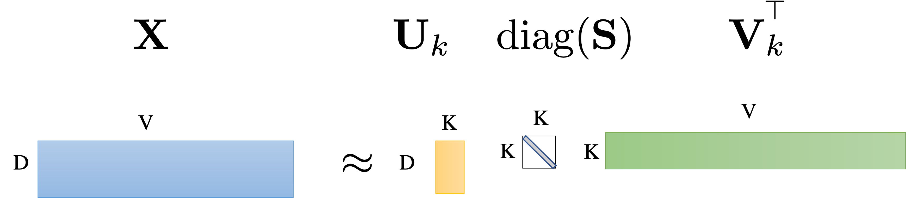

# 📚 Analisi Semantica Latente (Latent Semantic Analysis - LSA)

## 🧠 Concetti chiave

LSA (anche noto come Latent Semantic Indexing (LSI)) è una tecnica di *apprendimento non supervisionato* utilizzata nel *Natural Language Processing (NLP)* per scoprire **argomenti latenti** nascosti all’interno di grandi collezioni di testi.

L'idea è cercare di estrarre dal testo dei "concetti" (o temi) nascosti nei documenti e rappresentare questi temi come combinazione lineare delle parole nel vocabolario. Come ad esempio:

$$
\text{DBMS} = \text{data} \cdot 0.8 + \text{system} \cdot 0.7 + \text{server} \cdot 0.6 
$$

dove:
- DBMS è un concetto latente
- data, system e server sono parole del vocabolario
- $0.8, 0.7, 0.6$ sono i pesi che rappresentano la relazione tra questi tre termini e il concetto latente.

## 🧾 Matrice termine-documento

Sia $\mathbf{X} \in \mathbb{R}^{|D| \times |V|}$ una matrice termine-documento o una matrice TF-IDF calcolata a partire da un corpus.

Dove:

- $|D|$: numero di documenti
- $|V|$: dimensione del vocabolario (numero di termini distinti)

Ogni elemento $x_{ij}$ di $\mathbf{X}$ rappresenta l’importanza del termine $j$ nel documento $i$.

### 📌 La matrice $\mathbf{X}$ cattura:
- Relazioni **termine vs documento**: quanto è rappresentativo un termine in un documento.
- Relazioni **termine vs termine**: se due termini co-occorrono nei documenti.
- Relazioni **documento vs documento**: similarità semantica tra documenti.
## 🧠 Idea chiave n.1

> **Esistono $k$ argomenti latenti nascosti nella matrice $\mathbf{X}$, che vogliamo scoprire.**

Questi argomenti non sono osservabili direttamente, ma possono emergere come combinazioni lineari di parole e documenti attraverso l'SVD.
## 🔍 Idea chiave n.2

> **Non considerare $\mathbf{X}$ solo come dati grezzi: decompone la matrice in componenti strutturate.**

La decomposizione serve per **estrarre informazione strutturale** e ridurre la dimensionalità mantenendo le componenti principali.

## 🧮 Decomposizione con SVD

La decomposizione ai valori singolari è:

$$
\mathbf{X} = \mathbf{U} \mathbf{S} \mathbf{V}^\top
$$

dove:

- $\mathbf{U} \in \mathbb{R}^{|D| \times |D|}$: **matrice dei documenti**, ortonormale, ci dice quanto ogni documento è correlato con gli altri.
- $\mathbf{S} \in \mathbb{R}^{|D| \times |V|}$: **matrice diagonale** dei valori singolari (importanza degli assi) di $\mathbf{X}$.
- $\mathbf{V} \in \mathbb{R}^{|V| \times |V|}$: **matrice dei termini**, ortonormale, ci dice quanto ogni termine è correlato con gli altri.

Ma ovviamente, in questo modo, stiamo mantenendo **tutta l'informazione originale**, inclusi rumore e ridondanza. Questo accade perché, in assenza di riduzione, stiamo di fatto assegnando **un asse tematico** distinto a ogni documento e a ogni parola, senza generalizzare o cogliere **strutture comuni latenti**. L'idea dell'LSA è invece quella di **approssimare $\mathbf{X}$** mantenendo solo le componenti più rilevanti.

## ✂️ Approssimazione a rango ridotto (Truncated SVD)

Spesso $\mathbf{X}$ è molto grande. Usiamo una versione **troncata**:

$$
\mathbf{X} \approx \mathbf{U}_k \mathbf{S}_k \mathbf{V}_k^\top
$$

dove:

- $k \ll \min(|D|, |V|)$
- $\mathbf{U}_k \in \mathbb{R}^{|D| \times k}$
- $\mathbf{S}_k \in \mathbb{R}^{k \times k}$
- $\mathbf{V}_k \in \mathbb{R}^{|V| \times k}$

In questo modo otteniamo:

- **Vettori documenti** proiettati in $\mathbb{R}^k$, tramite $\mathbf{U}_k \mathbf{S}_k$
- **Vettori termini** proiettati in $\mathbb{R}^k$, tramite $\mathbf{V}_k \mathbf{S}_k$

### 🔒 Vincoli:

$$
\begin{aligned}
&\min_{\mathbf{U_k}, \mathbf{S_k}, \mathbf{V_k}} \|\mathbf{X} - \mathbf{U_k S_k V_k}^\top\|_F \\
&\text{s.t. } \mathbf{U_k}^\top \mathbf{U_k} = \mathbf{I_k}, \quad \mathbf{V_k}^\top \mathbf{V_k} = \mathbf{I_k} \\
&\mathbf{S_k} = \operatorname{diag}(\sigma_1, \sigma_2, \dots, \sigma_r) \quad \text{con } \sigma_1 \geq \sigma_2 \geq \dots \geq \sigma_k \geq 0
\end{aligned}
$$

- $\|\cdot\|_F$: norma di Frobenius (somma dei quadrati di tutti gli elementi della matrice)
- I vincoli garantiscono che $\mathbf{U}_k$ e $\mathbf{V}_k$ siano **matrici ortonormali**
- I $\sigma_i$ (valori singolari) sono **sempre reali e non negativi**.

## 📌 Interpretazione semantica

- Ogni **colonna di $\mathbf{V}_k$** rappresenta un *argomento latente*, ovvero una combinazione di termini che tende a comparire insieme nei documenti. Ogni riga di $\mathbf{V}_k$ descrive un termine secondo la sua affinità con questi argomenti latenti.
- Ogni **riga di $\mathbf{U}_k$** descrive un documento secondo la sua affinità con questi argomenti latenti. Ogni colonna di $\mathbf{U}_k$ rappresenta un documento secondo la sua affinità con questi argomenti latenti.
- La matrice $\mathbf{S}_k$ scala ciascun asse latente in base alla sua **importanza** (varianza spiegata).

## 🎯 Perché funziona?

- I **primi $k$ valori singolari** $\sigma_1, \dots, \sigma_k$ catturano **la maggior parte dell’informazione semantica** presente in $\mathbf{X}$.
- I valori successivi rappresentano spesso **rumore** (parole rare, anomalie, incoerenze).
- La proiezione in $\mathbb{R}^k$ consente di cogliere **relazioni latenti** tra termini e documenti, anche se non co-occorrono esplicitamente.
- Questo processo prende il nome di **riduzione dimensionale semantica**: migliora l’analisi mantenendo solo le componenti significative.

## 🔽 Riduzione della dimensionalità: Proiezione di un documento

Dato un documento $\mathbf{d} \in \mathbb{R}^{|V|}$ nello spazio originale dei termini:

$$ 
\mathbf{d}_k = \underbrace{\mathbf{V}_k^\top}_{k \times |V|} \underbrace{\mathbf{d}}_{|V| \times 1} \in \mathbb{R}^k
$$

- Stiamo **proiettando $\mathbf{d}$ nello spazio latente** generato da SVD.
- Questo spazio ha dimensione $k$, dove $k$ è scelto per catturare solo le direzioni semantiche più rilevanti.
- Il vettore risultante $\mathbf{d}_k$ descrive il documento $\mathbf{d}$ secondo la sua affinità con questi argomenti latenti.
- Stiamo praticamente riscrivendo $\mathbf{d}$ nel nuovo spazio latente, mantenendo solo le componenti significative.

## 🧠 Perché usare la SVD?

La SVD permette di scomporre la matrice $\mathbf{X}$ come somma di **matrici di rango 1**, pesate dai valori singolari. In particolare:

$$
\mathbf{X} = \sum_{i=1}^r \sigma_i \mathbf{u}_i \mathbf{v}_i^\top
$$

dove:

- $r = \operatorname{rank}(\mathbf{X})$
- $\sigma_i$ sono i valori singolari ordinati $\sigma_1 \geq \sigma_2 \geq \dots \geq \sigma_r \geq 0$
- $\mathbf{u}_i$ è la $i$-esima colonna di $\mathbf{U}$
- $\mathbf{v}_i$ è la $i$-esima colonna di $\mathbf{V}$

Questa somma rappresenta **la ricostruzione esatta** di $\mathbf{X}$ come somma di componenti **semplici ma strutturate**.

### ✂️ Approssimazione con i primi $k$ termini

Per ottenere un’approssimazione di rango ridotto, **manteniamo solo i primi $k$ termini**:

$$
\mathbf{X}_k = \sum_{i=1}^k \sigma_i \mathbf{u}_i \mathbf{v}_i^\top
$$

Questa $\mathbf{X}_k$ è:

- La **migliore approssimazione di rango $k$** della matrice $\mathbf{X}$ (in termini di norma di Frobenius)
- Una versione **compressa e semanticamente significativa** della matrice originale
- Ideale per eliminare rumore e migliorare generalizzazione

In sintesi, l’SVD ci consente di rappresentare $\mathbf{X}$ come una somma pesata di “concetti latenti” $\mathbf{u}_i \mathbf{v}_i^\top$, e di mantenerne solo i più importanti per l’analisi.

## 🧭 Interpretazione geometrica

La SVD può essere vista come una **pipeline geometrica**:

$$
\mathbf{A}\mathbf{x} = \mathbf{U}(\mathbf{S}(\mathbf{V}^\top \mathbf{x}))
$$

| Fase         | Operazione               |
|--------------|--------------------------|
| 1️⃣ Rotazione | $\mathbf{V}^\top$        |
| 2️⃣ Scalatura | $\mathbf{S}$            |
| 3️⃣ Rotazione | $\mathbf{U}$            |

- Le **componenti principali** (valori singolari) indicano **quanto contribuisce ogni direzione**.
- La **scalatura + rotazioni** preserva struttura ma elimina ridondanza.

## ⚠️ Limiti di LSA

Nonostante l'efficacia dell'LSA nella scoperta di relazioni semantiche latenti, presenta alcune **limitazioni importanti**:

- **Assunzione di linearità**: LSA rappresenta concetti come combinazioni lineari di termini, ma molte relazioni linguistiche reali sono non lineari e contestuali.
- **Incapacità di catturare la polisemia**: Un termine con più significati (es. "banca") viene rappresentato da un unico vettore, confondendo i contesti.
- **Non considera l’ordine delle parole**: Poiché la matrice termine-documento ignora la sequenza, LSA perde tutte le informazioni sintattiche.
- **Scelta di $k$ non banale**: Determinare il numero ottimale di concetti latenti è un compromesso tra generalizzazione e perdita di informazione.
- **Computazionalmente costoso**: La decomposizione SVD su matrici molto grandi può richiedere notevoli risorse computazionali.
- **Modello statico**: Una volta calcolata la SVD, aggiungere nuovi documenti richiede di ricalcolare tutto da capo.

## ✅ Conclusioni

L'Analisi Semantica Latente (LSA) è stata una delle prime tecniche efficaci per **estrarre strutture semantiche latenti** da grandi collezioni testuali, e ha influenzato fortemente lo sviluppo successivo nel campo del NLP.

Punti chiave:

- Riduce la dimensionalità e il rumore semantico attraverso la SVD.
- Cattura similarità concettuali tra parole e documenti anche in assenza di corrispondenza esplicita.
- È utile per attività come clustering, retrieval semantico e visualizzazione.

Tuttavia, le sue limitazioni l'hanno resa meno centrale con l’avvento di **modelli distribuiti e contestuali** più avanzati, come Word2Vec, GloVe e BERT. LSA resta comunque una base teorica utile per comprendere come si può passare da rappresentazioni sparse a rappresentazioni semantiche dense.

## 🔗 Argomenti Correlati

- **TF-IDF**: Metodo per ponderare l'importanza dei termini prima dell'applicazione dell'LSA.
- **PCA (Principal Component Analysis)**: Tecnica affine alla SVD per la riduzione dimensionale.
- **NMF (Non-negative Matrix Factorization)**: Alternativa a LSA che impone vincoli di non negatività.
- **Word2Vec / GloVe**: Modelli neurali per l'apprendimento di rappresentazioni dense delle parole.
- **BERT / Transformer**: Modelli basati su contesto, in grado di gestire la polisemia e la struttura sintattica.
- **Topic Modeling (LDA)**: Approccio probabilistico per la scoperta di argomenti latenti nei documenti.