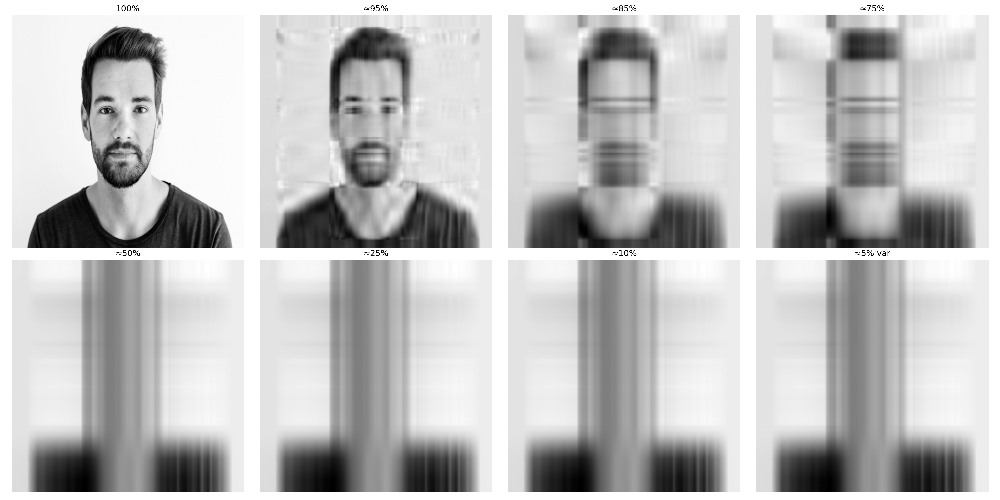
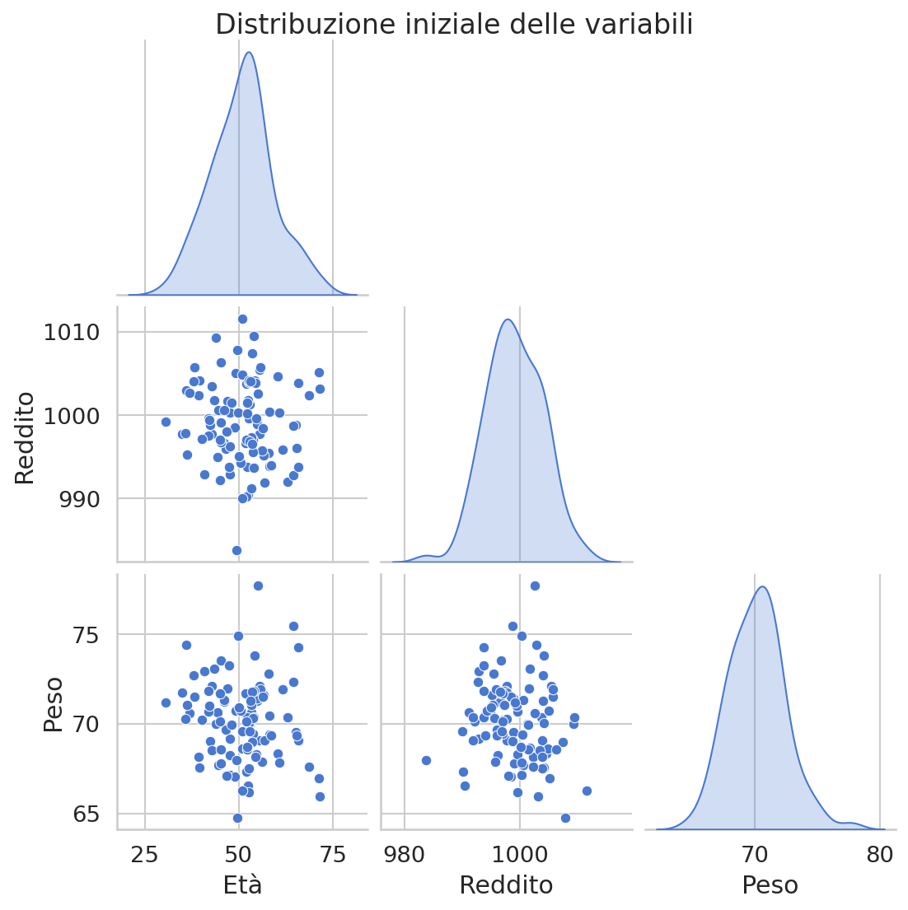
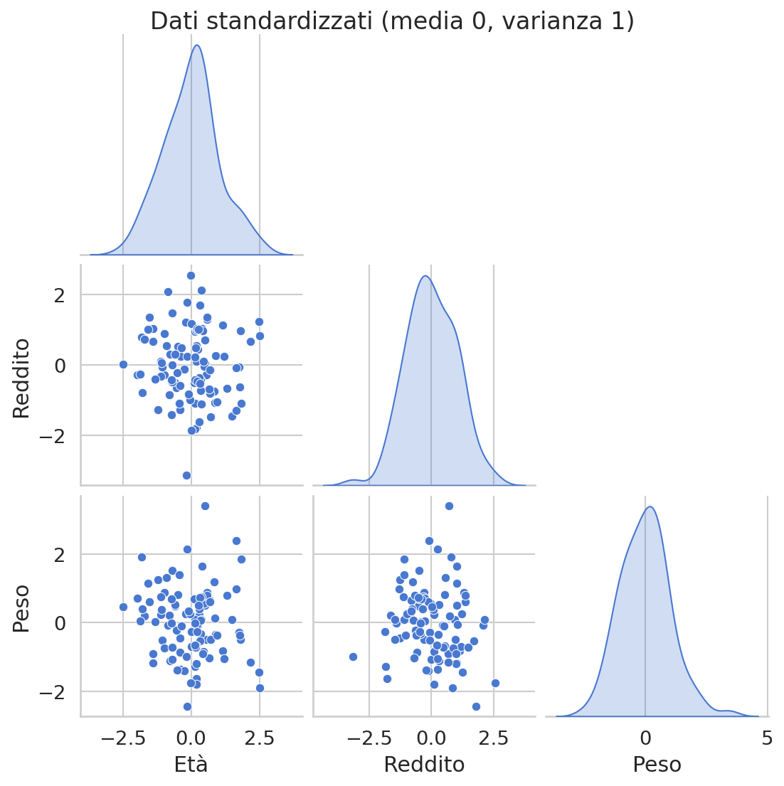
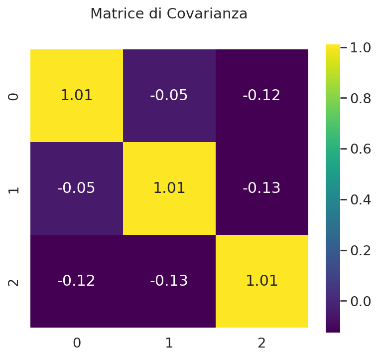

# Principal Component Analysis (PCA) - Guida Completa

## Indice
1. [Introduzione e Motivazione](#introduzione-e-motivazione)
2. [Fondamenti Matematici](#fondamenti-matematici)
3. [L'Algoritmo PCA Step-by-Step](#lalgoritmo-pca-step-by-step)
4. [Implementazione in Python](#implementazione-in-python)
5. [Interpretazione dei Risultati](#interpretazione-dei-risultati)
6. [Varianti Avanzate della PCA](#varianti-avanzate-della-pca)
7. [Applicazioni Pratiche](#applicazioni-pratiche)
8. [Vantaggi e Limitazioni](#vantaggi-e-limitazioni)

---

## Introduzione e Motivazione

La **Principal Component Analysis (PCA)** rappresenta una delle tecniche fondamentali e potenti nella cassetta degli algoritmi di machine learning. Non si tratta semplicemente di un algoritmo per ridurre le dimensioni dei dati, ma di un vero e proprio strumento matematico che ci permette di comprendere la struttura intrinseca dei nostri dataset.

Immaginate di trovarvi di fronte a un dataset con centinaia o migliaia di variabili. Come possiamo sperare di comprendere cosa ci dicono questi dati? Come possiamo visualizzarli? Come possiamo essere sicuri che non stiamo includendo informazioni ridondanti nei nostri modelli? La PCA risponde elegantemente a tutte queste domande.

La definizione formale ci dice che la PCA è una **tecnica di riduzione della dimensionalità basata sulla feature extraction**, utilizzata per comprimere i dati preservando la maggior parte delle informazioni rilevanti. Ma cosa significa davvero questo in termini pratici?

### L'Idea Centrale

L'obiettivo principale della PCA è cristallino nella sua semplicità matematica, eppure profondo nelle sue implicazioni:

> **Trovare una rappresentazione dello spazio originale dei dati in un sistema di coordinate trasformato, chiamato "componenti principali", che massimizzi la varianza (informazione) dei dati.**

Questa definizione nasconde un'intuizione geometrica bellissima. I nostri dati, quando hanno molte dimensioni, spesso non "riempiono" tutto lo spazio disponibile in modo uniforme. Invece, tendono a concentrarsi lungo certe direzioni specifiche. La PCA identifica proprio queste direzioni - quelle lungo cui i dati si "allungano" di più, quelle che catturano la maggior parte della variabilità.

### Connessione con la Manifold Hypothesis

La PCA è strettamente collegata a un'idea fondamentale nel machine learning: la **[[Manifold Hypothesis]]**. Questa ipotesi suggerisce che i dati ad alta dimensionalità che osserviamo nel mondo reale in realtà "vivono" su una superficie (manifold) di dimensionalità molto più bassa immersa nello spazio ad alta dimensione.

Pensate alle immagini di volti umani. Ogni immagine 64x64 pixel è tecnicamente un punto in uno spazio a 4096 dimensioni. Tuttavia, non tutti i possibili punti in questo spazio rappresentano volti realistici - solo una piccolissima frazione lo fa. I volti umani "vivono" su un manifold di dimensionalità molto più bassa. La PCA, pur essendo limitata a manifold lineari, ci aiuta a trovare approssimazioni di questi spazi di dimensionalità ridotta.

#### Esempio con Immagine di Volto

# Visualizzazione PCA su un'immagine di volto

L'immagine `face_pca_levels.png` mostra la ricostruzione di un volto utilizzando la PCA con diversi livelli di varianza cumulativa:

```python
!wget -O volto.jpg https://img.freepik.com/free-photo/portrait-white-man-isolated_53876-40306.jpg?semt=ais_hybrid&w=740&q=80

import numpy as np
import matplotlib.pyplot as plt
from sklearn.decomposition import PCA
from skimage import io, color
from skimage.transform import resize

# --- Step 1: Carica immagine ---
img_path = "volto.jpg"  # sostituisci con il percorso della tua immagine
img = io.imread(img_path)

# Converti in scala di grigi se necessario
if img.ndim == 3:
    img_gray = color.rgb2gray(img)
else:
    img_gray = img.astype(float) / 255.0  # normalizza se già in scala di grigi

# Ridimensiona per semplicità (opzionale)
img_gray = resize(img_gray, (512, 512), anti_aliasing=True)

# --- Step 2: Prepara la matrice X ---
h, w = img_gray.shape
X = img_gray  # (h, w)
X_flat = X  # già in 2D: n_samples=h, n_features=w

# --- Step 3: Fit PCA completo ---
pca = PCA()
pca.fit(X_flat)

# --- Step 4: Calcola varianza cumulativa e numero componenti per livelli desiderati ---
cum_var = np.cumsum(pca.explained_variance_ratio_)
levels = [1.0, 0.95, 0.85, 0.75, 0.5, 0.25, 0.1, 0.05]  # varianza cumulativa desiderata
max_components = min(X_flat.shape)  # massimo consentito

components_for_levels = [
    min(np.searchsorted(cum_var, level) + 1, max_components)
    for level in levels
]

# --- Step 5: Ricostruisci immagine per ogni livello ---
reconstructed_images = []
for n_comp in components_for_levels:
    pca_n = PCA(n_components=n_comp)
    X_reduced = pca_n.fit_transform(X_flat)
    X_reconstructed = pca_n.inverse_transform(X_reduced)
    reconstructed_images.append(X_reconstructed)

# --- Step 6: Mostra le immagini ---
fig, axes = plt.subplots(2, 4, figsize=(20, 10))
axes = axes.flatten()

titles = ["100%", "≈95%", "≈85%", "≈75%", "≈50%", "≈25%", "≈10%", "≈5% var"]
for ax, recon, title in zip(axes, reconstructed_images, titles):
    ax.imshow(recon, cmap='gray')
    ax.set_title(title)
    ax.axis('off')

plt.tight_layout()

# Salva la figura
output_path = "face_pca_levels.png"
plt.savefig(output_path, dpi=150)
plt.show()
```



<br>

| Livello di varianza | Descrizione |
|-------------------|-------------|
| 100%               | Immagine originale |
| ≈95%               | La maggior parte delle informazioni principali è mantenuta, dettagli leggermente sfocati |
| ≈85%               | I dettagli cominciano a sparire |
| ≈75%               | Perdite visibili, immagine gravemente deformata |
| ≈50% $\geq$               | Informazioni quasi completamente perse, struttura irriconoscibile |

Questa visualizzazione permette di capire come i primi componenti principali catturino le caratteristiche più rilevanti del volto e come la PCA riduca progressivamente i dettagli mantenendo solo la varianza principale.

### Problemi Concreti che Risolve la PCA

**1. La Maledizione della Dimensionalità (Curse of Dimensionality)**
Quando il numero di dimensioni cresce, i dati diventano sempre più "sparsi" - la distanza tra punti vicini aumenta esponenzialmente. Questo rende difficile per molti algoritmi di machine learning trovare pattern significativi. La PCA ci permette di lavorare in spazi di dimensionalità ridotta dove questi problemi sono meno severi.

**2. Visualizzazione dell'Invisibile**
Come possiamo visualizzare dati che esistono in 100 dimensioni? È fisicamente impossibile. Ma se la PCA ci dice che il 95% della varianza è catturata dalle prime 2-3 componenti, possiamo creare visualizzazioni 2D o 3D che mantengono la maggior parte dell'informazione strutturale.

**3. Rumore e Informazioni Irrilevanti**
Nei dati reali, non tutte le dimensioni sono ugualmente informative. Alcune potrebbero essere principalmente rumore, errori di misurazione, o informazioni ridondanti. La PCA agisce come un filtro naturale, concentrando l'informazione significativa nei primi componenti e relegando il rumore negli ultimi.

**4. Efficienza Computazionale**
Algoritmi che richiedono tempo $O(d^3)$ dove $d$ è il numero di dimensioni possono diventare impraticabili. Ridurre $d$ da 1000 a 50 può significare la differenza tra un'analisi che richiede ore e una che richiede secondi.

**5. Multicollinearità**
Quando le variabili sono fortemente correlate tra loro, molti algoritmi statistici diventano instabili. La PCA trasforma automaticamente i dati in un insieme di variabili ortogonali (non correlate), risolvendo elegantemente questo problema.

### Intuizione Geometrica Profonda

Per comprendere veramente la PCA, è essenziale sviluppare l'intuizione geometrica. Immaginate di avere un dataset bidimensionale dove i punti formano una nuvola ellittica. L'asse maggiore dell'ellisse rappresenta la direzione di massima varianza - questa sarebbe la prima componente principale. L'asse minore, perpendicolare al primo, rappresenta la seconda componente principale.

Ora estendete questa intuizione a dimensioni superiori. In uno spazio tridimensionale, potreste avere dati che si distribuiscono principalmente lungo un piano inclinato. I primi due componenti principali definirebbero questo piano, mentre il terzo componente (perpendicolare al piano) catturerebbe la varianza residua.

Questa trasformazione di coordinate non è arbitraria - è ottimale nel senso che massimizza la varianza catturata da ogni componente, soggetto al vincolo che tutti i componenti siano ortogonali tra loro.

---

## Fondamenti Matematici

La bellezza matematica della PCA risiede nella sua elegante connessione tra algebra lineare, statistica e geometria. Per comprendere appieno come funziona, dobbiamo costruire la teoria passo dopo passo, partendo dalle fondamenta.

### Rappresentazione del Dataset

Consideriamo un dataset $D = \{\vec{x}_i\}_{i=1}^N$ dove ogni osservazione $\vec{x}_i \in \mathbb{R}^d$. Qui:
- $N$ rappresenta il numero di osservazioni (campioni, righe)
- $d$ rappresenta il numero di variabili (dimensioni, colonne)

In forma matriciale, organizziamo questi dati in una matrice $\mathbf{X}$ di dimensione $N \times d$:

$$\mathbf{X} = \begin{bmatrix}
x_{1,1} & x_{1,2} & \cdots & x_{1,d} \\
x_{2,1} & x_{2,2} & \cdots & x_{2,d} \\
\vdots & \vdots & \ddots & \vdots \\
x_{N,1} & x_{N,2} & \cdots & x_{N,d}
\end{bmatrix}$$

Ogni riga $\vec{x}_i = [x_{i,1}, x_{i,2}, \ldots, x_{i,d}]$ rappresenta un'osservazione completa, mentre ogni colonna $\mathbf{x}^{(j)} = [x_{1,j}, x_{2,j}, \ldots, x_{N,j}]^T$ rappresenta tutti i valori di una specifica variabile.

```python
import numpy as np
import pandas as pd
import seaborn as sns
import matplotlib.pyplot as plt

# Impostazioni di stile moderno
sns.set(style="whitegrid", palette="muted", font_scale=1.2)

# Generiamo un dataset di esempio
np.random.seed(42)
N, d = 100, 3  # 100 osservazioni, 3 variabili
X = np.random.randn(N, d) * np.array([10, 5, 2]) + np.array([50, 1000, 70])

# Convertiamo in DataFrame per visualizzazione
df = pd.DataFrame(X, columns=['Età', 'Reddito', 'Peso'])

# Grafico pairplot per vedere le relazioni
sns.pairplot(df, diag_kind='kde', corner=True)
plt.suptitle("Distribuzione iniziale delle variabili", y=1.02)
output_path = "pca-datat.png"
plt.savefig(output_path, dpi=150)
plt.show()
```


### Il Problema Fondamentale della Standardizzazione

Prima di procedere con l'analisi, dobbiamo affrontare un problema cruciale: le diverse variabili potrebbero essere misurate in unità completamente diverse. Pensate a un dataset che include età (anni), reddito (euro), e peso (kg). La variabile "reddito" avrà naturalmente una varianza molto maggiore semplicemente per via delle unità di misura, non necessariamente perché è più "importante" per la struttura dei dati.

#### Standardizzazione Z-score

Per ogni variabile $j \in \{1, 2, \ldots, d\}$, calcoliamo:

**Media campionaria:**
$$\mu_j = \frac{1}{N} \sum_{i=1}^N x_{i,j}$$

**Deviazione standard campionaria (con correzione di Bessel):**
$$\sigma_j = \sqrt{\frac{1}{N-1} \sum_{i=1}^N (x_{i,j} - \mu_j)^2}$$

La **[[Correzione di Bessel]]** (usando $N-1$ invece di $N$) è fondamentale per ottenere una stima non distorta della varianza della popolazione quando lavoriamo con campioni.

**Trasformazione standardizzata:**
$$z_{i,j} = \frac{x_{i,j} - \mu_j}{\sigma_j}$$

Dopo la standardizzazione, ogni variabile ha media 0 e varianza 1. Il dataset standardizzato $\mathbf{Z}$ ha la stessa struttura di $\mathbf{X}$, 

$$
Z = \begin{bmatrix}
z_{1,1} & z_{1,2} & \cdots & z_{1,d} \\
z_{2,1} & z_{2,2} & \cdots & z_{2,d} \\
\vdots & \vdots & \ddots & \vdots \\
z_{N,1} & z_{N,2} & \cdots & z_{N,d}
\end{bmatrix}
$$

ma ora tutte le variabili sono sulla stessa scala.

```python
from sklearn.preprocessing import StandardScaler

# Standardizzazione
scaler = StandardScaler()
Z = scaler.fit_transform(X)
df_z = pd.DataFrame(Z, columns=df.columns)

# Visualizzazione dopo standardizzazione
sns.pairplot(df_z, diag_kind='kde', corner=True)
plt.suptitle("Dati standardizzati (media 0, varianza 1)", y=1.02)
output_path = "pca-standardization.png"
plt.savefig(output_path, dpi=150)
plt.show()
```


### La Matrice di Covarianza: Cuore della PCA

La **[[Covarianza|matrice di covarianza]]** $\boldsymbol{\Sigma}$ è l'oggetto matematico centrale della PCA. Per il dataset standardizzato $\mathbf{Z}$, calcoliamo:

$$\boldsymbol{\Sigma} = \frac{1}{N-1} \mathbf{Z}^T \mathbf{Z}$$

Questa è una matrice $d \times d$ dove ogni elemento $\Sigma_{j,k}$ rappresenta la covarianza campionaria tra le variabili $j$ e $k$:

$$\Sigma_{j,k} = \frac{1}{N-1} \sum_{i=1}^N z_{i,j} z_{i,k}$$

#### Proprietà Fondamentali della Matrice di Covarianza

1. **Simmetria**: $\boldsymbol{\Sigma} = \boldsymbol{\Sigma}^T$, poiché $\Sigma_{j,k} = \Sigma_{k,j}$

2. **Semi-definitezza positiva**: Per ogni vettore $\mathbf{v} \in \mathbb{R}^d$, abbiamo $\mathbf{v}^T \boldsymbol{\Sigma} \mathbf{v} \geq 0$

3. **Interpretazione degli elementi**:
   - **Diagonale**: $\Sigma_{j,j} = \text{Var}(z^{(j)}) = 1$ (per dati standardizzati)
   - **Off-diagonale**: $\Sigma_{j,k} = \text{Cov}(z^{(j)}, z^{(k)}) = \text{Corr}(x^{(j)}, x^{(k)})$

Per dati standardizzati, la matrice di covarianza coincide con la **matrice di correlazione** dei dati originali.

```python
Sigma = np.cov(Z, rowvar=False)

plt.figure(figsize=(6,5))
sns.heatmap(Sigma, annot=True, fmt=".2f", cmap="viridis", square=True)
plt.title("Matrice di Covarianza", fontsize=14, pad=30)
plt.savefig("pca-covariance.png", dpi=150, bbox_inches='tight')
plt.show()
```


##### Perché la diagonale della matrice di covarianza dei dati standardizzati può essere leggermente diversa da 1?

In Python, quando calcoliamo la matrice di covarianza con `np.cov(Z, rowvar=False)`, per default viene usata la **deviazione standard campionaria non corretta (unbiased estimator)**, cioè:

$$
\text{Cov}(z_j, z_j) = \frac{1}{N-1} \sum_{i=1}^{N} (z_{i,j} - \bar{z}_j)^2
$$

- La standardizzazione di `StandardScaler` usa la deviazione standard con denominatore $N$ (popolazione), mentre  
- `np.cov` usa denominatore $N-1$ (correzione di Bessel).  

Questo piccolo disallineamento genera valori leggermente maggiori di 1 sulla diagonale, ad esempio **1.01**.  

### Il Problema degli Autovalori: Dove Nasce la PCA

Il cuore matematico della PCA è la risoluzione del problema agli autovalori per la matrice di covarianza:

$$\boldsymbol{\Sigma} \mathbf{v}_j = \lambda_j \mathbf{v}_j$$

dove $\lambda_j$ sono gli **autovalori** e $\mathbf{v}_j$ sono i corrispondenti **autovettori**.

#### Perché Questo Problema È Cruciale?

Gli autovettori della matrice di covarianza hanno un'interpretazione geometrica profonda:
- **Gli autovettori** definiscono le direzioni principali di variazione nei dati
- **Gli autovalori** misurano la quantità di varianza lungo ciascuna direzione

#### Derivazione Matematica Dettagliata

Per risolvere il problema degli autovalori, cerchiamo i valori $\lambda$ per cui esiste un vettore non nullo $\mathbf{v}$ tale che:

$$\boldsymbol{\Sigma} \mathbf{v} = \lambda \mathbf{v}$$

Riscrivendo:
$$(\boldsymbol{\Sigma} - \lambda \mathbf{I}) \mathbf{v} = \mathbf{0}$$

Per ottenere una soluzione non banale ($\mathbf{v} \neq \mathbf{0}$), la matrice $(\boldsymbol{\Sigma} - \lambda \mathbf{I})$ deve essere singolare (non invertibile):

$$\det(\boldsymbol{\Sigma} - \lambda \mathbf{I}) = 0$$

Questa equazione, chiamata **equazione caratteristica**, è un polinomio di grado $d$ in $\lambda$, quindi ammette al massimo $d$ soluzioni reali (che sono esattamente $d$ per matrici simmetriche).

#### Il Teorema Spettrale

Poiché $\boldsymbol{\Sigma}$ è simmetrica, il **Teorema Spettrale** garantisce che:

1. Tutti gli autovalori sono reali: $\lambda_1, \lambda_2, \ldots, \lambda_d \in \mathbb{R}$
2. Gli autovettori corrispondenti ad autovalori distinti sono ortogonali
3. Esiste una base ortonormale di autovettori

Possiamo quindi scrivere la decomposizione spettrale:
$$\boldsymbol{\Sigma} = \mathbf{W} \boldsymbol{\Lambda} \mathbf{W}^T$$

dove:
- $\mathbf{W} = [\mathbf{w}_1, \mathbf{w}_2, \ldots, \mathbf{w}_d]$ è la matrice degli autovettori ortonormali
- $\boldsymbol{\Lambda} = \text{diag}(\lambda_1, \lambda_2, \ldots, \lambda_d)$ con $\lambda_1 \geq \lambda_2 \geq \ldots \geq \lambda_d \geq 0$

### Connessione Profonda con la [[Singular Value Decomposition]]

Un approccio numericamente più stabile per calcolare la PCA utilizza la **Singular Value Decomposition (SVD)** direttamente sulla matrice centrata dei dati.

Per la matrice centrata $\mathbf{Z}$ (di dimensione $N \times d$), la SVD è:
$$\mathbf{Z} = \mathbf{U} \boldsymbol{\Sigma}_{SVD} \mathbf{V}^T$$

dove:
- $\mathbf{U}$ è una matrice $N \times \min(N,d)$ ortogonale
- $\boldsymbol{\Sigma}_{SVD}$ è una matrice diagonale $\min(N,d) \times \min(N,d)$ con valori singolari $\sigma_1 \geq \sigma_2 \geq \ldots \geq 0$
- $\mathbf{V}$ è una matrice $d \times d$ ortogonale

#### La Connessione Magica

La matrice di covarianza può essere espressa usando la SVD:
$$\boldsymbol{\Sigma} = \frac{1}{N-1} \mathbf{Z}^T \mathbf{Z} = \frac{1}{N-1} \mathbf{V} \boldsymbol{\Sigma}_{SVD}^2 \mathbf{V}^T$$

Questo rivela che:
- **I componenti principali sono le colonne di $\mathbf{V}$**: $\mathbf{w}_j = \mathbf{v}_j$
- **Gli autovalori sono correlati ai valori singolari**: $\lambda_j = \frac{\sigma_j^2}{N-1}$

### Interpretazione Geometrica dell'Algebra

Ogni autovettore $\mathbf{w}_j$ definisce una direzione nello spazio originale delle variabili. L'autovalore $\lambda_j$ ci dice quanto i dati si "allungano" lungo quella direzione.

- **Autovalore grande**: I dati hanno molta variabilità lungo questa direzione
- **Autovalore piccolo**: I dati sono "compressi" lungo questa direzione
- **Autovalore zero**: I dati giacciono esattamente su un iperpiano perpendicolare a questa direzione

La somma di tutti gli autovalori è uguale alla varianza totale del dataset:
$$\sum_{j=1}^d \lambda_j = \text{tr}(\boldsymbol{\Sigma}) = \sum_{j=1}^d \text{Var}(z^{(j)}) = d$$

(per dati standardizzati, dove ogni variabile ha varianza 1).

---

## L'Algoritmo PCA Step-by-Step

Dopo aver costruito le fondamenta matematiche, possiamo ora descrivere l'algoritmo PCA in modo rigoroso e completo. Ogni passaggio ha una giustificazione matematica precisa e un significato geometrico intuitivo.

### Input e Output dell'Algoritmo

**Input:**
- Matrice dati $\mathbf{X}$ di dimensione $N \times d$ (N osservazioni, d variabili)
- Numero di componenti desiderato $k \leq d$

**Output:**
- Matrice dei componenti principali $\mathbf{W}_k$ di dimensione $d \times k$
- Dati proiettati $\mathbf{Z}_{PCA}$ di dimensione $N \times k$
- Autovalori $\boldsymbol{\lambda} = [\lambda_1, \lambda_2, \ldots, \lambda_k]$
- Informazioni per la ricostruzione (medie, deviazioni standard)

### Algoritmo Dettagliato

#### Step 1: Standardizzazione del Dataset

```
Per ogni variabile j = 1, 2, ..., d:
    Calcola la media: μⱼ = (1/N) Σᵢ₌₁ᴺ xᵢⱼ
    Calcola la dev. std: σⱼ = √[(1/(N-1)) Σᵢ₌₁ᴺ (xᵢⱼ - μⱼ)²]

Per ogni osservazione i = 1, 2, ..., N e variabile j = 1, 2, ..., d:
    Standardizza: zᵢⱼ = (xᵢⱼ - μⱼ) / σⱼ
```

**Perché questo step?** La standardizzazione assicura che:
1. Tutte le variabili abbiano uguale "peso" nel calcolo della PCA
2. L'algoritmo non sia dominato da variabili con scale numeriche maggiori
3. I risultati siano invarianti rispetto alle unità di misura

**Output di questo step:** Matrice standardizzata $\mathbf{Z}$ e vettori di medie $\boldsymbol{\mu}$ e deviazioni standard $\boldsymbol{\sigma}$.

#### Step 2: Calcolo della Matrice di Covarianza

```
Calcola la matrice di covarianza: Σ = (1/(N-1)) Z^T Z
```

**Interpretazione matematica:** Questa operazione calcola tutte le covarianze a coppie tra le variabili. L'elemento $\Sigma_{jk}$ rappresenta quanto le variabili $j$ e $k$ tendono a variare insieme.

**Interpretazione geometrica:** La matrice di covarianza codifica la "forma" della nuvola di punti nello spazio multidimensionale. Se immaginassimo i dati come un ellissoide multidimensionale, $\boldsymbol{\Sigma}$ ne descriverebbe la forma e l'orientamento.

#### Step 3: Decomposizione agli Autovalori

```
Risolvi il problema agli autovalori: Σwⱼ = λⱼwⱼ
Ottieni autovalori: λ₁, λ₂, ..., λₑ
Ottieni autovettori: w₁, w₂, ..., wₑ
```

**Metodi numerici:** In pratica, questo step viene eseguito usando algoritmi numerici ottimizzati:
- **Metodo diretto**: Decomposizione spettrale di $\boldsymbol{\Sigma}$
- **Metodo SVD**: SVD su $\mathbf{Z}$ (più stabile numericamente)

**Perché la SVD è preferibile?** 
1. **Stabilità numerica**: Evita di calcolare esplicitamente $\mathbf{Z}^T\mathbf{Z}$, che può amplificare errori numerici
2. **Efficienza**: Per $N \ll d$, la SVD può essere più veloce
3. **Robustezza**: Meno sensibile a condizionamento numerico della matrice

#### Step 4: Ordinamento e Selezione

```
Ordina autovalori in ordine decrescente: λ₁ ≥ λ₂ ≥ ... ≥ λₑ ≥ 0
Riordina autovettori di conseguenza: w₁, w₂, ..., wₑ
Seleziona i primi k autovettori: W_k = [w₁, w₂, ..., wₖ]
```

**Criterio di ordinamento:** Ordinare per autovalori decrescenti assicura che selezioniamo le direzioni di massima varianza. Questo è il principio ottimalità della PCA.

**Metodi per scegliere k:**
1. **Soglia di varianza**: Scegli $k$ tale che $\frac{\sum_{j=1}^k \lambda_j}{\sum_{j=1}^d \lambda_j} \geq \alpha$ (es. $\alpha = 0.95$)
2. **Criterio del gomito**: Cerca il "gomito" nel grafico degli autovalori
3. **Criterio di Kaiser**: Mantieni solo $\lambda_j > 1$ (per dati standardizzati)
4. **Cross-validation**: Testa diverse k su un task downstream

#### Step 5: Proiezione dei Dati

```
Proietta i dati: Z_PCA = Z × W_k
```

**Significato matematico:** Questa moltiplicazione matriciale calcola le coordinate di ogni punto dati nel nuovo sistema di riferimento definito dai componenti principali.

**Interpretazione geometrica:** Stiamo "ruotando" il sistema di coordinate originale in modo che i nuovi assi siano allineati con le direzioni di massima varianza. Ogni colonna di $\mathbf{Z}_{PCA}$ rappresenta le coordinate dei dati lungo un componente principale.

#### Perché Questa Proiezione Funziona?

La proiezione $\mathbf{Z} \mathbf{W}_k$ è ottimale in diversi sensi matematici:

1. **Massimizzazione della Varianza**: I primi $k$ componenti catturano il massimo possibile di varianza totale che può essere catturata da $k$ direzioni ortogonali.

2. **Minimizzazione dell'Errore di Ricostruzione**: Se dovessimo ricostruire i dati originali usando solo $k$ componenti, questa scelta minimizza l'errore quadratico medio di ricostruzione.

3. **Decorrelazione**: I componenti principali sono ortogonali, quindi le nuove coordinate sono non correlate.

#### Step 6: Ricostruzione (Opzionale)

```
Ricostruisci nello spazio standardizzato: Z_rec = Z_PCA × W_k^T
Ricostruisci nello spazio originale: X_rec = Z_rec ⊙ σ + μ
```

dove $⊙$ indica la moltiplicazione elemento per elemento (broadcasting) e l'addizione si applica lungo le colonne.

**Errore di Ricostruzione:**
$$\text{MSE} = \frac{1}{Nd} \|\mathbf{Z} - \mathbf{Z}_{rec}\|_F^2 = \frac{1}{Nd} \sum_{j=k+1}^d \lambda_j$$

Questo errore dipende solo dagli autovalori "scartati", confermando che la PCA è ottimale per l'approssimazione a rango ridotto.

### Complessità Computazionale

- **Standardizzazione**: $O(Nd)$
- **Matrice di covarianza**: $O(Nd^2)$
- **Decomposizione agli autovalori**: $O(d^3)$
- **Proiezione**: $O(Ndk)$

**Complessità totale**: $O(Nd^2 + d^3)$

Per $N \ll d$, è più efficiente usare la SVD direttamente su $\mathbf{Z}$, con complessità $O(N^2d + N^3)$.

### Varianti Algoritmiche

#### PCA via SVD (Numericamente Stabile)

```python
def pca_via_svd(Z, n_components):
    """
    PCA calcolata tramite SVD - più stabile numericamente
    """
    # SVD della matrice centrata
    U, s, Vt = np.linalg.svd(Z, full_matrices=False)
    
    # I componenti principali sono le righe di Vt (colonne di V)
    components = Vt[:n_components]
    
    # Autovalori dalla SVD
    explained_variance = (s[:n_components] ** 2) / (Z.shape[0] - 1)
    
    # Proiezione
    X_transformed = Z @ components.T
    
    return components, explained_variance, X_transformed
```

#### PCA Incrementale (Per Grandi Dataset)

Quando $N$ è molto grande, possiamo usare algoritmi incrementali che processano i dati a batch:

```
Inizializza: μ = 0, Σ = 0, n_seen = 0

Per ogni batch B:
    Aggiorna statistiche incrementalmente
    Aggiorna decomposizione agli autovalori
```

Questo approccio ha complessità di memoria $O(d^2)$ invece di $O(Nd)$.

### Considerazioni Pratiche

1. **Centralizzazione vs Standardizzazione**: 
   - Se le variabili hanno scale simili, può bastare centrare (sottrarre la media)
   - Se le scale differiscono significativamente, la standardizzazione è essenziale

2. **Gestione dei Valori Mancanti**:
   - **Rimozione completa**: Elimina osservazioni con valori mancanti
   - **Imputazione**: Sostituisci valori mancanti prima della PCA
   - **PCA probabilistica**: Gestisce valori mancanti direttamente

3. **Robustezza agli Outlier**:
   - La PCA standard è sensibile agli outlier
   - Alternative: Robust PCA, PCA con outlier detection preliminare

Il risultato di questo algoritmo è una trasformazione ottimale che preserva il massimo dell'informazione (varianza) nei primi $k$ componenti, fornendo una rappresentazione compatta ed efficace dei dati originali.

---

## Implementazione in Python

Implementiamo ora la PCA da zero e con scikit-learn, esplorando ogni aspetto pratico con esempi dettagliati e visualizzazioni illuminanti.

### Setup e Librerie Fondamentali

```python
import numpy as np
import matplotlib.pyplot as plt
import seaborn as sns
from sklearn.decomposition import PCA
from sklearn.preprocessing import StandardScaler
from sklearn.datasets import load_iris, make_classification, fetch_olivetti_faces
import pandas as pd
from mpl_toolkits.mplot3d import Axes3D

# Configurazione per plot più belli e informativi
plt.style.use('seaborn-v0_8')
sns.set_palette("husl")
plt.rcParams['figure.dpi'] = 100
plt.rcParams['savefig.dpi'] = 300

# Per riproducibilità
np.random.seed(42)
```

### Implementazione Manuale Completa

Costruiamo la PCA passo dopo passo per comprendere ogni dettaglio:

```python
def pca_from_scratch(X, n_components=None, standardize=True):
    """
    Implementazione completa della PCA da zero
    
    Parameters:
    -----------
    X : array-like, shape (n_samples, n_features)
        Matrice dei dati di input
    n_components : int, optional (default=None)
        Numero di componenti principali da mantenere
        Se None, mantiene tutti i componenti
    standardize : bool, optional (default=True)
        Se True, standardizza i dati prima della PCA
    
    Returns:
    --------
    dict con tutte le informazioni della PCA
    """
    
    X = np.asarray(X)
    n_samples, n_features = X.shape
    
    if n_components is None:
        n_components = min(n_samples - 1, n_features)
    
    print(f"🔍 ANALISI PCA - Dataset {n_samples}×{n_features}")
    print(f"📊 Componenti richiesti: {n_components}")
    print("-" * 50)
    
    # Step 1: Analisi preliminare dei dati
    print("📈 STATISTICHE ORIGINALI:")
    means_orig = np.mean(X, axis=0)
    stds_orig = np.std(X, axis=0, ddof=1)
    print(f"   Medie: min={means_orig.min():.3f}, max={means_orig.max():.3f}")
    print(f"   Std dev: min={stds_orig.min():.3f}, max={stds_orig.max():.3f}")
    
    # Step 2: Standardizzazione (se richiesta)
    if standardize:
        print("\n🎯 STANDARDIZZAZIONE:")
        # Salviamo i parametri per la ricostruzione
        means = np.mean(X, axis=0)
        stds = np.std(X, axis=0, ddof=1)
        
        # Evitiamo divisioni per zero
        stds[stds == 0] = 1
        
        X_processed = (X - means) / stds
        print(f"   ✓ Dati standardizzati (media≈0, std≈1)")
        print(f"   Check - Media post-std: {np.mean(X_processed, axis=0).max():.6f}")
        print(f"   Check - Std post-std: {np.std(X_processed, axis=0, ddof=1).max():.6f}")
    else:
        print("\n🎯 SOLO CENTRAGGIO (no standardizzazione):")
        means = np.mean(X, axis=0)
        stds = np.ones(n_features)  # Per mantenere compatibilità
        X_processed = X - means
        print(f"   ✓ Dati centrati (media≈0)")
        print(f"   Check - Media post-centraggio: {np.mean(X_processed, axis=0).max():.6f}")
    
    # Step 3: Calcolo matrice di covarianza
    print(f"\n🔢 MATRICE DI COVARIANZA:")
    cov_matrix = np.cov(X_processed, rowvar=False, ddof=1)
    print(f"   Dimensione: {cov_matrix.shape}")
    print(f"   Traccia (varianza totale): {np.trace(cov_matrix):.3f}")
    print(f"   Determinante: {np.linalg.det(cov_matrix):.6f}")
    
    # Verifica proprietà della matrice di covarianza
    is_symmetric = np.allclose(cov_matrix, cov_matrix.T)
    eigenvals_check = np.linalg.eigvals(cov_matrix)
    is_positive_semidefinite = np.all(eigenvals_check >= -1e-10)
    
    print(f"   Simmetrica: {is_symmetric}")
    print(f"   Semi-definita positiva: {is_positive_semidefinite}")
    
    # Step 4: Decomposizione agli autovalori
    print(f"\n🎯 DECOMPOSIZIONE AGLI AUTOVALORI:")
    eigenvalues, eigenvectors = np.linalg.eigh(cov_matrix)
    
    # Ordina in ordine decrescente
    idx_sorted = np.argsort(eigenvalues)[::-1]
    eigenvalues = eigenvalues[idx_sorted]
    eigenvectors = eigenvectors[:, idx_sorted]
    
    print(f"   Autovalori calcolati: {len(eigenvalues)}")
    print(f"   Range autovalori: [{eigenvalues.min():.6f}, {eigenvalues.max():.3f}]")
    
    # Verifica ortogonalità degli autovettori
    orthogonality_check = np.max(np.abs(eigenvectors.T @ eigenvectors - np.eye(n_features)))
    print(f"   Check ortogonalità autovettori: {orthogonality_check:.10f}")
    
    # Step 5: Selezione componenti e calcolo varianza spiegata
    print(f"\n📊 ANALISI VARIANZA SPIEGATA:")
    total_variance = np.sum(eigenvalues)
    explained_variance_ratio = eigenvalues / total_variance
    cumulative_variance_ratio = np.cumsum(explained_variance_ratio)
    
    print(f"   Varianza totale: {total_variance:.3f}")
    for i in range(min(10, len(eigenvalues))):
        print(f"   PC{i+1}: λ={eigenvalues[i]:.4f}, "
              f"var={explained_variance_ratio[i]:.3f} ({explained_variance_ratio[i]*100:.1f}%), "
              f"cum={cumulative_variance_ratio[i]:.3f} ({cumulative_variance_ratio[i]*100:.1f}%)")
    
    # Seleziona i primi n_components
    eigenvalues_selected = eigenvalues[:n_components]
    eigenvectors_selected = eigenvectors[:, :n_components]
    
    print(f"\n🎯 COMPONENTI SELEZIONATI:")
    print(f"   Numero: {n_components}")
    print(f"   Varianza catturata: {cumulative_variance_ratio[n_components-1]:.3f} "
          f"({cumulative_variance_ratio[n_components-1]*100:.1f}%)")
    
    # Step 6: Proiezione dei dati
    print(f"\n🔄 PROIEZIONE DEI DATI:")
    X_transformed = X_processed @ eigenvectors_selected
    print(f"   Dati originali: {X_processed.shape}")
    print(f"   Dati trasformati: {X_transformed.shape}")
    print(f"   Check - Media componenti: {np.mean(X_transformed, axis=0).max():.6f}")
    
    # Verifica che le componenti sono decorrelate
    transformed_cov = np.cov(X_transformed, rowvar=False, ddof=1)
    max_off_diagonal = np.max(np.abs(transformed_cov - np.diag(np.diag(transformed_cov))))
    print(f"   Check decorrelazione: max correlazione = {max_off_diagonal:.10f}")
    
    # Step 7: Calcolo dell'errore di ricostruzione (se k < d)
    if n_components < n_features:
        print(f"\n🔧 ERRORE DI RICOSTRUZIONE:")
        X_reconstructed_std = X_transformed @ eigenvectors_selected.T
        reconstruction_error = np.mean((X_processed - X_reconstructed_std)**2)
        theoretical_error = np.sum(eigenvalues[n_components:]) / (n_samples * n_features)
        
        print(f"   MSE empirico: {reconstruction_error:.6f}")
        print(f"   MSE teorico: {theoretical_error:.6f}")
        print(f"   Differenza: {abs(reconstruction_error - theoretical_error):.10f}")
        
        # Ricostruzione nello spazio originale
        if standardize:
            X_reconstructed = X_reconstructed_std * stds + means
        else:
            X_reconstructed = X_reconstructed_std + means
    else:
        X_reconstructed = X.copy()
        reconstruction_error = 0.0
    
    print(f"\n✅ ANALISI PCA COMPLETATA")
    print("=" * 50)
    
    # Prepara i risultati
    results = {
        # Dati trasformati e ricostruiti
        'X_transformed': X_transformed,
        'X_reconstructed': X_reconstructed,
        'X_standardized': X_processed,
        
        # Componenti principali
        'components': eigenvectors_selected.T,  # Convenzione scikit-learn
        'eigenvalues': eigenvalues_selected,
        'explained_variance_ratio': explained_variance_ratio[:n_components],
        'cumulative_variance_ratio': cumulative_variance_ratio[:n_components],
        
        # Parametri per trasformazioni inverse
        'means': means,
        'stds': stds,
        'standardize': standardize,
        
        # Metriche di qualità
        'reconstruction_error': reconstruction_error,
        'total_variance': total_variance,
        
        # Diagnostiche
        'all_eigenvalues': eigenvalues,
        'all_explained_variance_ratio': explained_variance_ratio,
        'cov_matrix': cov_matrix,
        'n_components': n_components,
        'n_features_original': n_features
    }
    
    return results

# Funzioni di utilità per analisi e visualizzazione
def analyze_pca_results(pca_results, feature_names=None):
    """
    Analizza e visualizza i risultati della PCA in modo completo
    """
    print("🔍 ANALISI DETTAGLIATA DEI RISULTATI PCA")
    print("=" * 60)
    
    # Estrai informazioni principali
    n_components = pca_results['n_components']
    n_features = pca_results['n_features_original']
    components = pca_results['components']
    eigenvalues = pca_results['eigenvalues']
    explained_var = pca_results['explained_variance_ratio']
    
    # Analisi dei componenti principali
    print(f"\n📊 INTERPRETAZIONE DEI COMPONENTI PRINCIPALI:")
    
    if feature_names is None:
        feature_names = [f'Feature_{i+1}' for i in range(n_features)]
    
    for i in range(n_components):
        print(f"\n🎯 COMPONENTE PRINCIPALE {i+1}:")
        print(f"   Autovalore: {eigenvalues[i]:.4f}")
        print(f"   Varianza spiegata: {explained_var[i]:.3f} ({explained_var[i]*100:.1f}%)")
        
        # Trova le feature più importanti per questo componente
        component_weights = components[i]
        abs_weights = np.abs(component_weights)
        sorted_indices = np.argsort(abs_weights)[::-1]
        
        print(f"   Feature più influenti:")
        for j in range(min(5, len(feature_names))):
            idx = sorted_indices[j]
            weight = component_weights[idx]
            print(f"     - {feature_names[idx]}: {weight:+.3f} "
                  f"({'positive' if weight > 0 else 'negative'} contribution)")
    
    # Suggerimenti per l'interpretazione
    print(f"\n💡 SUGGERIMENTI PER L'INTERPRETAZIONE:")
    if pca_results['cumulative_variance_ratio'][-1] >= 0.95:
        print(f"   ✅ Eccellente: {n_components} componenti catturano "
              f"{pca_results['cumulative_variance_ratio'][-1]*100:.1f}% della varianza")
    elif pca_results['cumulative_variance_ratio'][-1] >= 0.80:
        print(f"   ⚠️  Buono: {n_components} componenti catturano "
              f"{pca_results['cumulative_variance_ratio'][-1]*100:.1f}% della varianza")
        print(f"      Considera di aumentare il numero di componenti se necessario")
    else:
        print(f"   🔄 Attenzione: {n_components} componenti catturano solo "
              f"{pca_results['cumulative_variance_ratio'][-1]*100:.1f}% della varianza")
        print(f"      Valuta se aumentare il numero di componenti")

def plot_pca_analysis(pca_results, X_original=None, y=None, figsize=(15, 12)):
    """
    Crea una visualizzazione completa dei risultati PCA
    """
    fig = plt.figure(figsize=figsize)
    
    # Plot 1: Scree plot (Varianza spiegata per componente)
    ax1 = plt.subplot(2, 3, 1)
    n_all_components = len(pca_results['all_explained_variance_ratio'])
    components_range = range(1, min(21, n_all_components + 1))
    explained_var_plot = pca_results['all_explained_variance_ratio'][:20]
    
    plt.plot(components_range, explained_var_plot, 'bo-', linewidth=2, markersize=6)
    plt.xlabel('Numero Componente')
    plt.ylabel('Varianza Spiegata')
    plt.title('📊 Scree Plot\n(Varianza per Componente)')
    plt.grid(True, alpha=0.3)
    
    # Evidenzia i componenti selezionati
    n_selected = pca_results['n_components']
    if n_selected <= 20:
        plt.axvline(x=n_selected, color='red', linestyle='--', alpha=0.7, 
                   label=f'{n_selected} componenti selezionati')
        plt.legend()
    
    # Plot 2: Varianza cumulativa
    ax2 = plt.subplot(2, 3, 2)
    cumulative_var = np.cumsum(pca_results['all_explained_variance_ratio'])
    plt.plot(components_range, cumulative_var[:20], 'ro-', linewidth=2, markersize=6)
    plt.axhline(y=0.95, color='green', linestyle='--', alpha=0.7, label='95% varianza')
    plt.axhline(y=0.90, color='orange', linestyle='--', alpha=0.7, label='90% varianza')
    plt.xlabel('Numero Componenti')
    plt.ylabel('Varianza Cumulativa')
    plt.title('📈 Varianza Cumulativa')
    plt.grid(True, alpha=0.3)
    plt.legend()
    plt.ylim(0, 1.02)
    
    # Plot 3: Heatmap dei primi componenti principali
    ax3 = plt.subplot(2, 3, 3)
    n_components_to_show = min(5, pca_results['n_components'])
    components_for_heatmap = pca_results['components'][:n_components_to_show]
    
    im = plt.imshow(components_for_heatmap, cmap='RdBu_r', aspect='auto')
    plt.colorbar(im, ax=ax3, shrink=0.8)
    plt.xlabel('Feature Index')
    plt.ylabel('Componente Principale')
    plt.title(f'🎯 Pesi dei Primi {n_components_to_show} Componenti')
    plt.yticks(range(n_components_to_show), [f'PC{i+1}' for i in range(n_components_to_show)])
    
    # Plot 4: Distribuzione autovalori
    ax4 = plt.subplot(2, 3, 4)
    eigenvals_to_show = pca_results['all_eigenvalues'][:15]
    plt.bar(range(1, len(eigenvals_to_show) + 1), eigenvals_to_show, 
            alpha=0.7, color='skyblue', edgecolor='navy')
    plt.xlabel('Componente')
    plt.ylabel('Autovalore')
    plt.title('📊 Distribuzione Autovalori')
    plt.grid(True, alpha=0.3, axis='y')
    
    # Plot 5: Proiezione 2D (se possibile)
    if pca_results['n_components'] >= 2:
        ax5 = plt.subplot(2, 3, 5)
        X_transformed = pca_results['X_transformed']
        
        if y is not None:
            scatter = plt.scatter(X_transformed[:, 0], X_transformed[:, 1], 
                                c=y, cmap='viridis', alpha=0.7, s=50)
            plt.colorbar(scatter, ax=ax5, shrink=0.8)
            plt.title('🗺️ Proiezione PCA (Colorata per Target)')
        else:
            plt.scatter(X_transformed[:, 0], X_transformed[:, 1], 
                       alpha=0.7, s=50, color='steelblue')
            plt.title('🗺️ Proiezione PCA (Prime 2 Componenti)')
        
        plt.xlabel(f'PC1 ({pca_results["explained_variance_ratio"][0]*100:.1f}% varianza)')
        plt.ylabel(f'PC2 ({pca_results["explained_variance_ratio"][1]*100:.1f}% varianza)')
        plt.grid(True, alpha=0.3)
    
    # Plot 6: Errore di ricostruzione vs numero di componenti
    ax6 = plt.subplot(2, 3, 6)
    if X_original is not None:
        # Calcola l'errore per diversi numeri di componenti
        n_features = X_original.shape[1]
        max_components = min(15, n_features)
        reconstruction_errors = []
        
        for k in range(1, max_components + 1):
            # PCA temporanea con k componenti
            temp_pca = pca_from_scratch(X_original, n_components=k, standardize=True)
            reconstruction_errors.append(temp_pca['reconstruction_error'])
        
        plt.plot(range(1, max_components + 1), reconstruction_errors, 'go-', 
                linewidth=2, markersize=6)
        plt.xlabel('Numero Componenti')
        plt.ylabel('MSE Ricostruzione')
        plt.title('🔧 Errore di Ricostruzione')
        plt.grid(True, alpha=0.3)
        plt.yscale('log')  # Scala logaritmica per vedere meglio i dettagli
    else:
        # Se non abbiamo i dati originali, mostra la distribuzione degli autovalori scartati
        all_eigenvals = pca_results['all_eigenvalues']
        plt.bar(range(1, len(all_eigenvals) + 1), all_eigenvals, 
               alpha=0.7, color='lightcoral', edgecolor='darkred')
        plt.axvline(x=pca_results['n_components'], color='blue', linestyle='--', 
                   linewidth=2, label=f'Soglia ({pca_results["n_components"]} comp.)')
        plt.xlabel('Componente')
        plt.ylabel('Autovalore (Varianza)')
        plt.title('📉 Autovalori: Tenuti vs Scartati')
        plt.legend()
        plt.grid(True, alpha=0.3, axis='y')
    
    plt.tight_layout()
    return fig

# Esempio pratico con dataset Iris
def demo_pca_iris():
    """
    Dimostra la PCA sul famoso dataset Iris con spiegazioni dettagliate
    """
    print("🌸 DEMO PCA: DATASET IRIS")
    print("=" * 50)
    
    # Carica il dataset
    from sklearn.datasets import load_iris
    iris = load_iris()
    X, y = iris.data, iris.target
    feature_names = iris.feature_names
    target_names = iris.target_names
    
    print(f"📊 Dataset caricato:")
    print(f"   Campioni: {X.shape[0]}")
    print(f"   Feature: {X.shape[1]}")
    print(f"   Feature names: {feature_names}")
    print(f"   Classi: {len(target_names)} ({target_names})")
    
    # Analisi esplorativa preliminare
    print(f"\n🔍 ANALISI ESPLORATIVA:")
    df = pd.DataFrame(X, columns=feature_names)
    print("Statistiche descrittive:")
    print(df.describe().round(3))
    
    print(f"\nCorrelazioni tra feature:")
    correlation_matrix = df.corr()
    print(correlation_matrix.round(3))
    
    # Esegui PCA con la nostra implementazione
    print(f"\n🎯 ESECUZIONE PCA (nostra implementazione):")
    pca_results = pca_from_scratch(X, n_components=2, standardize=True)
    
    # Analisi dei risultati
    analyze_pca_results(pca_results, feature_names)
    
    # Confronta con scikit-learn
    print(f"\n🔄 CONFRONTO CON SCIKIT-LEARN:")
    scaler = StandardScaler()
    X_scaled = scaler.fit_transform(X)
    
    pca_sklearn = PCA(n_components=2)
    X_pca_sklearn = pca_sklearn.fit_transform(X_scaled)
    
    # Verifica che i risultati siano equivalenti (a meno del segno)
    diff_transformed = np.min([
        np.max(np.abs(pca_results['X_transformed'] - X_pca_sklearn)),
        np.max(np.abs(pca_results['X_transformed'] + X_pca_sklearn))
    ])
    
    print(f"   Differenza max nei dati trasformati: {diff_transformed:.10f}")
    print(f"   Varianza spiegata (nostra): {pca_results['explained_variance_ratio']}")
    print(f"   Varianza spiegata (sklearn): {pca_sklearn.explained_variance_ratio_}")
    
    # Visualizzazione completa
    fig = plot_pca_analysis(pca_results, X, y)
    plt.suptitle("🌸 Analisi PCA Completa - Dataset Iris", fontsize=16, y=0.98)
    plt.show()
    
    # Plot aggiuntivo: confronto 2D tra originale e PCA
    fig, (ax1, ax2) = plt.subplots(1, 2, figsize=(15, 6))
    
    # Plot originale (prime 2 feature)
    for i, target_name in enumerate(target_names):
        mask = y == i
        ax1.scatter(X[mask, 0], X[mask, 1], label=target_name, alpha=0.7, s=50)
    ax1.set_xlabel(feature_names[0])
    ax1.set_ylabel(feature_names[1])
    ax1.set_title('📊 Spazio Originale\n(Prime 2 Feature)')
    ax1.legend()
    ax1.grid(True, alpha=0.3)
    
    # Plot PCA
    X_transformed = pca_results['X_transformed']
    for i, target_name in enumerate(target_names):
        mask = y == i
        ax2.scatter(X_transformed[mask, 0], X_transformed[mask, 1], 
                   label=target_name, alpha=0.7, s=50)
    ax2.set_xlabel(f'PC1 ({pca_results["explained_variance_ratio"][0]*100:.1f}% var)')
    ax2.set_ylabel(f'PC2 ({pca_results["explained_variance_ratio"][1]*100:.1f}% var)')
    ax2.set_title('🎯 Spazio PCA\n(Prime 2 Componenti Principali)')
    ax2.legend()
    ax2.grid(True, alpha=0.3)
    
    plt.tight_layout()
    plt.show()
    
    return pca_results

# Test della demo
if __name__ == "__main__":
    # Esegui la demo con Iris
    iris_pca_results = demo_pca_iris()
```

### Implementazione con Scikit-Learn: Best Practices

Mentre la nostra implementazione da zero ci aiuta a capire ogni dettaglio, nella pratica scikit-learn offre implementazioni ottimizzate e numericamente stabili:

```python
from sklearn.decomposition import PCA, IncrementalPCA
from sklearn.preprocessing import StandardScaler
from sklearn.pipeline import Pipeline

def pca_with_sklearn_complete(X, n_components=None, plot_analysis=True):
    """
    Implementazione completa PCA con scikit-learn e analisi approfondita
    """
    print("🔧 PCA CON SCIKIT-LEARN - IMPLEMENTAZIONE PROFESSIONALE")
    print("=" * 60)
    
    # Step 1: Preprocessing con Pipeline
    # Un pipeline assicura che preprocessing e PCA siano applicati consistentemente
    if n_components is None:
        n_components = min(X.shape[0] - 1, X.shape[1])
    
    # Pipeline per riproducibilità e consistenza
    pca_pipeline = Pipeline([
        ('scaler', StandardScaler()),
        ('pca', PCA(n_components=n_components, random_state=42))
    ])
    
    print(f"📊 Configurazione Pipeline:")
    print(f"   Standardizzazione: StandardScaler")
    print(f"   PCA componenti: {n_components}")
    print(f"   Dataset shape: {X.shape}")
    
    # Fit e transform
    X_pca = pca_pipeline.fit_transform(X)
    pca_model = pca_pipeline.named_steps['pca']
    scaler_model = pca_pipeline.named_steps['scaler']
    
    print(f"\n✅ Trasformazione completata")
    print(f"   Output shape: {X_pca.shape}")
    print(f"   Varianza totale catturata: {pca_model.explained_variance_ratio_.sum():.3f}")
    
    # Step 2: Analisi dettagliata dei risultati
    print(f"\n📈 ANALISI COMPONENTI PRINCIPALI:")
    
    # Informazioni sui componenti
    components = pca_model.components_
    explained_variance = pca_model.explained_variance_
    explained_variance_ratio = pca_model.explained_variance_ratio_
    
    print(f"   Forma matrice componenti: {components.shape}")
    
    for i in range(min(5, n_components)):
        print(f"   PC{i+1}: λ={explained_variance[i]:.4f}, "
              f"ratio={explained_variance_ratio[i]:.3f} "
              f"({explained_variance_ratio[i]*100:.1f}%)")
    
    # Step 3: Diagnostiche avanzate
    print(f"\n🔍 DIAGNOSTICHE AVANZATE:")
    
    # Test di Kaiser (autovalori > 1 per dati standardizzati)
    kaiser_components = np.sum(explained_variance > 1.0)
    print(f"   Criterio di Kaiser: {kaiser_components} componenti (autovalori > 1)")
    
    # Analisi del "gomito" (elbow method)
    if len(explained_variance_ratio) > 3:
        # Calcola la seconda derivata per trovare il punto di gomito
        second_derivative = np.diff(explained_variance_ratio, n=2)
        elbow_candidate = np.argmax(second_derivative) + 2  # +2 per offset delle derivate
        print(f"   Punto gomito stimato: componente {elbow_candidate}")
    
    # Varianza cumulativa per diverse soglie
    cumulative_variance = np.cumsum(explained_variance_ratio)
    for threshold in [0.80, 0.90, 0.95, 0.99]:
        n_components_threshold = np.argmax(cumulative_variance >= threshold) + 1
        if cumulative_variance[n_components_threshold-1] >= threshold:
            print(f"   {threshold*100:.0f}% varianza: {n_components_threshold} componenti")
    
    # Step 4: Calcolo errore di ricostruzione
    print(f"\n🔧 ERRORE DI RICOSTRUZIONE:")
    X_reconstructed = pca_pipeline.inverse_transform(X_pca)
    
    # MSE per feature
    mse_per_feature = np.mean((X - X_reconstructed)**2, axis=0)
    mse_total = np.mean((X - X_reconstructed)**2)
    
    print(f"   MSE totale: {mse_total:.6f}")
    print(f"   MSE per feature:")
    for i, mse in enumerate(mse_per_feature):
        print(f"     Feature {i+1}: {mse:.6f}")
    
    # Errore teorico (somma degli autovalori scartati)
    if n_components < X.shape[1]:
        # Per calcolare l'errore teorico, dobbiamo fare PCA completa
        pca_full = PCA()
        X_scaled = scaler_model.transform(X)
        pca_full.fit(X_scaled)
        
        theoretical_error = np.sum(pca_full.explained_variance_[n_components:]) / X.shape[1]
        print(f"   MSE teorico: {theoretical_error:.6f}")
        print(f"   Differenza empirico-teorico: {abs(mse_total - theoretical_error):.8f}")
    
    # Step 5: Analisi della stabilità
    print(f"\n🎯 ANALISI STABILITÀ:")
    
    # Test bootstrap per valutare stabilità componenti
    n_bootstrap = 50
    n_samples = X.shape[0]
    stability_scores = []
    
    print(f"   Eseguendo {n_bootstrap} test bootstrap...")
    
    for bootstrap_iter in range(n_bootstrap):
        # Campiona con replacement
        bootstrap_indices = np.random.choice(n_samples, size=n_samples, replace=True)
        X_bootstrap = X[bootstrap_indices]
        
        # Applica PCA
        pca_bootstrap = Pipeline([
            ('scaler', StandardScaler()),
            ('pca', PCA(n_components=n_components, random_state=42))
        ])
        pca_bootstrap.fit(X_bootstrap)
        
        # Confronta i componenti principali (usando prodotto scalare)
        bootstrap_components = pca_bootstrap.named_steps['pca'].components_
        
        # Calcola similarità con componenti originali
        similarities = []
        for i in range(n_components):
            # Prodotto scalare (coseno se vettori normalizzati)
            similarity = abs(np.dot(components[i], bootstrap_components[i]))
            similarities.append(similarity)
        
        stability_scores.append(similarities)
    
    stability_scores = np.array(stability_scores)
    mean_stability = np.mean(stability_scores, axis=0)
    std_stability = np.std(stability_scores, axis=0)
    
    print(f"   Stabilità componenti principali:")
    for i in range(n_components):
        print(f"     PC{i+1}: {mean_stability[i]:.3f} ± {std_stability[i]:.3f}")
    
    # Interpretazione stabilità
    stable_components = np.sum(mean_stability > 0.7)
    print(f"   Componenti stabili (similarità > 0.7): {stable_components}/{n_components}")
    
    if plot_analysis:
        # Crea visualizzazione avanzata
        fig = plt.figure(figsize=(20, 15))
        
        # Plot 1: Scree plot con analisi del gomito
        ax1 = plt.subplot(3, 4, 1)
        n_plot = min(15, len(explained_variance_ratio))
        x_range = range(1, n_plot + 1)
        
        plt.plot(x_range, explained_variance_ratio[:n_plot], 'bo-', linewidth=2, markersize=6)
        plt.xlabel('Componente Principale')
        plt.ylabel('Varianza Spiegata')
        plt.title('📊 Scree Plot con Analisi Gomito')
        plt.grid(True, alpha=0.3)
        
        # Evidenzia punto di gomito se calcolato
        if len(explained_variance_ratio) > 3:
            second_derivative = np.diff(explained_variance_ratio[:n_plot], n=2)
            if len(second_derivative) > 0:
                elbow_idx = np.argmax(second_derivative) + 2
                if elbow_idx < n_plot:
                    plt.axvline(x=elbow_idx+1, color='red', linestyle='--', alpha=0.7,
                               label=f'Gomito: PC{elbow_idx+1}')
                    plt.legend()
        
        # Plot 2: Varianza cumulativa con soglie
        ax2 = plt.subplot(3, 4, 2)
        plt.plot(x_range, np.cumsum(explained_variance_ratio)[:n_plot], 'ro-', linewidth=2)
        
        # Aggiungi linee di soglia
        thresholds = [0.80, 0.90, 0.95]
        colors = ['orange', 'green', 'purple']
        for threshold, color in zip(thresholds, colors):
            plt.axhline(y=threshold, color=color, linestyle='--', alpha=0.7,
                       label=f'{threshold*100:.0f}%')
        
        plt.xlabel('Numero Componenti')
        plt.ylabel('Varianza Cumulativa')
        plt.title('📈 Varianza Cumulativa')
        plt.grid(True, alpha=0.3)
        plt.legend()
        plt.ylim(0, 1.05)
        
        # Plot 3: Heatmap componenti principali
        ax3 = plt.subplot(3, 4, 3)
        n_comp_heatmap = min(8, n_components)
        im = plt.imshow(components[:n_comp_heatmap], cmap='RdBu_r', aspect='auto')
        plt.colorbar(im, ax=ax3)
        plt.xlabel('Feature')
        plt.ylabel('Componente Principale')
        plt.title(f'🎯 Loadings Matrix\n(Prime {n_comp_heatmap} PC)')
        plt.yticks(range(n_comp_heatmap), [f'PC{i+1}' for i in range(n_comp_heatmap)])
        
        # Plot 4: Distribuzione autovalori
        ax4 = plt.subplot(3, 4, 4)
        plt.bar(x_range, explained_variance[:n_plot], alpha=0.7, color='skyblue')
        if kaiser_components > 0:
            plt.axhline(y=1, color='red', linestyle='--', alpha=0.7,
                       label=f'Soglia Kaiser (λ=1)')
            plt.legend()
        plt.xlabel('Componente')
        plt.ylabel('Autovalore')
        plt.title('📊 Autovalori (Criterio Kaiser)')
        plt.grid(True, alpha=0.3, axis='y')
        
        # Plot 5: Stabilità dei componenti
        ax5 = plt.subplot(3, 4, 5)
        x_stability = range(1, len(mean_stability) + 1)
        plt.bar(x_stability, mean_stability, yerr=std_stability, 
               alpha=0.7, color='lightgreen', capsize=5)
        plt.axhline(y=0.7, color='red', linestyle='--', alpha=0.7,
                   label='Soglia stabilità (0.7)')
        plt.xlabel('Componente Principale')
        plt.ylabel('Stabilità (Cosine Similarity)')
        plt.title('🎯 Stabilità Bootstrap')
        plt.legend()
        plt.grid(True, alpha=0.3, axis='y')
        plt.ylim(0, 1.05)
        
        # Plot 6: Errore di ricostruzione per feature
        ax6 = plt.subplot(3, 4, 6)
        feature_indices = range(1, len(mse_per_feature) + 1)
        plt.bar(feature_indices, mse_per_feature, alpha=0.7, color='salmon')
        plt.xlabel('Feature')
        plt.ylabel('MSE Ricostruzione')
        plt.title('🔧 Errore per Feature')
        plt.grid(True, alpha=0.3, axis='y')
        plt.yscale('log')
        
        # Plot 7-12: Proiezioni 2D delle prime 6 combinazioni di componenti
        if n_components >= 2:
            plot_positions = [(3, 4, 7), (3, 4, 8), (3, 4, 9), (3, 4, 10), (3, 4, 11), (3, 4, 12)]
            component_pairs = [(0, 1), (0, 2), (1, 2), (0, 3), (1, 3), (2, 3)]
            
            for idx, ((i, j), pos) in enumerate(zip(component_pairs, plot_positions)):
                if max(i, j) < n_components:
                    ax = plt.subplot(*pos)
                    plt.scatter(X_pca[:, i], X_pca[:, j], alpha=0.6, s=30, color='steelblue')
                    plt.xlabel(f'PC{i+1} ({explained_variance_ratio[i]*100:.1f}%)')
                    plt.ylabel(f'PC{j+1} ({explained_variance_ratio[j]*100:.1f}%)')
                    plt.title(f'PC{i+1} vs PC{j+1}')
                    plt.grid(True, alpha=0.3)
                else:
                    # Se non abbiamo abbastanza componenti, mostra distribuzione di un componente
                    ax = plt.subplot(*pos)
                    if i < n_components:
                        plt.hist(X_pca[:, i], bins=20, alpha=0.7, color='lightblue', edgecolor='navy')
                        plt.xlabel(f'PC{i+1}')
                        plt.ylabel('Frequenza')
                        plt.title(f'Distribuzione PC{i+1}')
                        plt.grid(True, alpha=0.3, axis='y')
        
        plt.tight_layout()
        plt.suptitle('🔍 Analisi PCA Completa con Scikit-Learn', fontsize=16, y=0.98)
        plt.show()
    
    # Restituisci risultati completi
    results = {
        'pipeline': pca_pipeline,
        'pca_model': pca_model,
        'scaler_model': scaler_model,
        'X_transformed': X_pca,
        'X_reconstructed': X_reconstructed,
        'components': components,
        'explained_variance': explained_variance,
        'explained_variance_ratio': explained_variance_ratio,
        'cumulative_variance_ratio': np.cumsum(explained_variance_ratio),
        'reconstruction_error_total': mse_total,
        'reconstruction_error_per_feature': mse_per_feature,
        'stability_scores': stability_scores,
        'stability_mean': mean_stability,
        'stability_std': std_stability,
        'kaiser_components': kaiser_components,
        'n_components': n_components
    }
    
    return results

# Esempio avanzato con dataset sintetico ad alta dimensionalità
def demo_high_dimensional_pca():
    """
    Dimostra PCA su dataset sintetico ad alta dimensionalità
    per mostrare il potere della riduzione dimensionale
    """
    print("🚀 DEMO PCA: DATASET AD ALTA DIMENSIONALITÀ")
    print("=" * 60)
    
    # Genera dataset sintetico con struttura intrinseca di bassa dimensionalità
    from sklearn.datasets import make_classification
    
    # Dataset con molte feature ma struttura intrinseca semplice
    X, y = make_classification(
        n_samples=1000,           # Numero campioni
        n_features=50,            # Feature totali
        n_informative=5,          # Feature realmente informative
        n_redundant=10,           # Feature ridondanti (combinazioni lineari delle informative)
        n_clusters_per_class=2,   # Cluster per classe
        class_sep=1.0,            # Separazione tra classi
        random_state=42
    )
    
    print(f"📊 Dataset generato:")
    print(f"   Campioni: {X.shape[0]}")
    print(f"   Feature totali: {X.shape[1]}")
    print(f"   Feature informative: 5")
    print(f"   Feature ridondanti: 10")
    print(f"   Classi: {len(np.unique(y))}")
    
    # Aggiungi rumore gaussiano per rendere più realistico
    noise = np.random.normal(0, 0.1, X.shape)
    X_noisy = X + noise
    
    print(f"   Rumore aggiunto: N(0, 0.1)")
    print(f"   SNR stimato: {np.var(X) / np.var(noise):.2f}")
    
    # Analizza la correlazione tra feature
    print(f"\n🔍 ANALISI CORRELAZIONI:")
    correlation_matrix = np.corrcoef(X_noisy.T)
    
    # Trova coppie di feature altamente correlate
    high_corr_pairs = []
    n_features = X_noisy.shape[1]
    
    for i in range(n_features):
        for j in range(i+1, n_features):
            if abs(correlation_matrix[i, j]) > 0.7:
                high_corr_pairs.append((i, j, correlation_matrix[i, j]))
    
    print(f"   Coppie con |correlazione| > 0.7: {len(high_corr_pairs)}")
    if high_corr_pairs:
        print("   Top 5 correlazioni più forti:")
        sorted_pairs = sorted(high_corr_pairs, key=lambda x: abs(x[2]), reverse=True)[:5]
        for i, j, corr in sorted_pairs:
            print(f"     Feature {i+1} - Feature {j+1}: {corr:.3f}")
    
    # Esegui PCA completa per analisi
    print(f"\n🎯 ESECUZIONE PCA COMPLETA:")
    pca_full = PCA()
    scaler = StandardScaler()
    
    X_scaled = scaler.fit_transform(X_noisy)
    X_pca_full = pca_full.fit_transform(X_scaled)
    
    explained_var_ratio = pca_full.explained_variance_ratio_
    cumulative_var = np.cumsum(explained_var_ratio)
    
    # Trova numero ottimale di componenti per diverse soglie
    thresholds = [0.80, 0.90, 0.95, 0.99]
    optimal_components = {}
    
    for threshold in thresholds:
        n_comp = np.argmax(cumulative_var >= threshold) + 1
        optimal_components[threshold] = n_comp
        reduction = (1 - n_comp / n_features) * 100
        print(f"   {threshold*100:.0f}% varianza: {n_comp} componenti "
              f"(riduzione: {reduction:.1f}%)")
    
    # Analisi della "curse of dimensionality"
    print(f"\n📐 ANALISI CURSE OF DIMENSIONALITY:")
    
    # Calcola distanze nell'spazio originale vs PCA
    from sklearn.metrics.pairwise import euclidean_distances
    
    # Campiona 100 punti per efficienza
    sample_indices = np.random.choice(X_noisy.shape[0], size=100, replace=False)
    X_sample = X_scaled[sample_indices]
    
    distances_original = euclidean_distances(X_sample)
    
    # Calcola per diversi numeri di componenti PCA
    distances_pca = {}
    for n_comp in [5, 10, 20, 30]:
        if n_comp <= n_features:
            pca_temp = PCA(n_components=n_comp)
            X_pca_temp = pca_temp.fit_transform(X_scaled)
            X_pca_sample = X_pca_temp[sample_indices]
            distances_pca[n_comp] = euclidean_distances(X_pca_sample)
    
    # Analizza la distribuzione delle distanze
    print(f"   Statistiche distanze (campione di 100 punti):")
    orig_distances_flat = distances_original[np.triu_indices_from(distances_original, k=1)]
    print(f"     Spazio originale ({n_features}D): "
          f"μ={np.mean(orig_distances_flat):.2f}, "
          f"σ={np.std(orig_distances_flat):.2f}")
    
    for n_comp, dist_matrix in distances_pca.items():
        dist_flat = dist_matrix[np.triu_indices_from(dist_matrix, k=1)]
        preserved_variance = cumulative_var[n_comp-1]
        print(f"     PCA {n_comp}D ({preserved_variance:.1%} var): "
              f"μ={np.mean(dist_flat):.2f}, "
              f"σ={np.std(dist_flat):.2f}")
    
    # Visualizzazione avanzata
    fig = plt.figure(figsize=(20, 12))
    
    # Plot 1: Scree plot completo
    ax1 = plt.subplot(2, 4, 1)
    plt.plot(range(1, len(explained_var_ratio) + 1), explained_var_ratio, 'bo-')
    plt.xlabel('Componente')
    plt.ylabel('Varianza Spiegata')
    plt.title('📊 Scree Plot Completo')
    plt.grid(True, alpha=0.3)
    plt.yscale('log')
    
    # Evidenzia i primi componenti più importanti
    top_components = 10
    plt.axvline(x=top_components, color='red', linestyle='--', alpha=0.7,
               label=f'Prime {top_components} PC')
    plt.legend()
    
    # Plot 2: Varianza cumulativa con soglie
    ax2 = plt.subplot(2, 4, 2)
    plt.plot(range(1, len(cumulative_var) + 1), cumulative_var, 'ro-')
    
    colors = ['orange', 'green', 'purple', 'brown']
    for (threshold, n_comp), color in zip(optimal_components.items(), colors):
        plt.axhline(y=threshold, color=color, linestyle='--', alpha=0.7,
                   label=f'{threshold*100:.0f}% ({n_comp} PC)')
        plt.axvline(x=n_comp, color=color, linestyle=':', alpha=0.5)
    
    plt.xlabel('Numero Componenti')
    plt.ylabel('Varianza Cumulativa')
    plt.title('📈 Soglie di Varianza')
    plt.legend()
    plt.grid(True, alpha=0.3)
    
    # Plot 3: Heatmap correlazioni originali
    ax3 = plt.subplot(2, 4, 3)
    im = plt.imshow(correlation_matrix, cmap='RdBu_r', aspect='auto', vmin=-1, vmax=1)
    plt.colorbar(im, ax=ax3)
    plt.title('🔗 Matrice Correlazioni\n(Spazio Originale)')
    plt.xlabel('Feature')
    plt.ylabel('Feature')
    
    # Plot 4: Prime componenti principali (loadings)
    ax4 = plt.subplot(2, 4, 4)
    n_comp_show = min(10, pca_full.n_components_)
    loadings = pca_full.components_[:n_comp_show]
    im = plt.imshow(loadings, cmap='RdBu_r', aspect='auto')
    plt.colorbar(im, ax=ax4)
    plt.title(f'🎯 Loadings Matrix\n(Prime {n_comp_show} PC)')
    plt.xlabel('Feature Originale')
    plt.ylabel('Componente Principale')
    
    # Plot 5-6: Proiezioni 2D con classi
    for idx, n_comp in enumerate([2, 5]):
        ax = plt.subplot(2, 4, 5 + idx)
        
        if n_comp <= pca_full.n_components_:
            pca_temp = PCA(n_components=n_comp)
            X_temp = pca_temp.fit_transform(X_scaled)
            
            if n_comp >= 2:
                # Scatter plot 2D
                for class_val in np.unique(y):
                    mask = y == class_val
                    plt.scatter(X_temp[mask, 0], X_temp[mask, 1], 
                              label=f'Classe {class_val}', alpha=0.6, s=20)
                
                plt.xlabel(f'PC1 ({pca_temp.explained_variance_ratio_[0]*100:.1f}%)')
                plt.ylabel(f'PC2 ({pca_temp.explained_variance_ratio_[1]*100:.1f}%)')
                plt.title(f'🗺️ Proiezione {n_comp}D\n'
                         f'({np.sum(pca_temp.explained_variance_ratio_)*100:.1f}% var)')
                plt.legend()
                plt.grid(True, alpha=0.3)
    
    # Plot 7: Confronto distribuzioni distanze
    ax7 = plt.subplot(2, 4, 7)
    
    # Plot distribuzione per spazio originale
    plt.hist(orig_distances_flat, bins=30, alpha=0.5, label=f'Originale ({n_features}D)',
             density=True, color='blue')
    
    # Plot per alcuni spazi PCA
    colors_hist = ['red', 'green', 'orange']
    for i, (n_comp, dist_matrix) in enumerate(list(distances_pca.items())[:3]):
        dist_flat = dist_matrix[np.triu_indices_from(dist_matrix, k=1)]
        plt.hist(dist_flat, bins=30, alpha=0.5, 
                label=f'PCA {n_comp}D ({cumulative_var[n_comp-1]:.1%})',
                density=True, color=colors_hist[i])
    
    plt.xlabel('Distanza Euclidea')
    plt.ylabel('Densità')
    plt.title('📐 Distribuzione Distanze')
    plt.legend()
    plt.grid(True, alpha=0.3)
    
    # Plot 8: Efficienza di compressione
    ax8 = plt.subplot(2, 4, 8)
    
    # Calcola rapporto di compressione per diversi livelli di qualità
    compression_ratios = []
    quality_levels = []
    
    for i in range(1, min(30, n_features)):
        compression_ratio = i / n_features
        quality = cumulative_var[i-1]
        compression_ratios.append(compression_ratio)
        quality_levels.append(quality)
    
    plt.plot(compression_ratios, quality_levels, 'go-', linewidth=2, markersize=4)
    
    # Aggiungi punti di interesse
    for threshold in [0.8, 0.9, 0.95]:
        if threshold in optimal_components:
            n_comp = optimal_components[threshold]
            ratio = n_comp / n_features
            plt.scatter(ratio, threshold, color='red', s=100, zorder=5)
            plt.annotate(f'{threshold:.0%}\n({n_comp} PC)', 
                        (ratio, threshold), 
                        xytext=(5, 5), textcoords='offset points',
                        fontsize=8, ha='left')
    
    plt.xlabel('Rapporto Compressione (k/d)')
    plt.ylabel('Qualità (Varianza Preservata)')
    plt.title('🗜️ Efficienza Compressione')
    plt.grid(True, alpha=0.3)
    plt.xlim(0, 1)
    plt.ylim(0, 1)
    
    plt.tight_layout()
    plt.suptitle('🚀 Analisi PCA: Dataset ad Alta Dimensionalità', fontsize=16, y=0.98)
    plt.show()
    
    # Ritorna risultati per analisi successive
    return {
        'X_original': X_noisy,
        'X_scaled': X_scaled,
        'y': y,
        'pca_model': pca_full,
        'optimal_components': optimal_components,
        'explained_variance_ratio': explained_var_ratio,
        'correlation_matrix': correlation_matrix
    }

# Esempio con dataset reale: Faces (Olivetti)
def demo_pca_faces():
    """
    Dimostra PCA su immagini di volti per mostrare
    l'applicazione alla computer vision
    """
    print("👤 DEMO PCA: DATASET VOLTI (OLIVETTI FACES)")
    print("=" * 50)
    
    # Carica dataset Olivetti Faces
    try:
        faces = fetch_olivetti_faces(shuffle=True, random_state=42)
        X_faces = faces.data
        y_faces = faces.target
        
        print(f"📊 Dataset caricato:")
        print(f"   Immagini: {X_faces.shape[0]}")
        print(f"   Pixel per immagine: {X_faces.shape[1]}")
        print(f"   Dimensioni immagine: 64x64 pixel")
        print(f"   Persone diverse: {len(np.unique(y_faces))}")
        print(f"   Immagini per persona: ~{X_faces.shape[0] // len(np.unique(y_faces))}")
        
        # Analisi preliminare
        print(f"\n🔍 ANALISI PRELIMINARE:")
        print(f"   Range valori pixel: [{X_faces.min():.3f}, {X_faces.max():.3f}]")
        print(f"   Media globale: {X_faces.mean():.3f}")
        print(f"   Deviazione standard: {X_faces.std():.3f}")
        
        # Esegui PCA
        print(f"\n🎯 ESECUZIONE PCA:")
        
        # Non standardizziamo per i volti perché i pixel hanno già range simile
        pca_faces = PCA(n_components=50)  # Manteniamo 50 componenti principali
        X_faces_pca = pca_faces.fit_transform(X_faces)
        
        explained_var = pca_faces.explained_variance_ratio_
        cumulative_var = np.cumsum(explained_var)
        
        print(f"   Componenti calcolati: {pca_faces.n_components_}")
        print(f"   Varianza catturata: {cumulative_var[-1]:.3f} ({cumulative_var[-1]*100:.1f}%)")
        
        # Analisi delle "eigenfaces"
        print(f"\n🎭 ANALISI EIGENFACES:")
        eigenfaces = pca_faces.components_
        
        # Le eigenfaces sono i componenti principali rimodellati come immagini 64x64
        eigenfaces_images = eigenfaces.reshape(-1, 64, 64)
        
        print(f"   Eigenfaces generate: {len(eigenfaces_images)}")
        print(f"   Ogni eigenface rappresenta una direzione principale nello spazio dei volti")
        
        # Calcola quanto ogni persona è rappresentata dai diversi componenti
        print(f"\n📊 RAPPRESENTAZIONE PER COMPONENTI:")
        for i in range(min(5, len(eigenfaces))):
            var_percentage = explained_var[i] * 100
            print(f"   Eigenface {i+1}: {var_percentage:.1f}% della varianza totale")
        
        # Visualizzazione completa
        fig = plt.figure(figsize=(20, 15))
        
        # Plot 1: Alcune immagini originali
        print(f"\n🖼️ CREAZIONE VISUALIZZAZIONI...")
        
        ax1 = plt.subplot(3, 6, 1)
        n_samples_show = 6
        
        for i in range(n_samples_show):
            ax = plt.subplot(3, 6, i + 1)
            face_img = X_faces[i].reshape(64, 64)
            plt.imshow(face_img, cmap='gray')
            plt.title(f'Persona {y_faces[i]}')
            plt.axis('off')
        
        plt.suptitle('🖼️ Volti Originali', fontsize=14, y=0.95)
        
        # Plot 2: Prime eigenfaces
        for i in range(6):
            ax = plt.subplot(3, 6, i + 7)
            eigenface = eigenfaces_images[i]
            # Normalizza per visualizzazione
            eigenface_norm = (eigenface - eigenface.min()) / (eigenface.max() - eigenface.min())
            plt.imshow(eigenface_norm, cmap='gray')
            plt.title(f'Eigenface {i+1}\n({explained_var[i]*100:.1f}%)')
            plt.axis('off')
        
        plt.suptitle('🎭 Prime 6 Eigenfaces', fontsize=14, y=0.65)
        
        # Plot 3: Ricostruzioni con diversi numeri di componenti
        # Scegli un volto specifico per la dimostrazione
        face_idx = 0
        original_face = X_faces[face_idx]
        
        reconstruction_components = [5, 10, 20, 30, 40, 50]
        
        for idx, n_comp in enumerate(reconstruction_components):
            ax = plt.subplot(3, 6, idx + 13)
            
            # Ricostruisci usando solo i primi n_comp componenti
            face_pca_coords = X_faces_pca[face_idx, :n_comp]
            face_reconstructed = np.dot(face_pca_coords, eigenfaces[:n_comp]) + pca_faces.mean_
            
            # Visualizza
            face_img = face_reconstructed.reshape(64, 64)
            plt.imshow(face_img, cmap='gray')
            
            # Calcola errore di ricostruzione
            mse = np.mean((original_face - face_reconstructed)**2)
            var_captured = cumulative_var[n_comp-1] * 100
            
            plt.title(f'{n_comp} PC\n{var_captured:.1f}% var\nMSE: {mse:.4f}')
            plt.axis('off')
        
        plt.suptitle(f'🔧 Ricostruzione Volto (Persona {y_faces[face_idx]})', fontsize=14, y=0.35)
        
        plt.tight_layout()
        plt.show()
        
        # Grafico separato per analisi quantitativa
        fig, ((ax1, ax2), (ax3, ax4)) = plt.subplots(2, 2, figsize=(15, 10))
        
        # Scree plot
        n_plot = min(30, len(explained_var))
        ax1.plot(range(1, n_plot + 1), explained_var[:n_plot], 'bo-')
        ax1.set_xlabel('Componente Principale')
        ax1.set_ylabel('Varianza Spiegata')
        ax1.set_title('📊 Scree Plot - Eigenfaces')
        ax1.grid(True, alpha=0.3)
        ax1.set_yscale('log')
        
        # Varianza cumulativa
        ax2.plot(range(1, n_plot + 1), cumulative_var[:n_plot], 'ro-')
        thresholds = [0.8, 0.9, 0.95]
        colors = ['orange', 'green', 'purple']
        
        for threshold, color in zip(thresholds, colors):
            ax2.axhline(y=threshold, color=color, linestyle='--', alpha=0.7,
                       label=f'{threshold*100:.0f}%')
            # Trova il numero di componenti necessario
            n_comp_needed = np.argmax(cumulative_var >= threshold) + 1
            if n_comp_needed <= n_plot:
                ax2.axvline(x=n_comp_needed, color=color, linestyle=':', alpha=0.5)
        
        ax2.set_xlabel('Numero Componenti')
        ax2.set_ylabel('Varianza Cumulativa')
        ax2.set_title('📈 Varianza Cumulativa')
        ax2.legend()
        ax2.grid(True, alpha=0.3)
        
        # Errore di ricostruzione vs numero di componenti
        component_range = range(1, min(51, len(eigenfaces) + 1))
        reconstruction_errors = []
        
        for n_comp in component_range:
            # Calcola errore medio di ricostruzione
            X_reconstructed = pca_faces.inverse_transform(X_faces_pca[:, :n_comp])
            mse = np.mean((X_faces - X_reconstructed)**2)
            reconstruction_errors.append(mse)
        
        ax3.plot(component_range, reconstruction_errors, 'go-')
        ax3.set_xlabel('Numero Componenti')
        ax3.set_ylabel('MSE Ricostruzione')
        ax3.set_title('🔧 Errore di Ricostruzione')
        ax3.grid(True, alpha=0.3)
        ax3.set_yscale('log')
        
        # Proiezione 2D dei volti
        ax4.scatter(X_faces_pca[:, 0], X_faces_pca[:, 1], c=y_faces, cmap='tab20')
        ax4.set_xlabel(f'PC1 ({explained_var[0]*100:.1f}%)')
        ax4.set_ylabel(f'PC2 ({explained_var[1]*100:.1f}%)')
        ax4.set_title('🗺️ Proiezione 2D dei Volti')
        ax4.grid(True, alpha=0.3)
        
        plt.tight_layout()
        plt.suptitle('👤 Analisi Quantitativa PCA - Volti', fontsize=14, y=0.98)
        plt.show()
        
        return {'pca_model': pca_faces, 'X_transformed': X_faces_pca, 'eigenfaces': eigenfaces_images}
        
    except Exception as e:
        print(f"❌ Errore nel caricamento del dataset: {e}")
        print("   Dataset Olivetti Faces potrebbe non essere disponibile")
        return None

# Esempio semplificato di utilizzo
def quick_pca_demo():
    """Demo rapida e semplice della PCA"""
    print("⚡ DEMO PCA RAPIDA")
    print("=" * 30)
    
    # Dataset Iris
    iris = load_iris()
    X, y = iris.data, iris.target
    
    # PCA con scikit-learn
    pca = PCA(n_components=2)
    scaler = StandardScaler()
    
    X_scaled = scaler.fit_transform(X)
    X_pca = pca.fit_transform(X_scaled)
    
    print(f"Varianza spiegata: {pca.explained_variance_ratio_.sum():.1%}")
    
    # Plot semplice
    plt.figure(figsize=(10, 4))
    
    plt.subplot(1, 2, 1)
    for i, name in enumerate(iris.target_names):
        plt.scatter(X[y==i, 0], X[y==i, 1], label=name, alpha=0.7)
    plt.xlabel(iris.feature_names[0])
    plt.ylabel(iris.feature_names[1])
    plt.title('Dati Originali')
    plt.legend()
    plt.grid(True, alpha=0.3)
    
    plt.subplot(1, 2, 2)
    for i, name in enumerate(iris.target_names):
        plt.scatter(X_pca[y==i, 0], X_pca[y==i, 1], label=name, alpha=0.7)
    plt.xlabel(f'PC1 ({pca.explained_variance_ratio_[0]:.1%})')
    plt.ylabel(f'PC2 ({pca.explained_variance_ratio_[1]:.1%})')
    plt.title('Dopo PCA')
    plt.legend()
    plt.grid(True, alpha=0.3)
    
    plt.tight_layout()
    plt.show()

if __name__ == "__main__":
    # Esegui demo semplice
    quick_pca_demo()
```

---

## Interpretazione dei Risultati

La PCA non è solo una trasformazione matematica - è uno strumento di esplorazione che ci racconta storie sui nostri dati. Imparare a interpretare i risultati è fondamentale per utilizzarla efficacemente.

### Come Interpretare i Componenti Principali

I **componenti principali** non sono variabili casuali, ma combinazioni lineari significative delle variabili originali. Ogni componente ha un'interpretazione geometrica e spesso anche semantica.

#### I Loadings: La Chiave dell'Interpretazione

I **loadings** (pesi) ci dicono quanto ogni variabile originale contribuisce a ciascun componente principale. Se il componente $j$ è definito come:

$PC_j = w_{j1}x_1 + w_{j2}x_2 + \ldots + w_{jd}x_d$

allora $w_{ji}$ è il loading della variabile $i$ nel componente $j$.

**Interpretazione pratica:**
- **Loading alto positivo**: La variabile contribuisce fortemente e positivamente al componente
- **Loading alto negativo**: La variabile contribuisce fortemente ma negativamente
- **Loading vicino a zero**: La variabile ha poca influenza su questo componente

```python
# Analisi dei loadings
def analyze_loadings(pca_model, feature_names, n_components=3):
    """Analizza e interpreta i loadings dei componenti principali"""
    
    components = pca_model.components_
    
    for i in range(min(n_components, len(components))):
        print(f"\n🎯 COMPONENTE PRINCIPALE {i+1}:")
        print(f"Varianza spiegata: {pca_model.explained_variance_ratio_[i]:.1%}")
        
        # Ordina le feature per importanza
        loadings = components[i]
        feature_importance = [(abs(loading), feature, loading) 
                            for loading, feature in zip(loadings, feature_names)]
        feature_importance.sort(reverse=True)
        
        print("Feature più influenti:")
        for abs_loading, feature, loading in feature_importance[:5]:
            direction = "+" if loading > 0 else "-"
            print(f"  {direction} {feature}: {loading:.3f}")
```

### Scelta del Numero Ottimale di Componenti

Questa è una delle decisioni più importanti nell'applicazione della PCA. Non esiste una risposta universale, ma diverse strategie:

#### 1. Criterio della Varianza Cumulativa
Mantieni componenti fino a raggiungere una certa percentuale di varianza (tipicamente 80-95%).

#### 2. Criterio del Gomito (Elbow Method)
Cerca il punto dove la varianza spiegata inizia a decrescere più lentamente.

#### 3. Criterio di Kaiser
Per dati standardizzati, mantieni solo componenti con autovalore > 1.

#### 4. Cross-Validation
Valuta le performance su un task downstream (classificazione, clustering, etc.).

```python
def choose_components(pca_model, method='variance', threshold=0.95):
    """
    Suggerisce il numero ottimale di componenti
    """
    explained_var = pca_model.explained_variance_ratio_
    cumvar = np.cumsum(explained_var)
    
    if method == 'variance':
        n_comp = np.argmax(cumvar >= threshold) + 1
        print(f"Per {threshold:.0%} varianza: {n_comp} componenti")
        
    elif method == 'kaiser':
        eigenvals = pca_model.explained_variance_
        n_comp = np.sum(eigenvals > 1)
        print(f"Criterio Kaiser: {n_comp} componenti")
        
    elif method == 'elbow':
        # Calcola la seconda derivata
        second_deriv = np.diff(explained_var, n=2)
        elbow = np.argmax(second_deriv) + 2
        print(f"Metodo gomito: ~{elbow} componenti")
    
    return n_comp
```

---

## Varianti Avanzate della PCA

La PCA classica è solo l'inizio. Esistono numerose varianti che estendono e migliorano il metodo base per situazioni specifiche.

### PCA Whitening (Sbiancamento)

Il **whitening** trasforma i dati in modo che abbiano non solo media zero, ma anche covarianza uguale all'identità. È utile per algoritmi che assumono input decorrelati con varianza unitaria.

```python
def pca_whitening(X, n_components=None):
    """PCA con whitening"""
    
    # PCA standard
    pca = PCA(n_components=n_components, whiten=True)
    scaler = StandardScaler()
    
    X_scaled = scaler.fit_transform(X)
    X_whitened = pca.fit_transform(X_scaled)
    
    # Verifica: la covarianza dovrebbe essere circa l'identità
    cov_whitened = np.cov(X_whitened.T)
    print(f"Covarianza dopo whitening (dovrebbe ≈ I):")
    print(f"Max valore off-diagonale: {np.max(np.abs(cov_whitened - np.eye(cov_whitened.shape[0]))):.6f}")
    
    return pca, X_whitened
```

### Incremental PCA

Per dataset troppo grandi per stare in memoria, la **Incremental PCA** processa i dati a batch.

```python
def incremental_pca_demo(X, batch_size=100):
    """Demo di Incremental PCA per grandi dataset"""
    
    from sklearn.decomposition import IncrementalPCA
    
    # PCA incrementale
    ipca = IncrementalPCA(n_components=10, batch_size=batch_size)
    
    # Processa a batch
    for i in range(0, X.shape[0], batch_size):
        batch = X[i:i+batch_size]
        ipca.partial_fit(batch)
    
    # Trasforma tutto il dataset
    X_ipca = ipca.transform(X)
    
    print(f"IPCA completata: {X.shape} -> {X_ipca.shape}")
    print(f"Varianza spiegata: {ipca.explained_variance_ratio_.sum():.1%}")
    
    return ipca, X_ipca
```

### Kernel PCA

La **Kernel PCA** estende la PCA a trasformazioni non lineari usando il "kernel trick".

```python
def kernel_pca_demo(X, kernel='rbf'):
    """Demo di Kernel PCA per relazioni non lineari"""
    
    from sklearn.decomposition import KernelPCA
    
    # Kernel PCA
    kpca = KernelPCA(n_components=2, kernel=kernel, gamma=0.1)
    X_kpca = kpca.fit_transform(X)
    
    print(f"Kernel PCA ({kernel}): {X.shape} -> {X_kpca.shape}")
    
    return kpca, X_kpca
```

---

## Applicazioni Pratiche

### Computer Vision: Riconoscimento Facciale

```python
# Esempio semplificato di eigenfaces
def simple_face_recognition():
    """Sistema semplificato di riconoscimento facciale"""
    
    # Simula dataset di volti
    n_people, n_images_per_person = 10, 5
    image_size = 64 * 64
    
    # Genera dati sintetici (in realtà useresti immagini reali)
    np.random.seed(42)
    faces_data = []
    labels = []
    
    for person_id in range(n_people):
        # Simula "volto base" per ogni persona
        base_face = np.random.rand(image_size)
        
        for img_id in range(n_images_per_person):
            # Aggiungi variazioni (illuminazione, pose, etc.)
            variation = 0.1 * np.random.rand(image_size)
            face = base_face + variation
            faces_data.append(face)
            labels.append(person_id)
    
    X_faces = np.array(faces_data)
    y_labels = np.array(labels)
    
    # PCA per estrazione feature
    pca_faces = PCA(n_components=20)
    X_faces_pca = pca_faces.fit_transform(X_faces)
    
    print(f"Dataset volti: {X_faces.shape}")
    print(f"Dopo PCA: {X_faces_pca.shape}")
    print(f"Compressione: {X_faces_pca.shape[1]/X_faces.shape[1]:.1%}")
    
    return pca_faces, X_faces_pca, y_labels
```

### Analisi Finanziaria: Riduzione del Rischio

```python
def financial_pca_demo():
    """PCA per analisi di portafoglio finanziario"""
    
    # Simula dati di rendimenti azionari
    np.random.seed(42)
    n_days, n_stocks = 252, 50  # Un anno di dati per 50 azioni
    
    # Genera correlazioni realistiche
    base_market = np.random.randn(n_days)
    stock_returns = []
    
    for i in range(n_stocks):
        # Ogni azione ha correlazione diversa con il mercato
        market_exposure = 0.3 + 0.4 * np.random.rand()
        specific_risk = (1 - market_exposure) * np.random.randn(n_days)
        stock_return = market_exposure * base_market + specific_risk
        stock_returns.append(stock_return)
    
    X_returns = np.array(stock_returns).T  # giorni × azioni
    
    # PCA sui rendimenti
    pca_finance = PCA()
    returns_pca = pca_finance.fit_transform(X_returns)
    
    # Analisi dei fattori di rischio
    print("💰 ANALISI FATTORI DI RISCHIO:")
    print(f"Primo fattore (mercato): {pca_finance.explained_variance_ratio_[0]:.1%}")
    print(f"Primi 5 fattori: {pca_finance.explained_variance_ratio_[:5].sum():.1%}")
    
    # Il primo componente dovrebbe rappresentare il "fattore mercato"
    market_factor = returns_pca[:, 0]
    
    return pca_finance, market_factor
```

---

## Vantaggi e Limitazioni

### ✅ Vantaggi della PCA

1. **Riduzione del Rumore**: Concentra l'informazione nei primi componenti
2. **Efficienza Computazionale**: Riduce drasticamente le dimensioni
3. **Visualizzazione**: Permette visualizzazioni 2D/3D di dati complessi
4. **Decorrelazione**: Elimina la multicollinearità
5. **Interpretabilità**: I componenti principali spesso hanno significato semantico

### ⚠️ Limitazioni della PCA

1. **Linearità**: Cattura solo relazioni lineari tra variabili
2. **Interpretabilità**: I componenti possono essere difficili da interpretare
3. **Sensibilità agli Outlier**: Valori estremi possono distorcere i risultati
4. **Standardizzazione Necessaria**: Richiede scaling appropriato dei dati
5. **Perdita di Informazione**: Alcuni pattern potrebbero andare persi

### Quando NON Usare la PCA

```python
def when_not_to_use_pca():
    """Esempi di situazioni dove la PCA non è appropriata"""
    
    print("❌ NON usare PCA quando:")
    print("1. Le relazioni sono fortemente non lineari")
    print("2. Ogni feature ha significato specifico importante")
    print("3. Il dataset è già di bassa dimensionalità")
    print("4. La interpretabilità è più importante dell'efficienza")
    print("5. I dati hanno molti outlier non trattati")
    
    # Esempio: dati non lineari
    t = np.linspace(0, 2*np.pi, 300)
    X_circle = np.column_stack([np.cos(t), np.sin(t)])
    X_circle += 0.1 * np.random.randn(300, 2)  # Rumore
    
    # PCA su dati circolari
    pca_circle = PCA(n_components=2)
    X_circle_pca = pca_circle.fit_transform(X_circle)
    
    plt.figure(figsize=(12, 4))
    
    plt.subplot(1, 3, 1)
    plt.scatter(X_circle[:, 0], X_circle[:, 1], alpha=0.6)
    plt.title('Dati Originali\n(Struttura Circolare)')
    plt.axis('equal')
    plt.grid(True, alpha=0.3)
    
    plt.subplot(1, 3, 2)
    plt.scatter(X_circle_pca[:, 0], X_circle_pca[:, 1], alpha=0.6)
    plt.title('Dopo PCA\n(Struttura Persa)')
    plt.xlabel(f'PC1 ({pca_circle.explained_variance_ratio_[0]:.1%})')
    plt.ylabel(f'PC2 ({pca_circle.explained_variance_ratio_[1]:.1%})')
    plt.grid(True, alpha=0.3)
    
    # Mostra i componenti principali
    plt.subplot(1, 3, 3)
    plt.scatter(X_circle[:, 0], X_circle[:, 1], alpha=0.3)
    
    # Disegna i componenti principali
    mean_point = np.mean(X_circle, axis=0)
    components = pca_circle.components_
    
    for i, (comp, var) in enumerate(zip(components, pca_circle.explained_variance_)):
        plt.arrow(mean_point[0], mean_point[1], 
                 comp[0] * np.sqrt(var), comp[1] * np.sqrt(var),
                 color=f'C{i}', width=0.02, head_width=0.05,
                 label=f'PC{i+1}')
    
    plt.title('Componenti Principali\n(Non Catturano la Circolarità)')
    plt.axis('equal')
    plt.legend()
    plt.grid(True, alpha=0.3)
    
    plt.tight_layout()
    plt.show()
    
    print(f"\n🔍 Per dati circolari:")
    print(f"Varianza spiegata PC1: {pca_circle.explained_variance_ratio_[0]:.1%}")
    print(f"Varianza spiegata totale: {pca_circle.explained_variance_ratio_.sum():.1%}")
    print("➡️ Alternative: Kernel PCA, Manifold Learning (t-SNE, UMAP)")

# Esegui esempio
when_not_to_use_pca()
```

---

## Conclusioni

La Principal Component Analysis rappresenta uno strumento fondamentale nell'arsenale di ogni data scientist. La sua eleganza matematica nasconde una potente capacità di rivelare la struttura nascosta dei dati, permettendoci di:

- **Comprendere** la geometria intrinseca dei nostri dataset
- **Visualizzare** informazioni altrimenti impossibili da rappresentare  
- **Ottimizzare** le performance computazionali dei nostri algoritmi
- **Filtrare** il rumore preservando il segnale importante

Tuttavia, come ogni strumento, la PCA ha i suoi limiti. La chiave del successo sta nel comprendere quando applicarla e come interpretarne i risultati. Ricorda sempre che la PCA è un mezzo, non un fine: il tuo obiettivo finale determina se e come utilizzarla.

### Prossimi Passi

Dopo aver padroneggiato la PCA, esplora:
- **[[Singular Value Decomposition]]** per una comprensione più profonda
- **t-SNE e UMAP** per riduzione dimensionale non lineare  
- **Factor Analysis** per modelli probabilistici più sofisticati
- **Independent Component Analysis** per separazione di segnali

La PCA ti ha aperto le porte al mondo della riduzione dimensionale - ora hai le chiavi per esplorarlo completamente! 🚀