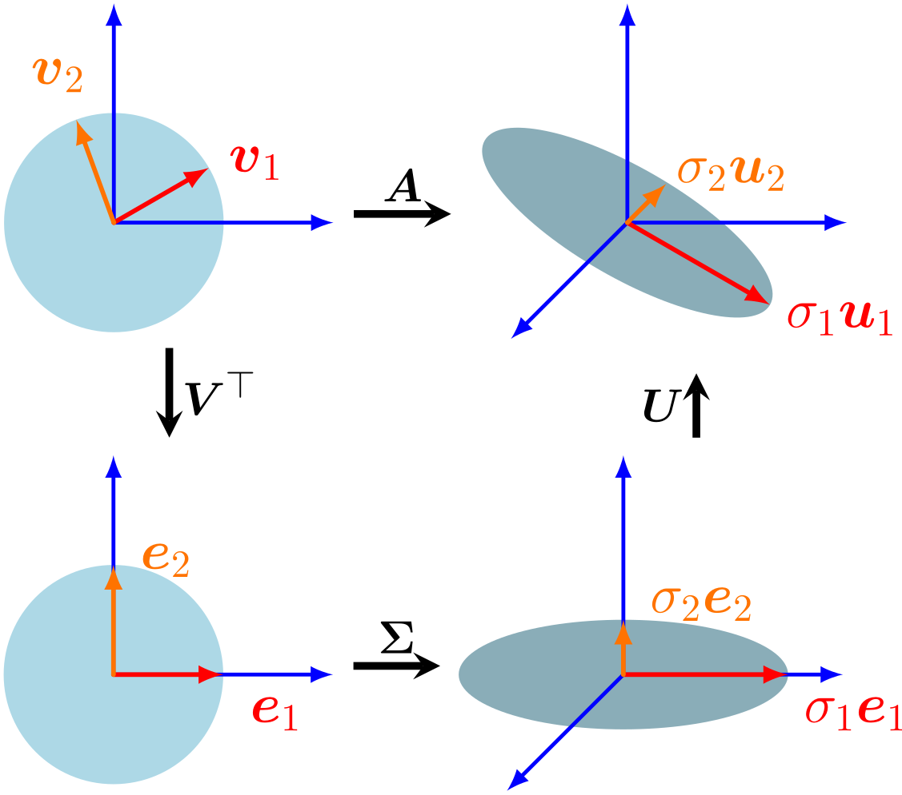

# 📚 Singular Value Decomposition (SVD)

## 📌 Introduzione

La **Singular Value Decomposition (SVD)** è una delle tecniche più potenti e versatili dell’algebra lineare. È un metodo che ci permette di "guardare dentro" una matrice e capire il comportamento profondo della trasformazione lineare che rappresenta, rivelandone le direzioni principali di azione e le dimensioni lungo cui opera.

Immagina una trasformazione come qualcosa che prende un insieme di punti e li sposta, allunga, schiaccia o ruota nello spazio. La SVD ci permette di scomporre questa trasformazione complessa in tre passaggi semplici e interpretabili:

- una **rotazione iniziale**, che riallinea il sistema di riferimento;
- una **scalatura**, che modifica le lunghezze lungo gli assi principali;
- una **rotazione finale**, che orienta il risultato nello spazio d’uscita.

In sostanza, SVD svela la struttura nascosta di qualsiasi matrice, anche se non è quadrata, anche se ha righe o colonne ridondanti, o persino se è "disturbata" dal rumore. 

Questa capacità di scomporre e reinterpretare trasformazioni la rende una tecnica centrale in molti campi: compressione delle immagini, riconoscimento facciale, sistemi di raccomandazione, ricerca semantica nei testi, e tanto altro.

## 🔍 Definizione Formale (caso $m > n$)

Diamo ora una definizione formale della SVD per $m > n$ (in modo analogo si può definire anche per $m < n$).

Sia $\{\mathbf v_1, \cdots, \mathbf v_n\}$ una base **ortonormale** dello spazio di partenza, con $\mathbf v_i \in \mathbb{R}^n$, e sia $\mathbf{A} \in \mathbb{R}^{m \times n}$ una matrice qualsiasi. Applichiamo $\mathbf{A}$ ai vettori della base:

$$
\mathbf A \mathbf v_1 = \sigma_1 \mathbf u_1,\quad \cdots,\quad \mathbf A \mathbf v_n = \sigma_n \mathbf u_n
$$

dove:

- $\{\mathbf u_i\}_{i=1}^n$ sono versori (tali che $||\mathbf u_i|| = 1$).
- $\{\sigma_i\}_{i=1}^n$ i fattori di scala dei $\mathbf u_i$.

Quindi, dato che abbiamo una base ortonormale, ogni vettore $\mathbf x$ può essere scritto come:

$$
\mathbf x = (\mathbf v_1 \cdot \mathbf x) \mathbf v_1 + \cdots + (\mathbf v_n \cdot \mathbf x) \mathbf v_n
$$

Applicando $\mathbf A$:

$$
\mathbf A \mathbf x = \sigma_1 (\mathbf v_1 \cdot \mathbf x) \mathbf u_1 + \cdots + \sigma_n (\mathbf v_n \cdot \mathbf x) \mathbf u_n
$$

Sostituendo termini, si ottiene la forma canonica:

$$
\mathbf{A} \mathbf{x} = \sum_{i=1}^{n} \sigma_i (\mathbf{v}_i \cdot \mathbf{x}) \mathbf{u}_i
$$

Cerchiamo ora di scrivere questa formula in forma matriciale:

### 1. **Raggruppiamo le proiezioni**

Definiamo:
- $z_i = \mathbf{v}_i \cdot \mathbf{x}$: la componente di $\mathbf{x}$ nella direzione di $\mathbf{v}_i$
- Il vettore completo delle proiezioni:
  $$
  \mathbf{z} =
  \begin{bmatrix}
  z_1 \\
  \vdots \\
  z_n
  \end{bmatrix}
  =
  \begin{bmatrix}
  \mathbf{v}_1^T \mathbf{x} \\
  \vdots \\
  \mathbf{v}_n^T \mathbf{x}
  \end{bmatrix}
  = V^T \mathbf{x}
  $$
  dove 
  $$
  V^T =
  \begin{bmatrix}
  \text{-----} \mathbf{v}_1^T \text{-----} \\
  \vdots \\
  \text{-----} \mathbf{v}_n^T \text{-----}
  \end{bmatrix}
  $$
è la matrice che contiene i vettori $\mathbf{v}_i$ come righe.

### 2. **Applichiamo la scalatura**

Ora moltiplichiamo ogni componente $z_i$ per $\sigma_i$, cioè applichiamo la matrice diagonale dei valori singolari:

$$
\Sigma \mathbf z
=
\begin{bmatrix}
\sigma_1 &        &        \\
        & \ddots &        \\
        &        & \sigma_n \\\\
\hline\\
0       & \cdots & 0       \\
\vdots  &        & \vdots  \\
0       & \cdots & 0
\end{bmatrix}
\begin{bmatrix}
z_1 \\
\vdots \\
z_n
\end{bmatrix}
=
\begin{bmatrix}
\sigma_1 z_1 \\
\vdots \\
\sigma_n z_n \\\\
\hline\\
0 \\
\vdots \\
0
\end{bmatrix}
$$

dove $\Sigma\in\mathbb R^{m\times n}$ è rettangolare (solo $n$ valori singolari).

### 3. **Sommiamo lungo le direzioni $\mathbf{u}_i$**

Costruiamo il vettore somma come combinazione lineare pesata dei vettori $\mathbf{u}_i$:

$$
\sum_{i=1}^n (\sigma_i z_i) \mathbf{u}_i = U_n (\Sigma \mathbf{z}) = U_n \Sigma V^T \mathbf{x}
$$

dove 

$$
U_n =
\begin{bmatrix}
\vert & & \vert \\
\mathbf{u}_1 & \cdots & \mathbf{u}_n \\
\vert & & \vert
\end{bmatrix}
$$

è la matrice che contiene i vettori $\mathbf{u}_i$ come colonne.

### 4. Completamento di $U$ a matrice $m\times m$

Poiché $m>n$, servono ancora $m-n$ colonne $\mathbf u_{n+1},\dots,\mathbf u_m$ per ottenere
$$
U =
\begin{bmatrix}
\vert & & \vert & \vert & & \vert \\
\mathbf{u}_1 & \cdots & \mathbf{u}_n & \mathbf{u}_{n+1} & \cdots & \mathbf{u}_m\\
\vert & & \vert & \vert & & \vert \\
\end{bmatrix}
\in\mathbb R^{m\times m},
$$
una matrice ortonormale completa. Si sceglie $\{\mathbf u_{n+1},\dots,\mathbf u_m\}$ come base ortonormale del **nucleo** di $A^T$.

### 5. **Forma finale della trasformazione**

Poiché il risultato vale per ogni $\mathbf{x}$, allora:

$$
\mathbf{A} \mathbf{x} = U \Sigma V^T \mathbf{x} \quad \Rightarrow \quad \boxed{\mathbf{A} = U \Sigma V^T}
$$

Questa è la **forma matriciale canonica della trasformazione lineare $\mathbf{A}$**: la **decomposizione ai valori singolari** (SVD).

## 📐 Interpretazione Geometrica

Questa formula mostra come la SVD scompone ogni trasformazione lineare in una **sequenza ordinata** di operazioni:

1. **Rotazione/Riflessione** (o cambio di base) del vettore di input nello spazio delle $\mathbf{v}_i$, tramite $\mathbf{V}^T$.
2. **Scalatura anisotropa** lungo queste direzioni, con coefficienti $\sigma_i$.
3. **Rotazione/Riflessione** finale nello spazio delle $\mathbf{u}_i$, tramite $\mathbf{U}$.

Questa decomposizione è non solo utile dal punto di vista computazionale, ma rivela anche la **struttura interna** della trasformazione stessa.

Quindi sia $\mathbf{A} \in \mathbb{R}^{m \times n}$ una matrice qualsiasi. La **SVD** è una fattorizzazione della matrice nella forma:

$$
\mathbf{A} = \mathbf{U} \mathbf{\Sigma} \mathbf{V}^{T}
$$

dove:

- $\mathbf{U} \in \mathbb{R}^{m \times m}$: matrice ortogonale delle **left singular vectors**
- $\mathbf{\Sigma} \in \mathbb{R}^{m \times n}$: matrice diagonale con valori $\sigma_i$ detti **singular values** in ordine decrescente
- $\mathbf{V} \in \mathbb{R}^{n \times n}$: matrice ortogonale delle **right singular vectors**

## 🧠 Approfondimento

Ogni trasformazione lineare $\mathbf{A} \in \mathbb{R}^{m \times n}$, per quanto complessa, può essere sempre **scomposta in tre fasi geometriche**:

$$
\mathbf{A} = \mathbf{U} \mathbf{\Sigma} \mathbf{V}^T
$$

Questa decomposizione corrisponde alla seguente **pipeline geometrica**:

### 🔹 1. Rotazione iniziale dello spazio ($\mathbf{V}^T$)

- Ruota (o riflette) lo spazio originale per allinearlo alle direzioni principali della trasformazione.

- Trasforma ogni vettore $\mathbf{A}$ nel nuovo sistema di riferimento ortonormale: $\mathbf z= \mathbf V^⊤ \mathbf x$

- Intuitivamente, è come esprimere $\mathbf{A}$ in una nuova base ortogonale costruita sui concetti principali della trasformazione.

### 🔹 2. Scalatura assiale ($\mathbf{\Sigma}$)

- $\mathbf{\Sigma}$ è una matrice **diagonale** che **scala** ogni coordinata **indipendentemente** lungo un asse ortogonale.
- I valori diagonali $\sigma_1 \geq \sigma_2 \geq \dots \geq \sigma_r \geq 0$ sono i **valori singolari** e rappresentano **quanto** viene deformato lo spazio in ciascuna direzione.
- Nessuna rotazione o shearing: solo **dilatazione o contrazione**.
- In questo passaggio avviene il "cuore" della trasformazione: le direzioni principali vengono **ingrandite o compresse** in base alla loro **importanza informativa**.

### 🔹 3. Rotazione finale ($\mathbf{U}$)

- Dopo che il vettore è stato proiettato e scalato lungo le direzioni principali, $\mathbf{U}$ applica una rotazione (o riflessione) per posizionare il risultato nello spazio d'uscita: quello di $\mathbb{R}^m$ se $\mathbf{A} \in \mathbb{R}^{m \times n}$.

- La trasformazione $\mathbf{U}$ agisce come un cambio di base nello spazio del codominio:
essa assegna un significato geometrico e direzionale al risultato, stabilendo in quale direzione finale andrà ogni componente scalata.

- Geometricamente, $\mathbf{U}$ determina l’orientamento dell’ellisse risultante: mentre $\mathbf{V}^T$ allinea l’ingresso alle direzioni principali e $\Sigma$ deforma (scala) secondo quelle direzioni, $\mathbf{U}$ decide come disporre quella deformazione nello spazio originale d’uscita.

### 🌌 Esempio Visivo

Immagina un **cerchio unitario** nello spazio 2D. Applichiamo $\mathbf{A}$ tramite la sua SVD:

 

L'immagine illustra geometricamente la decomposizione a valori singolari (SVD) di una matrice $\mathbf A$, mostrando come può essere interpretata come una sequenza di trasformazioni.

- **$\mathbf{V}^T$** ruota il cerchio nella direzione delle **direzioni principali** (quelle dove deve avvenire lo stretching).
- **$\mathbf{\Sigma}$** schiaccia o dilata il cerchio lungo i suoi assi principali, trasformandolo in un ellisse.
- **$\mathbf{U}$** riallinea (ruota o riflette) l’ellisse nell’output space, secondo le direzioni principali dell'immagine di $\mathbf{A}$, cioè gli autovettori di $\mathbf{A} \mathbf{A}^T$.

Risultato: da una figura simmetrica e isotropa (cerchio), otteniamo un oggetto deformato ma **con significato direzionale**.

### 🧬 Interpretazione concettuale

- Le **direzioni principali** (singular vectors) sono gli **assi di massima variazione** dell’azione di $\mathbf{A}$.
- I **valori singolari** dicono **quanto** $\mathbf{A}$ "stira" lo spazio lungo quei vettori.
- Questa decomposizione permette di **ridurre la dimensionalità** preservando la maggior parte dell’informazione (proiettando sui primi $k$ assi).

### 👻 Proprietà spettrali di $A^T A$ e $A A^T$

A partire dall’**SVD** $A = U\Sigma V^T$, mostriamo che:

- $\{\mathbf{v}_i\}$ sono autovettori di $A^T A$,
- $\{\mathbf{u}_i\}$ sono autovettori di $A A^T$,
- entrambe le famiglie sono ortonormali.

Per definizione
$$
A\,\mathbf{v}_i = \sigma_i\,\mathbf{u}_i.
$$

1. **Espansione di $A^T \mathbf{u}_i$ nella base $\{\mathbf{v}_j\}$**  
   Poiché $\{\mathbf{v}_j\}_{j=1}^n$ è una base ortonormale di $\mathbb{R}^n$, e $A^T \mathbf u$ è un vettore di $\mathbb{R}^n$, possiamo scrivere  
   $$
   A^T \mathbf{u}_i
   = \sum_{j=1}^n \bigl(\mathbf{v}_j^T (A^T \mathbf{u}_i)\bigr)\,\mathbf{v}_j.
   $$
   E quindi  
   $$
   \mathbf{v}_j^T (A^T \mathbf{u}_i)
   = (A\,\mathbf{v}_j)^T\,\mathbf{u}_i.
   $$

2. **Calcolo del coefficiente $(A\,\mathbf{v}_j)^T\mathbf{u}_i$**  
   Dall’SVD, $A\,\mathbf{v}_j = \sigma_j\,\mathbf{u}_j$. Quindi  
   $$
   (A\,\mathbf{v}_j)^T \mathbf{u}_i
   = (\sigma_j\,\mathbf{u}_j)^T \mathbf{u}_i
   = \sigma_j\,(\mathbf{u}_j^T \mathbf{u}_i)
   = \sigma_j\,\delta_{ji},
   $$
   dove $\delta_{ji}$ è il delta di Kronecker (uguale a 1 se $j=i$, 0 altrimenti). Questo semplicemente perché i vettori $\{\mathbf{u}_j\}_{j=1}^n$ sono ortonormali, e quindi il loro prodotto scalare vale $1$ solo se $j=i$ (e $0$ altrimenti).

3. **Semplificazione della somma**  
   $$
   A^T \mathbf{u}_i
   = \sum_{j=1}^n \sigma_j\,\delta_{ji}\,\mathbf{v}_j
   = \sigma_i\,\mathbf{v}_i.
   $$

4. **Conclusione sullo spettro di $A^T A$**  
   Ora applichiamo $A^T$ all’equazione originale:
   $$
     A^T\bigl(A\,\mathbf{v}_i\bigr)
     = A^T(\sigma_i\,\mathbf{u}_i)
     = \sigma_i\,(A^T \mathbf{u}_i)
     = \sigma_i\,(\sigma_i\,\mathbf{v}_i)
     = \sigma_i^2\,\mathbf{v}_i.
   $$
   Da cui:
   $$
     (A^T A)\,\mathbf{v}_i = \sigma_i^2\,\mathbf{v}_i,
   $$
   cioè $\mathbf{v}_i$ è autovettore di $A^T A$ con autovalore $\sigma_i^2$.

5. **Conclusione sullo spettro di $A A^T$**  
   Allo stesso modo, partiamo da:
   $$
   A\,\mathbf{v}_i = \sigma_i\,\mathbf{u}_i.
   $$
   Applichiamo $A$ a entrambi i lati dell'identità:
   $$
   AA^T \mathbf{u}_i = A\left(A^T \mathbf{u}_i\right).
   $$
   Dalla parte precedente, sappiamo che $A^T \mathbf{u}_i = \sigma_i\,\mathbf{v}_i$, quindi:
   $$
   A A^T \mathbf{u}_i = A(\sigma_i\,\mathbf{v}_i) = \sigma_i\,A \mathbf{v}_i = \sigma_i\,(\sigma_i\,\mathbf{u}_i) = \sigma_i^2\,\mathbf{u}_i.
   $$
   Quindi
   $$
   (A A^T)\,\mathbf{u}_i = \sigma_i^2\,\mathbf{u}_i,
   $$
   cioè $\mathbf{u}_i$ è autovettore di $A A^T$ con autovalore $\sigma_i^2$.

Pertanto, sia $A^T A$ che $A A^T$ ammettono una base ortonormale di autovettori, e i rispettivi autovalori sono i quadrati dei valori singolari $\sigma_i^2$.

### 🧮 Forma matriciale compatta

Tutti i risultati precedenti possono essere espressi elegantemente in forma matriciale. A partire dalla **SVD**:

$$
A = U \Sigma V^T,
$$

possiamo scrivere:

- Per il prodotto $A^T A$:

$$
A^T A = (U \Sigma V^T)^T (U \Sigma V^T)
= V \Sigma^T U^T U \Sigma V^T
= V \Sigma^T \Sigma V^T.
$$

Poiché $U^T U = I$, otteniamo:

$$
A^T A = V (\Sigma^T \Sigma) V^T,
$$

che mostra che $A^T A$ è **diagonalizzabile** tramite $V$, e ha **autovalori** dati da $\sigma_i^2$.

- Analogamente, per $A A^T$:

$$
A A^T = (U \Sigma V^T)(U \Sigma V^T)^T
= U \Sigma V^T V \Sigma^T U^T
= U \Sigma \Sigma^T U^T.
$$

Quindi:

$$
A A^T = U (\Sigma \Sigma^T) U^T,
$$

che mostra che $A A^T$ è **diagonalizzabile** tramite $U$, e ha gli **stessi autovalori** $\sigma_i^2$ (tranne eventuali zeri in più se $m \ne n$).

Queste espressioni confermano in forma compatta che:
- Le colonne di $V$ sono autovettori di $A^T A$,
- Le colonne di $U$ sono autovettori di $A A^T$,
- Gli autovalori in entrambi i casi sono i quadrati dei valori singolari contenuti in $\Sigma$.

- **Caso $m > n$:**  
  $U \in \mathbb{R}^{m \times m}$ è ortogonale. I primi $n$ autovettori corrispondono agli autovalori $\sigma_i^2 > 0$ di $A A^\top$; i restanti $m - n$ sono autovettori associati all’autovalore $0$.  

- **Caso $n > m$:**  
  $V \in \mathbb{R}^{n \times n}$ è ortogonale. I primi $m$ autovettori corrispondono agli autovalori $\sigma_i^2 > 0$ di $A^\top A$; i restanti $n - m$ sono autovettori associati all’autovalore $0$.  

## 📏 Proprietà

- I vettori di $\mathbf{U}$ e $\mathbf{V}$ formano **basi ortonormali** per lo spazio delle righe e delle colonne.
- I **valori singolari** $\sigma_i$ rappresentano la **quantità di informazione** trasportata lungo ciascuna direzione.
- $\text{rank}(\mathbf{A}) =$ numero di valori singolari non nulli.
- Può essere vista come una generalizzazione dell’autodecomposizione (eigendecomposition) per matrici rettangolari.

## 🔧 Riduzione Dimensionale tramite Truncated SVD

Spesso, molte direzioni in cui la matrice $\mathbf{A}$ proietta i dati risultano **trascurabili o rumorose**. La **Truncated SVD** consiste nel conservare **solo i primi $k \ll \min(m, n)$ valori singolari** più grandi:

$$
\mathbf{A} \approx \mathbf{A}_k = \mathbf{U}_k \mathbf{\Sigma}_k \mathbf{V}_k^T
$$

- $\mathbf{U}_k \in \mathbb{R}^{m \times k}$ contiene i primi $k$ vettori singolari sinistri.
- $\mathbf{\Sigma}_k \in \mathbb{R}^{k \times k}$ contiene i primi $k$ valori singolari (i più grandi).
- $\mathbf{V}_k^T \in \mathbb{R}^{k \times n}$ contiene i primi $k$ vettori singolari destri.

🔍 **Perché funziona?**

1. I valori singolari $\sigma_1 \geq \sigma_2 \geq \dots \geq \sigma_r$ sono ordinati in modo decrescente:  
   **i primi rappresentano le direzioni in cui $\mathbf{A}$ ha la massima "energia"** (varianza proiettata).

2. Geometricamente:  
   - Ogni direzione $\mathbf{v}_i$ corrisponde a un asse principale su cui $\mathbf{A}$ proietta i dati.
   - Il valore $\sigma_i$ misura **quanto è importante quella direzione**.
   - Troncando dopo $k$, scartiamo le direzioni meno influenti.

3. Matematicamente:  
   $$ 
   \mathbf{A}_k = \arg\min_{\text{rank-}k\text{ matrices } \mathbf{A}} \|\mathbf{A} - \mathbf{A}\|_F 
   $$
   cioè $\mathbf{A}_k$ è la **migliore approssimazione di rango $k$** di $\mathbf{A}$ in norma di Frobenius (somma dei quadrati degli scarti).

🚀 **Utilità**:
- **Compressione dei dati**: conserviamo solo l’informazione essenziale.
- **Riduzione del rumore**: eliminiamo direzioni deboli o casuali.
- **Estrazione di concetti latenti**: fondamentale in NLP, raccomandazione, clustering.

## 🧾 Differenze tra SVD ed Eigendecomposition

| Metodo      | Tipo matrice     | Fattorizzazione                                  |
|-------------|------------------|--------------------------------------------------|
| SVD         | qualsiasi         | $\mathbf{A} = \mathbf{U} \mathbf{\Sigma} \mathbf{V}^T$ |
| Eigendecomp | solo quadrate     | $\mathbf{A} = \mathbf{Q} \mathbf{\Lambda} \mathbf{Q}^{-1}$ |

Nota: SVD è più generale e robusta.

## ⚠️ Limiti della SVD

- Complessità computazionale elevata: $\mathcal{O}(mn\min(m,n))$
- Poco scalabile su matrici **molto grandi** (es. $10^6 \times 10^6$)
- Non si adatta bene a **matrici dinamiche** o sparse (come nel linguaggio naturale)
- Richiede **riaddestramento completo** per ogni nuovo documento/termine

## ✅ Vantaggi

- Estrae automaticamente **relazioni latenti**
- Riduce il rumore e le ridondanze
- Ottimo per compattare l'informazione
- Facilita la **similarità semantica** tra oggetti (es. documenti, parole)

## 🧪 Applicazioni

- **NLP**: [[Latent Semantic Analysis]] (LSA)
- **Motori di raccomandazione**: filtraggio collaborativo
- **Visione artificiale**: compressione di immagini
- **Machine Learning**: preprocessing per PCA e clustering

## 🧭 Conclusione

La SVD non è solo una tecnica matematica ma un **principio guida** per strutturare, comprimere e interpretare dati complessi. In ambito linguistico, è lo strumento matematico fondante di molte tecniche semantiche moderne.
