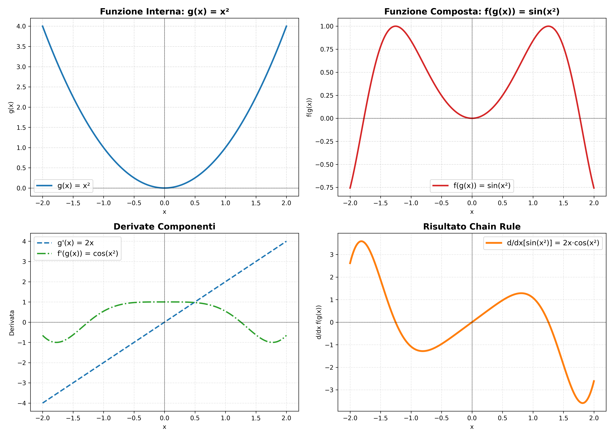
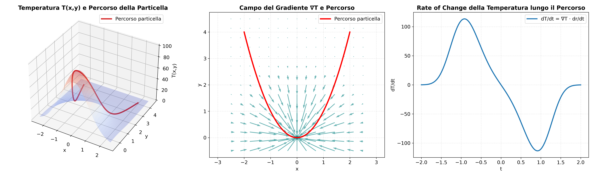

# Chain Rule - Regola della Catena nel Calcolo Differenziale

## Definizione Formale

La **regola della catena** (chain rule) è uno degli strumenti fondamentali del calcolo differenziale che ci permette di calcolare la derivata di funzioni composite.

**Teorema (Chain Rule)**: Se $y = f(g(x))$ dove $f$ e $g$ sono funzioni differenziabili, allora:

$$\frac{dy}{dx} = \frac{dy}{du} \cdot \frac{du}{dx}$$

dove $u = g(x)$.

In notazione di Leibniz:
$$\frac{d}{dx}[f(g(x))] = f'(g(x)) \cdot g'(x)$$

## Intuizione Geometrica

La chain rule può essere intesa come il prodotto di "velocità di cambiamento" lungo una catena di trasformazioni:

- $\frac{du}{dx}$: quanto velocemente cambia $u$ rispetto a $x$
- $\frac{dy}{du}$: quanto velocemente cambia $y$ rispetto a $u$
- $\frac{dy}{dx}$: quanto velocemente cambia $y$ rispetto a $x$

È come calcolare la velocità finale in una catena di ingranaggi: se il primo ingranaggio ruota a velocità $v_1$ e il rapporto di trasmissione è $r$, la velocità finale sarà $v_1 \cdot r$.

## Dimostrazione

**Dimostrazione usando il limite**:

Partiamo dalla definizione di derivata:
$$\frac{dy}{dx} = \lim_{\Delta x \to 0} \frac{f(g(x + \Delta x)) - f(g(x))}{\Delta x}$$

Introduciamo $\Delta u = g(x + \Delta x) - g(x)$:

$$\frac{dy}{dx} = \lim_{\Delta x \to 0} \frac{f(g(x) + \Delta u) - f(g(x))}{\Delta x}$$

Moltiplichiamo e dividiamo per $\Delta u$ (assumendo $\Delta u \neq 0$):

$$\frac{dy}{dx} = \lim_{\Delta x \to 0} \frac{f(g(x) + \Delta u) - f(g(x))}{\Delta u} \cdot \frac{\Delta u}{\Delta x}$$

Poiché $g$ è continua (essendo differenziabile), $\Delta u \to 0$ quando $\Delta x \to 0$:

$$\frac{dy}{dx} = \lim_{\Delta u \to 0} \frac{f(g(x) + \Delta u) - f(g(x))}{\Delta u} \cdot \lim_{\Delta x \to 0} \frac{\Delta u}{\Delta x}$$

$$= f'(g(x)) \cdot g'(x)$$

## Esempi Fondamentali

### Esempio 1: Funzione Polinomiale Composta
Calcolare $\frac{d}{dx}[(3x^2 + 1)^5]$

**Soluzione**:
- Funzione esterna: $f(u) = u^5 \Rightarrow f'(u) = 5u^4$
- Funzione interna: $g(x) = 3x^2 + 1 \Rightarrow g'(x) = 6x$

$$\frac{d}{dx}[(3x^2 + 1)^5] = 5(3x^2 + 1)^4 \cdot 6x = 30x(3x^2 + 1)^4$$

### Esempio 2: Funzione Trigonometrica Composta
Calcolare $\frac{d}{dx}[\sin(x^3 + 2x)]$

**Soluzione**:
- Funzione esterna: $f(u) = \sin(u) \Rightarrow f'(u) = \cos(u)$
- Funzione interna: $g(x) = x^3 + 2x \Rightarrow g'(x) = 3x^2 + 2$

$$\frac{d}{dx}[\sin(x^3 + 2x)] = \cos(x^3 + 2x) \cdot (3x^2 + 2)$$

### Esempio 3: Funzione Esponenziale Composta
Calcolare $\frac{d}{dx}[e^{x^2 \cos(x)}]$

**Soluzione**:
- Funzione esterna: $f(u) = e^u \Rightarrow f'(u) = e^u$
- Funzione interna: $g(x) = x^2 \cos(x)$

Prima calcoliamo $g'(x)$ usando la regola del prodotto:
$$g'(x) = 2x \cos(x) + x^2(-\sin(x)) = 2x\cos(x) - x^2\sin(x)$$

Quindi:
$$\frac{d}{dx}[e^{x^2 \cos(x)}] = e^{x^2 \cos(x)} \cdot (2x\cos(x) - x^2\sin(x))$$

## Chain Rule Generalizzata

Per composizioni di più funzioni $y = f(g(h(x)))$:

$$\frac{dy}{dx} = \frac{dy}{dv} \cdot \frac{dv}{du} \cdot \frac{du}{dx}$$

dove $u = h(x)$ e $v = g(u)$.

**Esempio**: $y = \sin^3(e^{2x})$

Scomposizione:
- $w = 2x \Rightarrow w' = 2$
- $u = e^w \Rightarrow u' = e^w = e^{2x}$
- $v = \sin(u) \Rightarrow v' = \cos(u) = \cos(e^{2x})$
- $y = v^3 \Rightarrow y' = 3v^2 = 3\sin^2(e^{2x})$

$$\frac{dy}{dx} = 3\sin^2(e^{2x}) \cdot \cos(e^{2x}) \cdot e^{2x} \cdot 2 = 6e^{2x}\sin^2(e^{2x})\cos(e^{2x})$$

## Visualizzazione Grafica

```python
import numpy as np
import matplotlib.pyplot as plt

# Funzione composta: f(g(x)) = sin(x²)
x = np.linspace(-2, 2, 1000)
g = x**2  # funzione interna
f_g = np.sin(g)  # funzione composta

# Derivate
g_prime = 2*x  # g'(x) = 2x
f_prime_at_g = np.cos(g)  # f'(g(x)) = cos(x²)
chain_rule_result = f_prime_at_g * g_prime  # f'(g(x)) * g'(x)

# Setup figure
fig, ((ax1, ax2), (ax3, ax4)) = plt.subplots(2, 2, figsize=(14, 10))
plt.rcParams.update({'font.size': 12})

# 1) Funzione interna g(x)
ax1.plot(x, g, color='#1f77b4', linewidth=2.5, label='g(x) = x²')
ax1.set_title('Funzione Interna: g(x) = x²', fontsize=14, weight='bold')
ax1.set_xlabel('x')
ax1.set_ylabel('g(x)')
ax1.grid(True, linestyle='--', alpha=0.4)
ax1.legend(fontsize=12)
ax1.axhline(0, color='black', linewidth=0.8, alpha=0.5)
ax1.axvline(0, color='black', linewidth=0.8, alpha=0.5)

# 2) Funzione composta f(g(x))
ax2.plot(x, f_g, color='#d62728', linewidth=2.5, label='f(g(x)) = sin(x²)')
ax2.set_title('Funzione Composta: f(g(x)) = sin(x²)', fontsize=14, weight='bold')
ax2.set_xlabel('x')
ax2.set_ylabel('f(g(x))')
ax2.grid(True, linestyle='--', alpha=0.4)
ax2.legend(fontsize=12)
ax2.axhline(0, color='black', linewidth=0.8, alpha=0.5)
ax2.axvline(0, color='black', linewidth=0.8, alpha=0.5)

# 3) Derivate componenti
ax3.plot(x, g_prime, color='#1f77b4', linestyle='--', linewidth=2.2, label="g'(x) = 2x")
ax3.plot(x, f_prime_at_g, color='#2ca02c', linestyle='-.', linewidth=2.2, label="f'(g(x)) = cos(x²)")
ax3.set_title('Derivate Componenti', fontsize=14, weight='bold')
ax3.set_xlabel('x')
ax3.set_ylabel('Derivata')
ax3.grid(True, linestyle='--', alpha=0.3)
ax3.legend(fontsize=12)
ax3.axhline(0, color='black', linewidth=0.8, alpha=0.5)
ax3.axvline(0, color='black', linewidth=0.8, alpha=0.5)

# 4) Chain rule risultato
ax4.plot(x, chain_rule_result, color='#ff7f0e', linewidth=3, label="d/dx[sin(x²)] = 2x·cos(x²)")
ax4.set_title('Risultato Chain Rule', fontsize=14, weight='bold')
ax4.set_xlabel('x')
ax4.set_ylabel('d/dx f(g(x))')
ax4.grid(True, linestyle='--', alpha=0.3)
ax4.legend(fontsize=12)
ax4.axhline(0, color='black', linewidth=0.8, alpha=0.5)
ax4.axvline(0, color='black', linewidth=0.8, alpha=0.5)

plt.tight_layout()
plt.savefig("chain_rule_visualization.png", dpi=300)
plt.show()
```



## Applicazioni Avanzate

### 1. Derivazione Implicita
Per equazioni come $x^2 + y^2 = 25$, dove $y = y(x)$:

$$\frac{d}{dx}[x^2 + y^2] = \frac{d}{dx}[25]$$
$$2x + 2y\frac{dy}{dx} = 0$$
$$\frac{dy}{dx} = -\frac{x}{y}$$

### 2. Derivazione Logaritmica
Per funzioni del tipo $y = f(x)^{g(x)}$:

$$\ln(y) = g(x) \ln(f(x))$$

Derivando entrambi i lati:
$$\frac{1}{y}\frac{dy}{dx} = g'(x)\ln(f(x)) + g(x)\frac{f'(x)}{f(x)}$$

$$\frac{dy}{dx} = f(x)^{g(x)}\left[g'(x)\ln(f(x)) + g(x)\frac{f'(x)}{f(x)}\right]$$

**Esempio**: $y = x^{\sin(x)}$

$$\frac{dy}{dx} = x^{\sin(x)}\left[\cos(x)\ln(x) + \sin(x)\frac{1}{x}\right]$$

### 3. Chain Rule nelle Derivate Parziali
Per funzioni di più variabili $z = f(x(t), y(t))$:

$$\frac{dz}{dt} = \frac{\partial f}{\partial x}\frac{dx}{dt} + \frac{\partial f}{\partial y}\frac{dy}{dt}$$

## Errori Comuni

### ❌ Errore 1: Dimenticare la derivata interna
$$\frac{d}{dx}[\sin(x^2)] = \cos(x^2) \text{ (SBAGLIATO)}$$
$$\frac{d}{dx}[\sin(x^2)] = \cos(x^2) \cdot 2x \text{ (CORRETTO)}$$

### ❌ Errore 2: Applicare la chain rule quando non serve
$$\frac{d}{dx}[\sin(x) + x^2] = \cos(x) \cdot 1 + 2x \cdot 1 \text{ (SBAGLIATO)}$$
$$\frac{d}{dx}[\sin(x) + x^2] = \cos(x) + 2x \text{ (CORRETTO)}$$

### ❌ Errore 3: Ordine sbagliato nella moltiplicazione
Per $f(g(x))$, l'ordine corretto è $f'(g(x)) \cdot g'(x)$, non $g'(x) \cdot f'(g(x))$ (anche se matematicamente equivalente, concettualmente l'ordine ha significato).

## Esercizi di Verifica

### Esercizio 1
Calcolare $\frac{d}{dx}[\sqrt{1 + \tan(x)}]$

**Soluzione**:
- $f(u) = \sqrt{u} = u^{1/2} \Rightarrow f'(u) = \frac{1}{2}u^{-1/2} = \frac{1}{2\sqrt{u}}$
- $g(x) = 1 + \tan(x) \Rightarrow g'(x) = \sec^2(x)$

$$\frac{d}{dx}[\sqrt{1 + \tan(x)}] = \frac{1}{2\sqrt{1 + \tan(x)}} \cdot \sec^2(x) = \frac{\sec^2(x)}{2\sqrt{1 + \tan(x)}}$$

### Esercizio 2
Calcolare $\frac{d}{dx}[\ln(\cos(3x^2))]$

**Soluzione**:
Composizione di tre funzioni:
- $h(x) = 3x^2 \Rightarrow h'(x) = 6x$
- $g(u) = \cos(u) \Rightarrow g'(u) = -\sin(u)$
- $f(v) = \ln(v) \Rightarrow f'(v) = \frac{1}{v}$

$$\frac{d}{dx}[\ln(\cos(3x^2))] = \frac{1}{\cos(3x^2)} \cdot (-\sin(3x^2)) \cdot 6x = -\frac{6x\sin(3x^2)}{\cos(3x^2)} = -6x\tan(3x^2)$$

## Connessioni e Approfondimenti

### Relazione con la Regola del Prodotto
La chain rule può essere vista come generalizzazione della regola del prodotto per "prodotti infinitesimali":

$$df = f'(g(x)) \cdot dg = f'(g(x)) \cdot g'(x) \cdot dx$$

### Chain Rule Multivariata e Gradiente

La chain rule si estende naturalmente alle funzioni di più variabili, dove diventa uno strumento ancora più potente. Questa generalizzazione non è solo una curiosità matematica, ma rivela la struttura profonda del calcolo differenziale.

#### Teorema (Chain Rule Multivariata)
Se $z = f(x_1, x_2, \ldots, x_n)$ e ciascuna $x_i = x_i(t)$ è una funzione differenziabile di $t$, allora:

$\frac{dz}{dt} = \frac{\partial f}{\partial x_1}\frac{dx_1}{dt} + \frac{\partial f}{\partial x_2}\frac{dx_2}{dt} + \cdots + \frac{\partial f}{\partial x_n}\frac{dx_n}{dt}$

**In notazione vettoriale**:
$\frac{dz}{dt} = \nabla f \cdot \frac{d\mathbf{x}}{dt}$

dove $\nabla f = \left(\frac{\partial f}{\partial x_1}, \frac{\partial f}{\partial x_2}, \ldots, \frac{\partial f}{\partial x_n}\right)$ è il **gradiente** di $f$.

#### Perché Funziona: Intuizione Geometrica

Il gradiente $\nabla f$ rappresenta la direzione di massima crescita di $f$ e la sua intensità. Quando ci muoviamo lungo una curva $\mathbf{x}(t)$ nello spazio, il tasso di variazione di $f$ dipende da:

1. **Quanto velocemente stiamo cambiando posizione**: $\frac{d\mathbf{x}}{dt}$
2. **Quanto è "ripida" la funzione nella direzione del movimento**: $\nabla f$

Il prodotto scalare $\nabla f \cdot \frac{d\mathbf{x}}{dt}$ cattura esattamente questa interazione.

#### Dimostrazione Rigorosa

Partiamo dalla definizione di derivata:
$\frac{dz}{dt} = \lim_{\Delta t \to 0} \frac{f(\mathbf{x}(t + \Delta t)) - f(\mathbf{x}(t))}{\Delta t}$

Usando il teorema del valor medio multivariato e la linearità dell'approssimazione di primo ordine:

$f(\mathbf{x} + \Delta \mathbf{x}) - f(\mathbf{x}) = \nabla f(\mathbf{x} + \theta\Delta \mathbf{x}) \cdot \Delta \mathbf{x}$

per qualche $\theta \in [0,1]$.

Sostituendo $\Delta \mathbf{x} = \mathbf{x}(t + \Delta t) - \mathbf{x}(t)$:

$\frac{dz}{dt} = \lim_{\Delta t \to 0} \frac{\nabla f(\mathbf{x} + \theta\Delta \mathbf{x}) \cdot \Delta \mathbf{x}}{\Delta t}$

Per continuità del gradiente:
$= \nabla f(\mathbf{x}(t)) \cdot \lim_{\Delta t \to 0} \frac{\Delta \mathbf{x}}{\Delta t} = \nabla f \cdot \frac{d\mathbf{x}}{dt}$

#### Esempio Fondamentale: Temperatura su una Superficie

Supponiamo che la temperatura in un punto $(x,y)$ sia data da:
$T(x,y) = 100e^{-(x^2+y^2)/2}$

Una particella si muove lungo il percorso $\mathbf{r}(t) = (t, t^2)$. Quanto velocemente cambia la temperatura percepita dalla particella?

**Soluzione**:
1. Calcoliamo il gradiente:
   $\nabla T = \left(-100xe^{-(x^2+y^2)/2}, -100ye^{-(x^2+y^2)/2}\right)$

2. La velocità della particella:
   $\frac{d\mathbf{r}}{dt} = (1, 2t)$

3. Applicando la chain rule:
   $\frac{dT}{dt} = \nabla T \cdot \frac{d\mathbf{r}}{dt} = -100xe^{-(x^2+y^2)/2} \cdot 1 + (-100ye^{-(x^2+y^2)/2}) \cdot 2t$

   Sostituendo $x = t, y = t^2$:
   $\frac{dT}{dt} = -100te^{-(t^2+t^4)/2}(1 + 2t^3)$

```python
import numpy as np
import matplotlib.pyplot as plt
from mpl_toolkits.mplot3d import Axes3D

# Funzione temperatura T(x,y)
def T(x, y):
    return 100 * np.exp(-(x**2 + y**2)/2)

# Gradiente di T
def grad_T(x, y):
    common_factor = -100 * np.exp(-(x**2 + y**2)/2)
    dTdx = common_factor * x
    dTdy = common_factor * y
    return np.array([dTdx, dTdy])

# Percorso della particella r(t) = (t, t^2)
t = np.linspace(-2, 2, 200)
x_path = t
y_path = t**2

# Velocità della particella dr/dt = (1, 2t)
dx_dt = np.gradient(x_path, t)
dy_dt = np.gradient(y_path, t)

# Valori di temperatura lungo il percorso
T_path = T(x_path, y_path)

# Chain rule: dT/dt = ∇T · dr/dt
dT_dt = []
for i in range(len(t)):
    grad = grad_T(x_path[i], y_path[i])
    velocity = np.array([dx_dt[i], dy_dt[i]])
    dT_dt.append(np.dot(grad, velocity))

# Setup figure
fig = plt.figure(figsize=(20, 6))
plt.rcParams.update({'font.size': 12})

# 1) Superficie 3D + percorso
ax1 = fig.add_subplot(131, projection='3d')
x_surf = np.linspace(-2.5, 2.5, 50)
y_surf = np.linspace(-0.5, 4.5, 50)
X, Y = np.meshgrid(x_surf, y_surf)
Z = T(X, Y)
ax1.plot_surface(X, Y, Z, alpha=0.25, cmap='coolwarm', edgecolor='none')
ax1.plot(x_path, y_path, T_path, color='#d62728', linewidth=3, label='Percorso particella')
ax1.set_title('Temperatura T(x,y) e Percorso della Particella', fontsize=14, weight='bold')
ax1.set_xlabel('x')
ax1.set_ylabel('y')
ax1.set_zlabel('T(x,y)')
ax1.view_init(elev=35, azim=-60)
ax1.legend(fontsize=12)

# 2) Percorso nel piano xy + campo gradiente
ax2 = fig.add_subplot(132)
x_field = np.linspace(-2.5, 2.5, 15)
y_field = np.linspace(-0.5, 4.5, 15)
X_field, Y_field = np.meshgrid(x_field, y_field)
grad_vectors = grad_T(X_field, Y_field)
U = grad_vectors[0]
V = grad_vectors[1]

ax2.quiver(X_field, Y_field, U, V, color='teal', alpha=0.6)
ax2.plot(x_path, y_path, 'r-', linewidth=3, label='Percorso particella')
ax2.set_title('Campo del Gradiente ∇T e Percorso', fontsize=14, weight='bold')
ax2.set_xlabel('x')
ax2.set_ylabel('y')
ax2.legend(fontsize=12)
ax2.grid(True, linestyle='--', alpha=0.3)
ax2.axis('equal')

# 3) Chain rule: dT/dt lungo il percorso
ax3 = fig.add_subplot(133)
ax3.plot(t, dT_dt, color='#1f77b4', linewidth=2.5, label='dT/dt = ∇T · dr/dt')
ax3.set_title('Rate of Change della Temperatura lungo il Percorso', fontsize=14, weight='bold')
ax3.set_xlabel('t')
ax3.set_ylabel('dT/dt')
ax3.grid(True, linestyle='--', alpha=0.3)
ax3.legend(fontsize=12)

plt.tight_layout()
plt.savefig("temperature_chain_rule.png", dpi=300)
plt.show()
```



Questo insieme di grafici illustra visivamente l'applicazione della **chain rule multidimensionale** per la funzione della temperatura  
$$
T(x,y) = 100 e^{-(x^2+y^2)/2}
$$  
lungo il percorso della particella $\mathbf{r}(t) = (t, t^2)$.

**Primo grafico (3D)**: mostra come varia la temperatura nello spazio in funzione delle coordinate $x$ e $y$; l'asse verticale (z) rappresenta i valori di temperatura, mentre la linea rossa indica il percorso seguito dalla particella attraverso i punti $(x(t), y(t))$, visualizzando come la temperatura cambia lungo il suo movimento.
  
Permette di vedere come la particella si muove su una superficie che varia in altezza (temperatura).

**Secondo grafico (piano xy)**: mostra il percorso della particella sul piano xy insieme al campo vettoriale del gradiente $\nabla T(x,y)$.  
Le frecce indicano la direzione di massima crescita della temperatura in ciascun punto.  
Questo aiuta a comprendere come la particella percepisce la variazione della temperatura rispetto alla direzione del movimento.

**Terzo grafico (dT/dt)**: rappresenta la derivata della temperatura percepita dalla particella lungo il percorso, calcolata tramite la chain rule:  
$$
\frac{dT}{dt} = \nabla T \cdot \frac{d\mathbf{r}}{dt}
$$  
Mostra quanto velocemente la temperatura cambia nel tempo lungo il movimento della particella.  
Picchi positivi indicano aumenti di temperatura, valori negativi indicano diminuzioni.  
Questo aiuta a comprendere come la temperatura cambia durante il movimento della particella.

#### Generalizzazione: Chain Rule per Funzioni di Più Variabili Indipendenti

Se $z = f(x, y)$ dove $x = x(s, t)$ e $y = y(s, t)$, allora:

$\frac{\partial z}{\partial s} = \frac{\partial f}{\partial x}\frac{\partial x}{\partial s} + \frac{\partial f}{\partial y}\frac{\partial y}{\partial s}$

$\frac{\partial z}{\partial t} = \frac{\partial f}{\partial x}\frac{\partial x}{\partial t} + \frac{\partial f}{\partial y}\frac{\partial y}{\partial t}$

**In forma matriciale**:
$\begin{pmatrix} \frac{\partial z}{\partial s} \\ \frac{\partial z}{\partial t} \end{pmatrix} = \begin{pmatrix} \frac{\partial f}{\partial x} & \frac{\partial f}{\partial y} \end{pmatrix} \begin{pmatrix} \frac{\partial x}{\partial s} & \frac{\partial x}{\partial t} \\ \frac{\partial y}{\partial s} & \frac{\partial y}{\partial t} \end{pmatrix}$

Questo è il prodotto tra il **gradiente** di $f$ e la **matrice Jacobiana** della trasformazione $(s,t) \mapsto (x,y)$.

#### Perché la Struttura è Universale

La ragione profonda per cui la chain rule funziona tanto nel caso univariato quanto multivariato risiede nella **linearità dell'approssimazione differenziale**:

1. **Caso univariato**: $df \approx f'(x) dx$
2. **Caso multivariato**: $df \approx \nabla f \cdot d\mathbf{x}$

In entrambi i casi, stiamo approssimando localmente una funzione non lineare con la sua **migliore approssimazione lineare**. La chain rule emerge naturalmente dalla composizione di queste approssimazioni lineari.

#### Applicazione: Cambi di Coordinate

Un'applicazione cruciale è nei **sistemi di coordinate**. Ad esempio, passando da coordinate cartesiane $(x,y)$ a polari $(r,\theta)$:

- $x = r\cos\theta, \quad y = r\sin\theta$
- $\frac{\partial x}{\partial r} = \cos\theta, \quad \frac{\partial x}{\partial \theta} = -r\sin\theta$
- $\frac{\partial y}{\partial r} = \sin\theta, \quad \frac{\partial y}{\partial \theta} = r\cos\theta$

Per una funzione $f(x,y) = f(r\cos\theta, r\sin\theta)$:

$\frac{\partial f}{\partial r} = \frac{\partial f}{\partial x}\cos\theta + \frac{\partial f}{\partial y}\sin\theta$

$\frac{\partial f}{\partial \theta} = \frac{\partial f}{\partial x}(-r\sin\theta) + \frac{\partial f}{\partial y}(r\cos\theta)$

#### Chain Rule nel Calcolo Vettoriale
Per curve parametriche $\mathbf{r}(t) = (x(t), y(t), z(t))$:

$\frac{d}{dt}[f(\mathbf{r}(t))] = \nabla f \cdot \mathbf{r}'(t)$

### Chain Rule nelle Equazioni Differenziali
Fondamentale per le sostituzioni nelle EDO. Ad esempio, per risolvere $\frac{dy}{dx} = f(\frac{y}{x})$, si usa la sostituzione $v = \frac{y}{x}$.

## Note Storiche

La chain rule fu sviluppata formalmente da **Gottfried Leibniz** nel XVII secolo come parte del calcolo differenziale. La notazione $\frac{dy}{dx}$ di Leibniz rende la chain rule particolarmente intuitiva, suggerendo visivamente la "cancellazione" dei differenziali.

**Isaac Newton** sviluppò contemporaneamente concetti equivalenti usando la sua notazione a punti, ma la formulazione di Leibniz si rivelò più chiara per la chain rule.

---

## Tags
#calcolo #derivate #chain-rule #funzioni-composite #matematica #analisi

## Collegamenti
- [[Regola del Prodotto]]
- [[Regola del Quoziente]]
- [[Derivazione Implicita]]
- [[Derivate Parziali]]
- [[Ottimizzazione]]