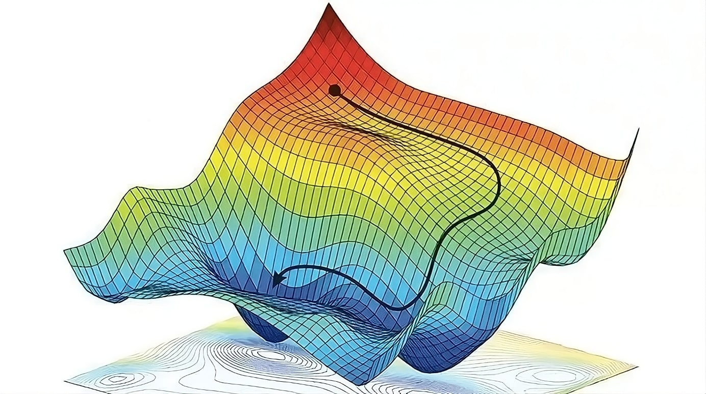
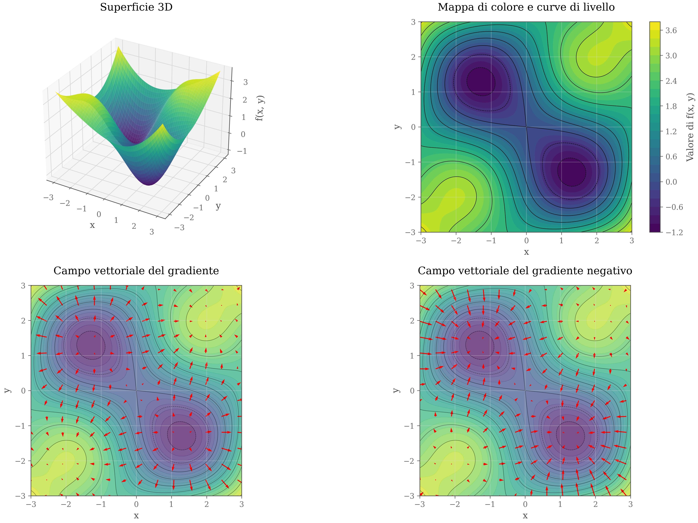
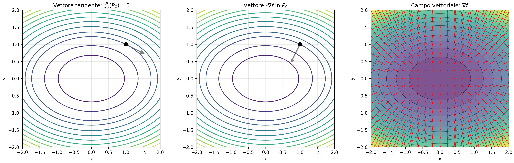
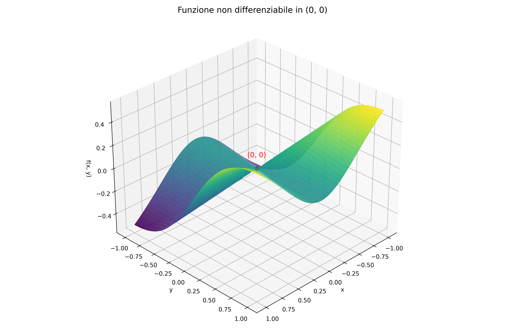
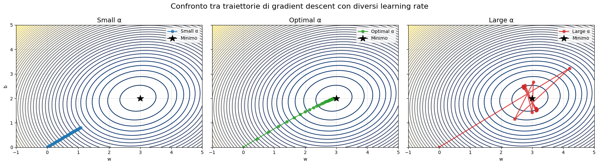

# Discesa del Gradiente

La discesa del gradiente (*Gradient Descent*, GD) è un algoritmo iterativo di minimizzazione del primo ordine. Viene definito **iterativo** poiché esegue una sequenza di aggiornamenti successivi per determinare un minimo locale della funzione obiettivo, a partire da una condizione iniziale.

È possibile che invece di un minimo locale (o globale), l'algoritmo si interrompa su un punto di sella. Durante la discesa del gradiente, l’algoritmo cerca punti dove il valore della funzione diminuisce. Se si avvicina a un punto di sella, il gradiente (cioè l'indicazione della direzione in cui scendere) può diventare molto piccolo, e questo può **rallentare o bloccare** temporaneamente l’ottimizzazione. Anche se i punti di sella esistono, è **molto improbabile** che la discesa del gradiente si fermi esattamente su uno di essi, per due motivi principali:

1. **Instabilità numerica**: i punti di sella sono instabili — basta una piccola variazione (come un errore di arrotondamento o un passo leggermente diverso) per spingere l’algoritmo lontano dal punto di sella.

2. **Alta dimensionalità**: negli spazi ad alta dimensione, i punti di sella sono molto più frequenti dei minimi, ma anche molto più "facili da evitare". È molto raro "cadere" perfettamente in un punto di sella, e ancor più raro restarci a lungo.

In pratica, anche se ci si può avvicinare a un punto di sella, la discesa del gradiente tende naturalmente a superarlo e continuare verso un minimo.

Un aspetto cruciale della discesa del gradiente è che, nel caso di funzioni **non convesse**, non possiamo garantire che l'algoritmo trovi il minimo globale. Infatti, tali funzioni possono presentare **molteplici minimi locali**, e il punto di convergenza dipenderà dalle condizioni iniziali del modello.

L'intuizione alla base della discesa del gradiente è piuttosto semplice:

1. Si parte da un punto iniziale nello spazio dei parametri.  
2. Si calcola il gradiente della funzione obiettivo in quel punto, il quale indica la direzione di massima crescita.  
3. Per minimizzare la funzione, ci si sposta nella direzione opposta a quella del gradiente, effettuando un "passo" in quella direzione.  
4. Questo processo viene ripetuto fino al raggiungimento di un criterio di arresto (convergenza).



*Figura 1.0: Discesa del Gradiente su una funzione loss non convessa*

Formalmente, il processo di aggiornamento iterativo può essere espresso come:

$$
\Theta^{(t+1)} \leftarrow \Theta^{(t)} - \alpha \nabla \ell_{\Theta^{(t)}}
$$

dove:

- $\Theta^{(t)}$ rappresenta i parametri del modello all'iterazione $t$,
- $\alpha$ è il **tasso di apprendimento** (*learning rate*), un iperparametro che determina l'ampiezza del passo nella direzione del gradiente,
- $\nabla \ell_{\Theta^{(t)}}$ è il gradiente della funzione di perdita $\ell$ rispetto ai parametri $\Theta$.

Ovviamente, per poter calcolare correttamente il gradiente di una funzione, e quindi eseguire correttamente la discesa del gradiente, abbiamo bisogno che la funzione $\ell$ sia differenziabile in ogni suo punto.

Infatti, non basta che sia definita la derivata parziale di $\ell$ rispetto a ogni singola variabile $\theta_i$, ma è necessario che $\ell$ abbia un gradiente continuo.

Possiamo anche, tramite l'unrolling ricorsivo, riscrivere esplicitamente $\Theta^{(t+1)}$ come:

$$
\begin{align*}
\Theta^{(1)}   &= \Theta^{(0)} - \alpha \nabla \ell_{\Theta^{(0)}}\\
\Theta^{(2)}   &= \Theta^{(1)} - \alpha \nabla \ell_{\Theta^{(1)}}\\
               &= \Theta^{(0)} - \alpha \nabla \ell_{\Theta^{(0)}} - \alpha \nabla \ell_{\Theta^{(1)}}\\
\vdots\\
\Theta^{(t+1)} &= \Theta^{(0)} - \alpha \sum_{i=0}^{t} \nabla \ell_{\Theta^{(i)}}.
\end{align*}
$$

Il criterio di arresto più comune è la verifica della norma del gradiente:

$$
\|\nabla \ell_{\Theta^{(t)}}\| \leq \epsilon
$$

dove $\epsilon$ è una soglia positiva molto piccola che determina il livello di precisione desiderato.

## Interpretazione Geometrica

Dal punto di vista geometrico, la discesa del gradiente segue una traiettoria nello spazio dei parametri, cercando il punto in cui la funzione di perdita assume un valore minimo. Se la funzione è convessa, l'algoritmo convergerà al minimo globale; altrimenti, si fermerà in un minimo locale. 

È importante notare che, a causa della precisione finita delle macchine, difficilmente si raggiungerà un punto esattamente stazionario, ma ci si fermerà quando la variazione della funzione di perdita diventa trascurabile.

## Proprietà del Gradiente

### Ortogonalità e Massima Crescita

Non abbiamo ancora fornito una giustificazione formale dell'affermazione secondo cui il gradiente di una funzione in un dato punto rappresenta la direzione di massima crescita della funzione stessa.

Per comprendere meglio questo concetto, introduciamo la **derivata direzionale**, una generalizzazione della derivata tradizionale nel dominio unidimensionale $\mathbb{R}$. Mentre nella retta reale esiste un'unica direzione lungo cui calcolare la derivata, in $\mathbb{R}^n$ (per $n \geq 2$) non esiste una direzione privilegiata per valutare la variazione di una funzione.

La derivata direzionale di una funzione differenziabile $f: \mathbb{R}^n \to \mathbb{R}$ lungo una direzione unitaria $\mathbf{v}$ è definita come:

$$
D_{\mathbf{v}} f(\mathbf{x}) = \lim_{h \to 0} \frac{f(\mathbf{x} + h \mathbf{v}) - f(\mathbf{x})}{h}.
$$

Questa definizione generalizza la derivata parziale $\frac{\partial f}{\partial x}$, che assume che la direzione considerata sia allineata con uno degli assi canonici (ovvero, solo una variabile cambia alla volta mentre le altre restano fisse). Al contrario, la derivata direzionale consente una variazione simultanea di tutte le variabili lungo una direzione arbitraria $\mathbf{v}$.

### Relazione tra Curve di Livello, Derivata Direzionale e Gradiente

Le **curve di livello** di una funzione sono le curve (o ipersuperfici) lungo le quali la funzione assume lo stesso valore. Ciò implica che la derivata direzionale della funzione in un punto appartenente alla curva, lungo una direzione tangente alla curva stessa, sia nulla, poiché la funzione non varia localmente in quella direzione.

Formalmente, se $\mathbf{v}$ è un vettore tangente alla curva di livello di $f$, allora

$$
\langle \nabla f, \mathbf{v} \rangle = 0.
$$

Questo risultato implica che il **gradiente è ortogonale alla curva di livello** e punta nella direzione di massima crescita della funzione. Inoltre, si può dimostrare che esso è orientato verso curve di livello con valori maggiori della funzione (ovvero, verso l'incremento della funzione stessa).

Questo concetto è riassunto nella seguente rappresentazione grafica:

- Le curve di livello rappresentano i punti di uguale valore della funzione.
- Il gradiente è sempre perpendicolare a tali curve.
- La discesa del gradiente segue la direzione opposta al gradiente stesso per minimizzare la funzione.

```python
import numpy as np
import matplotlib.pyplot as plt
from mpl_toolkits.mplot3d import Axes3D  # Necessario per i plot 3D

# Definizione della funzione f(x, y)
def f(x, y):
    """
    Esempio di funzione con più minimi locali.
    Puoi modificarla come preferisci.
    """
    return 0.2 * (x**2 + y**2) + 2.0 * np.sin(x) * np.sin(y)

# Definizione del gradiente di f(x, y)
def grad_f(x, y):
    """
    Calcola il gradiente di f(x, y): restituisce (df/dx, df/dy).
    """
    dfdx = 0.4 * x + 2.0 * np.cos(x) * np.sin(y)
    dfdy = 0.4 * y + 2.0 * np.sin(x) * np.cos(y)
    return dfdx, dfdy

# Creazione della griglia di punti per i plot
N = 200  # Numero di punti per dimensione
x_vals = np.linspace(-3, 3, N)
y_vals = np.linspace(-3, 3, N)
X, Y = np.meshgrid(x_vals, y_vals)
Z = f(X, Y)

# Calcolo del gradiente su una griglia più rada per la visualizzazione del campo vettoriale
step = 15  # Passo per la selezione dei punti per il campo vettoriale
x_quiver = X[::step, ::step]
y_quiver = Y[::step, ::step]
dfdx, dfdy = grad_f(x_quiver, y_quiver)

# Creazione della figura con 2 righe e 2 colonne, usando width_ratios per modificare le dimensioni dei subplot in alto
fig = plt.figure(figsize=(16, 10))
gs = fig.add_gridspec(2, 2, width_ratios=[3, 2])

# -------------------------------------------------------------------------
# Pannello 1 (in alto a sinistra): Plot 3D della superficie (più grande)
# -------------------------------------------------------------------------
ax1 = fig.add_subplot(gs[0, 0], projection='3d')
surf = ax1.plot_surface(X, Y, Z, cmap='viridis', edgecolor='none', alpha=0.9)
ax1.set_title('Superficie 3D')
ax1.set_xlabel('x')
ax1.set_ylabel('y')
ax1.set_zlabel('f(x, y)')

# -------------------------------------------------------------------------
# Pannello 2 (in alto a destra): Mappa di colore e curve di livello (più quadrato)
# -------------------------------------------------------------------------
ax2 = fig.add_subplot(gs[0, 1])
cont = ax2.contourf(X, Y, Z, levels=30, cmap='viridis')
ax2.contour(X, Y, Z, levels=10, colors='black', linewidths=0.5)
ax2.set_title('Mappa di colore e curve di livello')
ax2.set_xlabel('x')
ax2.set_ylabel('y')
ax2.set_aspect('equal', adjustable='box')  # Forza un aspetto quadrato
cbar = plt.colorbar(cont, ax=ax2)
cbar.set_label('Valore di f(x, y)')

# -------------------------------------------------------------------------
# Pannello 3 (in basso a sinistra): Campo vettoriale del gradiente positivo
# -------------------------------------------------------------------------
ax3 = fig.add_subplot(gs[1, 0])
ax3.contourf(X, Y, Z, levels=30, cmap='viridis', alpha=0.7)
ax3.contour(X, Y, Z, levels=10, colors='black', linewidths=0.5, alpha=0.5)
Q = ax3.quiver(x_quiver, y_quiver, dfdx, dfdy, color='red', scale=50)
ax3.set_title('Campo vettoriale del gradiente')
ax3.set_xlabel('x')
ax3.set_ylabel('y')
ax3.set_aspect('equal')

# -------------------------------------------------------------------------
# Pannello 4 (in basso a destra): Campo vettoriale del gradiente negativo
# -------------------------------------------------------------------------
ax4 = fig.add_subplot(gs[1, 1])
ax4.contourf(X, Y, Z, levels=30, cmap='viridis', alpha=0.7)
ax4.contour(X, Y, Z, levels=10, colors='black', linewidths=0.5, alpha=0.5)
Q2 = ax4.quiver(x_quiver, y_quiver, -dfdx, -dfdy, color='red', scale=50)
ax4.set_title('Campo vettoriale del gradiente negativo')
ax4.set_xlabel('x')
ax4.set_ylabel('y')
ax4.set_aspect('equal')

plt.tight_layout()
plt.savefig('./images/gradient.jpg', 
           dpi=300, 
           bbox_inches='tight',
           pad_inches=0.05,  # Aggiungere questo parametro
           #facecolor=fig.get_facecolor(),  # Mantenere il colore di sfondo
           transparent=False)  # Disabilitare la trasparenza
plt.show()
```



*Figura 1.1: Visualizzazione della funzione $f(x,y)$ con la sua superficie 3D, mappa di livello e campi vettoriali del gradiente positivo e negativo, evidenziando le direzioni di massima variazione.*

Questa proprietà è fondamentale nelle tecniche di ottimizzazione basate sul gradiente, in quanto garantisce che muovendosi nella direzione opposta al gradiente si riduce il valore della funzione obiettivo.

```python
import numpy as np
import matplotlib.pyplot as plt

# Definizione della funzione e del suo gradiente
def f(x, y):
    return 0.5 * x**2 + y**2

def grad_f(x, y):
    return x, 2 * y

# Creazione della griglia di punti
N = 200
x_vals = np.linspace(-2, 2, N)
y_vals = np.linspace(-2, 2, N)
X, Y = np.meshgrid(x_vals, y_vals)
Z = f(X, Y)

# Punto di interesse P0
P0 = (1, 1)
gx, gy = grad_f(P0[0], P0[1])  # gradiente in P0

# Calcolo della direzione tangente (v) a partire dalla condizione: <grad, v> = 0
# Scegliamo v = (2, -1) che è ortogonale a (1,2) (poichè 1*2 + 2*(-1) = 0)
v = np.array([2, -1], dtype=float)
v = v / np.linalg.norm(v)  # normalizzo

# Calcolo del vettore -gradiente in P0 (direzione di discesa)
neg_grad = -np.array([gx, gy])
if np.linalg.norm(neg_grad) > 1e-10:
    neg_grad_unit = neg_grad / np.linalg.norm(neg_grad)
else:
    neg_grad_unit = neg_grad

# Lunghezze per le frecce
arrow_len = 0.5

# Creazione della figura con 3 pannelli affiancati
fig, axes = plt.subplots(1, 3, figsize=(16, 5))

# ---------------------------
# Pannello 1: Curva di livello + vettore tangente (df/dv = 0)
# ---------------------------
ax1 = axes[0]
cont1 = ax1.contour(X, Y, Z, levels=15, cmap='viridis')
ax1.plot(P0[0], P0[1], 'ko', label=r'$P_0$')
# Calcolo del punto finale per la freccia tangente
P1 = (P0[0] + arrow_len * v[0], P0[1] + arrow_len * v[1])
ax1.annotate('', xy=P1, xytext=P0, 
             arrowprops=dict(arrowstyle='->', color='blue', lw=2))
ax1.set_title(r'Vettore tangente: $\frac{df}{dv}(P_0)=0$')
ax1.set_xlabel('x')
ax1.set_ylabel('y')
ax1.set_aspect('equal')

# ---------------------------
# Pannello 2: Curva di livello + vettore -gradiente
# ---------------------------
ax2 = axes[1]
cont2 = ax2.contour(X, Y, Z, levels=15, cmap='viridis')
ax2.plot(P0[0], P0[1], 'ko', label=r'$P_0$')
# Punto finale per la freccia -gradiente
P2 = (P0[0] + arrow_len * neg_grad_unit[0], P0[1] + arrow_len * neg_grad_unit[1])
ax2.annotate('', xy=P2, xytext=P0,
             arrowprops=dict(arrowstyle='->', color='red', lw=2))
ax2.set_title(r'Vettore -$\nabla f$ in $P_0$')
ax2.set_xlabel('x')
ax2.set_ylabel('y')
ax2.set_aspect('equal')

# ---------------------------
# Pannello 3: Campo vettoriale dell'intero gradiente
# ---------------------------
ax3 = axes[2]
cont3 = ax3.contourf(X, Y, Z, levels=15, cmap='viridis', alpha=0.7)
ax3.contour(X, Y, Z, levels=15, colors='black', linewidths=0.5, alpha=0.5)
# Campo vettoriale (quiver) per il gradiente
step = 10
xq = X[::step, ::step]
yq = Y[::step, ::step]
gxq, gyq = grad_f(xq, yq)
ax3.quiver(xq, yq, gxq, gyq, color='red', scale=30)
ax3.set_title(r'Campo vettoriale: $\nabla f$')
ax3.set_xlabel('x')
ax3.set_ylabel('y')
ax3.set_aspect('equal')

plt.tight_layout()
plt.savefig('./images/gradient.jpg', 
           dpi=300, 
           bbox_inches='tight',
           pad_inches=0.05,  # Aggiungere questo parametro
           #facecolor=fig.get_facecolor(),  # Mantenere il colore di sfondo
           transparent=False)  # Disabilitare la trasparenza
plt.show()
```



*Figura 1.2: Ortogonalità tra il vettore tangente alla curva di livello e il vettore -gradiente*

## Differenziabilità

Come abbiamo visto, il gradiente è l’elemento chiave nel funzionamento della discesa del gradiente. Ma ci si potrebbe chiedere: **tutte le funzioni di perdita permettono il calcolo del gradiente?**

La risposta è: **non sempre**.

Non tutte le funzioni sono **differenziabili**, cioè non tutte ammettono un gradiente ben definito in ogni punto del dominio. Questo è un problema rilevante, perché **la discesa del gradiente richiede che la funzione sia differenziabile**, altrimenti il gradiente potrebbe non esistere in certi punti e l’algoritmo potrebbe bloccarsi o dare risultati errati.

### Derivate parziali ≠ Differenziabilità

In una funzione di più variabili, avere **tutte le derivate parziali definite** non è sufficiente per garantire la differenziabilità. Infatti, può succedere che tutte le derivate esistano, ma non siano continue — e questo è un segnale che la funzione **non è veramente differenziabile**.

Un esempio classico è la seguente funzione:

- $f(x, y) = 0$ se $(x, y) = (0, 0)$
- $f(x, y) = \frac{x^2 y}{x^2 + y^2}$ altrimenti

```python
import numpy as np
import matplotlib.pyplot as plt
from mpl_toolkits.mplot3d import Axes3D

# Funzione definita a tratti
def f(x, y):
    with np.errstate(divide='ignore', invalid='ignore'):
        z = np.where((x == 0) & (y == 0), 0, (x**2 * y) / (x**2 + y**2))
    return z

# Griglia
x = np.linspace(-1, 1, 200)
y = np.linspace(-1, 1, 200)
X, Y = np.meshgrid(x, y)
Z = f(X, Y)

# Figura Matplotlib
fig = plt.figure(figsize=(12, 8))  # circa 1920x1080
ax = fig.add_subplot(111, projection='3d')

# Superficie
surf = ax.plot_surface(X, Y, Z, cmap='viridis', edgecolor='none', alpha=0.9)

# Punto non differenziabile all'origine
ax.scatter(0, 0, 0, color='red', s=50)
ax.text(0, 0, 0.1, '(0, 0)', color='red', fontsize=12, ha='center')

# Etichette
ax.set_title('Funzione non differenziabile in (0, 0)', fontsize=14)
ax.set_xlabel('x')
ax.set_ylabel('y')
ax.set_zlabel('f(x, y)')

# Vista iniziale
ax.view_init(elev=30, azim=45)

# Salvataggio in HD
plt.tight_layout()
plt.savefig("gradient-non-differentiable.png", dpi=300)
plt.show()
```



*Figura 1.3: Funzione non differenziabile*

Questa funzione ha derivate parziali definite ovunque, ma una di esse (in particolare rispetto a $y$) è **discontinua nell’origine**, e questo significa che $f$ **non è differenziabile** in $(0, 0)$.

### Implicazioni pratiche

Fortunatamente, nella pratica si usano spesso funzioni di perdita ben progettate, che sono **lisce e differenziabili** quasi ovunque. Tuttavia, **non è raro incontrare funzioni di perdita non differenziabili**, ad esempio con funzioni *piecewise* o attivazioni come la ReLU.

In questi casi, si adottano diverse strategie per rendere il problema trattabile:

- **Modifica o sostituzione della funzione** con una variante liscia (es. ReLU → Softplus)
- **Tecniche come il "reparametrization trick"** nei modelli generativi come le VAE, che permettono il passaggio del gradiente anche quando la funzione non è differenziabile nel senso classico

In conclusione, **la differenziabilità è un requisito fondamentale per l’applicazione diretta della discesa del gradiente**, ma esistono metodi e tecniche per aggirare o gestire in modo efficace i casi in cui essa venga meno.

## Learning Rate

Nella legge di aggiornamento della discesa del gradiente:

$$
\Theta^{(t+1)} = \Theta^{(t)} - \alpha \nabla \ell_{\Theta^{(t)}},
$$

il parametro $\alpha$ gioca un ruolo fondamentale. Questo parametro si chiama **learning rate** (tasso di apprendimento) ed è un **iperparametro**, cioè non viene appreso durante l’ottimizzazione, ma deve essere scelto manualmente (o tramite ricerca automatica).

Il learning rate è **sempre positivo**: se fosse negativo, infatti, ci si muoverebbe nella direzione opposta a quella desiderata, **massimizzando** invece che minimizzando la funzione di perdita.

### Effetti del learning rate

Il valore di $\alpha$ determina **quanto grande è ogni passo** che l’algoritmo compie nella direzione opposta al gradiente. Non coincide esattamente con la lunghezza del passo (che dipende anche dalla norma del gradiente), ma è **proporzionale ad essa**.

A seconda della sua scelta, il comportamento dell’algoritmo può variare notevolmente:

- Se **$\alpha$ è troppo piccolo**, l’algoritmo avanza molto lentamente e richiede molte iterazioni per convergere.
- Se **$\alpha$ è troppo grande**, si rischia di **superare il minimo**, causando **oscillazioni** o addirittura **divergenza**.
- Esiste un valore "ottimale" $\alpha^*$ per ogni punto, che minimizzerebbe la funzione lungo la direzione di discesa. Tuttavia, trovare questo valore è difficile perché richiederebbe una soluzione chiusa del problema, che **non è disponibile in generale** per funzioni non lineari.

Questa situazione è illustrata nella seguente figura:

```python
import numpy as np
import matplotlib.pyplot as plt

# Dati sintetici
np.random.seed(42)
X = np.random.randn(100, 1)
y = 3 * X.squeeze() + 2 + np.random.randn(100) * 0.5

# Funzione di perdita
def loss(w, b, X, y):
    y_pred = w * X.squeeze() + b
    return np.mean((y - y_pred) ** 2)

# Gradiente
def gradients(w, b, X, y):
    y_pred = w * X.squeeze() + b
    error = y_pred - y
    dw = 2 * np.mean(error * X.squeeze())
    db = 2 * np.mean(error)
    return dw, db

# Allenamento
def train(alpha, steps=30):
    w, b = 0.0, 0.0
    trajectory = [(w, b)]
    for _ in range(steps):
        dw, db = gradients(w, b, X, y)
        w -= alpha * dw
        b -= alpha * db
        trajectory.append((w, b))
    return trajectory

# Parametri per i plot
alphas = [0.01, 0.1, 0.95]
titles = ['Small α', 'Optimal α', 'Large α']
colors = ['#1f77b4', '#2ca02c', '#d62728']
trajectories = [train(alpha) for alpha in alphas]

# Curve di livello
w_range = np.linspace(-1, 5, 100)
b_range = np.linspace(0, 5, 100)
W, B = np.meshgrid(w_range, b_range)
Z = np.array([[loss(w, b, X, y) for w in w_range] for b in b_range])

# Plot
fig, axs = plt.subplots(1, 3, figsize=(18, 5), sharey=True)
for ax, traj, title, color in zip(axs, trajectories, titles, colors):
    contours = ax.contour(W, B, Z, levels=50, cmap='cividis')
    w_vals, b_vals = zip(*traj)
    ax.plot(w_vals, b_vals, marker='o', color=color, linewidth=2, alpha=0.8, label=title)
    ax.plot(3, 2, marker='*', color='black', markersize=15, label='Minimo')
    ax.set_title(title, fontsize=14)
    ax.set_xlabel('w')
    ax.grid(True, linestyle='--', alpha=0.5)
    ax.legend()
axs[0].set_ylabel('b')
plt.suptitle('Confronto tra traiettorie di gradient descent con diversi learning rate', fontsize=16)
plt.tight_layout()
plt.subplots_adjust(top=0.85)
plt.show()
```

<p align="center">
  
</p>

*Figura 2.0: Confronto tra learning rate troppo piccolo, troppo grande e ottimale*

### Line Search

Una strategia per scegliere dinamicamente il valore di $\alpha$ è il **line search**: una procedura che, una volta nota la direzione di discesa $-\nabla \ell_{\Theta^{(t)}}$, cerca il valore di $\alpha$ che **massimizza la diminuzione** della funzione di perdita lungo quella direzione. In pratica, si risolve un piccolo problema di ottimizzazione interno a ogni passo.

Questa tecnica è più costosa, ma può migliorare la stabilità e l'efficacia dell’ottimizzazione.

### Decadimento del learning rate

In alternativa al line search, è comune utilizzare **strategie di decadimento** del learning rate, cioè farlo **diminuire nel tempo** secondo una certa regola:

- **Decadimento lineare**:  
  $$ \alpha^{(t+1)} = \alpha^{(0)} - \rho t $$
- **Decadimento razionale**:  
  $$ \alpha^{(t+1)} = \frac{\alpha^{(0)}}{1 + \rho t} $$
- **Decadimento esponenziale**:  
  $$ \alpha^{(t+1)} = \alpha^{(0)} e^{-\rho t} $$

dove $\rho$ è un parametro di decadimento.

L’idea alla base è che all’inizio si vogliono fare **passi ampi** per esplorare rapidamente lo spazio dei parametri, mentre verso la fine servono **passi piccoli** per affinare la soluzione e garantire la convergenza ottimale.

### Considerazioni pratiche

Non esiste una "ricetta perfetta" per scegliere il learning rate o la sua strategia di aggiornamento. Molto spesso, la scelta viene fatta tramite:

- **esperienza pratica**
- **grid search o random search**
- **ottimizzazione bayesiana o altri metodi automatici**

Alcuni algoritmi, come **Adam**, includono meccanismi per **adattare automaticamente il learning rate** per ogni parametro, rendendo l'ottimizzazione più robusta e spesso più veloce.

## Batch, Mini-Batch e Stochastic Gradient Descent

La discesa del gradiente nella sua forma classica (chiamata **Batch Gradient Descent**) utilizza l'intero dataset per calcolare il gradiente della funzione di perdita. Questo approccio fornisce una direzione precisa, ma può essere computazionalmente costoso, specialmente su dataset di grandi dimensioni.

Per ovviare a questo problema, sono state sviluppate varianti più efficienti:

### 1. **Batch Gradient Descent**

In questo approccio, ad ogni iterazione viene utilizzato **l'intero dataset** per calcolare il gradiente:

$$
\Theta^{(t+1)} \leftarrow \Theta^{(t)} - \alpha \cdot \frac{1}{n} \sum_{i=1}^{n} \nabla \ell^{(i)}(\Theta^{(t)}).
$$

Si calcola quindi il gradiente della funzione di perdita per ogni esempio del dataset, e poi si effettua il passo di discesa con la media dei gradiente. Quindi un epoca in questo caso sonsiste in un solo passo di discesa.

- Vantaggi: direzione precisa della discesa.
- Svantaggi: lento per dataset molto grandi, non aggiornabile in tempo reale.

### 2. **Stochastic Gradient Descent (SGD)**

In questo caso, l'aggiornamento dei parametri viene effettuato **per ogni singolo esempio** del dataset:

$$
\Theta^{(t+1)} \leftarrow \Theta^{(t)} - \alpha \cdot \nabla \ell^{(i)}(\Theta^{(t)}).
$$

Quindi un epoca in questo caso consiste in $n$ passi di discesa (iterazioni). Questo perché si calcola il gradiente per ogni esempio del dataset, quindi si effettua $n$ passi di discesa.

- Vantaggi: aggiornamenti molto rapidi, buona approssimazione della direzione di discesa.
- Svantaggi: il rumore introdotto da ogni esempio può causare oscillazioni e rendere difficile la convergenza stabile.

### 3. **Mini-Batch Gradient Descent**

Rappresenta un compromesso tra le due precedenti. Si utilizza un **sottoinsieme (mini-batch)** di $m$ campioni (con $m \ll n$) per calcolare il gradiente:

$$
\Theta^{(t+1)} \leftarrow \Theta^{(t)} - \alpha \cdot \frac{1}{m} \sum_{j=1}^{m} \nabla \ell^{(j)}(\Theta^{(t)}).
$$

Qui calcoliamo ogni volta il gradiente su $m$ esempi, quindi un epoca in questo caso consiste in $\frac{n}{m}$ passi di discesa (iterazioni).

- Vantaggi: bilancia precisione e velocità, sfrutta l'efficienza computazionale del calcolo vettoriale su GPU.
- È la scelta più comune nelle reti neurali moderne.

### Confronto Grafico

Il seguente esempio Python illustra la differenza tra Batch, Mini-Batch e Stochastic Gradient Descent, evidenziando le traiettorie nel piano dei parametri:

```python
import numpy as np
import matplotlib.pyplot as plt

# Dati sintetici
np.random.seed(42)
X = np.random.randn(100, 1)
y = 3 * X.squeeze() + 2 + np.random.randn(100) * 0.5

# Funzione di perdita
def loss(w, b, X, y):
    y_pred = w * X.squeeze() + b
    return np.mean((y - y_pred) ** 2)

# Gradiente
def gradients(w, b, X, y):
    y_pred = w * X.squeeze() + b
    error = y_pred - y
    dw = 2 * np.mean(error * X.squeeze())
    db = 2 * np.mean(error)
    return dw, db

# Addestramento con step uniformi
def train(method='batch', batch_size=10, steps=30, alpha=0.1):
    w, b = 0.0, 0.0
    trajectory = [(w, b)]
    
    if method == 'batch':
        for _ in range(steps):
            dw, db = gradients(w, b, X, y)
            w -= alpha * dw
            b -= alpha * db
            trajectory.append((w, b))

    elif method == 'sgd':
        indices = np.random.permutation(len(X))
        for i in range(steps):
            idx = indices[i % len(X)]
            dw, db = gradients(w, b, X[idx:idx+1], y[idx:idx+1])
            w -= alpha * dw
            b -= alpha * db
            trajectory.append((w, b))

    elif method == 'minibatch':
        batch_size = max(1, len(X) // steps)
        for i in range(steps):
            indices = np.random.choice(len(X), batch_size, replace=False)
            X_batch = X[indices]
            y_batch = y[indices]
            dw, db = gradients(w, b, X_batch, y_batch)
            w -= alpha * dw
            b -= alpha * db
            trajectory.append((w, b))
            
    return trajectory

# Tracciamento traiettorie (30 step)
traj_batch = train(method='batch', steps=30)
traj_sgd = train(method='sgd', steps=30)
traj_minibatch = train(method='minibatch', steps=30)

# Curve di livello
w_range = np.linspace(-1, 5, 100)
b_range = np.linspace(0, 5, 100)
W, B = np.meshgrid(w_range, b_range)
Z = np.array([[loss(w, b, X, y) for w in w_range] for b in b_range])

# Livelli coerenti e ordinati
min_loss = np.min(Z)
lower_limit = min(min_loss, 0.5)
all_levels = np.linspace(lower_limit, np.max(Z), 50)

# Plot
plt.figure(figsize=(12, 8))
contours = plt.contour(W, B, Z, levels=all_levels, cmap='cividis')
plt.clabel(contours, inline=True, fontsize=8, fmt='%.2f')

# Colori desaturati
colors = ['#3e8250', '#567991', '#b05541']

# Traiettorie
for traj, label, color in zip([traj_batch, traj_sgd, traj_minibatch],
                              ['Batch GD', 'SGD', 'Mini-Batch GD'],
                              colors):
    w_vals, b_vals = zip(*traj)
    plt.plot(w_vals, b_vals, marker='o', label=label, linewidth=2, alpha=0.7, color=color)

# Minimo globale (approssimato analiticamente: w=3, b=2)
plt.plot(3, 2, marker='*', color='black', markersize=15, label='Minimo')

# Zoom centrato ma visibile anche l'origine
plt.xlim(-0.1, 4.0)
plt.ylim(0.0, 3.5)

# Stile
plt.xlabel('w', fontsize=12)
plt.ylabel('b', fontsize=12)
plt.title('Curve di livello della funzione di perdita con traiettorie', fontsize=14)
plt.legend()
plt.grid(True, linestyle='--', alpha=0.5)
plt.tight_layout()
plt.show()
```


*Figura 1.3: Confronto visivo tra le traiettorie di Batch Gradient Descent, SGD e Mini-Batch Gradient Descent*

### Conclusione

Le varianti del Gradient Descent offrono una gamma di compromessi tra accuratezza, velocità e stabilità. In pratica:

- **Batch GD** è utile per modelli piccoli e dataset contenuti.
- **SGD** è adatto a scenari online o dataset giganteschi.
- **Mini-Batch GD** è lo standard nell'apprendimento profondo per la sua efficienza.

Le tecniche moderne includono anche ottimizzatori avanzati (come Adam, RMSProp, Adagrad), che combinano il gradiente con meccanismi adattivi per un miglior controllo della discesa, che tratteremo proprio nella sezione successiva.

## Discesa del Gradiente con Momentum

Uno dei principali limiti della discesa del gradiente standard è la sua **lentezza di convergenza** in presenza di **vallate strette e profonde** nella funzione di perdita, oppure in direzioni con **curvature molto diverse** (ad esempio funzioni “a sella” o “a banana”). In questi casi, l’algoritmo può oscillare lungo le direzioni di maggiore curvatura, rallentando notevolmente il percorso verso il minimo.

Per mitigare questo problema, viene introdotto il concetto di **momentum**, ispirato alla fisica newtoniana: invece di aggiornare i parametri unicamente in base al gradiente attuale e al learning rate, si tiene conto anche della **direzione e velocità del movimento passato**, accumulando “inerzia” lungo le direzioni coerenti.

### Formula dell'Aggiornamento con Momentum

L’algoritmo introduce una variabile ausiliaria $\mathbf{v}^{(t)}$ che rappresenta la “velocità” del sistema, aggiornata iterativamente secondo:

$$
\begin{aligned}
\mathbf{v}^{(t+1)} &= \lambda \cdot \mathbf{v}^{(t)} - \alpha \cdot \nabla \ell_{\Theta^{(t)}}, \\
\Theta^{(t+1)} &= \Theta^{(t)} + \mathbf{v}^{(t+1)}.
\end{aligned}
$$

dove:

- $\alpha$ è il **learning rate**,
- $\lambda \in [0,1)$ è il **coefficiente di momentum**, che controlla il peso del termine di velocità accumulato (valori tipici: $\lambda = 0.9$),
- $\nabla \ell_{\Theta^{(t)}}$ è il gradiente della funzione di perdita all’iterazione $t$,
- $\mathbf{v}^{(t)}$ è la velocità accumulata al passo precedente. Al tempo $t=0$, $\mathbf{v}^{(0)} = 0$.

### Interpretazione Intuitiva

- Quando i gradienti puntano nella **stessa direzione** in iterazioni successive, il termine $\lambda \cdot \mathbf{v}^{(t)}$ **rafforza** la velocità in quella direzione, rendendo l’avanzamento più rapido.
- Quando la direzione del gradiente **cambia spesso** (es. oscillazioni), il momentum **smorza le variazioni**, stabilizzando l’andamento e migliorando la convergenza.


*Figura 1.3: La discesa del gradiente con momentum permette una traiettoria più fluida e veloce verso il minimo, evitando oscillazioni e rallentamenti dovuti a curvature diverse nelle direzioni principali.*

### Derivazione della forma chiusa per GD con Momentum


L’obiettivo è derivare una **forma chiusa** (non ricorsiva) dell’aggiornamento dei parametri al tempo $t+1$, in funzione di tutti i gradienti calcolati fino a quel momento. In questo modo possiamo analizzare in modo più chiaro **l’effetto cumulativo del momentum**, che combina i gradienti passati pesandoli secondo una **decadimento geometrico** controllato dall' iperparametro $\lambda$. Questo permette di evidenziare come il metodo favorisca le direzioni persistenti nel tempo e smorzi le oscillazioni dovute a cambiamenti locali nel paesaggio della funzione di perdita.

Partiamo dalle **equazioni ricorsive** della discesa del gradiente con momentum:

$$
\begin{cases}
\mathbf{v}^{(t+1)} = \lambda\,\mathbf{v}^{(t)} - \alpha \,\nabla \ell\bigl(\Theta^{(t)}\bigr),\\
\Theta^{(t+1)} = \Theta^{(t)} + \mathbf{v}^{(t+1)}.
\end{cases}
$$

Vogliamo **unrollare** queste relazioni fino all’iterazione iniziale $\Theta^{(0)}$.

#### 1. Espressione ricorsiva di $\mathbf{v}^{(t+1)}$

Applichiamo più volte la definizione di $\mathbf{v}$:

$$
\begin{aligned}
\mathbf{v}^{(1)} &= \lambda\,\mathbf{v}^{(0)} - \alpha\,\nabla \ell(\Theta^{(0)}),\\ 
\mathbf{v}^{(2)} &= \lambda\,\mathbf{v}^{(1)} - \alpha\,\nabla \ell(\Theta^{(1)})\\
&= \lambda \bigl(\lambda\,\mathbf{v}^{(0)} - \alpha\,\nabla \ell(\Theta^{(0)})\bigr)
  - \alpha\,\nabla \ell(\Theta^{(1)})\\
&= \lambda^2 \mathbf{v}^{(0)}
  - \alpha \bigl(\lambda\,\nabla \ell(\Theta^{(0)}) + \nabla \ell(\Theta^{(1)})\bigr),
\end{aligned}
$$

e in generale, per $0 \le i \le t$:

$$
\mathbf{v}^{(t+1)}
= \lambda^{\,t+1}\mathbf{v}^{(0)}
- \alpha \sum_{i=0}^{t} \lambda^{\,t-i}\,\nabla \ell\bigl(\Theta^{(i)}\bigr).
$$

Spesso si assume $\mathbf{v}^{(0)}=\mathbf{0}$, da cui:

$$
\mathbf{v}^{(t+1)}
= -\,\alpha \sum_{i=0}^{t} \lambda^{\,t-i}\,\nabla \ell\bigl(\Theta^{(i)}\bigr).
$$

#### 2. Unrolling di $\Theta^{(t+1)}$

Ora inseriamo $\mathbf{v}^{(t+1)}$ nell’aggiornamento di $\Theta$:

$$
\begin{aligned}
\Theta^{(t+1)}
&= \Theta^{(t)} + \mathbf{v}^{(t+1)}\\
&= \Theta^{(t)} 
  - \alpha \sum_{i=0}^{t} \lambda^{\,t-i}\,\nabla \ell\bigl(\Theta^{(i)}\bigr).
\end{aligned}
$$

Ripetendo ricorsivamente l’aggiornamento su $\Theta^{(t)}, \Theta^{(t-1)}, \dots, \Theta^{(0)}$, otteniamo:

$$
\begin{aligned}
\Theta^{(t+1)}
&= \Theta^{(0)}
  - \alpha \sum_{k=0}^{t} \sum_{i=0}^{k} \lambda^{\,k-i}\,\nabla \ell\bigl(\Theta^{(i)}\bigr) \\
&= \Theta^{(0)}
  - \alpha \sum_{i=0}^{t} \Bigl(\sum_{k=i}^{t} \lambda^{\,k-i}\Bigr)\,\nabla \ell\bigl(\Theta^{(i)}\bigr).
\end{aligned}
$$

#### 3. Calcolo della somma geometrica interna

La somma interna $\displaystyle\sum_{k=i}^{t} \lambda^{\,k-i}$ è una **serie geometrica** di ragione $\lambda$ e $t-i+1$ termini:

$$
\sum_{k=i}^{t} \lambda^{\,k-i}
= \sum_{h=0}^{t-i} \lambda^{\,h}
= \frac{1 - \lambda^{\,t-i+1}}{1 - \lambda}.
$$

#### 4. Forma finale

Sostituendo nella formula di $\Theta^{(t+1)}$, otteniamo la forma chiusa:

$$
\boxed{
\Theta^{(t+1)} 
= \Theta^{(0)} 
- \alpha \sum_{i=0}^{t} 
      \underbrace{\frac{1 - \lambda^{\,t-i+1}}{1 - \lambda}}_{\Gamma_i^t}
  \,\nabla \ell\bigl(\Theta^{(i)}\bigr).
}
$$

Qui $\displaystyle\Gamma_i^t = \frac{1 - \lambda^{\,t+1-i}}{1 - \lambda}$ è il **fattore di accumulo** che deriva dalla somma geometrica.

Questa espansione chiarisce perché il momentum aiuta a **smussare oscillazioni** e a **favorire direzioni stabili**, facilitando la convergenza più rapida verso un minimo.


### Confronto con Gradient Descent Standard

| Metodo                    | Pro | Contro |
|--------------------------|------|--------|
| **Gradient Descent**     | Preciso, semplice da implementare | Lento in presenza di vallate strette |
| **Momentum Gradient Descent** | Convergenza più rapida e fluida | Richiede una variabile aggiuntiva ($\mathbf{v}$) e tuning di $\lambda$ |

### Osservazioni Finali

- Il termine $\lambda$ controlla **quanto "lontano" nel passato** guardiamo per l’accumulo di velocità. Valori troppo alti ($\lambda \approx 0.99$) possono causare overshooting, mentre valori bassi rendono il metodo simile al GD standard.
- Il metodo con momentum è la base di molte varianti moderne dell'ottimizzazione, tra cui **Nesterov Accelerated Gradient (NAG)** e **Adam**.

In sintesi, il momentum fornisce un **bilanciamento intelligente tra memoria del passato e reattività al presente**, migliorando l’efficienza di convergenza e la stabilità numerica della discesa del gradiente.

## Limiti Superiori Asintotici

Per problemi **convessi** esiste sempre un minimizzatore globale $f^*$. Vogliamo capire quante iterazioni servono ai nostri algoritmi basati su discesa del gradiente (GD) o discesa del gradiente stocastica (SGD) per avvicinarsi a $f^*$ con un’accuratezza $\rho$. Formalmente consideriamo l’ineguaglianza:

$$
\bigl|\ell(f_{\Theta}) - \ell(f^*)\bigr| < \rho,
$$

dove:

- $\ell(f_{\Theta})$ è il valore della loss ottenuta dal modello parametrizzato $\Theta$,
- $\ell(f^*)$ è il valore di loss al vero minimizzatore,
- $\rho > 0$ è la **precisione** desiderata.

### Notazione

- $n$ = numero di esempi di addestramento
- $d$ = numero di parametri del modello
- $\kappa$ = **condizionamento** del problema (rapporto tra costante di Lipschitz del gradiente e costante di forte convessità)
- $\nu$ = costante legata alla varianza del gradiente nei metodi stocastici

### Complessità per Iterazione

| Metodo | Costo per iterazione |
|:-------|:---------------------:|
| **GD** | $O(n\,d)$           |
| **SGD**| $O(d)$              |

- **GD** richiede di calcolare il gradiente su **tutti** i $n$ esempi (costo $O(n\,d)$).
- **SGD** usa un solo esempio per aggiornamento (costo $O(d)$), indipendente da $n$.

### Numero di Iterazioni per Raggiungere $\rho$

| Metodo | Iterazioni necessarie |
|:-------|:----------------------:|
| **GD** | $O\bigl(\kappa \,\log\frac{1}{\rho}\bigr)$ |
| **SGD**| $O\!\bigl(\tfrac{\nu\,\kappa^2}{\rho}\bigr)\;+\;o\!\bigl(\tfrac{1}{\rho}\bigr)$ |

- **GD** converge **esponenzialmente** in $\rho$: bastano $O(\kappa\log\frac1\rho)$ iterazioni.
- **SGD** converge più lentamente in termini di $\rho$ (ordine $1/\rho$), ma ogni passo è molto economico.

### Confronto Complessivo

| Metodo | Complessità totale fino a $\rho$  |
|--------|------------------------------------:|
| **GD** | $O\bigl(n\,d \times \kappa\log\frac1\rho\bigr)$ |
| **SGD**| $O\bigl(d \times \frac{\nu\,\kappa^2}{\rho}\bigr)$ (dominante) |

- **GD**: costo totale cresce linearmente con $n$ ma logaritmicamente con la precisione $\rho$.
- **SGD**: costo totale **non dipende** da $n$, favorendo buone capacità di generalizzazione su dataset molto grandi, ma cresce come $1/\rho$.

> **Conclusione:**  
> - Se $n$ è piccolo e serve alta precisione, **GD** può essere vantaggioso.  
> - Per **dataset enormi** o scenari online, dove $n$ è grande o infinito, **SGD** è preferibile grazie al costo per iterazione indipendente da $n$ e migliori proprietà di generalizzazione.  
