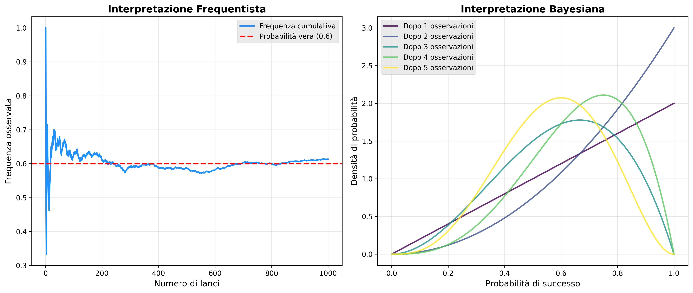
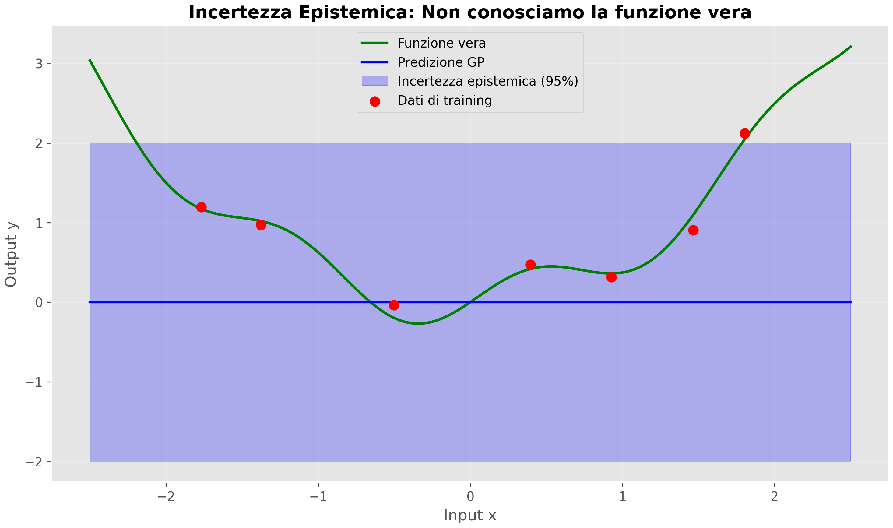
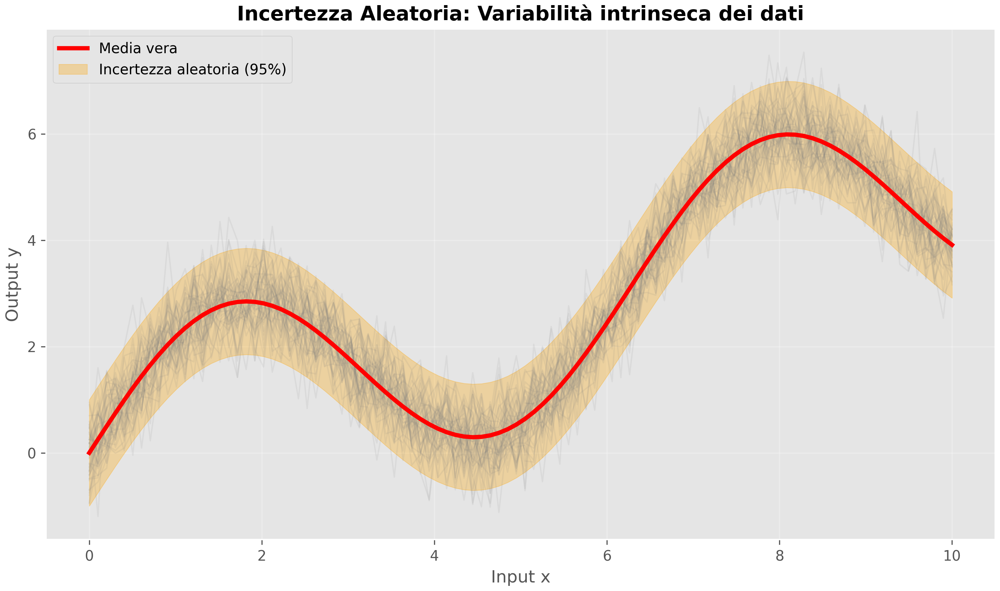
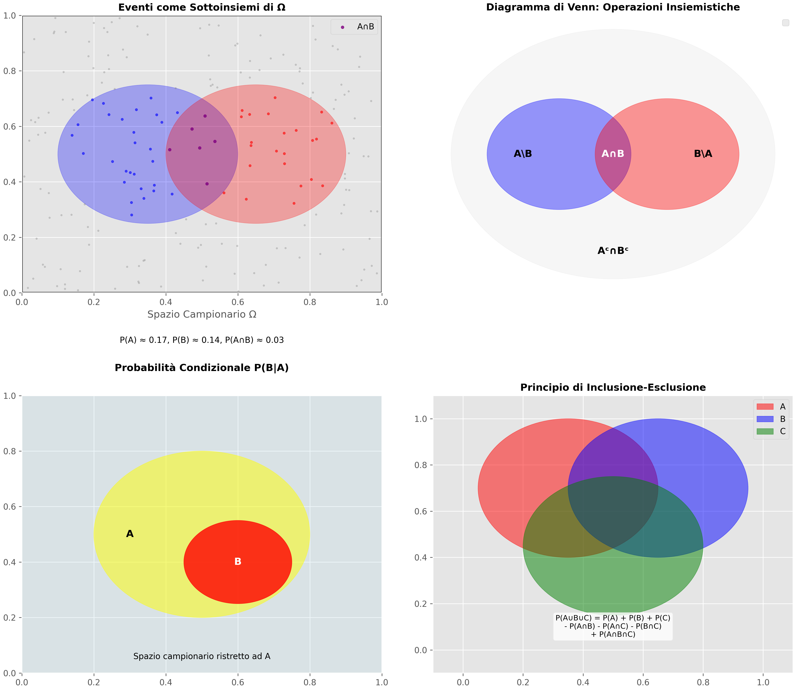
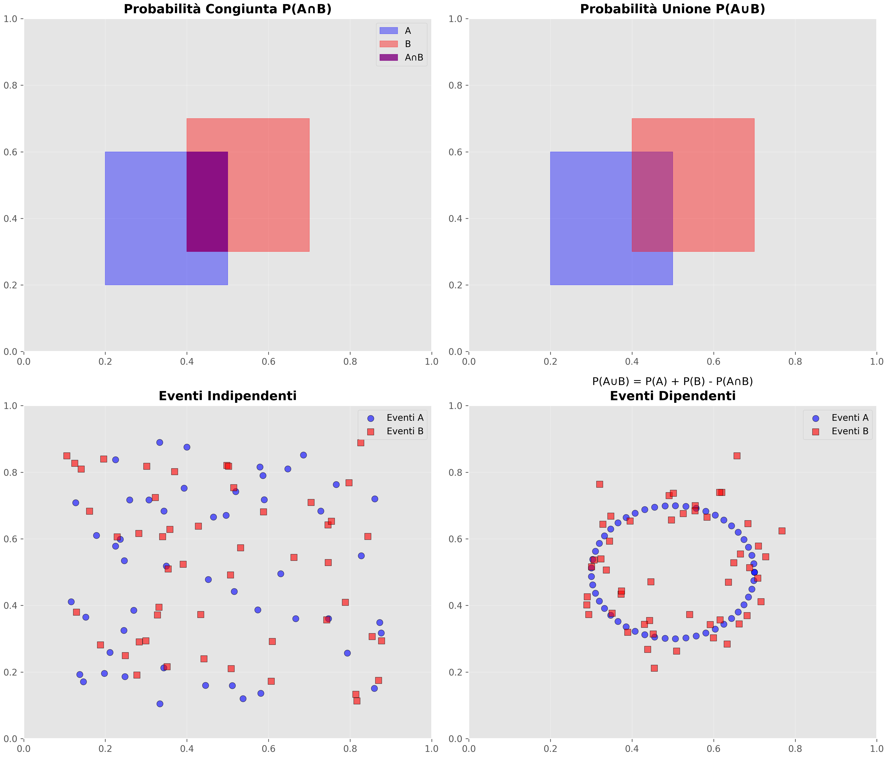

# Probabilità nel Machine Learning: Fondamenti Teorici

## Introduzione: Perché la Probabilità è Cruciale nel ML

La probabilità è il linguaggio matematico con cui descriviamo e quantifichiamo l'incertezza. Nel machine learning e nella data science, questa incertezza è onnipresente: dai dati rumorosi alle predizioni sui futuri eventi, dalla stima dei parametri di un modello alla valutazione della confidenza nelle nostre previsioni.

Come affermava Pierre-Simon Laplace nel 1812: *"La teoria della probabilità non è altro che buon senso ridotto a calcolo"*. Questa affermazione cattura perfettamente l'essenza della probabilità nel contesto moderno dell'intelligenza artificiale: trasformare l'intuizione umana sull'incertezza in strumenti matematici rigorosi e computabili.

## 1. Cos'è la Probabilità: Due Visioni Complementari

### 1.1 L'Interpretazione Frequentista

L'approccio frequentista interpreta la probabilità come **frequenza limite** di eventi ripetibili. Quando diciamo che una moneta ha probabilità 50% di uscire testa, intendiamo che, lanciandola infinite volte, la proporzione di teste convergerebbe al 50%.

**Caratteristiche principali:**

- Basata su esperimenti ripetibili
- La probabilità è una proprietà intrinseca del sistema
- Richiede grandi quantità di dati per essere accurata
- Ideale per fenomeni fisici ben definiti

**Esempio pratico:** La probabilità che un chip elettronico sia difettoso in una catena di produzione può essere stimata osservando migliaia di chip prodotti.

### 1.2 L'Interpretazione Bayesiana

L'approccio bayesiano interpreta la probabilità come **grado di credenza** o **misura dell'incertezza soggettiva**. Non richiede esperimenti ripetibili e può essere applicata a eventi unici.

**Caratteristiche principali:**

- Quantifica l'incertezza soggettiva
- Applicabile a eventi irripetibili
- Incorpora conoscenza a priori
- Aggiorna le credenze con nuove evidenze

**Esempio pratico:** La probabilità che i ghiacciai polari si sciolgano entro il 2030 è un evento unico, ma possiamo comunque quantificare la nostra incertezza basandoci sui dati climatici disponibili.

### 1.3 Confronto Frequentista e Bayesiano

Il seguente esempio confronta due interpretazioni della probabilità: quella **frequentista** e quella **bayesiana**. Vengono mostrati due grafici affiancati per evidenziare le differenze concettuali e visive.

#### Approccio Frequentista

Nel grafico a sinistra, simuliamo il lancio di una moneta sbilanciata con probabilità di successo $p = 0.6$. La **frequenza osservata** (rapporto tra teste e numero totale di lanci) converge verso la probabilità vera all'aumentare del numero di lanci:

- La linea blu mostra la frequenza cumulativa dei successi.
- La linea rossa tratteggiata indica la probabilità vera (0.6).
- Con il crescere dei lanci, la frequenza si stabilizza intorno al valore reale.

Questo grafico illustra la filosofia frequentista: la probabilità è il limite della frequenza relativa di eventi ripetuti.

#### Approccio Bayesiano

Nel grafico a destra, mostriamo come si aggiorna la **credibilità** della probabilità di successo osservando i dati sequenzialmente, usando un prior uniforme Beta(1,1):

- Ogni curva rappresenta la **distribuzione a posteriori** dopo un certo numero di osservazioni.
- Le curve diventano progressivamente più concentrate man mano che arrivano nuovi dati.
- Il colore delle curve aumenta di intensità per evidenziare l'accumularsi delle osservazioni.

Questo grafico illustra l’approccio bayesiano: la probabilità è una misura della nostra **certezza** sul valore del parametro, aggiornata via Bayes dopo ogni nuova osservazione.


```python
import numpy as np
import matplotlib.pyplot as plt
from scipy.stats import beta

# ---------------------------
# Parametri generali
# ---------------------------
np.random.seed(42)
NUM_FLIPS = 1000
TRUE_PROB = 0.6
OBSERVATIONS = [1, 1, 0, 1, 0, 1, 1, 1, 0, 1]
PRIOR_ALPHA, PRIOR_BETA = 1, 1
X = np.linspace(0, 1, 200)

# ---------------------------
# Creazione figure
# ---------------------------
fig, (ax1, ax2) = plt.subplots(1, 2, figsize=(14, 6))
plt.style.use('ggplot')

# ===========================
# Frequentista
# ===========================
flips = np.random.binomial(1, TRUE_PROB, NUM_FLIPS)
frequencies = np.cumsum(flips) / np.arange(1, NUM_FLIPS + 1)

ax1.plot(np.arange(1, NUM_FLIPS + 1), frequencies, color='dodgerblue', lw=2, label='Frequenza cumulativa')
ax1.axhline(TRUE_PROB, color='red', linestyle='--', lw=2, label='Probabilità vera (0.6)')
ax1.set_xlabel('Numero di lanci', fontsize=12)
ax1.set_ylabel('Frequenza osservata', fontsize=12)
ax1.set_title('Interpretazione Frequentista', fontsize=14, weight='bold')
ax1.legend(fontsize=10)
ax1.grid(True, alpha=0.3)

# ===========================
# Bayesiano
# ===========================
for i, obs in enumerate(OBSERVATIONS[:5]):
    posterior_alpha = PRIOR_ALPHA + sum(OBSERVATIONS[:i+1])
    posterior_beta = PRIOR_BETA + (i+1) - sum(OBSERVATIONS[:i+1])
    posterior = beta(posterior_alpha, posterior_beta)
    
    ax2.plot(X, posterior.pdf(X), lw=2,
             color=plt.cm.viridis(i/4),  # Sfumatura progressiva
             alpha=0.8,
             label=f'Dopo {i+1} osservazioni')

ax2.set_xlabel('Probabilità di successo', fontsize=12)
ax2.set_ylabel('Densità di probabilità', fontsize=12)
ax2.set_title('Interpretazione Bayesiana', fontsize=14, weight='bold')
ax2.legend(fontsize=10)
ax2.grid(True, alpha=0.3)

# ===========================
# Layout e salvataggio
# ===========================
plt.tight_layout()
plt.savefig('probabilità-frequentista-vs-bayesiana.png', dpi=300, bbox_inches='tight')
plt.show()
```



### 1.4 Quale Approccio nel Machine Learning?

Nel ML moderno, l'approccio **bayesiano** è prevalente per diverse ragioni:

1. **Flessibilità**: Può gestire eventi unici e irripetibili
2. **Incorporazione della conoscenza a priori**: Utile quando i dati sono scarsi
3. **Quantificazione dell'incertezza**: Essenziale per decisioni critiche
4. **Aggiornamento incrementale**: Perfetto per l'apprendimento online

## 2. Tipologie di Incertezza nel Machine Learning

### 2.1 Incertezza Epistemica (Model Uncertainty)

Deriva dalla nostra **ignoranza** sui meccanismi sottostanti che generano i dati. È riducibile raccogliendo più dati o migliorando il modello.

**Esempi:**

- Non conoscere la funzione vera che lega input e output
- Incertezza sui parametri del modello
- Scelta dell'architettura di rete neurale

#### Esempio pratico:
In questo esempio mostriamo come i Gaussian Process (GP) possano modellare l'incertezza epistemica, cioè l'incertezza dovuta alla mancanza di conoscenza completa della funzione sottostante.

1. **Funzione vera**  
   La funzione reale che vogliamo stimare è una combinazione di un termine quadratico, un termine sinusoidale e un termine lineare. Questa funzione è sconosciuta al modello.

2. **Dati di training limitati**  
   Generiamo pochi punti campionati casualmente sulla funzione vera, con un piccolo rumore. Questi punti rappresentano le informazioni disponibili al modello.

3. **Gaussian Process per modellare l'incertezza**  
   Il GP è un modello probabilistico che fornisce una distribuzione di probabilità su tutte le possibili funzioni compatibili con i dati osservati. Utilizza un kernel (in questo caso RBF) per definire la correlazione tra i punti.

4. **Predizione e incertezza**  
   Il GP restituisce sia la media predetta sia la deviazione standard, che rappresenta l'incertezza epistemica. L'incertezza è maggiore nelle regioni dove non ci sono dati osservati e diminuisce vicino ai punti di training.

5. **Visualizzazione**  
   - La linea verde mostra la funzione vera.  
   - La linea blu rappresenta la predizione media del GP.  
   - L’area azzurra sfumata indica l’incertezza epistemica al 95% (cioè l’intervallo ±2 deviazioni standard).  
   - I punti rossi corrispondono ai dati di training osservati.  

   Questo grafico evidenzia come il GP sia più incerto lontano dai dati osservati e come l’incertezza diminuisca in corrispondenza dei punti di training.

Questo esempio mostra come i Gaussian Process permettano di rappresentare in modo naturale e visivo l’incertezza epistemica quando i dati disponibili sono limitati.


```python
import numpy as np
import matplotlib.pyplot as plt
from sklearn.gaussian_process import GaussianProcessRegressor
from sklearn.gaussian_process.kernels import RBF

# Imposta stile elegante integrato in Matplotlib
plt.style.use('ggplot')

# Funzione vera (sconosciuta al modello)
def true_function(x):
    return 0.5 * x**2 + 0.3 * np.sin(4*x) + 0.1 * x

# Dati di training limitati
np.random.seed(42)
X_train = np.random.uniform(-2, 2, 8).reshape(-1, 1)
y_train = true_function(X_train.ravel()) + 0.1 * np.random.randn(8)

# Gaussian Process per modellare l'incertezza epistemica
gp = GaussianProcessRegressor(kernel=RBF(length_scale=1.0), alpha=1e-6)
gp.fit(X_train, y_train)

# Predizioni con incertezza
X_test = np.linspace(-2.5, 2.5, 200).reshape(-1, 1)
y_pred, sigma = gp.predict(X_test, return_std=True)
y_true = true_function(X_test.ravel())

# Creazione del grafico
plt.figure(figsize=(10, 6))
plt.plot(X_test, y_true, color='green', linewidth=2, label='Funzione vera')
plt.plot(X_test, y_pred, color='blue', linewidth=2, label='Predizione GP')
plt.fill_between(X_test.ravel(), 
                 y_pred - 2*sigma, 
                 y_pred + 2*sigma, 
                 color='blue', alpha=0.25, label='Incertezza epistemica (95%)')
plt.scatter(X_train, y_train, color='red', s=60, label='Dati di training', zorder=5)

plt.xlabel('Input x', fontsize=12)
plt.ylabel('Output y', fontsize=12)
plt.title('Incertezza Epistemica: Non conosciamo la funzione vera', fontsize=14, fontweight='bold')
plt.legend(fontsize=10)
plt.grid(alpha=0.3)
plt.tight_layout()

# Salva immagine ad alta qualità
plt.savefig('epistemic_uncertainty.png', dpi=300, bbox_inches='tight', pad_inches=0.05)
plt.show()
```



### 2.2 Incertezza Aleatoria (Data Uncertainty)

Deriva dalla **variabilità intrinseca** dei dati e non può essere ridotta nemmeno con infinite osservazioni.

**Esempi:**

- Rumore nelle misurazioni
- Variabilità biologica nei dati medici
- Comportamento umano imprevedibile

#### Esempio pratico:

In questo esempio mostriamo l'incertezza aleatoria, cioè la variabilità intrinseca dei dati che non può essere ridotta osservando più campioni della stessa funzione.

1. **Processo con rumore intrinseco**  
   La funzione sottostante è una combinazione di un termine sinusoidale e lineare. A questa funzione aggiungiamo un rumore fisso, che rappresenta l'incertezza aleatoria.

2. **Generazione di molte realizzazioni**  
   Simuliamo numerose osservazioni indipendenti della stessa funzione con rumore. Ogni realizzazione differisce leggermente a causa del rumore intrinseco.

3. **Visualizzazione**  
   - Le linee grigie sottili rappresentano le diverse realizzazioni del processo con rumore, evidenziando la variabilità dei dati.  
   - La linea rossa spessa indica la media vera della funzione sottostante, cioè il valore atteso senza rumore.  
   - L’area arancione sfumata mostra l’intervallo di ±2 deviazioni standard, rappresentando l’incertezza aleatoria al 95%.  

4. **Interpretazione**  
   Questo grafico mette in evidenza che, anche con molti dati, non possiamo eliminare completamente l’incertezza aleatoria, perché è intrinseca al processo stesso.

L'esempio illustra la natura inevitabile dell’incertezza aleatoria, distinta dall’incertezza epistemica che può essere ridotta con dati aggiuntivi.


```python
import numpy as np
import matplotlib.pyplot as plt

# Imposta stile elegante integrato in Matplotlib
plt.style.use('ggplot')

# Simulazione processo con rumore intrinseco
np.random.seed(42)
x = np.linspace(0, 10, 100)
true_mean = 2 * np.sin(x) + 0.5 * x
noise_std = 0.5  # Rumore intrinseco fisso

# Creazione figura
plt.figure(figsize=(10, 6))

# Generazione di più realizzazioni del processo con rumore
n_realizations = 50
for i in range(n_realizations):
    y_noisy = true_mean + np.random.normal(0, noise_std, len(x))
    plt.plot(x, y_noisy, color='gray', alpha=0.1, linewidth=1)

# Linea della media vera
plt.plot(x, true_mean, color='red', linewidth=3, label='Media vera')

# Area di incertezza aleatoria (±2σ)
plt.fill_between(x, true_mean - 2*noise_std, true_mean + 2*noise_std, 
                 color='orange', alpha=0.3, label='Incertezza aleatoria (95%)')

# Personalizzazione grafico
plt.xlabel('Input x', fontsize=12)
plt.ylabel('Output y', fontsize=12)
plt.title('Incertezza Aleatoria: Variabilità intrinseca dei dati', fontsize=14, fontweight='bold')
plt.legend(fontsize=10)
plt.grid(alpha=0.3)
plt.tight_layout()

# Salva immagine ad alta qualità
plt.savefig('aleatoric_uncertainty.png', dpi=300, bbox_inches='tight', pad_inches=0.05)
plt.show()
```




### 2.3 Perché Distinguere le Due Incertezze?

Questa distinzione è **cruciale** per:

1. **Active Learning**: Raccogliere dati dove l'incertezza epistemica è alta
2. **Allocazione delle risorse**: Non sprecare tempo dove l'incertezza è solo aleatoria
3. **Interpretabilità**: Capire se possiamo migliorare il modello o se abbiamo raggiunto il limite teorico
4. **Decisioni critiche**: Sapere quando fidarsi delle predizioni del modello

## 3. Probabilità come Estensione della Logica e Teoria degli Insiemi

### 3.1 Lo Spazio Campionario: Il Teatro degli Eventi

Prima di addentrarci nel formalismo matematico, è essenziale comprendere il **contesto** in cui tutti gli eventi probabilistici si svolgono. Immaginiamo di essere degli osservatori che assistono a un esperimento: lanciamo una moneta, estraiamo una carta da un mazzo, osserviamo il meteo di domani. In ciascuno di questi casi, c'è un insieme ben definito di **tutti i possibili risultati** che possono verificarsi.

#### 3.1.1 Definizione dello Spazio Campionario

**Definizione formale:** Lo **spazio campionario** $\Omega$ (omega maiuscola) è l'insieme di tutti i possibili risultati di un esperimento aleatorio.

Questa definizione, apparentemente semplice, nasconde una profondità matematica considerevole. Lo spazio campionario non è solo una collezione astratta di simboli, ma rappresenta la **totalità delle possibilità** che la natura (o il processo che stiamo studiando) può manifestare.

**Esempi concreti per costruire l'intuizione:**

1. **Lancio di una moneta:** $\Omega = \{T, C\}$ dove $T$ = testa e $C$ = croce
2. **Lancio di un dado:** $\Omega = \{1, 2, 3, 4, 5, 6\}$
3. **Durata di vita di una lampadina:** $\Omega = [0, +\infty)$ (numeri reali non negativi)
4. **Temperatura di Roma domani:** $\Omega = (-50°C, +60°C)$ (intervallo realistico)
5. **Sequenza di lanci di moneta:** $\Omega = \{T, C\}^{\infty}$ (sequenze infinite)

Osserviamo come lo spazio campionario possa essere **discreto** (primo e secondo esempio), **continuo** (terzo e quarto esempio), o addirittura **infinito** (quinto esempio). Questa varietà riflette la ricchezza dei fenomeni che la teoria della probabilità può descrivere.

#### 3.1.2 Gli Eventi: Sottoinsiemi Significativi dello Spazio Campionario

Una volta definito il nostro "universo delle possibilità" $\Omega$, possiamo identificare **sottoinsiemi particolari** che rappresentano eventi di interesse.

**Definizione formale:** Un **evento** $A$ è un sottoinsieme dello spazio campionario, ossia $A \subseteq \Omega$.

Ma cosa significa questa definizione in termini concreti? Un evento rappresenta una **collezione di risultati** che condividono una proprietà comune che ci interessa osservare.

**Esempi per chiarire il concetto:**

Consideriamo il lancio di un dado ($\Omega = \{1, 2, 3, 4, 5, 6\}$):

- **Evento "numero pari":** $A = \{2, 4, 6\}$
- **Evento "numero maggiore di 4":** $B = \{5, 6\}$
- **Evento "numero uguale a 3":** $C = \{3\}$
- **Evento "numero minore di 1":** $D = \emptyset$ (insieme vuoto)
- **Evento "numero compreso tra 1 e 6":** $E = \{1, 2, 3, 4, 5, 6\} = \Omega$

Ogni evento ha una **interpretazione linguistica naturale**: invece di dire "è uscito 2 oppure 4 oppure 6", diciamo semplicemente "è uscito un numero pari". Gli eventi ci permettono di **aggregare risultati elementari** in categorie significative.

#### 3.1.3 Classificazione degli Eventi

Per completezza matematica, distinguiamo diversi tipi di eventi:

**Eventi elementari:** Contengono un solo risultato. Per esempio, $\{3\}$ nel lancio del dado.

**Eventi composti:** Contengono più di un risultato. Per esempio, $\{2, 4, 6\}$.

**Evento impossibile:** L'insieme vuoto $\emptyset$. Non può mai verificarsi.

**Evento certo:** L'intero spazio campionario $\Omega$. Si verifica sempre.

Questa classificazione non è meramente accademica: riflette **gradi diversi di specificità** nelle nostre domande. Un evento elementare corrisponde a una domanda molto specifica ("uscirà esattamente 3?"), mentre un evento composto corrisponde a una domanda più generale ("uscirà un numero pari?").

### 3.2 La Probabilità come Funzione: Dal Concetto Intuitivo alla Definizione Matematica

Ora che abbiamo stabilito il nostro framework insiemistico, possiamo finalmente definire cosa sia una **probabilità** in senso matematico.

#### 3.2.1 La Probabilità come Misura

**Definizione informale:** La probabilità è una **funzione** che assegna a ogni evento un numero compreso tra 0 e 1, interpretabile come "grado di credibilità" o "frequenza attesa" dell'evento.

**Definizione formale:** Una **misura di probabilità** (o semplicemente **probabilità**) è una funzione $P: \mathcal{F} \to [0,1]$ dove $\mathcal{F}$ è una σ-algebra di sottoinsiemi di $\Omega$, tale che soddisfa gli assiomi di Kolmogorov.

Sia $(\Omega, \mathcal{F})$ uno spazio di probabilità. Una misura di probabilità $P: \mathcal{F} \to [0,1]$ soddisfa i seguenti assiomi di Kolmogorov:

1. **Non negatività:**  
   Per ogni evento $A \in \mathcal{F}$,  
   $$
   P(A) \ge 0
   $$

2. **Normalizzazione:**  
   La probabilità dell'intero spazio è 1:  
   $$
   P(\Omega) = 1
   $$

3. **σ-additività (o additività numerabile):**  
   Per ogni sequenza numerabile di eventi disgiunti $A_1, A_2, \dots \in \mathcal{F}$,  
   $$
   P\Big(\bigcup_{i=1}^{\infty} A_i\Big) = \sum_{i=1}^{\infty} P(A_i)
   $$

*Nota tecnica: La σ-algebra $\mathcal{F}$ è una collezione di sottoinsiemi di $\Omega$ che include $\Omega$, è chiusa rispetto al complemento e all'unione numerabile. Per i nostri scopi pratici, possiamo pensare a $\mathcal{F}$ come alla collezione di "tutti gli eventi di interesse".*

**Interpretazione intuitiva:** La probabilità è una **macchina matematica** che prende in input un evento (sottoinsieme) e restituisce un numero che quantifica quanto è plausibile che quell'evento si verifichi.

- $P(A) = 0$: l'evento $A$ è impossibile
- $P(A) = 1$: l'evento $A$ è certo
- $P(A) = 0.5$: l'evento $A$ ha la stessa plausibilità del suo complemento
- $P(A) > P(B)$: l'evento $A$ è più plausibile dell'evento $B$

#### 3.2.2 Dal Calcolo Proposizionale alla Probabilità: L'Estensione Naturale

La connessione tra logica e probabilità diventa ora cristallina. Nella **logica proposizionale classica**, lavoriamo con valori di verità discreti:

- Una proposizione $p$ è vera ($p = 1$) o falsa ($p = 0$)
- Le operazioni logiche (AND, OR, NOT) combinano questi valori discreti

La **teoria della probabilità** estende questo framework permettendo **valori intermedi**:

- Un evento $A$ ha probabilità $P(A) \in [0,1]$
- Le operazioni probabilistiche corrispondono alle operazioni insiemistiche

Questa estensione non è arbitraria, ma segue una **logica interna** rigorosa. Quando l'incertezza è assente ($P(A) \in \{0,1\}$), ritroviamo esattamente la logica classica. Quando l'incertezza è presente, la probabilità fornisce un framework coerente per ragionare con informazione incompleta.

#### 3.2.3 La Corrispondenza Fondamentale

Ora possiamo stabilire la corrispondenza precisa tra operazioni logiche e operazioni probabilistiche:

| Operazione Logica | Operazione Insiemistica | Operazione Probabilistica | Interpretazione Intuitiva |
|-------------------|-------------------------|---------------------------|---------------------------|
| $A \lor B$ (OR) | $A \cup B$ (unione) | $P(A \cup B)$ | "A oppure B (o entrambi)" |
| $A \land B$ (AND) | $A \cap B$ (intersezione) | $P(A \cap B)$ | "A e B simultaneamente" |
| $\neg A$ (NOT) | $A^c$ (complemento) | $P(A^c) = 1 - P(A)$ | "non A" |
| $A \rightarrow B$ (IMPLICA) | - | $P(B|A)$ | "B dato che A si è verificato" |

**Aspetto cruciale:** Questa corrispondenza non è solo una curiosità matematica, ma riflette il fatto che **la probabilità è il linguaggio naturale per ragionare con incertezza**. Quando facciamo inferenze nel mondo reale, stiamo implicitamente eseguendo operazioni probabilistiche che corrispondono a operazioni logiche.

### 3.3 Probabilità Condizionale: Restrizione dello Spazio Campionario

La probabilità condizionale $P(B|A)$ può essere interpretata geometricamente come una **normalizzazione**: restringiamo lo spazio campionario ad $A$ e ricalcoliamo le probabilità relative.

$P(B|A) = \frac{P(A \cap B)}{P(A)} = \frac{|A \cap B|/|\Omega|}{|A|/|\Omega|} = \frac{|A \cap B|}{|A|}$

**Interpretazione insiemistica:** Tra tutti i risultati in $A$, quale frazione appartiene anche a $B$?

### 3.4 Assiomi di Kolmogorov: Fondamenti Matematici

Gli **assiomi di Kolmogorov** formalizzano matematicamente questi concetti:

1. **Non-negatività:** $P(A) \geq 0$ per ogni evento $A$
2. **Normalizzazione:** $P(\Omega) = 1$
3. **σ-additività:** Per eventi disgiunti $A_1, A_2, \ldots$:
   $P\left(\bigcup_{i=1}^{\infty} A_i\right) = \sum_{i=1}^{\infty} P(A_i)$

Questi assiomi garantiscono che la probabilità si comporti in modo coerente con la nostra intuizione insiemistica.

```python
import matplotlib.pyplot as plt
from matplotlib.patches import Circle, Rectangle
import numpy as np

fig, ((ax1, ax2), (ax3, ax4)) = plt.subplots(2, 2, figsize=(14, 12))

# -----------------------------
# 1. Eventi come sottoinsiemi
# -----------------------------
omega = Rectangle((0, 0), 1, 1, fill=False, edgecolor='black', linewidth=2)
ax1.add_patch(omega)

circle_A = Circle((0.35, 0.5), 0.25, fill=True, color='blue', alpha=0.3)
circle_B = Circle((0.65, 0.5), 0.25, fill=True, color='red', alpha=0.3)
ax1.add_patch(circle_A)
ax1.add_patch(circle_B)

np.random.seed(42)
n_points = 200
x_points = np.random.uniform(0, 1, n_points)
y_points = np.random.uniform(0, 1, n_points)

in_A = (x_points - 0.35)**2 + (y_points - 0.5)**2 <= 0.25**2
in_B = (x_points - 0.65)**2 + (y_points - 0.5)**2 <= 0.25**2
in_both = in_A & in_B
in_neither = ~in_A & ~in_B

ax1.scatter(x_points[in_both], y_points[in_both], c='purple', s=12, alpha=0.8, label='A∩B')
ax1.scatter(x_points[in_A & ~in_B], y_points[in_A & ~in_B], c='blue', s=8, alpha=0.6)
ax1.scatter(x_points[in_B & ~in_A], y_points[in_B & ~in_A], c='red', s=8, alpha=0.6)
ax1.scatter(x_points[in_neither], y_points[in_neither], c='gray', s=4, alpha=0.3)

ax1.set_xlim(0, 1)
ax1.set_ylim(0, 1)
ax1.set_title('Eventi come Sottoinsiemi di Ω', fontsize=12, fontweight='bold')
ax1.legend()
ax1.set_xlabel('Spazio Campionario Ω')

# Spostiamo il testo delle probabilità più in basso
ax1.annotate(f'P(A) ≈ {np.mean(in_A):.2f}, P(B) ≈ {np.mean(in_B):.2f}, P(A∩B) ≈ {np.mean(in_both):.2f}',
             xy=(0.5, -0.18), xycoords='axes fraction', ha='center', fontsize=10)

# --------------------------------------
# 2. Diagramma di Venn (due insiemi)
# --------------------------------------
ax2.set_xlim(-1, 1)
ax2.set_ylim(-1, 1)

universe = Circle((0, 0), 0.9, fill=True, color='lightgray', alpha=0.2)
ax2.add_patch(universe)

set_A = Circle((-0.3, 0), 0.4, fill=True, color='blue', alpha=0.4)
set_B = Circle((0.3, 0), 0.4, fill=True, color='red', alpha=0.4)
ax2.add_patch(set_A)
ax2.add_patch(set_B)

ax2.text(-0.5, 0, 'A\\B', fontsize=12, ha='center', va='center', weight='bold')
ax2.text(0.5, 0, 'B\\A', fontsize=12, ha='center', va='center', weight='bold')
ax2.text(0, 0, 'A∩B', fontsize=12, ha='center', va='center', weight='bold', color='white')
ax2.text(0, -0.7, 'Aᶜ∩Bᶜ', fontsize=12, ha='center', va='center', weight='bold')

ax2.set_title('Diagramma di Venn: Operazioni Insiemistiche', fontsize=12, fontweight='bold')
ax2.legend()
ax2.axis('off')

# -------------------------------------------------
# 3. Probabilità condizionale
# -------------------------------------------------
ax3.set_position([0.1, 0.1, 0.35, 0.38])  # y più basso

ax3.set_xlim(0, 1)
ax3.set_ylim(0, 1)

# Spazio campionario originale
original_space = Rectangle((0, 0), 1, 1, fill=True, color='lightblue', alpha=0.2)
ax3.add_patch(original_space)

# Evento A
cond_space = Circle((0.5, 0.5), 0.3, fill=True, color='yellow', alpha=0.5)
ax3.add_patch(cond_space)
ax3.text(0.3, 0.5, 'A', color='black', fontsize=12, fontweight='bold', ha='center', va='center')

# Evento B|A
event_b_given_a = Circle((0.6, 0.4), 0.15, fill=True, color='red', alpha=0.8)
ax3.add_patch(event_b_given_a)
ax3.text(0.6, 0.4, 'B', color='white', fontsize=12, fontweight='bold', ha='center', va='center')

ax3.set_title('Probabilità Condizionale P(B|A)', fontsize=12, fontweight='bold', pad=30)
ax3.text(0.5, 0.05, 'Spazio campionario ristretto ad A', ha='center', fontsize=10)

# -------------------------------------------------
# 4. Principio di inclusione-esclusione
# -------------------------------------------------
ax4.set_position([0.5, 0.1, 0.35, 0.38])  # leggermente più in basso

ax4.set_xlim(-0.1, 1.1)
ax4.set_ylim(-0.1, 1.1)

# Centri spostati e raggio aumentato per evidenziare intersezione
colors = ['red', 'blue', 'green']
alphas = [0.5, 0.5, 0.5]
centers = [(0.35, 0.7), (0.65, 0.7), (0.5, 0.45)]
labels = ['A', 'B', 'C']
radii = [0.3, 0.3, 0.3]

for i, (center, color, alpha, label, r) in enumerate(zip(centers, colors, alphas, labels, radii)):
    circle = Circle(center, r, fill=True, color=color, alpha=alpha, label=label)
    ax4.add_patch(circle)

formula_text = """P(A∪B∪C) = P(A) + P(B) + P(C)
- P(A∩B) - P(A∩C) - P(B∩C)
+ P(A∩B∩C)"""

ax4.text(0.5, 0.05, formula_text, ha='center', va='bottom', fontsize=9, 
         bbox=dict(boxstyle="round,pad=0.3", facecolor="white", alpha=0.8))
ax4.set_title('Principio di Inclusione-Esclusione', fontsize=12, fontweight='bold')
ax4.legend()

plt.tight_layout()
plt.savefig('probability_view.png', dpi=300, bbox_inches='tight', pad_inches=0.05)
plt.show()
```



### 3.5 Implicazioni per il Machine Learning

Questa connessione tra logica, teoria degli insiemi e probabilità è fondamentale nel ML:

1. **Classificazione**: Ogni classe può essere vista come un evento/insieme
2. **Feature Selection**: L'indipendenza condizionale guida la selezione delle variabili
3. **Bayes Networks**: La struttura riflette le dipendenze condizionali tra eventi
4. **Regole di Associazione**: Basate su intersezioni tra insiemi di transazioni
5. **Teoria dell'Informazione**: L'entropia misura l'"incertezza" di una partizione probabilistica dello spazio

La bellezza di questa formulazione è che **trasforma problemi probabilistici complessi in operazioni geometriche intuitive** su insiemi, fornendo sia rigore matematico che comprensione visiva.

### 3.6 Visualizzazione delle Probabilità

- **Probabilità Congiunta P(A∩B)**  
  Mostra la sovrapposizione di due eventi A (blu) e B (rosso). L’area viola rappresenta l’intersezione, cioè la probabilità che entrambi gli eventi si verifichino contemporaneamente.

- **Probabilità Unione P(A∪B)**  
  Illustra l’unione degli eventi A e B. Tutte le aree blu e rosse contano, ma l’intersezione va sottratta per evitare doppio conteggio. La formula \(P(A∪B) = P(A) + P(B) - P(A∩B)\) è riportata sotto il grafico.

- **Eventi Indipendenti**  
  Mostra due insiemi di punti (A blu, B rosso) distribuiti casualmente nello spazio. La disposizione casuale indica che la presenza di un evento non influenza l’altro.

- **Eventi Dipendenti**  
  Visualizza A e B come cluster correlati. L’andamento concentrato dei punti rossi rispetto ai blu mostra che la probabilità di B dipende dalla presenza di A, evidenziando la dipendenza tra eventi.

```python
import matplotlib.pyplot as plt
import matplotlib.patches as patches
import numpy as np

fig, ((ax1, ax2), (ax3, ax4)) = plt.subplots(2, 2, figsize=(14, 12))

# -----------------------------
# 1. Probabilità Congiunta
# -----------------------------
ax1.add_patch(patches.Rectangle((0.2, 0.2), 0.3, 0.4, fill=True, color='blue', alpha=0.4, label='A'))
ax1.add_patch(patches.Rectangle((0.4, 0.3), 0.3, 0.4, fill=True, color='red', alpha=0.4, label='B'))
ax1.add_patch(patches.Rectangle((0.4, 0.3), 0.1, 0.3, fill=True, color='purple', alpha=0.8, label='A∩B'))

ax1.set_xlim(0, 1)
ax1.set_ylim(0, 1)
ax1.set_title('Probabilità Congiunta P(A∩B)', fontsize=14, fontweight='bold')
ax1.legend(loc='upper right', fontsize=10)
ax1.grid(alpha=0.3)

# -----------------------------
# 2. Probabilità Unione
# -----------------------------
ax2.add_patch(patches.Rectangle((0.2, 0.2), 0.3, 0.4, fill=True, color='blue', alpha=0.4, label='A'))
ax2.add_patch(patches.Rectangle((0.4, 0.3), 0.3, 0.4, fill=True, color='red', alpha=0.4, label='B'))
ax2.set_xlim(0, 1)
ax2.set_ylim(0, 1)
ax2.set_title('Probabilità Unione P(A∪B)', fontsize=14, fontweight='bold')
ax2.text(0.5, -0.1, 'P(A∪B) = P(A) + P(B) - P(A∩B)', ha='center', fontsize=12)
ax2.grid(alpha=0.3)

# -----------------------------
# 3. Eventi Indipendenti
# -----------------------------
np.random.seed(42)
x_a = np.random.uniform(0.1, 0.9, 50)
y_a = np.random.uniform(0.1, 0.9, 50)
x_b = np.random.uniform(0.1, 0.9, 50)
y_b = np.random.uniform(0.1, 0.9, 50)

ax3.scatter(x_a, y_a, c='blue', alpha=0.6, s=50, label='Eventi A', edgecolor='k')
ax3.scatter(x_b, y_b, c='red', alpha=0.6, s=50, marker='s', label='Eventi B', edgecolor='k')
ax3.set_xlim(0, 1)
ax3.set_ylim(0, 1)
ax3.set_title('Eventi Indipendenti', fontsize=14, fontweight='bold')
ax3.legend()
ax3.grid(alpha=0.3)

# -----------------------------
# 4. Eventi Dipendenti
# -----------------------------
theta = np.linspace(0, 2*np.pi, 50)
x_dep = 0.5 + 0.2 * np.cos(theta)
y_dep = 0.5 + 0.2 * np.sin(theta)
x_dep_b = x_dep + 0.05 * np.random.randn(50)
y_dep_b = y_dep + 0.05 * np.random.randn(50)

ax4.scatter(x_dep, y_dep, c='blue', alpha=0.6, s=50, label='Eventi A', edgecolor='k')
ax4.scatter(x_dep_b, y_dep_b, c='red', alpha=0.6, s=50, marker='s', label='Eventi B', edgecolor='k')
ax4.set_xlim(0, 1)
ax4.set_ylim(0, 1)
ax4.set_title('Eventi Dipendenti', fontsize=14, fontweight='bold')
ax4.legend()
ax4.grid(alpha=0.3)

plt.tight_layout()
plt.savefig('probability_concepts.png', dpi=300, bbox_inches='tight', pad_inches=0.05)
plt.show()
```



## Conclusione

Questi concetti fondamentali costituiscono la base matematica su cui poggiano tutti gli algoritmi di machine learning moderni. Dall'inferenza bayesiana alle reti neurali, dalla regressione logistica ai modelli generativi, tutto parte da questi principi probabilistici.

Nei prossimi capitoli esploreremo come questi concetti si traducono in strumenti pratici per l'analisi dei dati e la costruzione di modelli predittivi robusti e interpretabili.