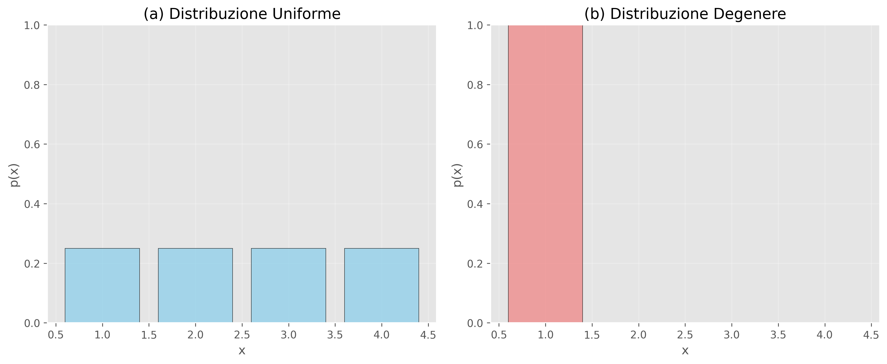
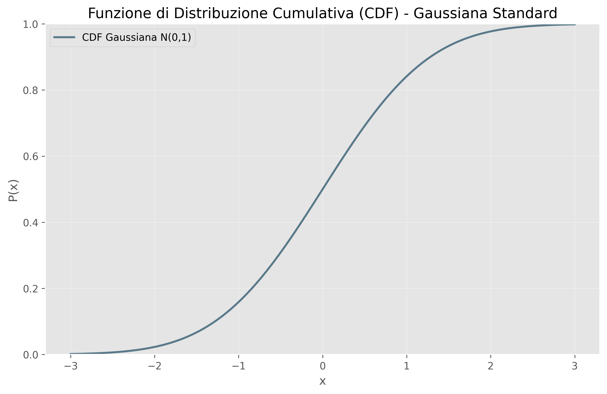
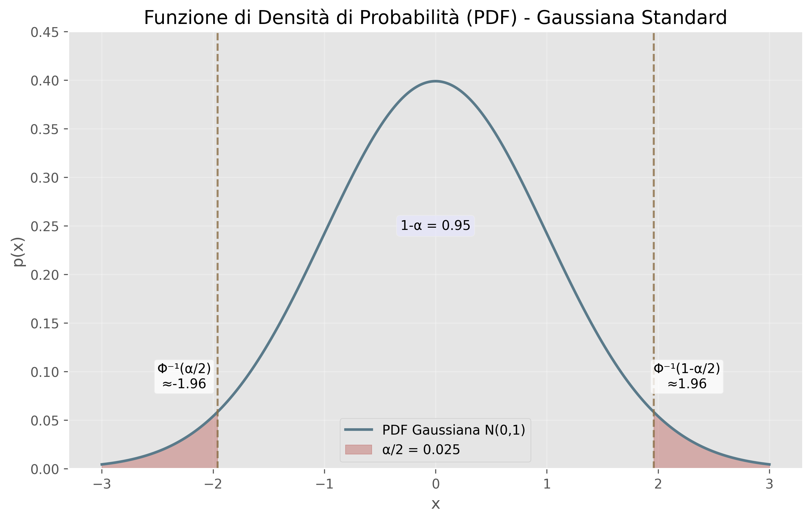

# Variabili Casuali: Dal Caos alla Comprensione Quantitativa

## Introduzione: Perché Abbiamo Bisogno delle Variabili Casuali?

Nel mondo reale, siamo costantemente confrontati con fenomeni che sfuggono alla nostra capacità di previsione esatta. Quando lanciamo una moneta, non possiamo predire con certezza se uscirà testa o croce; quando misuriamo la temperatura di una città, il valore cambia continuamente; quando contiamo il numero di clienti che entrano in un negozio in un'ora, questo numero varia da giorno a giorno. Questa **incertezza** non è un difetto del nostro sistema di misurazione, ma una caratteristica intrinseca della realtà.

Le **variabili casuali** rappresentano il ponte concettuale che ci permette di trasformare questa incertezza apparentemente caotica in un framework matematico rigoroso e potente. Esse non sono semplicemente "numeri che cambiano a caso", ma strumenti sofisticati che catturano la struttura probabilistica sottostante ai fenomeni incerti.

### Esempi Fondamentali che Motivano il Concetto

**Esempio 1: Il Lancio del Dado**
Consideriamo un dado a sei facce. Prima del lancio, sappiamo che il risultato sarà uno tra {1, 2, 3, 4, 5, 6}, ma non sappiamo quale. La variabile casuale $X$ che rappresenta "il numero che appare sulla faccia superiore" ci permette di:

- Assegnare probabilità a ciascun esito possibile
- Calcolare la probabilità di eventi complessi (es. "uscita di un numero pari")
- Quantificare l'incertezza attraverso misure come la varianza

**Esempio 2: Il Traffico Urbano**
Supponiamo di voler modellare il tempo $T$ necessario per percorrere un tragitto in città. Questo tempo dipende da fattori imprevedibili: semafori, altri veicoli, condizioni meteorologiche, incidenti. La variabile casuale $T$ ci consente di:

- Stimare il tempo medio di percorrenza
- Calcolare la probabilità di arrivare in ritardo
- Ottimizzare i percorsi considerando l'incertezza

**Esempio 3: Controllo di Qualità Industriale**
In una fabbrica, ogni prodotto ha una certa probabilità di essere difettoso. Se $D$ rappresenta il numero di prodotti difettosi in un lotto di 100 pezzi, questa variabile casuale ci permette di:

- Progettare sistemi di controllo qualità efficaci
- Calcolare i costi attesi legati ai difetti
- Determinare la dimensione ottimale dei campioni di controllo

## La Natura Profonda delle Variabili Casuali

### Caratteristiche Fondamentali

**1. Mappatura dalla Realtà ai Numeri**
Una variabile casuale è essenzialmente una **funzione** che associa a ogni possibile esito di un esperimento un numero reale. Questo processo di "numerizzazione" è cruciale perché:

- Trasforma esiti qualitativi in quantità misurabili
- Permette l'applicazione di strumenti matematici potenti
- Facilita il confronto e l'analisi statistica

**2. Incertezza Strutturata**
A differenza del puro caos, le variabili casuali incorporano una **struttura probabilistica** che riflette:

- La natura del processo fisico sottostante
- I vincoli e le regolarità del sistema osservato
- Le relazioni causali tra diversi fattori

**3. Prevedibilità Statistica**
Paradossalmente, ciò che è imprevedibile a livello individuale diventa prevedibile a livello aggregato:

- Un singolo lancio di moneta è imprevedibile
- La proporzione di teste in 10.000 lanci è altamente prevedibile
- Questo principio è alla base della **[[Legge dei Grandi Numeri]]**

### Il Ruolo del Punto Campionario

Ogni variabile casuale $X$ ha il suo valore determinato dal **punto campionario** $\omega$ che si realizza nell'esperimento $\mathcal{E}$. Questo concetto è fondamentale perché:

- **$\omega$ rappresenta lo "stato del mondo"** al momento dell'osservazione
- **$X(\omega)$ è il valore numerico** associato a quello stato specifico  
- **L'incertezza nasce** dal fatto che non conosciamo in anticipo quale $\omega$ si realizzerà.

## Definizione Formale

**Definizione 1.6 (Variabile Casuale)**
Sia $\Omega$ uno spazio campionario corrispondente a un esperimento $\mathcal E$, e sia $X: \Omega \to \mathbb{R}$ una funzione che mappa lo spazio campionario sulla retta reale in generale. Allora $X$ è detta **variabile casuale**.

Quindi:

- Un **evento** è un insieme di esiti (o una parte) dello spazio campionario. Ad esempio, nel lancio di una moneta, l'evento "esce testa" è l'insieme che contiene l'esito "testa". Gli eventi sono ciò a cui assegniamo una probabilità, e possono essere combinati tra loro (unione, intersezione, complemento, ecc.). Quindi, gli eventi indicano "cosa accade" (cioè, un insieme di esiti) e hanno una probabilità associata.
- Una **variabile aleatoria** è una funzione che associa un numero reale ad ogni esito dello spazio campionario. In altre parole, trasforma l'insieme degli esiti (che possono essere non numerici) in valori numerici, permettendoci di studiarne le proprietà statistiche (come la media, la varianza e la distribuzione). Ad esempio, lanciando due dadi, possiamo definire una variabile aleatoria che rappresenta la somma dei valori ottenuti. Quindi, le variabili aleatorie mappano ciascun esito a un numero, permettendo l'analisi quantitativa dell'esperimento.

### Spazi Campionari, Stati ed Eventi

Quando parliamo di probabilità, ci sono tre concetti fondamentali da distinguere con precisione:  

1. **Lo spazio campionario** $\Omega$  
2. **La variabile casuale** $X$  
3. **Lo spazio degli stati della variabile** $\mathcal{X}$  

#### Spazio Campionario ($\Omega$)  
Lo **spazio campionario** (o **universo**) è l’insieme di *tutti i possibili esiti elementari* di un esperimento casuale.  
Ogni elemento $\omega \in \Omega$ rappresenta un **singolo risultato osservabile**.

$$
\Omega = \{\omega_1, \omega_2, \dots, \omega_n\}
$$

- È il punto di partenza della teoria della probabilità.  
- Viene definito **prima** di introdurre qualunque variabile casuale.  
- È su $\Omega$ che si definisce la **misura di probabilità** $P$.  

#### Variabile Casuale ($X$)  
Una **variabile casuale** è una funzione che associa ad ogni esito elementare $\omega \in \Omega$ un valore numerico:

$$
X : \Omega \to \mathcal{X}, \quad \omega \mapsto X(\omega)
$$

- Non è “casuale” nel senso matematico: è una **funzione deterministica**.  
- La casualità nasce dal fatto che non sappiamo *a priori* quale $\omega$ si verificherà.  
- Quindi la variabile casuale “eredita” l’incertezza da $\Omega$.  

#### Spazio degli Stati ($\mathcal{X}$)  
Lo **spazio degli stati** (o **insieme dei valori possibili della variabile casuale**) è semplicemente l’immagine della funzione $X$:  

$$
\mathcal{X} = \{ X(\omega) : \omega \in \Omega \}
$$

- Contiene tutti i valori che la variabile casuale può assumere.  
- È un sottoinsieme dei numeri reali (o più in generale di uno spazio matematico).  
- Mentre $\Omega$ descrive i “risultati fisici” dell’esperimento, $\mathcal{X}$ descrive i “valori numerici” associati.

Lo spazio degli stati $\mathcal{X}$ serve per rappresentare i valori della variabile casuale e facilitare calcoli probabilistici.

### Esempio: Lancio di un dado

- **Spazio campionario**: gli esiti elementari del dado sono i numeri da 1 a 6
  $$
  \Omega = \{1,2,3,4,5,6\}
  $$

- **Variabile casuale**: definiamo
  $$
  X(\omega) = 
    \begin{cases}
      0 & \text{se } \omega \text{ è pari} \\
      1 & \text{se } \omega \text{ è dispari}
    \end{cases}
  $$

- **Spazio degli stati** della variabile $X$: 
  $$
  \mathcal{X} = \{0,1\} \quad \text{(0 = pari, 1 = dispari)}
  $$

Qui si nota chiaramente la differenza:  
- $\Omega$ contiene i risultati del dado (1,2,3,4,5,6)  
- $\mathcal{X}$ contiene i possibili valori di “parità” (0 o 1)  

### Eventi  

Un **evento** è un sottoinsieme di $\Omega$, cioè un insieme di esiti elementari dell’esperimento.  

Dal punto di vista della variabile casuale $X$, lo stesso evento può essere descritto come una **condizione sui valori di $X$** nello spazio degli stati $\mathcal{X}$.  

#### Esempio: dado → variabile “pari o dispari”  

Sia $\Omega = \{1,2,3,4,5,6\}$ lo spazio campionario dell’esperimento (lancio di un dado).  
Definiamo una variabile casuale:  

$$
X(\omega) = 
\begin{cases}
0 & \text{se $\omega$ è pari} \\
1 & \text{se $\omega$ è dispari}
\end{cases}
$$

Allora lo **spazio degli stati** è:  
$$
\mathcal{X} = \{0,1\}
$$  

Esempi di eventi:  

- **Evento “esce un numero pari”**  
  $$
  A = \{\omega \in \Omega : X(\omega) = 0\} = \{2,4,6\}
  $$  
  Dal punto di vista dei valori di $X$, questo corrisponde all’insieme $\{0\}$ in $\mathcal{X}$.  

- **Evento “esce un numero dispari”**  
  $$
  B = \{\omega \in \Omega : X(\omega) = 1\} = \{1,3,5\}
  $$  
  Dal punto di vista dei valori di $X$, questo corrisponde all’insieme $\{1\}$ in $\mathcal{X}$.   

## Variabili Casuali Discrete

**Definizione:**
Se lo spazio degli stati $\mathcal{X}$ è finito o infinito numerabile, allora $X$ è chiamata **variabile casuale discreta**.

**Proprietà:**

- Assumono un numero finito o infinito numerabile di valori
- Le variabili casuali intere sono un caso speciale (e sempre discrete)

**Struttura Probabilistica:**
Comprendere una variabile casuale richiede l'analisi della struttura probabilistica dell'esperimento sottostante.

## Funzione di Massa di Probabilità (PMF)

**Definizione 1.7 (Funzione di Massa di Probabilità)**
Per una variabile casuale **discreta** $X: \Omega \to \mathbb{R}$ che assume valori $x_1, x_2, x_3, \ldots$, la **funzione di massa di probabilità (pmf)** è definita come:

$$p(x) \triangleq \Pr(X = x)$$

In questo caso, denotiamo la probabilità dell'evento che $X$ ha valore $x$ tramite $\Pr(X = x)$.

**Terminologia Alternativa:**

- Chiamata anche **distribuzione di probabilità**
- A volte indicata semplicemente come **funzione di massa**

**Requisiti per una PMF Valida:**

1. **Non-negatività:** $0 \leq p(x) \leq 1$ per ogni $x$.
2. **Normalizzazione:** $\sum_{x \in \mathcal{X}} p(x) = 1$.

Qualsiasi funzione che soddisfa queste due condizioni per un insieme di valori $x_1, x_2, x_3, \ldots$ è una **pmf** valida.

### Rappresentazione delle PMF

Se $X$ ha un numero finito di valori, diciamo $K$, la **pmf** può essere rappresentata come una lista di $K$ numeri, che possiamo visualizzare come un istogramma.

**Esempi di Distribuzioni Discrete:**
1. **Distribuzione Uniforme:** Su $\mathcal{X} = \{1, 2, 3, 4\}$, abbiamo $p(x) = 1/4$ per ogni $x$.
2. **Distribuzione Degenere:** $p(x) = \mathbb{I}(x = 1)$, dove $\mathbb{I}(\cdot)$ è la funzione indicatore binario. Questa distribuzione rappresenta il fatto che $X$ è sempre uguale al valore 1. (Quindi vediamo che le variabili casuali possono anche essere costanti.)

```python
import matplotlib.pyplot as plt
import numpy as np

# Creare subplot per le due distribuzioni
fig, (ax1, ax2) = plt.subplots(1, 2, figsize=(12, 5))

# (a) Distribuzione uniforme
x_values = [1, 2, 3, 4]
uniform_probs = [0.25, 0.25, 0.25, 0.25]

ax1.bar(x_values, uniform_probs, alpha=0.7, color='skyblue', edgecolor='black')
ax1.set_xlabel('x')
ax1.set_ylabel('p(x)')
ax1.set_title('(a) Distribuzione Uniforme')
ax1.set_ylim(0, 1.0)
ax1.grid(True, alpha=0.3)

# (b) Distribuzione degenere
degenerate_probs = [1.0, 0.0, 0.0, 0.0]

ax2.bar(x_values, degenerate_probs, alpha=0.7, color='lightcoral', edgecolor='black')
ax2.set_xlabel('x')
ax2.set_ylabel('p(x)')
ax2.set_title('(b) Distribuzione Degenere')
ax2.set_ylim(0, 1.0)
ax2.grid(True, alpha=0.3)

plt.tight_layout()
plt.savefig('distribuzioni_discrete.png', dpi=300, bbox_inches='tight')
plt.show()
```



## Variabili Casuali Continue

Se $X \in \mathbb{R}$ è una quantità a valori reali, è chiamata **variabile casuale continua**. In questo caso, non possiamo più creare un insieme finito (o numerabile) di valori distinti che può assumere. Tuttavia, c'è un numero numerabile di intervalli in cui possiamo partizionare la retta reale.

### Funzione di Distribuzione Cumulativa (CDF)

Definiamo gli eventi $D = (X \leq x_1)$, $E = (X \leq x_2)$ e $F = (x_1 < X \leq x_2)$, dove $x_1 < x_2$. Abbiamo che $E = D \lor F$, e poiché $D$ e $F$ sono mutuamente esclusivi, la regola della somma dà:

$$\Pr(E) = \Pr(D) + \Pr(F)$$

e quindi la probabilità di essere nell'intervallo $F$ è data da:

$$\Pr(F) = \Pr(E) - \Pr(D)$$

In generale, definiamo la **funzione di distribuzione cumulativa** o **cdf** della variabile casuale $X$ come segue:

$$P(x) \triangleq \Pr(X \leq x)$$

Usando questa definizione, possiamo calcolare la probabilità di essere in qualsiasi intervallo come segue:

$$\Pr(x_1 < X \leq x_2) = P(x_2) - P(x_1)$$

Le CDF sono funzioni monotonicamente non-decrescenti.

```python
import matplotlib.pyplot as plt
import numpy as np
from scipy.stats import norm

# Generare punti per il plot
x = np.linspace(-3, 3, 1000)

# CDF della distribuzione normale standard
cdf_values = norm.cdf(x)

# Creare il plot con colori desaturati
plt.figure(figsize=(10, 6))
plt.plot(x, cdf_values, color='#5A7A8A', linewidth=2, label='CDF Gaussiana N(0,1)')
plt.xlabel('x')
plt.ylabel('P(x)')
plt.title('Funzione di Distribuzione Cumulativa (CDF) - Gaussiana Standard')
plt.grid(True, alpha=0.3)
plt.legend()
plt.ylim(0, 1)
plt.savefig('cdf_gaussiana.png', dpi=300, bbox_inches='tight')
plt.show()
```



### Funzione di Densità di Probabilità (PDF)

Definiamo la **funzione di densità di probabilità** o **pdf** come la derivata della **cdf**:

$$p(x) \triangleq \frac{d}{dx}P(x)$$

(Nota che questa derivata non sempre esiste, nel qual caso la **pdf** non è definita.)

Data una **pdf**, possiamo calcolare la probabilità di una variabile continua di essere in un intervallo finito come segue:

$$\Pr(x_1 < X \leq x_2) = \int_{x_1}^{x_2} p(x)dx = P(x_2) - P(x_1)$$

Quando la dimensione dell'intervallo diventa più piccola, possiamo scrivere:

$$\Pr(x < X \leq x + dx) \approx p(x)dx$$

Intuitivamente, questo dice che la probabilità che $X$ sia in un piccolo intervallo attorno a $x$ è la densità in $x$ moltiplicata per la larghezza dell'intervallo.

### Quantili

Se la cdf $P$ è strettamente monotonicamente crescente, ha un'inversa, chiamata **cdf inversa**, o **funzione del punto percentile (ppf)**, o **funzione quantile**.

Se $P$ è la cdf di $X$, allora $P^{-1}(q)$ è il valore $x_q$ tale che $\Pr(X \leq x_q) = q$; questo è chiamato il **$q$-esimo quantile** di $P$.

**Quantili Importanti:**
- $P^{-1}(0.5)$ è la **mediana** della distribuzione, con metà della massa di probabilità a sinistra e metà a destra
- $P^{-1}(0.25)$ e $P^{-1}(0.75)$ sono i **quartili inferiore e superiore**

**Esempio con la Distribuzione Gaussiana:**
Sia $\Phi$ la cdf della distribuzione gaussiana $N(0,1)$, e $\Phi^{-1}$ la cdf inversa. Allora i punti a sinistra di $\Phi^{-1}(\alpha/2)$ contengono $\alpha/2$ della massa di probabilità. Per simmetria, i punti a destra di $\Phi^{-1}(1-\alpha/2)$ contengono anch'essi $\alpha/2$ della massa. Quindi l'intervallo centrale $(\Phi^{-1}(\alpha/2), \Phi^{-1}(1-\alpha/2))$ contiene $1-\alpha$ della massa.

```python
import matplotlib.pyplot as plt
import numpy as np
from scipy.stats import norm

# Generare punti per il plot
x = np.linspace(-3, 3, 1000)

# PDF della distribuzione normale standard
pdf_values = norm.pdf(x)

# Calcolare i quantili per alpha = 0.05
alpha = 0.05
left_quantile = norm.ppf(alpha/2)  # Φ^(-1)(α/2)
right_quantile = norm.ppf(1-alpha/2)  # Φ^(-1)(1-α/2)

# Creare il plot con colori desaturati
plt.figure(figsize=(10, 6))
plt.plot(x, pdf_values, color='#5A7A8A', linewidth=2, label='PDF Gaussiana N(0,1)')

# Evidenziare le code (α/2 ciascuna) con colori desaturati
x_left = x[x <= left_quantile]
pdf_left = pdf_values[x <= left_quantile]
plt.fill_between(x_left, pdf_left, alpha=0.4, color='#B85450', label=f'α/2 = {alpha/2}')

x_right = x[x >= right_quantile]
pdf_right = pdf_values[x >= right_quantile]
plt.fill_between(x_right, pdf_right, alpha=0.4, color='#B85450')

# Aggiungere linee verticali per i quantili
plt.axvline(left_quantile, color='#8B6F47', linestyle='--', alpha=0.8)
plt.axvline(right_quantile, color='#8B6F47', linestyle='--', alpha=0.8)

# Aggiungere etichette spostate per non sovrapporre il grafico
plt.text(left_quantile-0.3, 0.08, f'Φ⁻¹(α/2)\n≈{left_quantile:.2f}', 
         ha='center', va='bottom', fontsize=10, 
         bbox=dict(boxstyle="round,pad=0.2", facecolor="white", alpha=0.8))
plt.text(right_quantile+0.3, 0.08, f'Φ⁻¹(1-α/2)\n≈{right_quantile:.2f}', 
         ha='center', va='bottom', fontsize=10,
         bbox=dict(boxstyle="round,pad=0.2", facecolor="white", alpha=0.8))
plt.text(0, 0.25, f'1-α = {1-alpha}', ha='center', va='center', 
         bbox=dict(boxstyle="round,pad=0.3", facecolor="#E6E6FA", alpha=0.8))

plt.xlabel('x')
plt.ylabel('p(x)')
plt.title('Funzione di Densità di Probabilità (PDF) - Gaussiana Standard')
plt.grid(True, alpha=0.3)
plt.legend()
plt.ylim(0, 0.45)
plt.savefig('pdf_gaussiana_quantili.png', dpi=300, bbox_inches='tight')
plt.show()
```



<br>

Se impostiamo $\alpha = 0.05$, l'intervallo centrale del 95% è coperto dal range:

$$(\Phi^{-1}(0.025), \Phi^{-1}(0.975)) = (-1.96, 1.96)$$

*Nota: Storicamente, le variabili casuali nacquero in contesti di gioco d'azzardo, rendendo i casi a valori interi (es. la somma di due lanci di dado) gli esempi più intuitivi.*

### Ulteriori precisazioni su CDF e PDF 📈

- Per una **variabile casuale continua**, la probabilità di osservare un singolo punto è sempre zero:  
  $$
  \Pr(X = x) = 0 \quad \forall x \in \mathcal{X}
  $$
- La **pdf** $p(x)$ è definita come la derivata della cdf $P(x)$:
  $$
  p(x) = \frac{d}{dx} P(x)
  $$
  *Nota: la derivata può non esistere in tutti i punti; in quel caso si può usare una definizione più generale tramite misure.*

- La **pdf** deve soddisfare la **condizione di normalizzazione**:
  $$
  \int_{\mathcal{X}} p(x) \, dx = 1
  $$

## Conclusione

Le variabili casuali ci permettono di trasformare fenomeni incerti e apparentemente caotici in strumenti matematici rigorosi e utili. Esse offrono un **linguaggio comune** per descrivere eventi aleatori, quantificare l'incertezza e ragionare sulle probabilità, sia in contesti discreti che continui.

Alcuni punti chiave da ricordare:

1. **Distinzione tra spazio campionario e spazio degli stati**  
   - Lo **spazio campionario** $\Omega$ rappresenta l’insieme di tutti i possibili esiti dell’esperimento.  
   - Lo **spazio degli stati** $\mathcal{X}$ è l’insieme dei valori numerici che la variabile casuale può assumere.  
   - Questa distinzione è fondamentale per evitare ambiguità nella definizione degli eventi e nell’analisi probabilistica.

2. **Eventi e probabilità**  
   - Un **evento** è un sottoinsieme di $\Omega$, e possiamo assegnargli una probabilità.  
   - Tramite la variabile casuale $X$, possiamo descrivere lo stesso evento come una condizione sui valori numerici nello spazio degli stati, facilitando calcoli e rappresentazioni.

3. **Strumenti di analisi**  
   - Per variabili discrete, la **pmf** (funzione di massa di probabilità) ci dice la probabilità di ciascun valore.  
   - Per variabili continue, la **cdf** e la **pdf** permettono di calcolare probabilità su intervalli e di identificare quantili, mediane e intervalli di confidenza.

4. **Prevedibilità statistica**  
   - Anche quando i singoli esiti sono imprevedibili, la distribuzione della variabile casuale consente di fare previsioni affidabili a livello aggregato, come espresso dalla **Legge dei Grandi Numeri**.

In sintesi, comprendere le variabili casuali significa acquisire la capacità di **modellare l’incertezza**, di **quantificarla matematicamente** e di **utilizzare strumenti statistici per prendere decisioni informate**. Dal lancio di un dado al controllo qualità industriale, dalla previsione del traffico alla finanza quantitativa, le variabili casuali sono il cuore della teoria della probabilità e dell’analisi statistica.
